# Session C2: Drawing Lewis Structures, Covalent Molecules & Polyatomic Ions

**Duration:** 90 minutes\
**Continues from:** Session C1, *Electronegativity, Bond Character & the Three Bond Types*. C1 covered **what** a covalent bond is (shared electron pairs, small ΔEN) and how to **name** covalent compounds with prefixes. Today covers **how to draw them**. C1's closing note named Lewis structures as the natural next step.\
**Grade-9 foundation:** NCERT Class 9 Ch9 *Atomic Foundations of Matter*: valence electrons, the octet rule, and the polyatomic-ion list (OH⁻, NH₄⁺, NO₃⁻, CO₃²⁻, SO₄²⁻, HCO₃⁻) Dhairya already memorized for the bonding quiz.\
**Grade-11 depth:** NCERT Class 11 Ch4 *Chemical Bonding and Molecular Structure*, §4.1 (Lewis symbols, §4.1.1 octet rule, §4.1.2 covalent bond, §4.1.3 Lewis representation of molecules and ions, §4.1.4 formal charge, §4.1.5 limitations of the octet rule) and §4.3 (bond parameters: bond length, bond enthalpy, §4.3.4 bond order, §4.3.5 resonance). The school's *Gen Chem Lewis* slides (photos) set the exact vocabulary and the 4-step drawing method used below.\
**Interactive tool:** *Lewis Structure Builder*, on the study-tools site under `lewis-builder/`. It has 20 molecules and ions in 3 levels, and he builds each structure himself with instant hints.

---

## Lesson Plan

**Objectives.** By the end of this session Dhairya should be able to:

1. Find the number of valence electrons of any main-group atom from its group, and draw its Lewis dot symbol.
2. Tell a **bonding pair** from a **lone pair**, and read single, double and triple bonds as **bond orders** 1, 2 and 3. He should also say which bond is shorter and stronger.
3. Draw the Lewis structure of any simple molecule with the **4-step method**, including molecules that need double or triple bonds.
4. Draw Lewis structures of **polyatomic ions**: adjust the electron count for the charge, draw brackets, and write the charge outside.
5. Use **formal charge** to pick the best structure, and recognize **resonance** (nitrate, carbonate).

| Time | Segment |
| ---- | ---- |
| 0–8 min | Warm-up: 4 recall questions from C1 |
| 8–18 min | Part 1: valence electrons & Lewis dot symbols |
| 18–30 min | Part 2: bonding pairs, lone pairs, bond order, bond length & strength |
| 30–50 min | Part 3: the 4-step method, with worked examples (CH₃OH, CO₂, HCN, CH₂O) |
| 50–68 min | Part 4: polyatomic ions, formal charge and resonance |
| 68–82 min | Part 5: interactive *Lewis Structure Builder* (Levels 1 → 3) |
| 82–90 min | Exit ticket, then assign the homework |

**Pacing note.** If you run behind, shorten Part 2's bond-length table (just state "triple is shortest and strongest") and do only Levels 1 and 3 of the builder. Do not cut Part 4. Polyatomic ions are the stated test topic, and the charge adjustment in Step 1 is where most mistakes happen.

---

## Warm-up (8 min)

1. *In a covalent bond, what happens to the electrons?* → They are **shared** as pairs between two non-metal atoms. The ΔEN is small, below about 1.7.
2. *Name CO₂ and N₂O₅.* → Carbon dioxide; dinitrogen pentoxide.
3. *Formula and charge of nitrate, carbonate, ammonium and hydroxide?* → NO₃⁻, CO₃²⁻, NH₄⁺, OH⁻.
4. *C1 said the atoms inside a polyatomic ion are held together by what kind of bond?* → **Covalent** bonds. The whole group carries one overall charge. So today's method works on ions too.

**Bridge to today:** "We know CO₂ is *carbon dioxide* and that its atoms share electrons, but *which* electrons, and *how many* bonds? Today we draw it."

---

## Part 1 — Valence Electrons & Lewis Dot Symbols (10 min)

**Valence electrons** are the electrons in the outermost shell. They are the only ones that take part in bonding.

**Shortcut for main-group elements:** valence electrons = the group number's last digit (groups 1, 2, 13–18).

| Group | 1 | 2 | 13 | 14 | 15 | 16 | 17 | 18 |
| ---- | ---- | ---- | ---- | ---- | ---- | ---- | ---- | ---- |
| Valence e⁻ | 1 | 2 | 3 | 4 | 5 | 6 | 7 | 8 |
| Examples | H, Na | Mg, Ca | B, Al | **C**, Si | **N**, P | **O**, S | **F**, Cl | Ne, Ar |
| Bonds usually formed | 1 | 2 | 3 | **4** | **3** | **2** | **1** | 0 |

**Lewis dot symbol:** the element symbol with its valence electrons as dots. Place them one per side first (4 sides), then pair them up.

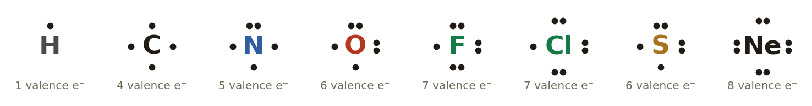{width=100%}

**The octet rule** (NCERT §4.1.1): atoms bond so that each ends up with **8 electrons** around it, like a noble gas. **Hydrogen** needs only **2** (a *duet*, like helium).

**Why "bonds usually formed" works:** an atom forms as many bonds as the number of electrons it is *missing* from an octet. N has 5, so it needs 3 more and forms 3 bonds. O has 6, needs 2, and forms 2 bonds. This is the fastest way to check a structure.

---

## Part 2 — Lewis Structures, Bond Pairs & Bond Order (12 min)

### Bonding pairs and lone pairs

A **Lewis structure** shows how atoms share some or all of their valence electrons so that each gets an octet (a duet for hydrogen).

- A **bonding pair** is a **shared pair** of electrons, drawn between two atoms. It counts toward the octet (or duet) of **both** atoms.
- A **lone pair** is a pair that belongs to only one atom and is **not involved in bonding**.

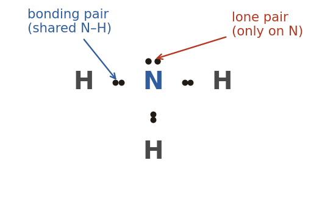{width=45%}

In NH₃, nitrogen is surrounded by 3 bonding pairs and 1 lone pair, which is 8 electrons. Each H has 1 bonding pair, which is 2 electrons.

### Dashes, and single, double and triple bonds

Each bonding pair is usually drawn as a **dash**, and **each dash = 2 electrons**. Lone pairs stay as dots.

| Pairs shared | Bond | Drawn as | Electrons in the bond | **Bond order** | Example |
| ---- | ---- | ---- | ---- | ---- | ---- |
| 1 | Single | A–B | 2 | **1** | F–F, H–O |
| 2 | Double | A=B | 4 | **2** | O=O, C=O |
| 3 | Triple | A≡B | 6 | **3** | N≡N, C≡N |

**Bond order** is simply the number of bonds between two atoms.

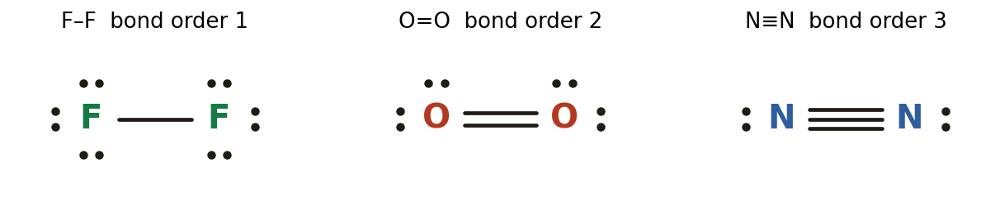{width=85%}

### Bond length and bond strength

More shared pairs pull the two nuclei **closer**, and take **more energy** to break. (Numbers from the class slides, for carbon–carbon bonds.)

| Bond | Bond order | Bond length | Energy to break |
| ---- | ---- | ---- | ---- |
| C–C | 1 | 1.535 Å | 365 kJ/mol |
| C=C | 2 | 1.339 Å | 598 kJ/mol |
| C≡C | 3 | 1.203 Å | 962 kJ/mol |

**Rule:** as the bond order goes **up**, the bond length goes **down** and the bond strength goes **up**. A triple bond is the shortest and strongest. (1 Å = 10⁻¹⁰ m.)

---

## Part 3 — Drawing Lewis Structures: the 4-Step Method (20 min)

This is the method from the class slides, which matches NCERT §4.1.3.

1. **Count the total number of valence electrons.** Add them up for every atom. For a **polyatomic ion**, **add** one electron for each negative charge and **subtract** one for each positive charge.
2. **Connect the atoms with single bonds to make the skeleton.** The **central atom** is the one that forms the most bonds, or the **least electronegative** atom (this is C1's electronegativity trend at work). **Hydrogen and fluorine are never central**, because they can form only one bond. For an ion, draw **square brackets** around the whole structure and write the **charge outside, top right**.
3. **Add lone pairs to the terminal (outer) atoms to complete their octets.** Skip hydrogen, which is already complete with one bond. If any electrons are **left over**, put them as lone pairs on the **central atom**.
4. **If the central atom still lacks an octet, move lone pairs from outer atoms into multiple bonds.** When every atom has its octet (H: 2), the structure is complete.

**Always finish with the two checks:**

- Electrons drawn = electrons counted in step 1. Each dash counts 2 and each lone pair counts 2.
- Every atom has 8 electrons around it, and every H has 2.

### Worked Example 1 — CH₃OH (methanol), the class slide example

**Step 1, count the valence e⁻:** C = 4, H = 4 × 1 = 4, O = 6. The total is **14 e⁻**.

**Step 2, skeleton:** carbon forms 4 bonds, so it is central to its three H and the O. The O bonds to the last H (the formula is written C-H₃ then O-H, which shows the connections). That makes 5 single bonds = 10 e⁻ used, so **4 left**.

**Step 3, lone pairs:** the only terminal atom that isn't H is O. It has 2 bonds (4 e⁻), so it needs 4 more: 2 lone pairs. That uses all 4, so **0 left**.

**Step 4, check:** C has 4 bonds = 8 ✓. O has 2 bonds + 2 lone pairs = 8 ✓. Each H has 1 bond = 2 ✓. Electrons drawn: 5 × 2 + 2 × 2 = 14 ✓.

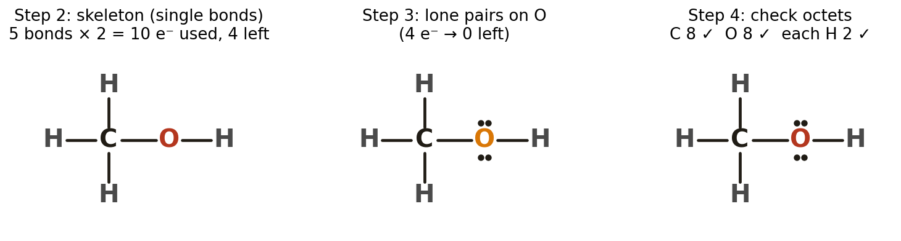{width=100%}

### Worked Example 2 — CO₂ (needs double bonds)

**Step 1:** C = 4, O = 2 × 6 = 12, so the total is **16 e⁻**.

**Step 2:** C is the least electronegative (EN 2.5 vs O 3.5), so it is central: O–C–O. 2 bonds = 4 e⁻, so **12 left**.

**Step 3:** each O needs 6 more, which is 3 lone pairs each. That uses all 12, so **0 left**. But **C has only 2 bonds = 4 e⁻**. ✗

**Step 4:** move **one lone pair from each O** into the bond with C. Each single bond becomes a double bond: **O=C=O**. Now C has 2 double bonds = 8 ✓, and each O has 1 double bond + 2 lone pairs = 8 ✓. The total is still 16 ✓.

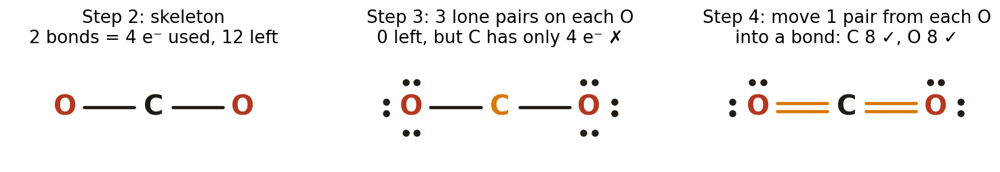{width=100%}

**Key idea:** step 4 never adds electrons. It only **moves** an existing lone pair so that it becomes shared. That is why a double bond appears exactly when the electrons "run out" before the central atom is full.

### Worked Example 3 — HCN (needs a triple bond)

- **Step 1:** H = 1, C = 4, N = 5, so the total is **10 e⁻**.
- **Step 2:** H can't be central. C forms the most bonds, so the skeleton is H–C–N. 2 bonds = 4 e⁻, so **6 left**.
- **Step 3:** N gets 3 lone pairs (6 e⁻), so **0 left**. C has only 2 bonds = 4 e⁻. ✗
- **Step 4:** move **two** lone pairs from N into the C–N bond, which becomes **C≡N**. Now C has 1 + 3 = 4 bonds = 8 ✓ and N has 3 bonds + 1 lone pair = 8 ✓.
- **Result:** H–C≡N: with one lone pair on N.

### Worked Example 4 — CH₂O (formaldehyde)

- **Step 1:** 4 + 2(1) + 6 = **12 e⁻**.
- **Step 2:** C is central, bonded to O and both H. 3 bonds = 6 e⁻, so **6 left**.
- **Step 3:** O gets 3 lone pairs, so **0 left**. C has 3 bonds = 6 e⁻. ✗
- **Step 4:** move one O lone pair into the C–O bond, making **C=O**. Now C has 8 ✓ and O has 2 bonds + 2 lone pairs = 8 ✓.

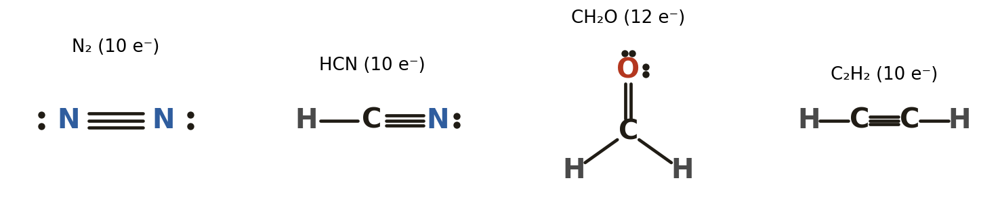{width=100%}

**Pattern to notice:** C always ends with **4 bonds**, N with **3 bonds + 1 lone pair**, O with **2 bonds + 2 lone pairs**, and a halogen with **1 bond + 3 lone pairs**. This matches the "bonds usually formed" row in Part 1 and is a fast way to check any neutral molecule.

---

## Part 4 — Polyatomic Ions, Formal Charge & Resonance (18 min)

### What changes for an ion

A polyatomic ion is a group of covalently bonded atoms with an **overall charge** (C1). The charge means electrons were **gained** or **lost**, so:

- **Step 1 changes:** a **negative** charge adds electrons and a **positive** charge removes them. OH⁻ has 1 extra electron; NH₄⁺ has 1 fewer.
- **The drawing changes:** put **square brackets** around the whole structure and write the charge **outside, top right**.

{width=100%}

| Ion | Step 1 count | Structure |
| ---- | ---- | ---- |
| OH⁻ | 6 + 1 + **1** = 8 | O–H with 3 lone pairs on O |
| NH₄⁺ | 5 + 4 − **1** = 8 | N with 4 single bonds to H, no lone pairs |
| H₃O⁺ | 6 + 3 − **1** = 8 | O with 3 bonds to H + 1 lone pair |
| CN⁻ | 4 + 5 + **1** = 10 | C≡N with 1 lone pair on each atom |

### Formal charge: where the charge "sits"

The purple circled signs in the figures are **formal charges** (NCERT §4.1.4). A formal charge compares how many electrons an atom "owns" in the structure with how many valence electrons it brought:

**Formal charge = V − L − ½B**

where V = valence electrons of the free atom, L = electrons in its **lone pairs**, and B = electrons in its **bonds** (so ½B = the number of bonds).

**Why it works:** the atom keeps all of its lone-pair electrons and **half** of each shared pair. If it ends up owning fewer electrons than it brought, it is positive; if more, negative.

**Checks:**

- The formal charges always **add up to the overall charge** of the molecule or ion.
- The **best** structure has formal charges as close to **zero** as possible. Any negative charge should be on the **more electronegative** atom.

**Worked check — OH⁻:** O has V = 6, L = 6 (3 lone pairs) and 1 bond, so FC = 6 − 6 − 1 = **−1**. H has 1 − 0 − 1 = 0. The sum is −1, which matches the charge ✓. The negative charge sits on the O.

**Worked check — NH₄⁺:** N has 5 − 0 − 4 = **+1**, and each H is 0. The sum is +1 ✓.

**Using formal charge to choose between structures (CO₂):** both of these give every atom an octet, but only one is right:

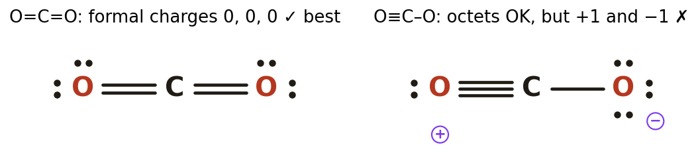{width=80%}

O=C=O has all formal charges 0, so it is the correct structure. O≡C–O puts +1 and −1 on the two oxygens, so it is worse.

### Worked Example 5 — NO₃⁻ (nitrate) and resonance

- **Step 1:** N = 5, O = 3 × 6 = 18, plus **1** for the charge = **24 e⁻**.
- **Step 2:** N is less electronegative than O (3.0 vs 3.5), so N is central with 3 O around it. 3 bonds = 6 e⁻, so **18 left**. Draw brackets with a − charge.
- **Step 3:** each O gets 3 lone pairs (18 e⁻), so **0 left**. N has 3 bonds = 6 e⁻. ✗
- **Step 4:** move one lone pair from **one** O into a double bond with N. Now N has 8 ✓, the double-bonded O has 2 lone pairs, and the other two O each have 3.
- **Formal charges:** N = 5 − 0 − 4 = **+1**. The O in N=O is 6 − 4 − 2 = 0. Each O in N–O is 6 − 6 − 1 = **−1**. The sum is +1 − 1 − 1 = **−1** ✓.

**But which O gets the double bond?** Any of the three: the structures are equally good. When more than one valid Lewis structure differs **only in where the double bond (electrons) is placed**, they are called **resonance structures** and are joined with a double-headed arrow ↔. (Compare the ozone and nitrate diagrams in the class slides.)

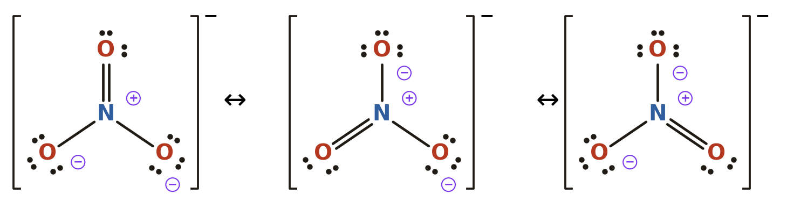{width=100%}

**What it really means:** the real ion is a **blend** of all three. Experiments show all three N–O bonds are **identical**, each between a single and a double bond (bond order 1⅓). The double bond isn't jumping around; no single drawing can show it alone.

### Worked Example 6 — CO₃²⁻, NO₂⁻ and SO₄²⁻

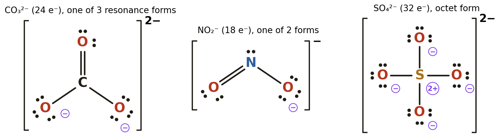{width=100%}

- **CO₃²⁻:** 4 + 18 + **2** = 24 e⁻. The same shape and steps as nitrate: one C=O and two C–O. Each single-bonded O has FC −1, so the sum is −2 ✓. It has 3 resonance forms.
- **NO₂⁻:** 5 + 12 + **1** = 18 e⁻. The skeleton O–N–O uses 4, leaving 14. Each O takes 3 lone pairs (12), leaving 2, which go on **N** as a lone pair (step 3's "leftover electrons go on the central atom"). N then has 2 bonds + 1 lone pair = 6 ✗. Move one O lone pair to make N=O, and N has 8 ✓. There are 2 resonance forms.
- **SO₄²⁻:** 6 + 24 + **2** = 32 e⁻. 4 single bonds (8 e⁻) + 3 lone pairs on each O (24 e⁻) = 32, so every atom already has an octet and **no step 4 is needed**. The formal charges are S = 6 − 0 − 4 = +2 and each O = −1, which sum to −2 ✓.
  - *Beyond the octet (for later):* sulfur is in period 3 and can hold more than 8 electrons (an **expanded octet**, NCERT §4.1.5). Some textbooks draw SO₄²⁻ with two S=O bonds to reduce the formal charges. At this level, the octet form above is the expected answer. Follow your teacher's version.

### When the octet rule bends (NCERT §4.1.5, awareness only)

| Exception | Example | What happens |
| ---- | ---- | ---- |
| Incomplete octet | BF₃, BeCl₂ | B has only 6 e⁻, Be only 4 |
| Odd number of electrons | NO, NO₂ | Someone has to be left with 7 |
| Expanded octet (period 3 and below) | PCl₅, SF₆ | P has 10 e⁻, S has 12 |

---

## Part 5 — Interactive Activity: *Lewis Structure Builder* (14 min)

Open **study tools → Chemistry → Lewis Structure Builder**. It follows exactly the 4 steps above:

1. **Count:** type the total valence electrons. A wrong answer shows the per-atom breakdown, including the charge adjustment for ions.
2. **Skeleton:** pick the central atom. A wrong pick explains the rule (least electronegative, never H or F).
3. **Build:** tap bonds to switch between single, double and triple, and tap atoms to add or remove lone pairs. A live counter shows electrons **left to place**, and every atom shows its own electron count (e.g. "6/8").
4. **Check:** the builder says exactly what is wrong (e.g. "N has only 6 electrons"). If the octets are right but the formal charges could be smaller, it says so. For nitrate or carbonate, **any** resonance form is accepted.

**Suggested run for today:** Level 1 → H₂O, NH₃, CH₃OH; Level 2 → CO₂, HCN, CH₂O; Level 3 → OH⁻, NH₄⁺, NO₃⁻, SO₄²⁻. Let him use hints freely on the first of each level and none on the last. The stars show how independent he was.

---

## Exit Ticket (8 min)

1. How many valence electrons does SO₃²⁻ have in total? → 6 + 3(6) + **2** = **26**.
2. Why can't hydrogen be the central atom? → It can form only **one** bond (it needs just 2 electrons).
3. Which is shorter and stronger, C=O or C≡O? → **C≡O**. A higher bond order gives a shorter, stronger bond.
4. In NO₃⁻, why are there three drawings joined by ↔? → **Resonance.** The double bond could be drawn to any of the 3 O; the real ion is an average, with all three bonds equal.
5. What is the formal charge on N in NH₄⁺? → 5 − 0 − 4 = **+1**.

---

## Homework — Draw These (answers below)

*For each one: show the 4 steps, count the electrons, and write the formal charge on every atom that isn't zero. Use brackets and a charge for ions.*

1. H₂S
2. PCl₃
3. C₂H₄ (the two C atoms are bonded to each other)
4. NO⁺
5. ClO⁻ (hypochlorite)
6. SO₃²⁻ (sulfite)
7. PO₄³⁻ (phosphate), octet form

---

## Answer Key — Full Step-by-Step Solutions

**1. H₂S**

- Step 1: S = 6, H = 2 × 1, so the total is **8 e⁻**.
- Step 2: S is central (H never is): H–S–H. 2 bonds = 4 e⁻, so 4 left.
- Step 3: the terminal atoms are both H, so they are skipped. The 4 leftover electrons go on S as 2 lone pairs.
- Step 4: S has 2 bonds + 2 lone pairs = 8 ✓, and each H has 2 ✓. All formal charges are 0.

**Answer:** H–S–H with 2 lone pairs on S (the same pattern as water: S is in the same group as O).

**2. PCl₃**

- Step 1: P = 5, Cl = 3 × 7 = 21, so the total is **26 e⁻**.
- Step 2: P is central (less electronegative than Cl). 3 bonds = 6 e⁻, so 20 left.
- Step 3: each Cl gets 3 lone pairs (18 e⁻), so 2 left. Those go on P as 1 lone pair.
- Step 4: P has 3 bonds + 1 lone pair = 8 ✓, and each Cl has 8 ✓. The formal charges are P = 5 − 2 − 3 = 0 and Cl = 7 − 6 − 1 = 0.

**Answer:** P with 3 single bonds to Cl, 1 lone pair on P and 3 on each Cl.

**3. C₂H₄**

- Step 1: 2 × 4 + 4 × 1 = **12 e⁻**.
- Step 2: C–C with 2 H on each C. 5 bonds = 10 e⁻, so 2 left.
- Step 3: the only terminal atoms are H. The 2 leftover electrons go on one C as a lone pair, which gives that C 8 but leaves the other C with 3 bonds = 6 ✗.
- Step 4: move that lone pair into the C–C bond to make **C=C**. Now each C has 1 double + 2 single = 4 bonds = 8 ✓.

**Answer:** H₂C=CH₂, with no lone pairs.

**4. NO⁺**

- Step 1: 5 + 6 − **1** = **10 e⁻**.
- Step 2: N–O. 1 bond = 2 e⁻, so 8 left.
- Step 3: 3 lone pairs on O (6 e⁻), so 2 left. Those go on N as 1 lone pair, but N then has only 4 ✗.
- Step 4: move 2 lone pairs from O into the bond, giving **N≡O**. Each atom now has 3 bonds + 1 lone pair = 8 ✓.
- Formal charges: N = 5 − 2 − 3 = 0 and O = 6 − 2 − 3 = **+1**. The sum is +1 ✓.

**Answer:** [:N≡O:]⁺.

**5. ClO⁻**

- Step 1: 7 + 6 + **1** = **14 e⁻**.
- Step 2: Cl–O. 2 e⁻ used, so 12 left.
- Step 3: 3 lone pairs on O (6), then 3 lone pairs on Cl (6), so 0 left.
- Step 4: Cl has 8 ✓ and O has 8 ✓.
- Formal charges: Cl = 7 − 6 − 1 = 0 and O = 6 − 6 − 1 = **−1**. The sum is −1 ✓.

**Answer:** [Cl–O]⁻ with 3 lone pairs on each atom.

**6. SO₃²⁻**

- Step 1: 6 + 18 + **2** = **26 e⁻**.
- Step 2: S is central with 3 O. 3 bonds = 6 e⁻, so 20 left.
- Step 3: each O gets 3 lone pairs (18), so 2 left. Those go on S as 1 lone pair.
- Step 4: S has 3 bonds + 1 lone pair = 8 ✓, and each O has 8 ✓.
- Formal charges: S = 6 − 2 − 3 = **+1** and each O = 6 − 6 − 1 = **−1**. The sum is +1 − 3 = −2 ✓.

**Answer:** as in the figure below.

**7. PO₄³⁻**

- Step 1: 5 + 24 + **3** = **32 e⁻**.
- Step 2: P is central with 4 O. 4 bonds = 8, so 24 left.
- Step 3: 3 lone pairs on each O uses all 24, so 0 left.
- Step 4: P has 4 bonds = 8 ✓ and each O has 8 ✓.
- Formal charges: P = 5 − 0 − 4 = **+1** and each O = **−1**. The sum is +1 − 4 = −3 ✓.

**Answer:** the same shape as sulfate.

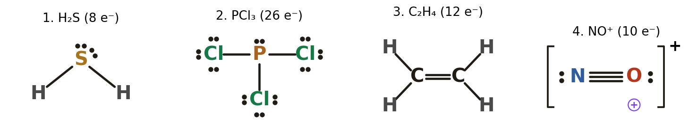{width=100%}

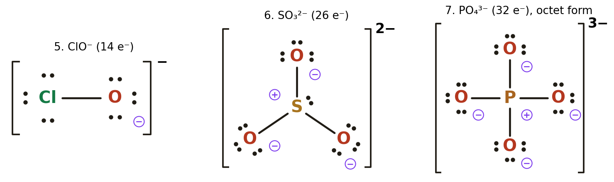{width=100%}

---

## Notes for next session

Lewis structures show **which** electrons are shared, but not the **3-D shape**. The next step is **VSEPR theory** (NCERT Class 11 Ch4 §4.4). The lone pairs drawn today push bonding pairs apart. That is why H₂O is **bent** (104.5°) while CO₂ is **linear**, and why NH₃ is a pyramid. It also finally explains **molecular polarity**: CO₂ has polar C=O bonds but is a non-polar molecule, because the two dipoles cancel.
