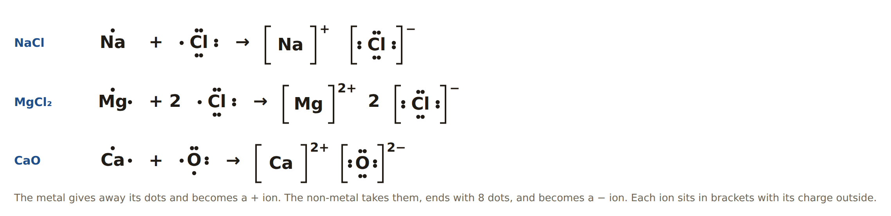
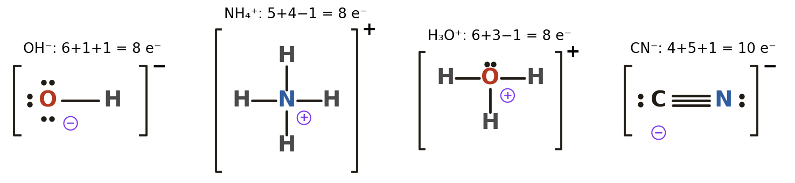
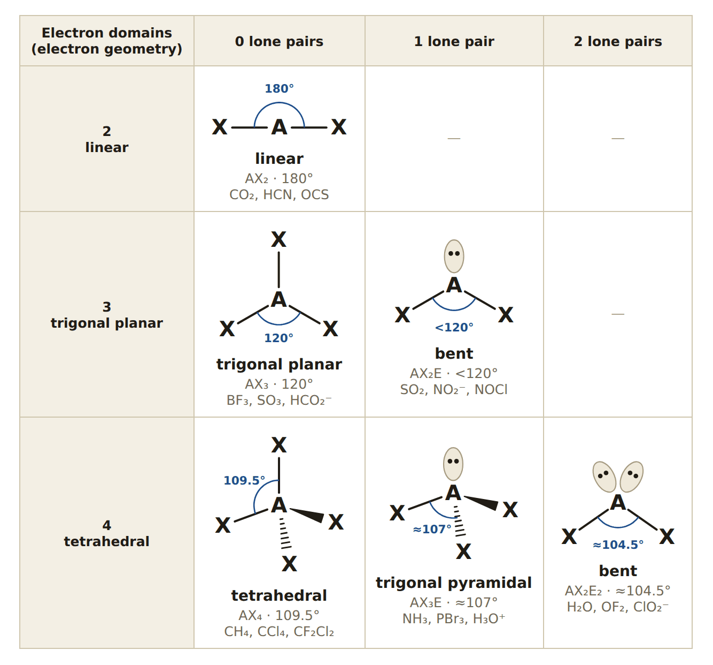
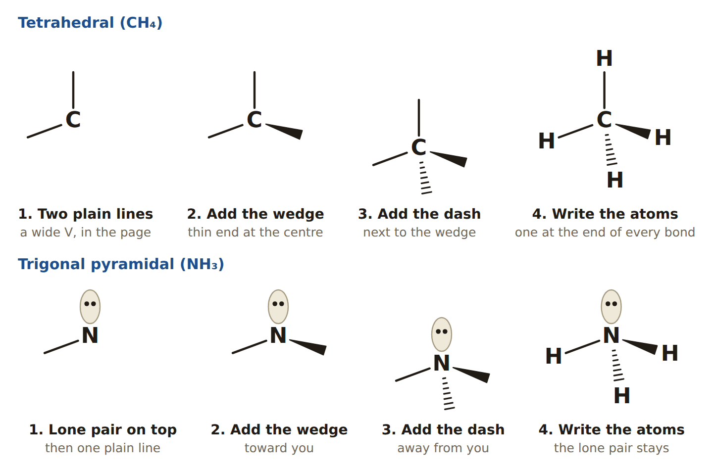
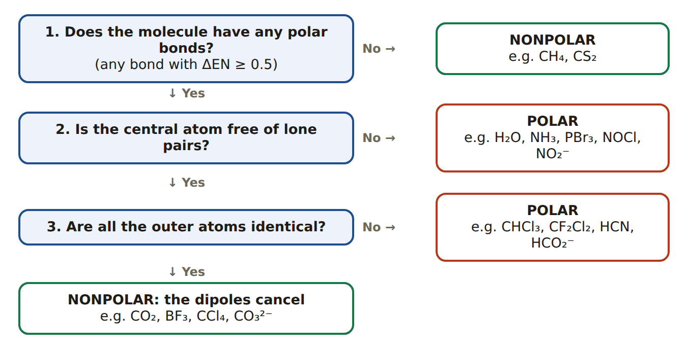

# Session C4: Chemical Bonding, the Whole Unit on One Note (Test Review)

**Duration:** 45 minutes (strict)\
**Test:** Monday 10/5, chemical bonding. The teacher's topic list has 7 items, and this note follows that list in the same order.\
**Built from:** Session C1 (*Electronegativity, Bond Character & the Three Bond Types*, plus the bonding quiz prep), Session C2 (*Lewis Structures & Polyatomic Ions*) and Session C3 (*VSEPR, Shapes & Polarity*). Open those for full explanations and derivations; this note is the short version.\
**Sources behind those sessions:** NCERT Class 9 Ch9 (§9.4 bonding, §9.5 formulae, §9.6 properties), Class 9 Ch5 (alloys), NCERT Class 10 Ch3 (metals), NCERT Class 11 Ch3 (electronegativity) and Ch4 (§4.1 Lewis structures, §4.3.6 polarity, §4.4 VSEPR).\
**Practice tools** (study-tools site, Chemistry): *Chemical Bonding Unit Quiz* (`chem-unit-quiz/`), *Chemical Bonding Unit Flashcards* (`chem-unit-flashcards/`), plus *Wedge & Dash Lab* and *VSEPR Worksheet Test* for the drawing columns.

---

## Lesson Plan

| Time | Segment |
| ---- | ---- |
| 0–5 min | Topic 1: identify the bond type (5 quick examples) |
| 5–12 min | Topic 4: naming, the decision tree and 8 names |
| 12–20 min | Topic 2: drawing, one ionic and two covalent |
| 20–26 min | Topics 3 and 5: properties, then match materials to jobs |
| 26–38 min | Topics 6 and 7: one full worksheet row together, one alone |
| 38–45 min | Mixed quiz from the *Unit Quiz* tool; note the weak topics for the weekend |

**Pacing note.** Naming and the worksheet row carry the most marks and the most ways to slip, so protect those two blocks. If time runs out, set Topics 3 and 5 as reading: they are tables.

**Weekend plan before Monday:** flashcards once through, then one topic quiz for each weak topic, then one full mock test (aim for 90%).

---

## Topic 1 — Identifying the Type of Bond

**Two questions decide it:** *what kinds of atoms?* and *how big is ΔEN?*

ΔEN = larger electronegativity − smaller electronegativity

| Atoms | Bond | What the electrons do | ΔEN | Examples |
| ---- | ---- | ---- | ---- | ---- |
| metal + metal | **metallic** | valence electrons leave their atoms and move freely: a "sea" of electrons around + ions | not used | Cu, Fe, brass |
| metal + non-metal | **ionic** | **transferred**: the metal loses, the non-metal gains, and the ions attract | more than 1.7 | NaCl, MgO, CaCl₂ |
| two different non-metals | **polar covalent** | **shared unequally**: pulled toward the more electronegative atom (δ−) | 0.5 to 1.7 | H–Cl, C–O, O–H |
| two identical or similar non-metals | **nonpolar covalent** | **shared equally** | less than 0.5 | Cl₂, N₂, C–H |

> **Electronegativities:** H 2.1 · C 2.5 · N 3.0 · O 3.5 · F 4.0 · Na 0.9 · Mg 1.2 · Al 1.5 · Si 1.8 · P 2.1 · S 2.5 · Cl 3.0 · K 0.8 · Br 2.8

**Worked examples**

- **NaCl:** metal + non-metal. ΔEN = 3.0 − 0.9 = 2.1, so it is **ionic**.
- **H₂O:** two non-metals. O–H: 3.5 − 2.1 = 1.4, so the bonds are **polar covalent**.
- **CH₄:** C–H: 2.5 − 2.1 = 0.4, so the bonds are **nonpolar covalent**.
- **Bronze** (Cu + Sn): two metals, so it is **metallic** (an alloy).

**Traps**

- The cutoffs are guides. H–F has ΔEN = 1.9 but is two non-metals sharing electrons, so it is a *very polar covalent* bond, not ionic. **Kinds of atoms come first; ΔEN refines it.**
- A compound with a **polyatomic ion** has both: NaNO₃ is ionic between Na⁺ and NO₃⁻, and covalent inside NO₃⁻.
- "Both covalents" on the topic list means **polar** and **nonpolar** covalent.

---

## Topic 2 — Drawing Bonds

### Ionic: ions in brackets

1. Draw each atom's valence electrons as dots.
2. The **metal gives away** all its valence electrons; the **non-metal takes** enough to reach 8.
3. Write each ion in **square brackets with its charge outside**. The metal ion has no dots left; the non-metal ion has 8.
4. Use as many of each ion as it takes for the charges to add to zero.

{width=100%}

### Covalent: Lewis structures (shared pairs)

The 4 steps from C2:

1. **Count the valence electrons.** Add 1 for each negative charge; subtract 1 for each positive charge.
2. **Draw the skeleton** with single bonds. The central atom is the one that forms the most bonds (usually the least electronegative). **H and F are never central.**
3. **Add lone pairs** to the outer atoms until each has 8 (H needs only 2). Put any leftover electrons on the central atom.
4. **If the central atom has fewer than 8**, move a lone pair from an outer atom to make a double or triple bond.

**Check:** electrons drawn = electrons counted, and every atom has 8 (H has 2). For a polyatomic ion, add **brackets and the charge**.

{width=100%}

{width=100%}

| Species | Count | Structure |
| ---- | ---- | ---- |
| H₂O | 8 | H–O–H, 2 lone pairs on O |
| NH₃ | 8 | N with 3 N–H bonds, 1 lone pair on N |
| CO₂ | 16 | O=C=O, 2 lone pairs on each O |
| N₂ | 10 | N≡N, 1 lone pair on each N |
| CH₂O | 12 | C=O plus 2 C–H, 2 lone pairs on O |
| NH₄⁺ | 8 | N with 4 N–H bonds, in brackets, + |
| OH⁻ | 8 | O–H with 3 lone pairs on O, in brackets, − |
| NO₃⁻ | 24 | one N=O and two N–O, in brackets, − (3 resonance forms) |
| CO₃²⁻ | 24 | one C=O and two C–O, in brackets, 2− (3 resonance forms) |

**Formal charge** (to choose between structures): FC = valence e⁻ − lone-pair e⁻ − number of bonds. The best structure has formal charges closest to zero. **Resonance:** when the double bond could go to more than one identical atom, draw each version joined by ↔; the real ion is a blend.

**Bond order:** single = 1, double = 2, triple = 3. Higher bond order means a **shorter and stronger** bond.

---

## Topic 3 — Properties of Bonds: Weaker vs Stronger

| Property | Ionic | Metallic | Covalent (molecules) | Covalent network |
| ---- | ---- | ---- | ---- | ---- |
| Made of | + and − ions in a crystal lattice | + ions in a sea of electrons | separate molecules | atoms all joined by covalent bonds |
| Melting / boiling point | **high** | usually **high** | **low** | **very high** |
| Hardness | hard but **brittle** | **malleable** and **ductile** | soft | very hard |
| Conducts electricity | **not as a solid**; yes when molten or dissolved | **yes, even as a solid** | no | no (graphite is the exception) |
| Dissolves in water | often yes | no | polar ones yes, nonpolar ones no | no |
| Examples | NaCl, MgO | Cu, Fe, Al | H₂O, CO₂, sugar, wax | diamond, SiO₂ (quartz) |

**The reasons (what a test asks you to explain)**

- **Ionic solids melt high:** every ion is held by strong attractions to all its neighbours.
- **Ionic solids are brittle:** a knock shifts a layer so that like charges sit next to each other; they repel and the crystal cracks.
- **Ionic solids conduct only when molten or dissolved:** the ions carry the charge, and in the solid they are locked in place.
- **Metals conduct as solids:** the delocalized electrons are free to move.
- **Metals are malleable and ductile:** layers of ions slide while the electron sea keeps holding them together, so nothing breaks.
- **Molecular substances melt low:** the covalent bonds *inside* each molecule are strong, but the forces *between* molecules are weak, and melting only has to overcome those weak forces.
- **Network solids are the hardest and melt highest:** to melt diamond you must break covalent bonds themselves.

**Ranking that usually works:** melting point of network covalent > ionic ≈ metallic > molecular covalent. Within molecules, **polar** molecules attract each other more strongly than nonpolar ones of similar size, so they melt and boil higher (water vs methane).

---

## Topic 4 — Naming: Which Rule Do I Use?

**Decision tree**

1. **Is the first part a metal (or ammonium, NH₄⁺)?** Then it is **ionic: no prefixes**.
   - Does the metal have more than one possible charge (Fe, Cu and most other transition metals)? Then add a **Roman numeral** equal to its charge.
   - Is there a **polyatomic ion**? Use that ion's own name. Do not change it to -ide.
   - Otherwise the second word is the non-metal with **-ide**.
2. **Are both elements non-metals?** Then it is **covalent: use prefixes**, and the second word ends in **-ide**.

| Type | Rule | Examples |
| ---- | ---- | ---- |
| Metal with one charge + non-metal | metal name + non-metal with **-ide** | NaCl sodium chloride · MgO magnesium oxide · Al₂O₃ aluminium oxide |
| Metal with several charges + non-metal | metal name **(Roman numeral)** + -ide | FeCl₂ iron(II) chloride · FeCl₃ iron(III) chloride · Cu₂O copper(I) oxide · CuO copper(II) oxide |
| Any cation + polyatomic ion | cation name + **the ion's name** | NaNO₃ sodium nitrate · CaCO₃ calcium carbonate · Mg(OH)₂ magnesium hydroxide · (NH₄)₂SO₄ ammonium sulfate |
| Two non-metals | **prefixes** + -ide | CO carbon monoxide · CO₂ carbon dioxide · PCl₃ phosphorus trichloride · N₂O₅ dinitrogen pentoxide |

**Roman numerals: how to find the number.** Work back from the anion. In Fe₂O₃, three O²⁻ make 6−, so two Fe must make 6+, so each is Fe³⁺: **iron(III) oxide**. Zinc (Zn²⁺) and silver (Ag⁺) have only one charge, so they take no numeral. Older names: ferrous = iron(II), ferric = iron(III), cuprous = copper(I), cupric = copper(II).

**Prefixes:** 1 mono · 2 di · 3 tri · 4 tetra · 5 penta · 6 hexa · 7 hepta · 8 octa · 9 nona · 10 deca

- No "mono" on the **first** element: CO₂ is carbon dioxide.
- The second element always gets a prefix: CO is carbon **mon**oxide.
- Drop the prefix's last *a* or *o* before "oxide": mon**ox**ide, tetr**ox**ide, pent**ox**ide.
- Hydrogen first takes no prefix: H₂S is hydrogen sulfide. Water and ammonia keep their common names.

**Polyatomic ions to know**

| Ion | Formula | Ion | Formula |
| ---- | ---- | ---- | ---- |
| ammonium | NH₄⁺ | carbonate | CO₃²⁻ |
| hydroxide | OH⁻ | hydrogencarbonate (bicarbonate) | HCO₃⁻ |
| nitrate | NO₃⁻ | sulfate | SO₄²⁻ |
| nitrite | NO₂⁻ | sulfite | SO₃²⁻ |
| phosphate | PO₄³⁻ | | |

**Pattern:** *-ate* has one more oxygen than *-ite* (nitrate NO₃⁻, nitrite NO₂⁻; sulfate SO₄²⁻, sulfite SO₃²⁻). *-ide* means a single-element ion (chloride, oxide), with hydroxide as the common exception.

**Writing an ionic formula (criss-cross):** write the ions with their charges, swap the charge numbers into subscripts, and reduce. Al³⁺ and O²⁻ give Al₂O₃. Put a polyatomic ion in **parentheses** when there are 2 or more of it: Ca²⁺ and NO₃⁻ give Ca(NO₃)₂.

---

## Topic 5 — Designing Materials: Bond Type to Real-World Use

**The method:** list the properties the job needs, then choose the bond type that gives them.

| The job needs | Choose | Why | Examples |
| ---- | ---- | ---- | ---- |
| Carries electricity; can be drawn into wire | **metallic** | free electrons carry charge; layers slide without breaking | copper wiring, aluminium cables |
| Conducts heat; can be shaped; tough | **metallic** | electron sea carries heat; malleable | pans, car bodies, tools |
| Stronger, harder or rust-proof metal | **alloy** (still metallic) | atoms of a different size stop the layers sliding; some additions resist corrosion | steel, stainless steel, brass, bronze |
| Survives very high temperature; hard; electrical insulator | **ionic** (ceramics) | strong ion–ion attraction; ions locked in place | furnace bricks, spark-plug insulators, tiles |
| Extremely hard; cuts other materials | **covalent network** | every atom held by covalent bonds | diamond-tipped drills, silicon carbide |
| Light, flexible, low melting point, insulator, waterproof | **molecular covalent** (plastics, waxes) | weak forces between molecules; no free charges | wire coating, bottles, pan handles, raincoats |

**Trade-offs a "design" question wants you to name**

- Ionic materials are hard **but brittle**: fine for a tile, wrong for a hammer.
- Metals are tough **but conduct**: a pan needs a plastic or wooden handle.
- Plastics are light and insulating **but melt at low temperatures**.
- **Polarity matters for dissolving:** "like dissolves like". Polar and ionic substances dissolve in water (polar). Nonpolar substances (oil, wax, grease) do not, which is why wax and nonstick coatings repel water.

**Alloys to remember (C1):** brass = copper + zinc · bronze = copper + tin · stainless steel = iron + carbon + chromium + nickel. An alloy is a **mixture**, not a compound.

---

## Topic 6 — Molecular Geometry (VSEPR)

**Electron domains** on the central atom = bonded atoms (a double or triple bond counts once) + lone pairs. Domains repel and get as far apart as they can.

{width=82%}

| Domains | Lone pairs | Electron geometry | Molecular geometry | Angle | Example |
| ---- | ---- | ---- | ---- | ---- | ---- |
| 2 | 0 | linear | **linear** | 180° | CO₂ |
| 3 | 0 | trigonal planar | **trigonal planar** | 120° | BF₃ |
| 3 | 1 | trigonal planar | **bent** | < 120° | SO₂ |
| 4 | 0 | tetrahedral | **tetrahedral** | 109.5° | CH₄ |
| 4 | 1 | tetrahedral | **trigonal pyramidal** | ≈ 107° | NH₃ |
| 4 | 2 | tetrahedral | **bent** | ≈ 104.5° | H₂O |

- **Electron geometry** counts every domain. **Molecular geometry** names only where the atoms are.
- Lone pairs repel more than bonding pairs, so they squeeze the bond angle: 109.5° → 107° → 104.5°.

**3-D redraw:** flat shapes (linear, trigonal planar, bent) use plain lines only. Tetrahedral uses 2 plain lines + 1 wedge + 1 dash. Trigonal pyramidal uses the lone pair on top + 1 plain line + 1 wedge + 1 dash. The thin end of a wedge goes at the central atom.

{width=80%}

---

## Topic 7 — Molecular Polarity

**Bond polarity** comes from ΔEN (Topic 1). The arrow points to the more electronegative atom (δ−).

**Molecular polarity** is the sum of the bond arrows, so it depends on the **shape**.

{width=72%}

{width=82%}

- **Nonpolar:** CO₂, BF₃, CCl₄, CH₄ (symmetric, identical outer atoms, or no polar bonds).
- **Polar:** H₂O, NH₃, SO₂ (lone pair on the centre); CHCl₃, CF₂Cl₂, HCN (outer atoms differ).

**The full worksheet row, in order:** valence e⁻ → Lewis → count domains → electron geometry → molecular geometry and angle → 3-D redraw → bond polarity (ΔEN) → molecular polarity.

**Worked row: SO₂.** 18 e⁻ · O=S–O with 1 lone pair on S (2 resonance forms) · 3 domains, trigonal planar · bent, less than 120° · plain lines, lone pair on S · S–O ΔEN 1.0, polar · **polar** (bent).

---

## Practice Questions (answers follow)

**Topic 1: identify the bond**

1. Classify the bond in each: (a) KBr (b) O₂ (c) HCl (d) brass (e) CO₂
2. ΔEN for N–H is 0.9. What kind of bond is it?
3. Which bond is the most polar: C–H, C–O or C–F?

**Topic 2: drawing**

4. Draw CaCl₂ with brackets and charges.
5. How many valence electrons are in (a) SO₄²⁻ (b) NH₄⁺ (c) HCN?
6. Draw the Lewis structure of CO₂. What is the bond order of each C–O bond?

**Topic 3: properties**

7. Solid NaCl does not conduct, but melted NaCl does. Why?
8. Why can copper be drawn into a wire while NaCl shatters?
9. Rank by melting point, lowest first: NaCl, CO₂, diamond.

**Topic 4: naming**

10. Name: (a) N₂O₄ (b) Fe₂O₃ (c) K₂SO₄ (d) CuCl (e) SF₆ (f) NH₄NO₃
11. Write the formula: (a) magnesium nitrate (b) copper(II) oxide (c) dinitrogen trioxide (d) aluminium sulfate (e) iron(III) hydroxide
12. Why does FeCl₃ need a Roman numeral but CaCl₂ does not?

**Topic 5: designing materials**

13. Choose a bond type and give a reason: (a) the core of an electrical cable (b) its outer coating (c) the lining of a furnace (d) a drill tip.
14. Why is steel used for bridges and not pure iron?

**Topics 6 and 7: geometry and polarity**

15. Give the molecular geometry and bond angle: (a) CH₄ (b) NH₃ (c) H₂O (d) CO₂ (e) SO₂
16. Polar or nonpolar, with a reason: (a) CCl₄ (b) CHCl₃ (c) NH₃ (d) CO₂ (e) H₂O
17. Complete the row for PCl₃: valence e⁻, electron geometry, molecular geometry and angle, redraw, bond polarity, molecular polarity.

---

## Answers

1. (a) ionic (b) nonpolar covalent (c) polar covalent (d) metallic (e) polar covalent bonds
2. Polar covalent (0.9 is between 0.5 and 1.7).
3. C–F: ΔEN 1.5, against 1.0 for C–O and 0.4 for C–H.
4. [Ca]²⁺ and two [Cl]⁻, each Cl with 8 dots.
5. (a) 6 + 24 + 2 = **32** (b) 5 + 4 − 1 = **8** (c) 1 + 4 + 5 = **10**
6. O=C=O with 2 lone pairs on each O; each bond has bond order **2**.
7. The ions carry the current. In the solid they are locked in the lattice; when it melts they can move.
8. In copper the ion layers slide and the electron sea still holds them. In NaCl a shifted layer puts like charges together, which repel and split the crystal.
9. CO₂ < NaCl < diamond (molecular < ionic < network).
10. (a) dinitrogen tetroxide (b) iron(III) oxide (c) potassium sulfate (d) copper(I) chloride (e) sulfur hexafluoride (f) ammonium nitrate
11. (a) Mg(NO₃)₂ (b) CuO (c) N₂O₃ (d) Al₂(SO₄)₃ (e) Fe(OH)₃
12. Iron forms more than one ion (Fe²⁺, Fe³⁺), so the name must say which. Calcium only forms Ca²⁺.
13. (a) metallic: free electrons conduct, ductile (b) molecular covalent (plastic): insulator, flexible (c) ionic ceramic: very high melting point (d) covalent network (diamond): hardest
14. Steel is an alloy: the added carbon atoms stop the iron layers sliding, so it is stronger and harder.
15. (a) tetrahedral, 109.5° (b) trigonal pyramidal, ≈ 107° (c) bent, ≈ 104.5° (d) linear, 180° (e) bent, less than 120°
16. (a) nonpolar: symmetric, 4 identical atoms (b) polar: outer atoms differ (c) polar: lone pair on N (d) nonpolar: linear, dipoles cancel (e) polar: bent
17. 26 e⁻ · tetrahedral (4 domains) · trigonal pyramidal, ≈ 107° · lone pair on top, 1 plain line, 1 wedge, 1 dash · P–Cl ΔEN 0.9, polar · polar (lone pair).

---

## The 10 mistakes that cost the most marks

1. Using prefixes for an ionic compound ("magnesium dichloride"). Metals never take prefixes.
2. Forgetting the Roman numeral for iron or copper, or adding one for sodium or calcium.
3. Changing a polyatomic ion's name to -ide, or leaving out its parentheses: Ca(OH)₂, not CaOH₂.
4. Forgetting to add or subtract electrons for the charge when counting.
5. Leaving out the brackets and charge on an ion's drawing.
6. Putting H in the centre of a Lewis structure.
7. Counting a double bond as two domains.
8. Giving the electron geometry when the question asks for the molecular geometry.
9. Calling a molecule polar just because its bonds are polar (CO₂ and CCl₄ are nonpolar).
10. Saying ionic solids conduct electricity. Only molten or dissolved.
