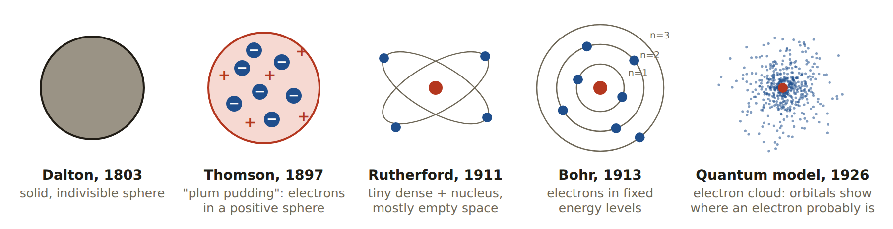
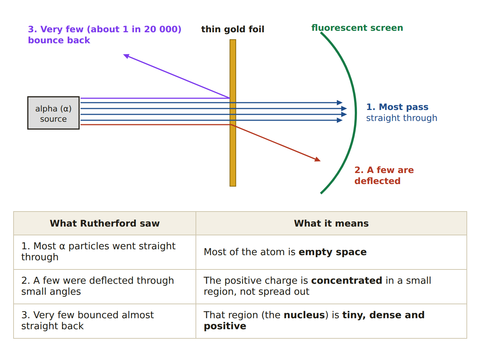
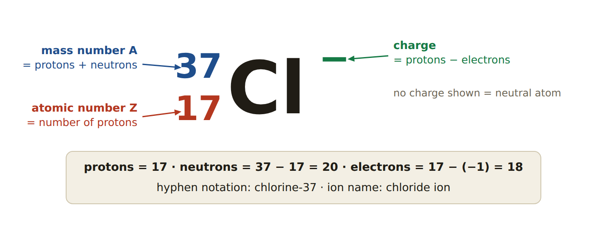
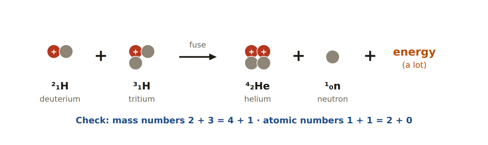
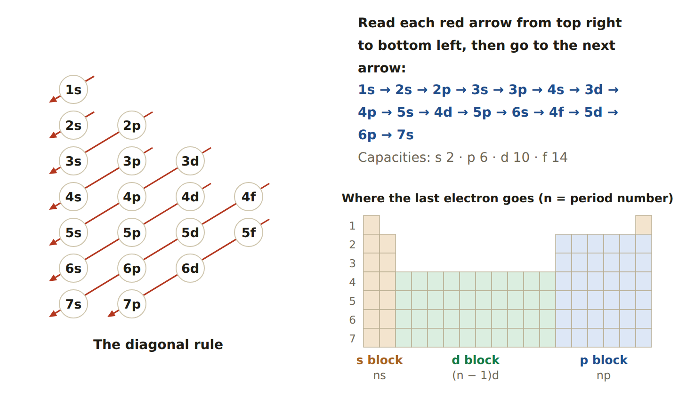
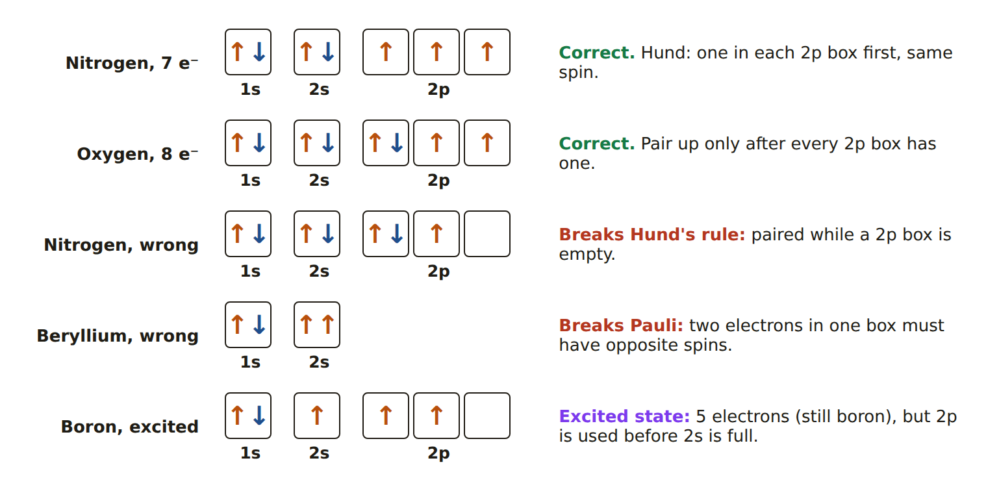
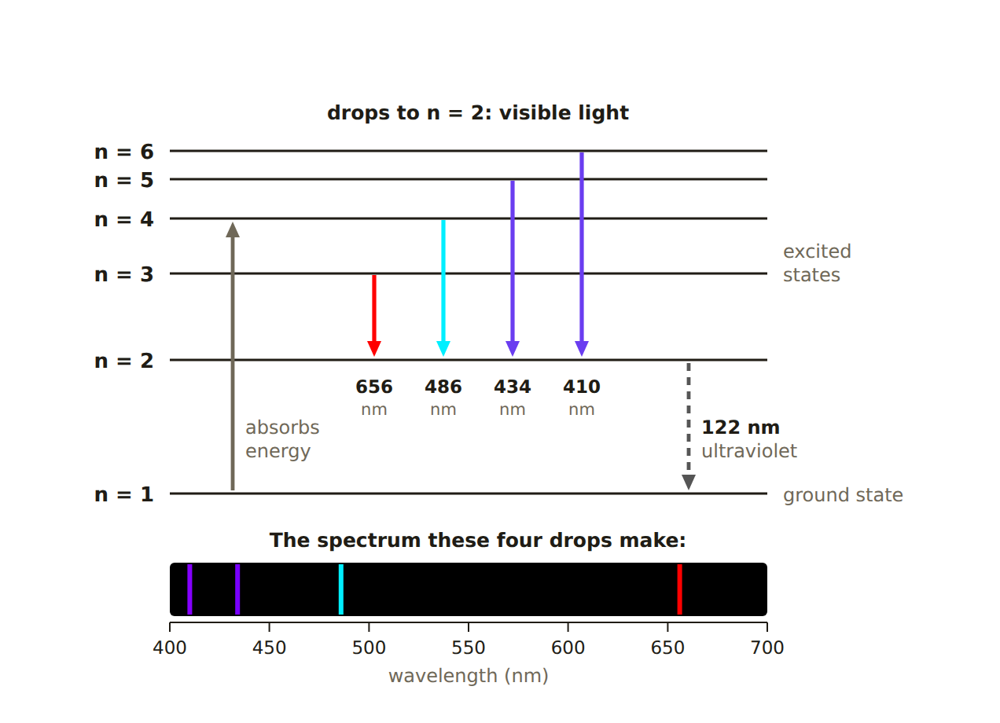
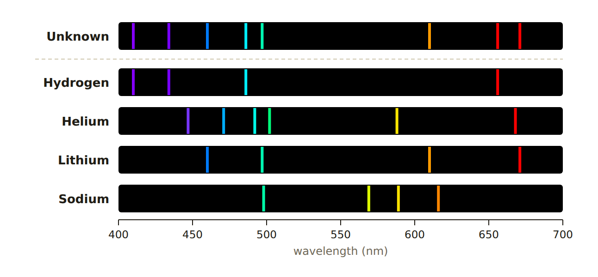
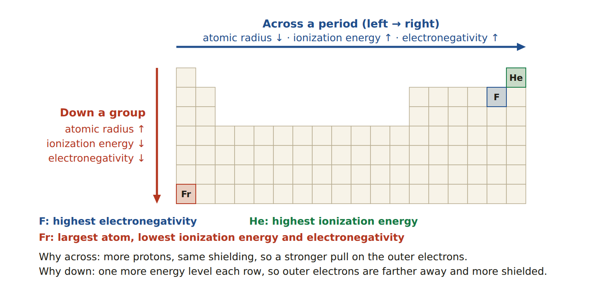
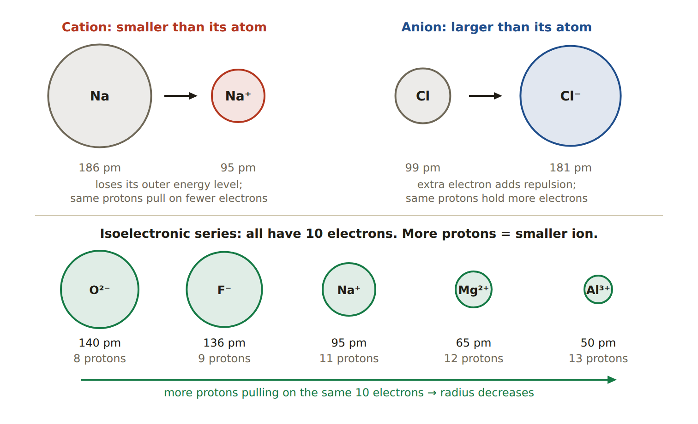

# Session C5: Chemistry Interim Review — Atomic Structure, Periodic Trends and Bonding

**Exam weighting (from the teacher):** Unit 1 Atomic Structure **60%** · Unit 2 Periodic Trends **20%** · Unit 3 Chemical Bonding **20%**. This note gives each unit that share of the space, and follows the teacher's topic lists in order.\
**Sources:** NCERT Class 9 Ch. 4 (*Structure of the Atom*), NCERT Class 11 Ch. 2 (*Structure of Atom*: sub-atomic particles, atomic models, Bohr's model, emission spectra, orbitals and electronic configuration) and Ch. 3 (*Periodicity*: atomic radius, ionic radius, ionization enthalpy, electronegativity). Unit 3 is the short version of Sessions C1 to C4.\
**Practice tools** (study-tools site, Chemistry): *Electron Configuration Lab* (`electron-config/`), *Isotopes, Ions and Average Atomic Mass* (`atom-math/`), *Emission Spectra Lab* (`spectra-lab/`), *Trends to Bonds* (`trends-to-bonds/`), *Chemistry Interim Quiz* (`chem-interim-quiz/`) and *Interim Flashcards* (`chem-interim-flashcards/`).

## Lesson Plan (three 45-minute sessions)

| Session | Minutes | What to do |
| ---- | ---- | ---- |
| **A. Unit 1, part 1** | 0–12 | Topic 1: atomic models. Student retells the timeline from the picture, then one merit and one limitation of each model. |
| | 12–22 | Topics 2 and 3: particles, isotopes vs ions. Fill the counting table without notes. |
| | 22–37 | Topic 4: average atomic mass, including a missing-variable problem. |
| | 37–45 | Topic 5: fusion, then 5 quick questions from the practice set. |
| **B. Unit 1, part 2** | 0–20 | Topic 6: electron configuration: full, noble gas, orbital diagrams, ground vs excited. |
| | 20–32 | Topic 7: light emission: excitation, de-excitation, energy and wavelength. |
| | 32–45 | Topic 8: emission spectra matching, then the Emission Spectra Lab. |
| **C. Units 2 and 3** | 0–18 | Unit 2: the four trends with the "three ideas" explanation. |
| | 18–38 | Unit 3: bonding in the teacher's order, at speed. |
| | 38–45 | Mark Practice Exam 1 together; list the weak topics. |

---

# Unit 1 — Atomic Structure (60%)

## Topic 1 — Atomic Models: Scientists, Experiments, Merits and Limitations

{width=100%}

| Scientist, year | Experiment or evidence | What it showed / the model | Merit | Limitation |
| ---- | ---- | ---- | ---- | ---- |
| **Dalton**, 1803 | Mass ratios in chemical reactions (conservation of mass, definite proportions) | Atoms are tiny, **solid, indivisible spheres**. Atoms of one element are identical; compounds form in whole-number ratios; reactions rearrange atoms. | Explained the laws of conservation of mass and definite proportions. | Atoms *are* divisible (protons, neutrons, electrons). Atoms of one element can differ in mass (isotopes). No charges. |
| **Thomson**, 1897 | **Cathode ray tube:** the ray bent toward a positive plate, and was the same for every metal and gas | All atoms contain tiny negative particles: **electrons**. **Plum pudding model:** electrons embedded in a sphere of positive charge. | First model with a subatomic particle; explains why atoms are neutral. | No nucleus. Could not explain the gold foil results. |
| **Millikan**, 1909 | **Oil drop experiment** | Measured the **charge of one electron** (−1.60 × 10⁻¹⁹ C), which also gave its mass (9.11 × 10⁻³¹ kg). | Showed the electron has a fixed charge and a mass about 1/1836 of a proton's. | A measurement, not a model of the atom. |
| **Rutherford**, 1911 | **Gold foil (alpha scattering) experiment** | **Nuclear model:** a tiny, dense, positive **nucleus** with electrons around it; the atom is mostly empty space. | Discovered the nucleus; explains the scattering. | An orbiting electron should lose energy and spiral into the nucleus, so the atom should collapse. Does not explain line spectra or how electrons are arranged. |
| **Bohr**, 1913 | **Line spectrum of hydrogen** | Electrons move in **fixed energy levels** (orbits). An electron in a level does not lose energy. Light is absorbed or emitted only when an electron **jumps between levels**. | Explains why atoms are stable and why hydrogen gives a line spectrum. | Works only for one-electron atoms (hydrogen). Cannot explain the spectra of larger atoms. Electrons do not really travel in neat circular paths. |
| **Chadwick**, 1932 | Bombarded **beryllium with alpha particles**; a neutral radiation came out | Discovered the **neutron**: no charge, mass about equal to a proton. | Explained the "missing" mass of the nucleus and why isotopes exist. | — |
| **Quantum mechanical model** (Schrödinger, 1926; with de Broglie and Heisenberg) | Electrons behave as **waves**; mathematics of the wave equation | Electrons are found in **orbitals**: regions where there is a high probability of finding an electron (the **electron cloud**). Energy is still quantized (levels and sublevels s, p, d, f). | Works for every atom; explains the periodic table and bonding. | Gives only the *probability* of where an electron is, never its exact path (Heisenberg's uncertainty principle). |

{width=88%}

**How to remember the order:** *Dalton's ball → Thomson's pudding → Rutherford's nucleus → Bohr's levels → the quantum cloud.* Each new model was built to fix the limitation of the one before it.

**Orbit vs orbital (a favorite test question).** A Bohr **orbit** is a fixed circular path at a set distance. A quantum **orbital** is a 3-D region where the electron is *probably* found. Orbits are a simplification; orbitals are the accepted picture.

---

## Topic 2 — Subatomic Particles

| Particle | Symbol | Relative charge | Relative mass (amu) | Where | Discovered by |
| ---- | ---- | ---- | ---- | ---- | ---- |
| Proton | p⁺ | +1 | 1 | nucleus | Rutherford (after Goldstein's positive rays) |
| Neutron | n⁰ | 0 | 1 | nucleus | Chadwick, 1932 |
| Electron | e⁻ | −1 | about 1/1836 (≈ 0) | electron cloud, outside the nucleus | Thomson, 1897 |

- **Atomic number (Z)** = number of protons. It **identifies the element**. Change the protons and you have a different element.
- **Mass number (A)** = protons + neutrons. So **neutrons = A − Z**.
- In a **neutral atom**, electrons = protons.
- The nucleus holds almost all the **mass** but almost none of the **volume**: it is about 100 000 times smaller than the atom. Electrons take up the space but add almost no mass.
- Protons and neutrons together are called **nucleons**.

---

## Topic 3 — Isotopes vs Ions (Naming and Notation)

{width=86%}

| | Isotopes | Ions |
| ---- | ---- | ---- |
| What changes | the number of **neutrons** | the number of **electrons** |
| What stays the same | protons (same element) and, for neutral atoms, electrons | protons (same element) and neutrons |
| Effect | different **mass number**; same chemical behavior | a **charge**; different chemical behavior |
| Notation | hyphen: **carbon-14** · symbol: ¹⁴₆C | charge at the top right: **Mg²⁺**, **Cl⁻** |
| Naming | element name + mass number | **cation** (+): element name + "ion" (sodium ion) · **anion** (−): ending changes to **-ide** (chloride ion, oxide ion) |

**Charge rule:** charge = protons − electrons. Lose electrons → positive ion (**cation**). Gain electrons → negative ion (**anion**). The protons never change when an ion forms.

**Counting practice**

| Species | Protons | Neutrons | Electrons | How |
| ---- | ---- | ---- | ---- | ---- |
| ¹⁴₆C (carbon-14) | 6 | 8 | 6 | n = 14 − 6; neutral, so e = p |
| ²³₁₁Na⁺ | 11 | 12 | 10 | 1+ means one electron lost |
| ²⁴₁₂Mg²⁺ | 12 | 12 | 10 | 2+ means two electrons lost |
| ³⁷₁₇Cl⁻ | 17 | 20 | 18 | 1− means one electron gained |
| ¹⁸₈O²⁻ | 8 | 10 | 10 | 2− means two electrons gained |
| ⁵⁶₂₆Fe³⁺ | 26 | 30 | 23 | 3+ means three electrons lost |

**Compare two species in three questions:** Same protons? (If not, different elements.) Same neutrons? (If not, isotopes.) Same electrons? (If not, one is an ion.) Carbon-12 and carbon-14 are **isotopes**. Na and Na⁺ are an **atom and its ion**. ¹⁴₆C and ¹⁴₇N have the same mass number but are **different elements**.

Hydrogen's three isotopes have their own names: protium (¹H), deuterium (²H) and tritium (³H).

---

## Topic 4 — Average Atomic Mass (and Solving for a Missing Variable)

Most elements are a mixture of isotopes. The mass on the periodic table is the **weighted average** of the isotope masses:

> **average atomic mass = (mass₁ × fraction₁) + (mass₂ × fraction₂) + …**, where fraction = percent abundance ÷ 100, and the fractions add to 1.

**Why "weighted"?** Take 100 chlorine atoms: about 76 are chlorine-35 and 24 are chlorine-37. Total mass ≈ 76 × 35 + 24 × 37 = 3548, so the average is 3548 ÷ 100 = 35.48. Each isotope counts in proportion to how many atoms of it there are. That is all the formula does.

**Quick check without a calculator:** the average is always **between** the isotope masses and **closest to the most abundant** isotope.

### Type A: find the average

Chlorine: Cl-35 has mass 34.969 amu (75.78%); Cl-37 has mass 36.966 amu (24.22%).

- 34.969 × 0.7578 = 26.4995
- 36.966 × 0.2422 = 8.9532
- Sum = **35.45 amu** (closer to 35, because Cl-35 is more abundant)

Magnesium (three isotopes): 23.985 × 0.7899 + 24.986 × 0.1000 + 25.983 × 0.1101 = 18.946 + 2.499 + 2.861 = **24.31 amu**.

### Type B: find the missing percent abundances

Boron has two isotopes: B-10 (10.013 amu) and B-11 (11.009 amu). Its average atomic mass is 10.811 amu. Find the percent of each.

1. Let x = fraction of B-10. Then the fraction of B-11 is (1 − x), because the fractions add to 1.
2. 10.013x + 11.009(1 − x) = 10.811
3. 10.013x + 11.009 − 11.009x = 10.811
4. −0.996x = −0.198, so x = 0.1988
5. **B-10 is 19.9% and B-11 is 80.1%.** Check: the average (10.811) is closer to 11, so B-11 should be the larger share. It is.

### Type C: find a missing isotope mass

Copper has two isotopes. Cu-63 has mass 62.930 amu and is 69.15% of copper. The average atomic mass is 63.546 amu. Find the mass of Cu-65.

1. Percent of Cu-65 = 100 − 69.15 = 30.85%
2. 62.930 × 0.6915 + m × 0.3085 = 63.546
3. 43.516 + 0.3085m = 63.546
4. m = 20.030 ÷ 0.3085 = **64.93 amu**

**Common slips:** using percents instead of fractions (75.78 instead of 0.7578); using mass numbers when exact masses are given; forgetting that the two fractions are x and (1 − x), not x and x.

---

## Topic 5 — Nuclear Fusion

**Fusion:** two **light nuclei join** to form one heavier nucleus, releasing a very large amount of energy.

{width=90%}

- **Where:** the core of the Sun and other stars. Stars fuse hydrogen into helium; later they build heavier elements (up to iron).
- **Conditions:** extremely **high temperature** (millions of degrees) and **high pressure**. Nuclei are all positive, so they repel; only very fast nuclei get close enough to fuse.
- **Where the energy comes from:** the products have slightly **less mass** than the reactants. The missing mass has become energy (E = mc²).
- **Nuclear vs chemical:** in a chemical reaction only electrons are rearranged and the elements stay the same. In a nuclear reaction the **nucleus changes**, so a **new element** forms, and the energy is millions of times larger.

**Balancing a nuclear equation.** The **mass numbers** (top) and the **atomic numbers** (bottom) must each add up to the same total on both sides.

| Equation | Check |
| ---- | ---- |
| ²₁H + ³₁H → ⁴₂He + ¹₀n | top: 2 + 3 = 4 + 1 · bottom: 1 + 1 = 2 + 0 |
| ²₁H + ²₁H → ³₂He + **?** | top: 4 = 3 + **1** · bottom: 2 = 2 + **0**, so the particle is a neutron, ¹₀n |
| ⁴₂He + ⁴₂He → **?** | top 8, bottom 4: element 4 is beryllium, so ⁸₄Be |

| | Fusion | Fission |
| ---- | ---- | ---- |
| What happens | small nuclei **join** | a large nucleus **splits** (for example uranium-235 hit by a neutron) |
| Where | Sun and stars; hydrogen bomb | nuclear power plants; atomic bomb |
| Conditions | extremely high temperature and pressure | can run at ordinary temperatures once started (chain reaction) |
| Products | helium; little long-lived waste | radioactive waste |
| Both | change the nucleus, form new elements, release far more energy than chemical reactions | |

---

## Topic 6 — Electron Configuration

### The address system

| Energy level (n) | Sublevels | Orbitals | Maximum electrons (2n²) |
| ---- | ---- | ---- | ---- |
| 1 | 1s | 1 | 2 |
| 2 | 2s, 2p | 1 + 3 = 4 | 8 |
| 3 | 3s, 3p, 3d | 1 + 3 + 5 = 9 | 18 |
| 4 | 4s, 4p, 4d, 4f | 1 + 3 + 5 + 7 = 16 | 32 |

**Every orbital holds at most 2 electrons.** So an s sublevel holds 2, p holds 6, d holds 10 and f holds 14.

### The three rules

1. **Aufbau principle:** fill the lowest-energy sublevel first.
2. **Pauli exclusion principle:** an orbital holds at most 2 electrons, and they must have **opposite spins** (one ↑, one ↓).
3. **Hund's rule:** within a sublevel, put **one electron in each orbital first** (all with the same spin), and only then start pairing.

{width=100%}

**Filling order:** 1s → 2s → 2p → 3s → 3p → **4s → 3d** → 4p → 5s → 4d → 5p. The surprise is that **4s fills before 3d**.

**Shortcut:** read the periodic table left to right like a book. Groups 1–2 are the s block, groups 13–18 are the p block, groups 3–12 are the d block. In period 4 you pass 4s (K, Ca), then 3d (Sc to Zn), then 4p (Ga to Kr).

### Writing a neutral ground-state configuration

1. Find the number of electrons (= atomic number for a neutral atom).
2. Fill sublevels in order until the electrons run out.
3. **Check:** the superscripts must add up to the atomic number.

| Element | Z | Full configuration | Noble gas configuration |
| ---- | ---- | ---- | ---- |
| N | 7 | 1s² 2s² 2p³ | [He] 2s² 2p³ |
| O | 8 | 1s² 2s² 2p⁴ | [He] 2s² 2p⁴ |
| Na | 11 | 1s² 2s² 2p⁶ 3s¹ | [Ne] 3s¹ |
| P | 15 | 1s² 2s² 2p⁶ 3s² 3p³ | [Ne] 3s² 3p³ |
| Cl | 17 | 1s² 2s² 2p⁶ 3s² 3p⁵ | [Ne] 3s² 3p⁵ |
| Ca | 20 | 1s² 2s² 2p⁶ 3s² 3p⁶ 4s² | [Ar] 4s² |
| Fe | 26 | 1s² 2s² 2p⁶ 3s² 3p⁶ 4s² 3d⁶ | [Ar] 4s² 3d⁶ |
| Br | 35 | 1s² 2s² 2p⁶ 3s² 3p⁶ 4s² 3d¹⁰ 4p⁵ | [Ar] 4s² 3d¹⁰ 4p⁵ |

**Noble gas configuration:** write the symbol of the **previous noble gas** (the one at the end of the row above) in brackets, then only the electrons after it. [He] = 2 electrons, [Ne] = 10, [Ar] = 18, [Kr] = 36.

**Two exceptions to know:** chromium is [Ar] 4s¹ 3d⁵ and copper is [Ar] 4s¹ 3d¹⁰. A half-filled or completely filled d sublevel is extra stable.

**Reading a configuration backwards.** The highest n is the **period**. The electrons in the highest n are the **valence electrons** (for main-group elements). 1s² 2s² 2p⁶ 3s² 3p⁴ has 16 electrons (sulfur), is in period 3, and has 6 valence electrons.

### Orbital filling diagrams

One box per orbital, one arrow per electron. Label each sublevel.

{width=100%}

### Ground state vs excited state

- **Ground state:** every electron is in the lowest sublevel available. This is what the filling order gives.
- **Excited state:** the atom has absorbed energy, and at least one electron sits in a **higher sublevel while a lower one is not full**. The number of electrons has **not** changed, so it is still the same element.

**How to decide (three steps):**

1. **Check the limits.** Any sublevel over its capacity (2p⁷, 1s³, 3d¹¹) is **not possible**.
2. **Count the electrons.** The total is the atomic number, which names the element.
3. **Compare with the ground state.** Same as the filling order → ground state. An electron skipped ahead → excited state.

| Configuration | Electrons | Verdict |
| ---- | ---- | ---- |
| 1s² 2s² 2p⁶ 3s¹ | 11 | sodium, **ground** state |
| 1s² 2s² 2p⁶ 3p¹ | 11 | sodium, **excited** (3s is empty but 3p is used) |
| 1s² 2s¹ 2p³ | 6 | carbon, **excited** (2s is not full) |
| 1s² 2s² 2p⁵ 3s¹ | 10 | neon, **excited** |
| 1s² 2s² 2p⁷ | — | **not possible** (2p holds 6) |

---

## Topic 7 — Light Emission: Excitation and De-excitation

{width=78%}

**The story in four steps**

1. **Ground state.** The electron is in its lowest energy level.
2. **Excitation.** The atom **absorbs** energy (heat from a flame, electricity, or light). The electron jumps to a higher level. The atom is now in an **excited state**, which is unstable.
3. **De-excitation.** The electron **falls back** to a lower level.
4. **Emission.** As it falls, it gives out the energy as one **photon** of light. The photon's energy is exactly the **difference** between the two levels.

> **Absorb energy → jump up. Fall down → emit light.** Light comes out on the way *down*, never on the way up.

**Energy, frequency and wavelength**

- c = λf (speed of light = wavelength × frequency), with c = 3.00 × 10⁸ m/s
- E = hf (energy of a photon), with h = 6.626 × 10⁻³⁴ J·s
- Together: E = hc ÷ λ

So a **bigger drop** releases **more energy**, which means a **higher frequency** and a **shorter wavelength** (toward violet). A smaller drop gives lower energy and a longer wavelength (toward red).

| Color | Wavelength | Frequency | Photon energy |
| ---- | ---- | ---- | ---- |
| red | long (about 700 nm) | low | low |
| violet | short (about 400 nm) | high | high |

Order of visible light by increasing energy: red, orange, yellow, green, blue, violet. Beyond violet is ultraviolet (more energy); below red is infrared (less energy).

*Worked example (only if your class did the calculation).* Hydrogen's red line has λ = 656 nm = 6.56 × 10⁻⁷ m. f = c ÷ λ = (3.00 × 10⁸) ÷ (6.56 × 10⁻⁷) = 4.57 × 10¹⁴ Hz. E = hf = (6.626 × 10⁻³⁴)(4.57 × 10¹⁴) = 3.03 × 10⁻¹⁹ J.

**Why lines and not a rainbow?** Energy levels are **quantized**: an electron can only be in certain levels, so only certain drops are possible, so only certain colors come out.

**Flame tests** use this. Heating a metal salt excites its electrons, and the color seen as they fall back identifies the metal: lithium red, sodium yellow, potassium lilac, calcium orange-red, copper blue-green.

---

## Topic 8 — Atomic Emission Spectra (Matching Lines)

- A **continuous spectrum** (white light through a prism) shows every color.
- An **emission (line) spectrum** shows only a few bright lines on a dark background. It comes from a glowing gas of one element.
- Every element has its **own set of energy levels**, so every element has its **own set of lines**. An emission spectrum is the element's **fingerprint**.

**The matching rule.** An element is in the unknown sample only if **every one** of its lines appears in the unknown's spectrum. One matching line is not enough. Lines left over belong to another element.

{width=92%}

**Worked example (the figure).**

- **Hydrogen:** 410, 434, 486 and 656 nm are all in the unknown. **Present.**
- **Lithium:** 460, 497, 610 and 671 nm are all in the unknown. **Present.**
- **Helium:** its lines at 447, 471, 588 and 668 nm are missing. **Absent.**
- **Sodium:** one of its lines (498) sits almost on lithium's 497, but 569, 589 and 616 are missing. **Absent.** This is the trap: a single match proves nothing.
- Every line in the unknown is now accounted for, so the unknown is **hydrogen + lithium** only.

**Method for the exam:** take one reference element at a time, put a ruler (or the edge of your paper) on each of its lines, and tick it only if the unknown has a line in exactly the same place. All ticked → present.

---

# Unit 2 — Periodic Trends (20%)

**Every trend comes from three ideas.** Learn these and you can explain any of them.

1. **Nuclear charge:** more protons pull electrons in more strongly.
2. **Shielding:** inner (core) electrons block some of the pull. Across a period shielding stays about the **same**; down a group it **increases**.
3. **Distance:** more energy levels put the outer electrons farther from the nucleus, where the pull is weaker.

**Effective nuclear charge** (the pull an outer electron actually feels) ≈ protons − inner electrons. Sodium: 11 − 10 = +1. Chlorine: 17 − 10 = +7. Same period, same shielding, much stronger pull on chlorine's outer electrons.

{width=100%}

| Property | Definition | Across a period → | Down a group ↓ |
| ---- | ---- | ---- | ---- |
| **Atomic radius** | size of the atom (half the distance between two bonded nuclei) | **decreases:** more protons, same shielding, electrons pulled closer | **increases:** a new energy level each row, more shielding |
| **First ionization energy** | energy needed to **remove** the outermost electron from a gaseous atom | **increases:** electrons held more tightly | **decreases:** outer electron is farther away and more shielded |
| **Electronegativity** | how strongly an atom **attracts shared electrons** in a bond | **increases** | **decreases** |
| **Ionic radius** | size of an ion | cations shrink, then anions shrink (see below) | **increases** |

**Small atom = tight hold.** A small atom holds its electrons tightly, so it has a **high** ionization energy and a **high** electronegativity. A large atom holds them loosely, so both are **low**. Atomic radius runs opposite to the other two.

**Data to see the trends (NCERT values)**

| Period 3 | Na | Mg | Al | Si | P | S | Cl |
| ---- | ---- | ---- | ---- | ---- | ---- | ---- | ---- |
| Atomic radius (pm) | 186 | 160 | 143 | 117 | 110 | 104 | 99 |
| First ionization energy (kJ/mol) | 496 | 737 | 577 | 786 | 1011 | 1000 | 1256 |
| Electronegativity | 0.9 | 1.2 | 1.5 | 1.8 | 2.1 | 2.5 | 3.0 |

| Group 1 | Li | Na | K | Rb | Cs |
| ---- | ---- | ---- | ---- | ---- | ---- |
| Atomic radius (pm) | 152 | 186 | 231 | 244 | 262 |
| First ionization energy (kJ/mol) | 520 | 496 | 419 | 403 | 374 |
| Electronegativity | 1.0 | 0.9 | 0.8 | 0.8 | 0.7 |

The ionization energy does not rise perfectly smoothly (Mg to Al and P to S dip slightly). The **general** trend is what the exam asks for, unless your class studied the dips.

### Ionic radius

{width=92%}

- A **cation is smaller** than its atom: it has lost electrons (usually its whole outer level), and the same protons now pull on fewer electrons.
- An **anion is larger** than its atom: the added electrons repel each other, and the same protons have more electrons to hold.
- **Isoelectronic ions** (same number of electrons): the one with **more protons is smaller**. O²⁻ > F⁻ > Na⁺ > Mg²⁺ > Al³⁺.

### Ionization energy tells you the valence electrons

Removing a second or third electron always takes more energy. The **huge jump** comes when you start removing **core** electrons.

| Element | 1st | 2nd | 3rd | 4th | Reading |
| ---- | ---- | ---- | ---- | ---- | ---- |
| Na | 496 | **4562** | | | jump after 1 electron: 1 valence electron |
| Mg | 738 | 1451 | **7733** | | jump after 2: 2 valence electrons |
| Al | 578 | 1817 | 2745 | **11 577** | jump after 3: 3 valence electrons |

(kJ/mol)

### How to write a trend explanation (the three-part answer)

> **Claim** (which is larger) → **cause** (protons, shielding, or energy levels) → **effect** (pull on the outer electrons).

- *Why is chlorine smaller than sodium?* Both have three energy levels and the same shielding, but chlorine has **17 protons** to sodium's 11. The **stronger nuclear pull** draws the outer electrons **closer**.
- *Why is potassium's ionization energy lower than sodium's?* Potassium's outer electron is in the **4th energy level**, farther from the nucleus and **shielded** by more inner electrons, so it is **held less tightly** and is easier to remove.
- *Why is fluorine more electronegative than iodine?* Fluorine is a much **smaller** atom, so the bonding electrons are **closer to its nucleus** and less shielded, and are attracted more strongly.

**Link to Unit 3.** The **difference** in electronegativity between two atoms decides the bond: large difference → ionic; medium → polar covalent; small → nonpolar covalent. Metals (low ionization energy) lose electrons and form cations; non-metals (high electronegativity) gain electrons and form anions.

---

# Unit 3 — Chemical Bonding (20%)

The full version is Session C4. This is the exam-day summary in the teacher's order.

## 1. Identifying types of bonds

| Atoms | Bond | Electrons are | ΔEN | Examples |
| ---- | ---- | ---- | ---- | ---- |
| metal + metal | **metallic** | delocalized: a "sea" of electrons around + ions | not used | Cu, brass |
| metal + non-metal | **ionic** | **transferred** | more than 1.7 | NaCl, MgO |
| two different non-metals | **polar covalent** | **shared unequally** | 0.5 to 1.7 | H–Cl, O–H |
| identical or similar non-metals | **nonpolar covalent** | **shared equally** | less than 0.5 | Cl₂, C–H |

Electronegativities: H 2.1 · C 2.5 · N 3.0 · O 3.5 · F 4.0 · Na 0.9 · Mg 1.2 · Al 1.5 · Si 1.8 · P 2.1 · S 2.5 · Cl 3.0 · K 0.8 · Br 2.8. Kinds of atoms come first; ΔEN refines it.

## 2. Drawing bonds

- **Ionic (ions in brackets):** the metal gives away its valence electrons; the non-metal takes enough to reach 8. Draw each ion in **square brackets with the charge outside**. The metal ion has no dots; the non-metal ion has 8.

{width=92%}

- **Covalent (Lewis structures):** (1) count valence electrons, adding 1 for each − charge and subtracting 1 for each + charge; (2) draw the skeleton with single bonds, never with H in the center; (3) give the outer atoms 8 each, leftovers go on the central atom; (4) if the central atom is short of 8, make a double or triple bond. A polyatomic ion needs **brackets and its charge**.

## 3. Properties: weaker vs stronger

| Property | Ionic | Metallic | Covalent (molecules) | Covalent network |
| ---- | ---- | ---- | ---- | ---- |
| Melting point | high | usually high | **low** | **very high** |
| Hardness | hard but **brittle** | malleable, ductile | soft | very hard |
| Conducts electricity | only **molten or dissolved** | yes, even as a solid | no | no (except graphite) |
| Examples | NaCl, MgO | Cu, Fe | H₂O, CO₂, wax | diamond, SiO₂ |

Reasons to give: ionic solids have ions **fixed in a lattice** (no conduction until they can move); metals have **delocalized electrons**; molecular substances melt low because only the **weak forces between molecules** are overcome, not the covalent bonds.

## 4. Naming

1. **Metal (or NH₄⁺) first → ionic, no prefixes.** Metal with more than one charge (Fe, Cu, most transition metals): add a **Roman numeral**. A **polyatomic ion** keeps its own name. Otherwise the non-metal ends in **-ide**.
2. **Two non-metals → covalent, use prefixes** (mono, di, tri, tetra, penta, hexa), ending in **-ide**. No "mono" on the first element.

| Formula | Name | Rule used |
| ---- | ---- | ---- |
| MgCl₂ | magnesium chloride | ionic, -ide |
| Fe₂O₃ | iron(III) oxide | Roman numeral: 3 O²⁻ = 6−, so each Fe is 3+ |
| Ca(NO₃)₂ | calcium nitrate | polyatomic ion |
| N₂O₄ | dinitrogen tetroxide | prefixes |

Polyatomic ions: ammonium NH₄⁺ · hydroxide OH⁻ · nitrate NO₃⁻ · nitrite NO₂⁻ · carbonate CO₃²⁻ · sulfate SO₄²⁻ · sulfite SO₃²⁻ · phosphate PO₄³⁻.

## 5. Designing materials

List the properties the job needs, then choose the bond type that gives them: **metallic** to conduct or to be shaped (wires, pans); **ionic ceramic** for very high temperatures and electrical insulation (but brittle); **covalent network** for extreme hardness (drill tips); **molecular covalent** (plastics) for light, flexible insulators (wire coating, handles).

## 6. Molecular geometry (VSEPR)

Electron domains on the central atom = bonded atoms (a double or triple bond counts once) + lone pairs.

| Domains | Lone pairs | Electron geometry | Molecular geometry | Angle | Example |
| ---- | ---- | ---- | ---- | ---- | ---- |
| 2 | 0 | linear | **linear** | 180° | CO₂ |
| 3 | 0 | trigonal planar | **trigonal planar** | 120° | BF₃ |
| 3 | 1 | trigonal planar | **bent** | < 120° | SO₂ |
| 4 | 0 | tetrahedral | **tetrahedral** | 109.5° | CH₄ |
| 4 | 1 | tetrahedral | **trigonal pyramidal** | ≈ 107° | NH₃ |
| 4 | 2 | tetrahedral | **bent** | ≈ 104.5° | H₂O |

## 7. Molecular polarity

A molecule is **polar** if it has polar bonds **and** the bond dipoles do not cancel. They cancel only when the shape is symmetric **and** all the outer atoms are the same.

{width=80%}

- **Nonpolar:** CO₂, BF₃, CCl₄, CH₄.
- **Polar:** H₂O, NH₃, SO₂ (lone pair on the central atom); CH₂Cl₂, HCN (outer atoms differ).

---

# Practice Set (answers follow)

**Unit 1**

1. Which experiment led to the discovery of the nucleus, and what three observations were made?
2. State one limitation of (a) Thomson's model, (b) Rutherford's model, (c) Bohr's model.
3. Give the number of protons, neutrons and electrons in ⁴⁰₂₀Ca²⁺ and in ¹⁵₇N³⁻.
4. Are ³⁵₁₇Cl and ³⁷₁₇Cl isotopes or ions? What about ³⁵₁₇Cl and ³⁵₁₇Cl⁻?
5. Silver has two isotopes: Ag-107 (106.905 amu, 51.839%) and Ag-109 (108.905 amu, 48.161%). Calculate its average atomic mass.
6. Gallium's two isotopes are Ga-69 (68.926 amu) and Ga-71 (70.925 amu). The average atomic mass is 69.723 amu. Find the percent abundance of each.
7. Complete the fusion equation: ²₁H + ¹₁H → **?**
8. Write the full and the noble gas configurations of (a) sulfur, (b) potassium, (c) zinc.
9. Draw the orbital diagram of the 2p sublevel of fluorine. How many unpaired electrons does it have?
10. Classify as ground state, excited state or not possible, and name the element: (a) 1s² 2s² 2p⁶ 3s² 3p¹ (b) 1s² 2s² 2p⁶ 3s¹ 3p² (c) 1s² 2s³.
11. An electron falls from n = 5 to n = 2 in one atom and from n = 3 to n = 2 in another. Which emits the photon with the shorter wavelength? Why?
12. An unknown spectrum has lines at 405, 436, 447, 471, 492, 502, 546, 578, 588 and 668 nm. Using the reference lines in this note (mercury: 405, 436, 546, 578; helium: 447, 471, 492, 502, 588, 668; hydrogen: 410, 434, 486, 656), which elements are present?

**Unit 2**

13. Arrange in order of increasing atomic radius: Cl, Na, K, S.
14. Which has the higher first ionization energy, Mg or Ba? Explain in terms of energy levels and shielding.
15. Arrange in order of decreasing size: Mg²⁺, O²⁻, Na⁺, F⁻. Explain.
16. An element has successive ionization energies of 590, 1145, 4912 and 6491 kJ/mol. How many valence electrons does it have, and which group is it in?

**Unit 3**

17. Classify the bond in each: KF, HBr, O₂, bronze.
18. Name Cu₂O, PCl₅ and Na₂SO₄.
19. For NH₃ give the electron geometry, molecular geometry, bond angle and molecular polarity.
20. Solid sodium chloride does not conduct electricity but molten sodium chloride does. Explain.

## Answers

1. Rutherford's **gold foil (alpha scattering)** experiment. Most alpha particles passed straight through; a few were deflected through small angles; very few (about 1 in 20 000) bounced back.
2. (a) No nucleus, so it cannot explain the gold foil results. (b) An orbiting electron should lose energy and spiral into the nucleus; it also does not explain line spectra. (c) It works only for hydrogen (one electron).
3. Ca²⁺: 20 protons, 40 − 20 = **20** neutrons, 20 − 2 = **18** electrons. N³⁻: 7 protons, 15 − 7 = **8** neutrons, 7 + 3 = **10** electrons.
4. ³⁵Cl and ³⁷Cl are **isotopes** (same protons, different neutrons). ³⁵Cl and ³⁵Cl⁻ are an **atom and its ion** (same protons and neutrons, different electrons).
5. 106.905 × 0.51839 + 108.905 × 0.48161 = 55.418 + 52.450 = **107.87 amu**.
6. Let x = fraction of Ga-69. 68.926x + 70.925(1 − x) = 69.723 → 70.925 − 1.999x = 69.723 → x = 1.202 ÷ 1.999 = 0.6013. **Ga-69 is 60.1%, Ga-71 is 39.9%.**
7. Top: 2 + 1 = 3. Bottom: 1 + 1 = 2. Element 2 is helium: **³₂He**.
8. (a) S: 1s² 2s² 2p⁶ 3s² 3p⁴ = [Ne] 3s² 3p⁴. (b) K: 1s² 2s² 2p⁶ 3s² 3p⁶ 4s¹ = [Ar] 4s¹. (c) Zn: 1s² 2s² 2p⁶ 3s² 3p⁶ 4s² 3d¹⁰ = [Ar] 4s² 3d¹⁰.
9. Fluorine is 1s² 2s² 2p⁵. The 2p boxes are [↑↓] [↑↓] [↑]. **One** unpaired electron.
10. (a) 13 electrons, aluminum, **ground** state. (b) 13 electrons, aluminum, **excited** (3s is not full but 3p is used). (c) **Not possible:** an s sublevel holds only 2.
11. **5 → 2.** It is the bigger drop, so the photon has more energy, a higher frequency and a shorter wavelength (434 nm, against 656 nm for 3 → 2).
12. **Mercury** (405, 436, 546, 578 all present) and **helium** (447, 471, 492, 502, 588, 668 all present). Hydrogen is absent: none of 410, 434, 486, 656 appear. All ten lines are accounted for.
13. **Cl < S < Na < K.** Across period 3 the radius decreases (Na > S > Cl); K is in period 4, below Na, so it is the largest.
14. **Mg.** Barium's outer electrons are in the 6th energy level, far from the nucleus and shielded by many inner electrons, so they are held weakly and are easier to remove.
15. **O²⁻ > F⁻ > Na⁺ > Mg²⁺.** All have 10 electrons. The more protons (8, 9, 11, 12), the stronger the pull on the same electrons and the smaller the ion.
16. The big jump is between the 2nd and 3rd, so it has **2 valence electrons: group 2** (it is calcium).
17. KF **ionic** (metal + non-metal, ΔEN 3.2) · HBr **polar covalent** (ΔEN 0.7) · O₂ **nonpolar covalent** (ΔEN 0) · bronze **metallic**.
18. **Copper(I) oxide** (O is 2−, so each of the two Cu is 1+) · **phosphorus pentachloride** · **sodium sulfate**.
19. 4 domains (3 bonds + 1 lone pair): electron geometry **tetrahedral**, molecular geometry **trigonal pyramidal**, angle **about 107°**, **polar** (the lone pair makes it unsymmetric, so the N–H dipoles do not cancel).
20. In the solid the **ions are fixed** in the lattice and cannot move. When it melts the ions are **free to move** and carry the charge.

## The mistakes that cost the most marks

1. Saying Rutherford discovered the electron, or that Thomson discovered the nucleus. Thomson: electron. Rutherford: nucleus. Chadwick: neutron.
2. Subtracting the wrong way for ions: a **positive** charge means **fewer** electrons.
3. Changing the number of protons when making an ion or an isotope. Protons never change.
4. Using percents (75.78) instead of fractions (0.7578) in average atomic mass.
5. Writing 3d before 4s is full, or forgetting that 3d comes before 4p.
6. Pairing electrons in a p sublevel before each orbital has one (Hund's rule).
7. Using the noble gas from the **same** row for the noble gas configuration. It is always the one from the row **above**.
8. Saying light is emitted when the electron jumps **up**. It is emitted when the electron falls **down**.
9. Mixing up wavelength and energy: **short** wavelength means **high** energy.
10. Calling an element present in a spectrum because **one** line matches. All of its lines must match.
11. Saying atomic radius increases across a period because there are more electrons. It **decreases**: more protons, same shielding.
12. Explaining a trend with "it is further right on the table". Always give the cause: protons, shielding or energy levels.
13. In Unit 3: prefixes on ionic names, a missing Roman numeral, a double bond counted as two domains, and "polar bonds, so polar molecule".

## Notes for next session

- Take Practice Exam 1 under timed conditions; use Exam 2 (Challenge) two days later.
- If the class did photon calculations (E = hf), add five more calculation problems; if not, skip the worked example in Topic 7.
