# Session C3: VSEPR, Molecular Shapes, Bond Angles & Polarity

**Duration:** 45 minutes (strict)\
**Continues from:** Session C2, *Drawing Lewis Structures, Covalent Molecules & Polyatomic Ions*. C2 ended with this exact next step: a Lewis structure shows **which** electrons are shared, but not the **3-D shape**. Today uses the Lewis structure to predict the shape, and then the shape to decide whether the molecule is **polar**.\
**Class worksheet (9/30):** an 8-column table: *Chemical Formula · Valence e⁻ · Lewis · Electron Geometry · Molecular Geometry & Bond Angle · Molecular Geometry Redraw · Bond Polarity? · Molecular Polarity?* The rows are PBr₃, HCO₂⁻, NOCl, NO₂⁻ and CF₂Cl₂. Dhairya finished most of the PBr₃ and HCO₂⁻ rows in class. **Expect the test to use this same table**, so every worked example below is laid out column by column.\
**Grade-9 foundation:** NCERT Class 9 Ch9 *Atomic Foundations of Matter*, §9.4.1 *Bonding by sharing of electrons: Covalent Bond* (valence electrons, shared pairs, the octet).\
**Grade-11 depth:** NCERT Class 11 Ch4 *Chemical Bonding and Molecular Structure*: §4.3.6 *Polarity of Bonds* (dipole moment, the crossed arrow, bond dipoles adding as vectors, Table 4.5, pp. 110–112) and §4.4 *The VSEPR Theory* (postulates, repulsion order, Tables 4.6–4.8, pp. 112–116). Electronegativities are the Pauling values from NCERT Class 11 Ch3, the same ones used in C1.\
**Interactive tools** (study-tools site, Chemistry): *VSEPR Shape Explorer* (`vsepr-shapes/`), *Wedge & Dash Lab* (`wedge-dash/`), *Worksheet Trainer* (`vsepr-table/`), *Worksheet Test* (`vsepr-worksheet/`), *VSEPR & Polarity flashcards* (`vsepr-flashcards/`) and *VSEPR & Polarity Practice Test* (`vsepr-test/`).

---

## Lesson Plan

**Objectives.** By the end of this session Dhairya should be able to fill in every column of the worksheet table for any molecule or ion with up to 4 electron domains:

1. Count the **electron domains** on the central atom from its Lewis structure, and name the **electron geometry**.
2. Name the **molecular geometry** and give the **bond angle**, including how lone pairs squeeze the angle.
3. **Redraw** the molecule in 3-D with plain lines, wedges and dashes.
4. Decide whether each bond is **polar** from ΔEN, and whether the whole **molecule** is polar from its shape.

| Time | Segment |
| ---- | ---- |
| 0–3 min | Warm-up: 3 quick recall questions |
| 3–13 min | Part 1: VSEPR, electron domains and electron geometry (show the *Shape Explorer*) |
| 13–20 min | Part 2: molecular geometry, bond angles and the lone-pair squeeze |
| 20–23 min | Part 3: the 3-D redraw with wedges and dashes |
| 23–31 min | Part 4: bond polarity and molecular polarity |
| 31–42 min | Part 5: the worksheet: check rows 1–2 together, then he solves rows 3–5 alone |
| 42–45 min | Exit ticket; homework is the *Wedge & Dash Lab* plus the *Worksheet Test* |

**Pacing note.** Part 5 is the priority, since it is exactly what the test looks like. If you run behind, skip the derivations (the 109.5° cube proof and the vector sums). State the results and leave the proofs to the notes. Do not skip the "electron geometry vs molecular geometry" distinction in Part 2. It is the most common test mistake.

### The row routine (one column at a time)

| Column | How to fill it |
| ---- | ---- |
| **Valence e⁻** | Add each atom's valence electrons (the last digit of its group). Add 1 for each negative charge; subtract 1 for each positive charge. |
| **Lewis** | The C2 4-step method. For an ion, use brackets and write the charge outside. |
| **Electron geometry** | Count the **electron domains** on the central atom: each bonded atom counts 1 (single, double or triple bond), and each lone pair counts 1. Then 2 = linear, 3 = trigonal planar, 4 = tetrahedral. |
| **Molecular geometry & bond angle** | Use the **atoms only** (the lone pairs are invisible) and read the shape from the chart in Part 2. |
| **Redraw** | Draw that shape in 3-D: plain lines lie in the page, a wedge comes toward you, a dash goes away. Draw the lone pairs on the central atom. |
| **Bond polarity** | For each *kind* of bond, ΔEN = larger EN − smaller EN. Below 0.5 it is nonpolar; from 0.5 to 1.7 it is polar. |
| **Molecular polarity** | If there are no polar bonds, the molecule is nonpolar. If there are polar bonds, it is nonpolar only if the shape is symmetric: no lone pairs on the central atom **and** identical outer atoms. Otherwise it is polar. |

---

## Warm-up (3 min)

1. *How many valence electrons does NOCl have?* → N 5 + O 6 + Cl 7 = **18**.
2. *In NOCl, which atom is central, and why?* → **N**. It forms 3 bonds, O forms 2 and Cl forms 1. The atom that forms the most bonds goes in the middle (C2, step 2).
3. *C1 recall: is a C–H bond polar?* → ΔEN = 2.5 − 2.1 = 0.4, which is below 0.5, so it is **nonpolar**. (This is the "H: nonpolar" note on the worksheet.)

**Bridge to today:** "A Lewis structure is flat. Real molecules are 3-D, and their shape decides things like whether water is polar. Today we get the shape from the Lewis structure you already know how to draw."

---

## Part 1 — VSEPR: Electron Domains & Electron Geometry (10 min)

### The idea

**VSEPR** stands for **V**alence **S**hell **E**lectron **P**air **R**epulsion. The main postulates, from NCERT §4.4:

- The shape of a molecule depends on the number of valence-shell electron pairs, **bonded or non-bonded**, around the **central atom**.
- Electron pairs **repel** each other, because their clouds are negatively charged.
- The pairs therefore sit **as far apart as possible**, which minimizes repulsion.
- A **multiple bond is treated as if it were a single electron pair**. The 2 or 3 pairs of a double or triple bond act as one "super pair".
- When a molecule has **resonance structures**, VSEPR applies to any one of them. They all give the same shape.

### Counting electron domains

An **electron domain** is one region of electron density around the central atom:

- each **bonded atom** = 1 domain, whether the bond is single, double or triple;
- each **lone pair on the central atom** = 1 domain.

**Do not count** the lone pairs on the outer atoms. They affect their own atom, not the central atom's shape.

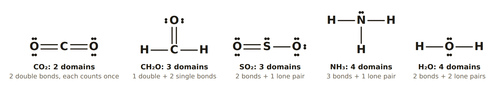{width=100%}

### Electron geometry

Electron geometry is the arrangement of **all** the domains, lone pairs included. It depends only on how many domains there are (NCERT Fig. 4.6 and Table 4.6):

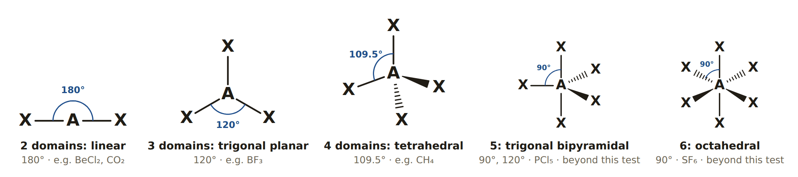{width=100%}

| Domains | Electron geometry | Angle between domains | Why that angle |
| ---- | ---- | ---- | ---- |
| 2 | linear | 180° | Two domains get farthest apart on opposite sides. |
| 3 | trigonal planar | 120° | Three domains spread around a circle: 360° ÷ 3 = 120°, all in one plane. |
| 4 | tetrahedral | 109.5° | In 3-D, four domains point to the corners of a tetrahedron (derivation below). |
| 5, 6 | trigonal bipyramidal, octahedral | 90°/120°, 90° | Needs an expanded octet (period 3 and below). **Not on this test.** |

**Why 109.5°, not 90°? (Derivation.)** On paper, 4 bonds look as if they would sit at 90° in a "+" shape. In 3-D they can get farther apart. Put the central atom at the centre of a cube, and the 4 domains toward 4 alternate corners:

a = (1, 1, 1), b = (1, −1, −1), c = (−1, 1, −1), d = (−1, −1, 1).

The angle θ between any two of them comes from the dot product:

cos θ = (a · b) / (|a| |b|) = (1·1 + 1·(−1) + 1·(−1)) / (√3 · √3) = (1 − 1 − 1) / 3 = **−1/3**

θ = cos⁻¹(−1/3) = **109.47° ≈ 109.5°**.

That is wider than 90°, so the tetrahedron is the arrangement that keeps the pairs farthest apart. (Each pair of corners gives the same −1/3, so all six angles are equal.)

---

## Part 2 — Molecular Geometry, Bond Angles & the Lone-Pair Squeeze (7 min)

### Electron geometry vs molecular geometry

- **Electron geometry** includes every domain, lone pairs too.
- **Molecular geometry** (the "shape") describes **only where the atoms are**. Imagine the lone pairs are invisible.

When the central atom has **no lone pairs**, the two geometries are the **same**. When it has lone pairs, the molecular geometry gets a **different name**. This is NCERT's split into "no lone pair" (Table 4.6) and "one or more lone pairs" (Table 4.7).

{width=90%}

| Domains | Bonded atoms | Lone pairs | Electron geometry | **Molecular geometry** | Bond angle | Examples |
| ---- | ---- | ---- | ---- | ---- | ---- | ---- |
| 2 | 2 | 0 | linear | **linear** | 180° | CO₂, HCN |
| 3 | 3 | 0 | trigonal planar | **trigonal planar** | 120° | BF₃, HCO₂⁻ |
| 3 | 2 | 1 | trigonal planar | **bent** | slightly < 120° | SO₂ (119.5°), NO₂⁻, NOCl |
| 4 | 4 | 0 | tetrahedral | **tetrahedral** | 109.5° | CH₄, CF₂Cl₂ |
| 4 | 3 | 1 | tetrahedral | **trigonal pyramidal** | ≈ 107° (< 109.5°) | NH₃, PBr₃ |
| 4 | 2 | 2 | tetrahedral | **bent** | ≈ 104.5° (< 109.5°) | H₂O |

(The AXE labels in the chart come from NCERT Table 4.7: A = central atom, X = bonded atom, E = lone pair. NH₃ is AX₃E.)

**Watch out:** "bent" appears **twice**. With 3 domains it is under 120°, and with 4 domains it is about 104.5°. On the test, write the electron geometry too, so the grader can see which bent you mean.

### Lone pairs squeeze the bond angle

NCERT §4.4 gives the order of repulsion:

**lone pair–lone pair > lone pair–bond pair > bond pair–bond pair**

**Why:** a bonding pair is shared between two nuclei, so it is pulled out into a narrow region. A lone pair belongs to the central atom alone, so it spreads out and takes **more space**. It pushes the bonding pairs closer together, which makes the bond angle smaller than the ideal one (NCERT Table 4.8):

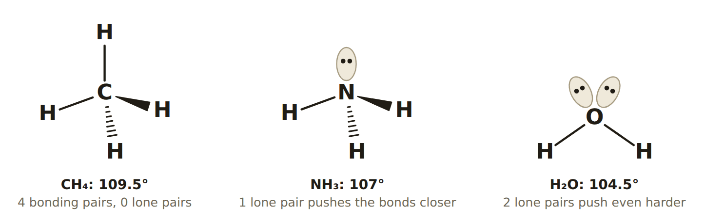{width=85%}

- **CH₄:** 4 bond pairs, no squeeze, so **109.5°**.
- **NH₃:** 1 lone pair pushes on 3 bond pairs, so the angle drops to **107°**.
- **H₂O:** 2 lone pairs push harder still (lp–lp is the strongest), so the angle drops to **104.5°**.
- **SO₂:** 3 domains with 1 lone pair, so the angle drops from 120° to **119.5°**.

**What to write on the test:** trigonal pyramidal "≈ 107° (less than 109.5°)"; bent from 4 domains "≈ 104.5° (less than 109.5°)"; bent from 3 domains "less than 120°". *Beyond the test:* real angles vary with the atoms. PBr₃ is about 101°, because big Br atoms on a large P squeeze further. The ideal-based answers above are what a VSEPR test expects.

---

## Part 3 — The 3-D Redraw: Wedges & Dashes (3 min)

*In the lesson, spend the 3 minutes on the rule and one drawing. The rest of this part is reference for the practice tools: **Wedge & Dash Lab** lets him turn a 3-D model and watch the drawing change.*

### What the three lines mean

A page is flat, but most molecules are not. Chemists use three kinds of line to show depth:

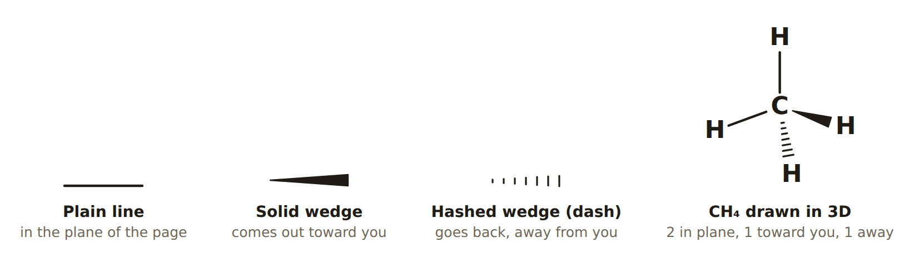{width=100%}

- **Plain line:** the bond lies **in the page**.
- **Solid wedge:** the atom comes **out of the page, toward you**. It is drawn wider at that end because closer things look bigger.
- **Hashed wedge (dash):** the atom goes **behind the page, away from you**.

The **thin end** of a wedge always sits at the central atom. The **wide end** is at the atom that sticks out.

### When are they needed? The page test

Ask: *can this molecule lie flat on the page?*

- **Yes, if the shape is flat.** Linear, trigonal planar and bent molecules have all their atoms in one plane. Lay that plane on the page and every bond is a **plain line**. No wedges, no dashes.
- **No, if the shape is 3-D.** Tetrahedral and trigonal pyramidal molecules cannot lie flat. A page can still hold the central atom and **2** of the outer atoms, because any 3 points lie in one plane. The atoms that are left over stick out: the one in front gets the **wedge**, the one behind gets the **dash**.

| Molecular geometry | Flat? | Draw it with |
| ---- | ---- | ---- |
| linear, trigonal planar, bent | yes | plain lines only |
| tetrahedral | no | 2 plain lines + 1 wedge + 1 dash |
| trigonal pyramidal | no | lone pair on top + 1 plain line + 1 wedge + 1 dash |

### How to draw it, step by step

{width=92%}

**Tetrahedral:**

1. Write the central atom. Draw **2 plain lines** in a wide V: one straight up and one down to the left. These two bonds are in the page.
2. On the other side, draw the **wedge**, thin end at the central atom.
3. Next to the wedge, draw the **dash**.
4. Write one atom at the end of every bond.

**Trigonal pyramidal:** the same drawing, with the top bond replaced by the **lone pair**. That leaves 1 plain line, 1 wedge and 1 dash.

**Why this works:** it is the molecule seen from the side, with two bonds lying in the page. Turn the molecule round to the back and the wedge and the dash swap, so it does not matter which of the two you call the wedge.

### Common mistakes

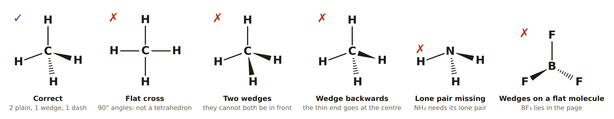{width=100%}

- **A flat cross** (4 plain lines at 90°) shows a flat molecule, not a tetrahedron.
- **Two wedges** (or two dashes): the two leftover atoms are on opposite sides of the page, so there is always one of each.
- **A wedge drawn backwards:** the thin end goes at the central atom.
- **A missing lone pair:** always draw the central atom's lone pairs in the redraw (a lobe or two dots). They are why the shape is what it is. Outer atoms' lone pairs can be left out.
- **Wedges on a flat molecule:** BF₃, SO₂, NO₂⁻, NOCl and HCO₂⁻ all lie in the page.
- **A bond with no atom on it:** every line, wedge and dash ends at an atom.

---

## Part 4 — Bond Polarity & Molecular Polarity (8 min)

### Bond polarity (C1 recap, now with arrows)

When two different atoms share a pair, the **more electronegative** atom pulls the pair toward itself. It becomes slightly negative (**δ−**) and the other atom slightly positive (**δ+**). NCERT §4.3.6 calls this a **polar covalent bond**; with identical atoms (H₂, Cl₂) the pair sits in the middle and the bond is **nonpolar**.

**The C1 rule for bond polarity**, using ΔEN = larger EN − smaller EN:

| ΔEN | Bond |
| ---- | ---- |
| less than 0.5 | nonpolar covalent |
| 0.5 to 1.7 | polar covalent |
| more than 1.7 | mostly ionic (between two non-metals, call it *very polar* covalent, like H–F in C1) |

**Electronegativities you'll need** (Pauling, NCERT Class 11 Ch3; the same values as C1):

> **H 2.1 · B 2.0 · C 2.5 · N 3.0 · O 3.5 · F 4.0 · Si 1.8 · P 2.1 · S 2.5 · Cl 3.0 · Br 2.8 · I 2.5**

**Dipole moment** (NCERT §4.3.6). A polar bond has a **dipole moment**, which measures how strongly the charge is separated:

**µ = Q × r**

where Q is the size of the separated charge and r is the distance between the centres of positive and negative charge. The unit is the **debye**: 1 D = 3.33564 × 10⁻³⁰ C m. It is a **vector**: it has a size and a direction.

**The crossed arrow** (NCERT's chemistry convention): draw an arrow along the bond with a **cross (+) at the δ+ end** and the **arrowhead at the δ− end**. The arrow points the way the electrons are pulled, toward the more electronegative atom.

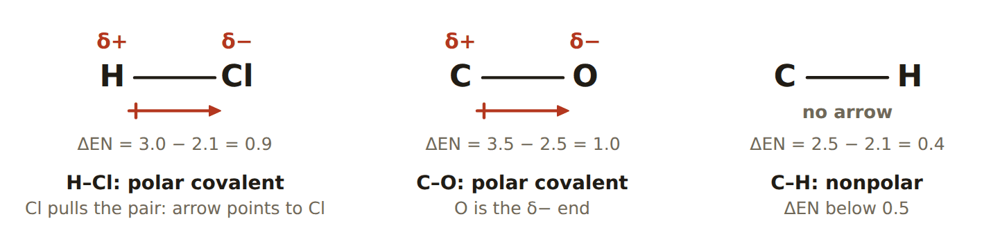{width=90%}

### Molecular polarity: add the arrows

For a molecule with more than one bond, NCERT §4.3.6 says the dipole moment of the molecule is the **vector sum** of the bond dipoles. So the **shape** decides the answer:

- If the arrows **cancel**, the molecule is **nonpolar**, even when every bond is polar.
- If they **don't cancel**, there is a **net dipole** and the molecule is **polar**.

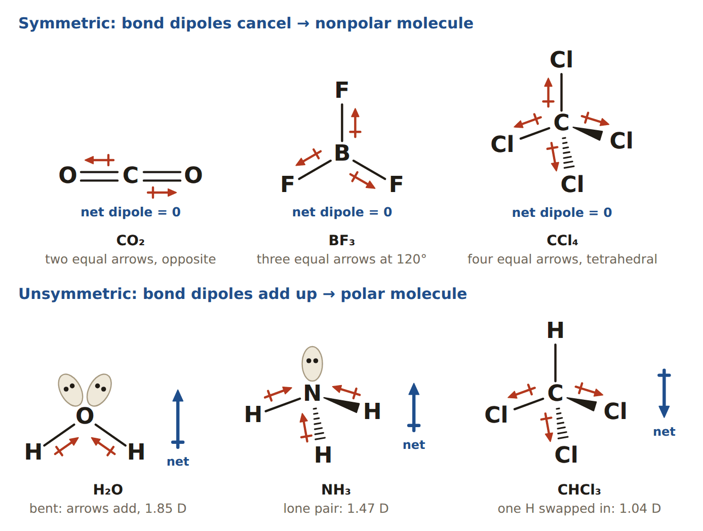{width=90%}

**Derivations (vector sums):**

- **CO₂ (linear):** the two C=O dipoles are equal and point in opposite directions: µ + (−µ) = **0**. So CO₂ is **nonpolar**, although each C=O bond is polar (ΔEN = 1.0). NCERT Table 4.5: CO₂ = 0 D.
- **BF₃ (trigonal planar):** the three equal B–F dipoles point at 90°, 210° and 330°. Adding their components:
  - *x:* µ(cos 90° + cos 210° + cos 330°) = µ(0 − 0.866 + 0.866) = 0
  - *y:* µ(sin 90° + sin 210° + sin 330°) = µ(1 − 0.5 − 0.5) = 0

  The net is **0**, so BF₃ is **nonpolar** (Table 4.5: 0 D). As NCERT puts it, "the resultant of any two is equal and opposite to the third".
- **CCl₄ (tetrahedral):** using the cube corners from Part 1, the four equal dipoles add to (1,1,1) + (1,−1,−1) + (−1,1,−1) + (−1,−1,1) = (0, 0, 0). CCl₄ is **nonpolar** (Table 4.5: 0 D).
- **H₂O (bent, 104.5°):** two equal O–H dipoles at an angle θ. Their components across the bisector cancel, and their components along the bisector add. Each contributes µ cos(θ/2), so the net is 2µ cos(θ/2). NCERT gives the net as **1.85 D**. So 1.85 = 2µ cos 52.25°, which gives µ(O–H) = 1.85 ÷ (2 × 0.612) ≈ **1.51 D** for each bond. The net is not zero, so water is **polar**.
- **CHCl₃ vs CCl₄:** swap one Cl for an H and the symmetry is broken. CHCl₃ = **1.04 D** (polar), while CCl₄ = 0 D (Table 4.5). This is exactly the CF₂Cl₂ idea on the worksheet.

**Lone pairs have their own pull too** (NCERT's NH₃ vs NF₃ example). In NH₃ the lone pair points the same way as the N–H bond dipoles, so the net is large (1.47 D). In NF₃ it points the opposite way to the N–F dipoles, so the net is small (0.23 D). Both are still **polar**, because neither is symmetric.

### The quick test for molecular polarity

{width=78%}

**Symmetric shapes that can be nonpolar:** linear, trigonal planar and tetrahedral, with **no lone pairs on the central atom** and **all outer atoms the same**. Any lone pair on the central atom (bent, trigonal pyramidal) or any mix of outer atoms (CHCl₃, CF₂Cl₂, HCN, HCO₂⁻) makes the molecule **polar**. The one exception is a molecule with no polar bonds at all, like CH₄ or CS₂: there is nothing to add up, so it is nonpolar.

**Ions on the worksheet** (HCO₂⁻, NO₂⁻): an ion carries an overall charge, so "polar" here means the same thing it does for a molecule: whether the bond dipoles cancel. Use the same flowchart.

---

## Part 5 — The 9/30 Worksheet, Row by Row (11 min)

**Plan:** spend 2 minutes checking rows 1–2 with him (he did most of them in class), then he completes rows 3–5 alone with the row routine. Mark each column together.

### Feedback on his rows 1–2

- **PBr₃:** the answers he wrote are right: 26 e⁻, the Lewis structure (lone pair on P, 3 on each Br), tetrahedral with 4 domains, trigonal pyramidal 107°, and polar bonds. **Missing:** molecular polarity = **Polar** (it has a lone pair, so it is not symmetric).
  - **His redraw needs a second look.** He has the right idea (the lone pair on P, with one plain line, one wedge and one dash), but check two things with him. Every bond must end at an atom: the solid wedge seems to have no Br written at its wide end. And the thin end of each wedge goes at P: his hashed wedge looks as if it is drawn the other way round. This is the part he is unsure about, so go through Part 3 and the *Wedge & Dash Lab* with him.
- **HCO₂⁻:** right so far: 18 e⁻, brackets and the − charge, trigonal planar with 3 e⁻ domains, trigonal planar 120°, and the redraw. **Missing:** bond polarity: C–H is **nonpolar** (ΔEN 0.4; his "H: nonpolar" note is right) and C–O is **polar** (ΔEN 1.0). Molecular polarity is **Polar**, because the outer atoms are not all the same (1 H and 2 O).
  - Also mention: HCO₂⁻ has **2 resonance structures** (the double bond can sit on either O), just like NO₂⁻ in C2. The shape is the same in both.
- **Spelling on the test:** "trigonal plan**a**r" (not "planer") and "pyramid**a**l".

### Row 1 — PBr₃

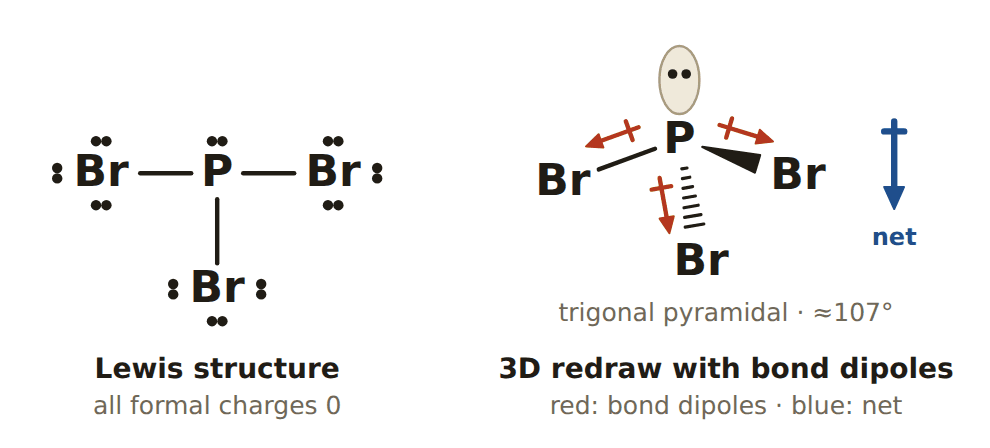{width=62%}

1. **Valence e⁻:** P = 5, Br = 3 × 7 = 21, so the total is **26**.
2. **Lewis:** P is central (it forms 3 bonds; Br forms only 1). 3 P–Br bonds use 6, leaving 20. Each Br gets 3 lone pairs (18), leaving 2, which go on P as 1 lone pair. P has 3 bonds + 1 lone pair = 8 ✓, and each Br has 8 ✓. All formal charges are 0.
3. **Electron geometry:** P has 3 bonded atoms + 1 lone pair = **4 domains**, so **tetrahedral**.
4. **Molecular geometry & angle:** 3 atoms + 1 lone pair gives **trigonal pyramidal**, **≈ 107°** (less than 109.5°, squeezed by the lone pair).
5. **Redraw:** lone pair on top of P; below it, 1 plain line, 1 wedge and 1 dash to the three Br.
6. **Bond polarity:** P–Br: ΔEN = 2.8 − 2.1 = **0.7**, which is **polar** (Br is δ−).
7. **Molecular polarity:** **polar**. There are polar bonds and a lone pair on P, so the three P–Br dipoles (all pointing down toward the Br atoms) add up instead of cancelling.

### Row 2 — HCO₂⁻ (formate)

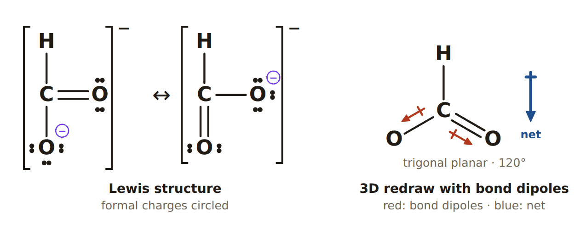{width=88%}

1. **Valence e⁻:** H 1 + C 4 + O 2 × 6 + **1** for the − charge = **18**.
2. **Lewis:** C is central (it forms 4 bonds; H is never central). The skeleton H–C bonded to two O uses 3 bonds = 6, leaving 12. Each O gets 3 lone pairs (12), leaving 0. C has only 3 bonds = 6 ✗. Move one O lone pair into a **C=O** double bond, and C now has 8 ✓. Draw brackets with the **−** outside.
   - Formal charges: C = 4 − 0 − 4 = 0; the O in C=O = 6 − 4 − 2 = 0; the O in C–O = 6 − 6 − 1 = **−1**. The sum is −1 ✓.
   - **Resonance:** the double bond can go to either O, so there are 2 equivalent structures, joined by ↔.
3. **Electron geometry:** C has 3 bonded atoms and 0 lone pairs = **3 domains** (the double bond counts once), so **trigonal planar**.
4. **Molecular geometry & angle:** no lone pairs, so it is also **trigonal planar**, **120°**.
5. **Redraw:** all in one plane: H up, the two O atoms at lower left and lower right, with one C=O drawn double.
6. **Bond polarity:** C–H: 2.5 − 2.1 = **0.4, nonpolar**. C–O: 3.5 − 2.5 = **1.0, polar** (O is δ−).
7. **Molecular polarity:** **polar**. The shape has no lone pair, but the outer atoms are **not identical** (H vs O), so the two strong C–O dipoles are not balanced by the weak C–H. The net points toward the O side.

### Row 3 — NOCl (nitrosyl chloride)

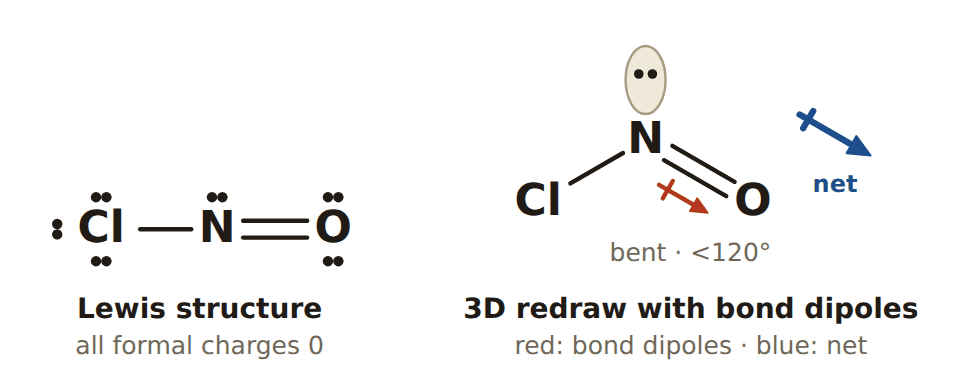{width=62%}

1. **Valence e⁻:** N 5 + O 6 + Cl 7 = **18**.
2. **Lewis:** N is central (it forms 3 bonds; O forms 2, Cl forms 1). The skeleton Cl–N–O uses 2 bonds = 4, leaving 14. Cl gets 3 lone pairs (6) and O gets 3 lone pairs (6), leaving 2, which go on N as a lone pair. N has 2 bonds + 1 lone pair = 6 ✗. Move one lone pair **from O** into the N–O bond, giving **N=O**. N has 8 ✓, O has 2 bonds + 2 lone pairs = 8 ✓, and Cl has 8 ✓.
   - **Why O and not Cl for the double bond?** With N=O every formal charge is 0: N = 5 − 2 − 3 = 0, O = 6 − 4 − 2 = 0, Cl = 7 − 6 − 1 = 0. A Cl=N double bond would put +1 on Cl and −1 on O, which is worse (C2's formal-charge rule).
   - **Result:** Cl–N=O with 1 lone pair on N, 2 on O and 3 on Cl.
3. **Electron geometry:** N has 2 bonded atoms + 1 lone pair = **3 domains**, so **trigonal planar**.
4. **Molecular geometry & angle:** 2 atoms + 1 lone pair gives **bent**, **less than 120°** (the real angle is about 113°).
5. **Redraw:** in one plane: the lone pair on top of N, and Cl and O below at each side, with N=O drawn double.
6. **Bond polarity:** N–Cl: 3.0 − 3.0 = **0.0, nonpolar**. N=O: 3.5 − 3.0 = **0.5, polar** (right on the line; O is δ−).
7. **Molecular polarity:** **polar**. The shape is bent (a lone pair on N) and the outer atoms are different, so the N=O dipole is not cancelled.

*Note on the numbers:* some periodic tables print more decimals (N 3.04, O 3.44, Cl 3.16). Then N=O is 0.40 and N–Cl is 0.12, so some answer keys call both bonds only slightly polar. The **molecular** answer is **polar** either way. Use the EN table the teacher gives on the test.

### Row 4 — NO₂⁻ (nitrite)

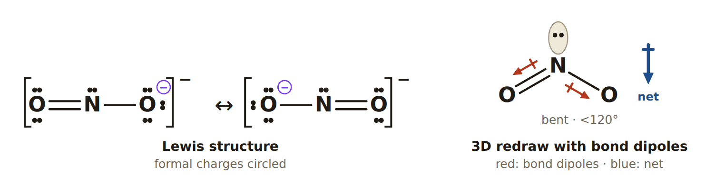{width=90%}

1. **Valence e⁻:** N 5 + O 2 × 6 + **1** = **18**.
2. **Lewis** (from C2): the skeleton O–N–O uses 4, leaving 14. Each O gets 3 lone pairs (12), leaving 2, which go on N as a lone pair. N has 2 bonds + 1 lone pair = 6 ✗. Move one O lone pair to make **N=O**. Now N, both O atoms and the total are all right: 8 ✓, 8 ✓, 18 ✓. Brackets and **−**.
   - Formal charges: N = 5 − 2 − 3 = 0; O in N=O = 0; O in N–O = **−1**. The sum is −1 ✓. There are **2 resonance structures**.
3. **Electron geometry:** N has 2 bonded atoms + 1 lone pair = **3 domains**, so **trigonal planar**.
4. **Molecular geometry & angle:** **bent**, **less than 120°** (about 115°).
5. **Redraw:** in one plane: the lone pair on top of N, and the two O atoms below at each side. One N=O is drawn double, but because of resonance the two bonds are really identical.
6. **Bond polarity:** N–O: 3.5 − 3.0 = **0.5, polar** (O is δ−).
7. **Molecular polarity:** **polar**. It is bent, so the two N–O dipoles point partly the same way (down, toward the O atoms) and add.

**Compare with row 2:** HCO₂⁻ and NO₂⁻ both have 18 electrons and 2 resonance forms, yet HCO₂⁻ is **trigonal planar** and NO₂⁻ is **bent**. The difference is the **lone pair on N**. Count the domains every time; never guess the shape from the formula.

### Row 5 — CF₂Cl₂ (Freon-12)

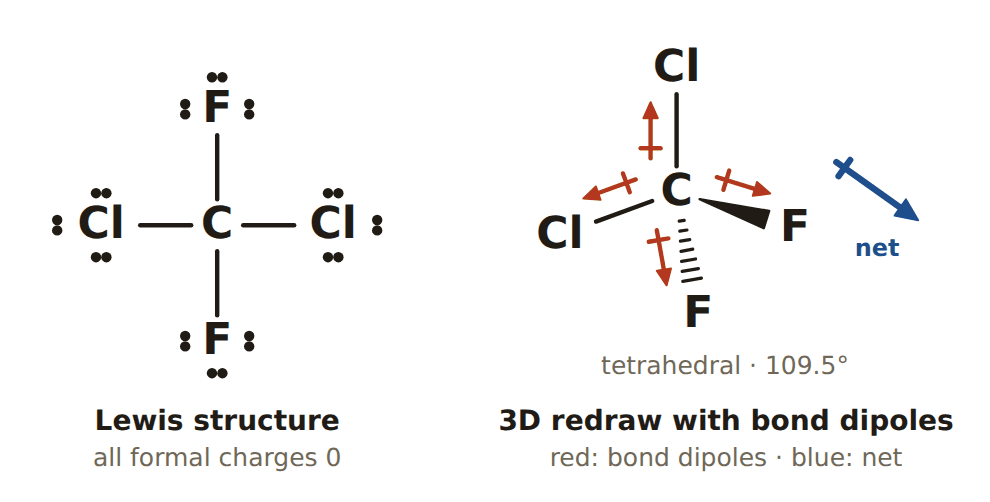{width=62%}

1. **Valence e⁻:** C 4 + F 2 × 7 + Cl 2 × 7 = **32**.
2. **Lewis:** C is central (it forms 4 bonds and is the least electronegative; F is never central). 4 single bonds use 8, leaving 24. Each of the 4 halogens gets 3 lone pairs (24), leaving 0. C has 4 bonds = 8 ✓, and every halogen has 8 ✓. All formal charges are 0. There is **no lone pair on C**.
3. **Electron geometry:** C has 4 bonded atoms + 0 lone pairs = **4 domains**, so **tetrahedral**.
4. **Molecular geometry & angle:** **tetrahedral**, **109.5°** (approximately, since the atoms differ).
5. **Redraw:** 2 plain lines in the page (the 2 Cl), 1 wedge and 1 dash (the 2 F). In a tetrahedron all 4 corners are equivalent, so any placement is the same molecule.
6. **Bond polarity:** C–F: 4.0 − 2.5 = **1.5, polar**. C–Cl: 3.0 − 2.5 = **0.5, polar**. F and Cl are both δ−.
7. **Molecular polarity:** **polar**. The shape is symmetric, but the outer atoms are **not identical**: the C–F dipoles (ΔEN 1.5) are much stronger than the C–Cl dipoles (0.5), so they can't cancel.

**Proof by vector sum.** Put F on the cube corners (1,1,1) and (1,−1,−1), and Cl on (−1,1,−1) and (−1,−1,1). Weight each by its ΔEN:

1.5[(1,1,1) + (1,−1,−1)] + 0.5[(−1,1,−1) + (−1,−1,1)] = 1.5(2,0,0) + 0.5(−2,0,0) = **(2, 0, 0) ≠ 0**

The net points toward the side with the two F atoms. If all four were Cl (CCl₄), the same sum would be (0, 0, 0).

### The completed worksheet

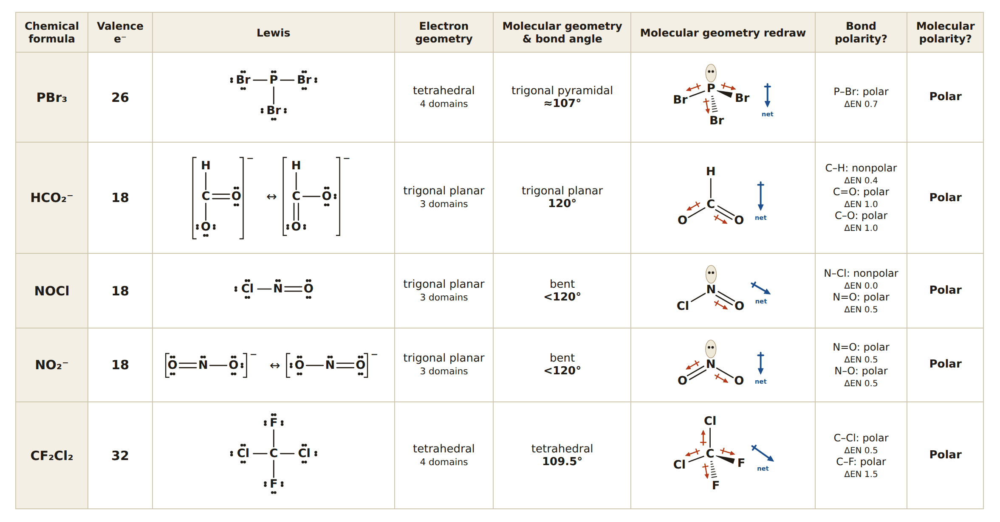{width=100%}

---

## Exit Ticket (3 min)

1. How many electron domains are around C in CO₂? → **2**. Each double bond counts once.
2. The electron geometry is tetrahedral and the central atom has 1 lone pair. What is the molecular geometry and bond angle? → **Trigonal pyramidal, ≈ 107°**.
3. CCl₄ has four polar bonds. Why is it nonpolar? → It is **tetrahedral with 4 identical atoms**, so the 4 equal dipoles cancel.
4. Which is polar, BF₃ or NF₃? → **NF₃**. It has a lone pair on N, so it is trigonal pyramidal and its dipoles don't cancel. BF₃ is trigonal planar and symmetric, so it is nonpolar.

---

## Homework — Complete the Row (answers below)

*For each one, fill in all 8 worksheet columns: valence e⁻, Lewis, electron geometry (with the number of domains), molecular geometry & bond angle, the 3-D redraw, bond polarity (with ΔEN) and molecular polarity.* Then practise the drawings in the *Wedge & Dash Lab* (10 right in *Draw it*), and take the *Worksheet Test* until he scores 90% or more.

1. CH₂Cl₂
2. SO₃²⁻ (sulfite)
3. COCl₂ (C is central, bonded to O and both Cl)
4. ClO₂⁻ (chlorite; Cl is central)
5. OCS (C is central)
6. NH₄⁺

---

## Answer Key — Full Solutions

**1. CH₂Cl₂**

- Valence e⁻: 4 + 2(1) + 2(7) = **20**.
- Lewis: C is central with 2 H and 2 Cl. 4 bonds use 8, leaving 12, which is 3 lone pairs on each Cl. C has 8 ✓; the formal charges are all 0.
- Electron geometry: 4 atoms + 0 lone pairs = 4 domains, so **tetrahedral**.
- Molecular geometry: **tetrahedral, 109.5°**.
- Bond polarity: C–H 0.4 is **nonpolar**; C–Cl 0.5 is **polar**.
- Molecular polarity: **polar**. The outer atoms aren't identical, so the C–Cl dipoles aren't cancelled.

**2. SO₃²⁻**

- Valence e⁻: 6 + 3(6) + **2** = **26**.
- Lewis (from C2): S is central with 3 single bonds (6), each O has 3 lone pairs (18), and the last 2 electrons go on S as a lone pair. The formal charges are S +1 and each O −1, which sum to −2 ✓. Brackets and 2−.
- Electron geometry: 3 atoms + 1 lone pair = 4 domains, so **tetrahedral**.
- Molecular geometry: **trigonal pyramidal, ≈ 107°**.
- Bond polarity: S–O: 3.5 − 2.5 = 1.0, **polar**.
- Molecular polarity: **polar**. The lone pair on S makes it unsymmetric.

**3. COCl₂ (phosgene)**

- Valence e⁻: 4 + 6 + 2(7) = **24**.
- Lewis: C is central with O and 2 Cl. 3 bonds use 6, leaving 18. That gives 3 lone pairs on each of O, Cl and Cl, leaving 0. C has only 6 ✗, so move an O lone pair to make **C=O**. The formal charges are all 0.
- Electron geometry: 3 atoms + 0 lone pairs = 3 domains, so **trigonal planar**.
- Molecular geometry: **trigonal planar, 120°**.
- Bond polarity: C=O 1.0 is **polar**; C–Cl 0.5 is **polar**.
- Molecular polarity: **polar**. It is symmetric in shape, but O ≠ Cl, and the C=O dipole is bigger than the two C–Cl dipoles.

**4. ClO₂⁻ (chlorite)**

- Valence e⁻: 7 + 2(6) + **1** = **20**.
- Lewis: the skeleton O–Cl–O uses 4, leaving 16. Each O gets 3 lone pairs (12), leaving 4, which go on Cl as **2 lone pairs**. Cl has 2 bonds + 2 lone pairs = 8 ✓, so no step 4 is needed. The formal charges are Cl = 7 − 4 − 2 = +1 and each O = −1, which sum to −1 ✓. Brackets and −.
- Electron geometry: 2 atoms + 2 lone pairs = 4 domains, so **tetrahedral**.
- Molecular geometry: **bent, ≈ 104.5°** (less than 109.5°), the same pattern as water.
- Bond polarity: Cl–O: 3.5 − 3.0 = 0.5, **polar**.
- Molecular polarity: **polar** (bent).

**5. OCS**

- Valence e⁻: 6 + 4 + 6 = **16**.
- Lewis: exactly like CO₂: **O=C=S**, with 2 lone pairs on O and 2 on S. The formal charges are all 0.
- Electron geometry: 2 atoms + 0 lone pairs = 2 domains, so **linear**.
- Molecular geometry: **linear, 180°**.
- Bond polarity: C=O 1.0 is **polar**; C=S: 2.5 − 2.5 = 0, **nonpolar**.
- Molecular polarity: **polar**. It is linear like CO₂, but the two ends are different, so only the C=O dipole is there and nothing cancels it.

**6. NH₄⁺**

- Valence e⁻: 5 + 4(1) − **1** = **8**.
- Lewis: N with 4 N–H bonds (8 electrons), no lone pairs. The formal charge on N is 5 − 0 − 4 = +1 ✓. Brackets and +.
- Electron geometry: 4 atoms + 0 lone pairs = 4 domains, so **tetrahedral**.
- Molecular geometry: **tetrahedral, 109.5°**.
- Bond polarity: N–H: 3.0 − 2.1 = 0.9, **polar**.
- Molecular polarity: **nonpolar**. It is tetrahedral with 4 identical atoms, so the four equal dipoles cancel. (It still carries its + charge; "nonpolar" is about the dipoles.)

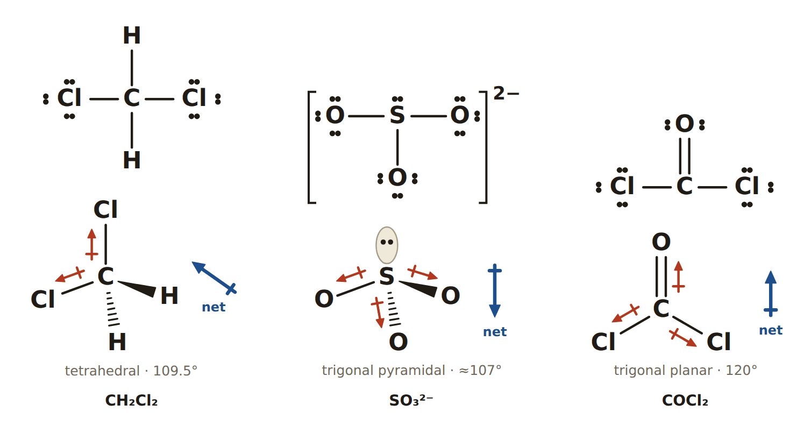{width=88%}

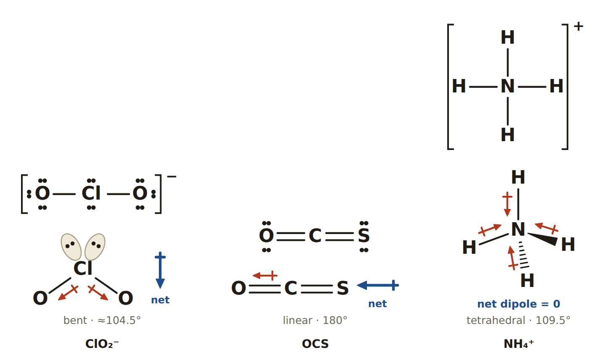{width=85%}

---

## Notes for next session

VSEPR shows **where** the atoms go but not **how** the orbitals make that possible. NCERT §4.5 (valence bond theory) and §4.6 (**hybridisation**: sp, sp², sp³) answer that: tetrahedral CH₄ is sp³, trigonal planar BF₃ is sp², and linear BeCl₂ is sp. Polarity also leads into **intermolecular forces** (NCERT §4.9 starts with hydrogen bonding): polar molecules attract each other (dipole–dipole forces), which is why water (polar) boils far higher than methane (nonpolar), and why "like dissolves like". Check with Dhairya which of these his class takes next before planning C4.
