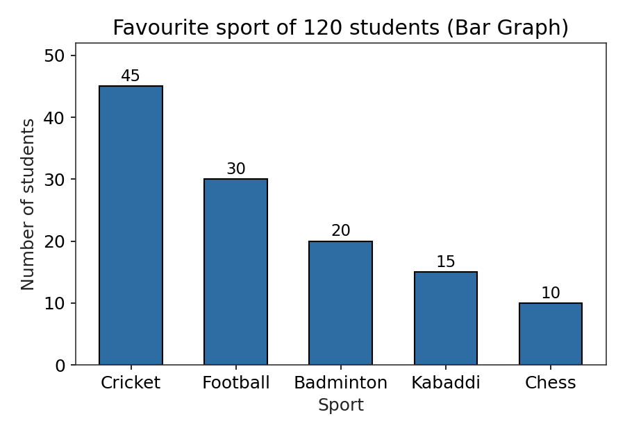
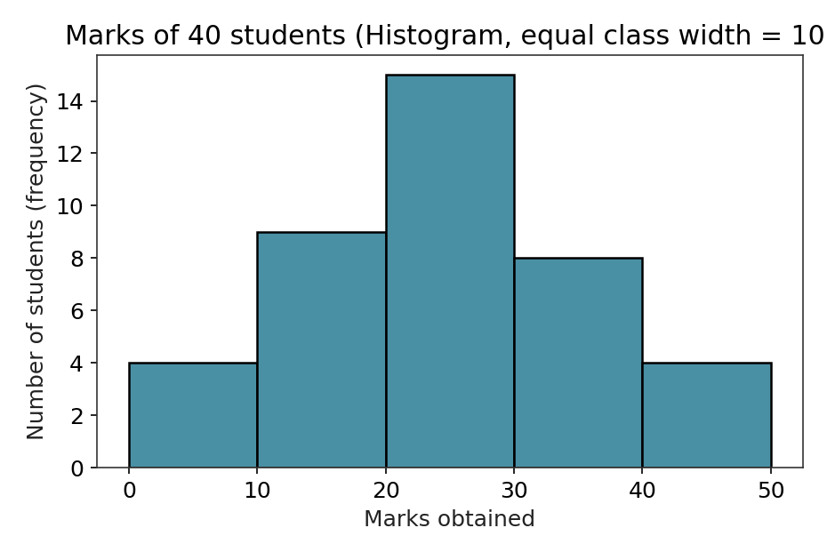
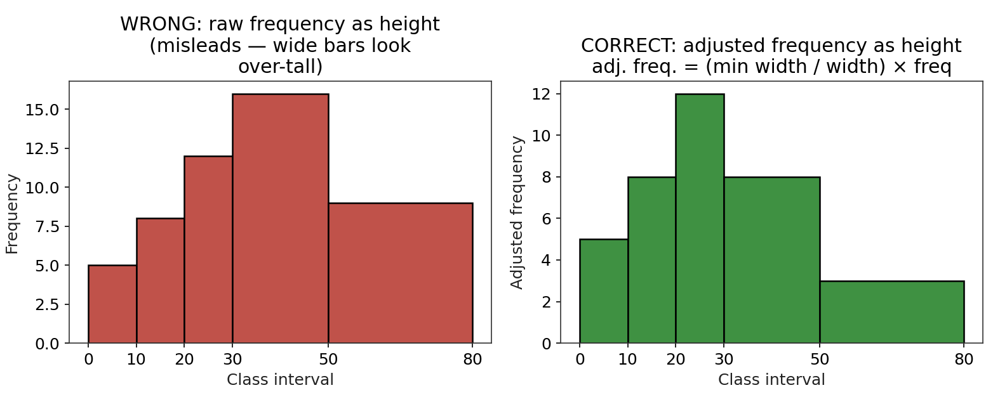
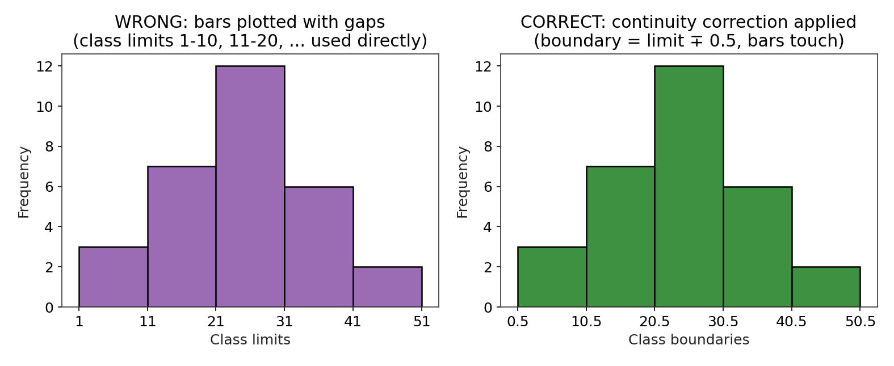
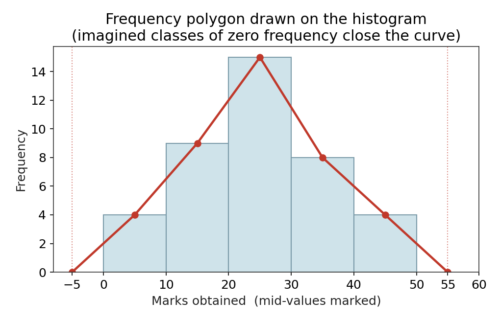
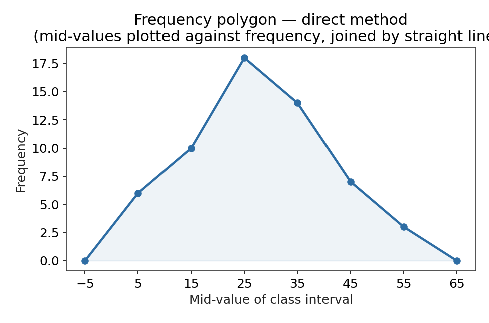
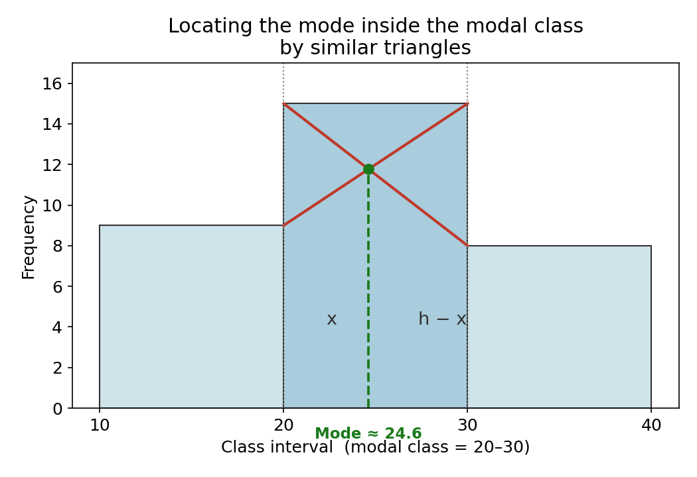
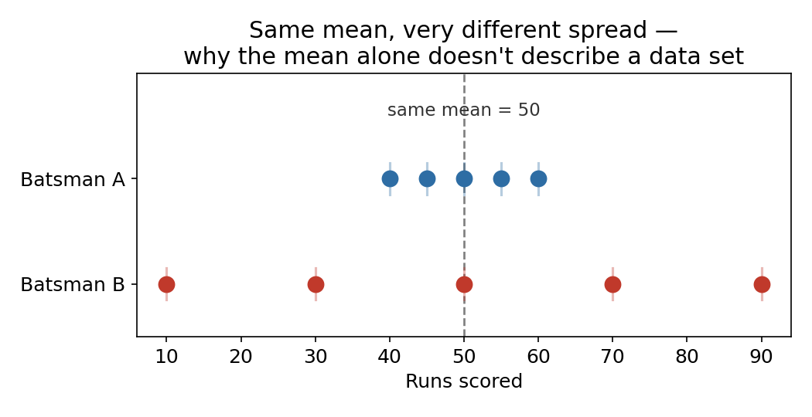

# Session M2 — Data and Statistics

**Track:** Accelerated Mathematics (Grade 9 → Grade 10 → Grade 11, interleaved)
**Source material:** R.D. Sharma Mathematics — Class IX Ch. 17 *(Graphical Representation of Statistical Data)*, Class X Ch. 14 *(Statistics)*, Class XI Ch. 32 *(Statistics)*; plus, for data collection and study design, the school course *Advanced Algebra: Concepts and Connections* (Larson & Boswell), CCGPS strand *Data and Statistical Reasoning* — Populations & Samples / Sampling Methods and Bias mini-lessons
**Format:** Every formula is derived from something more basic before it is used. Every named result gets its full verbal statement and its mathematical form. Every practice problem has a complete step-by-step solution in the answer key.

---

## Prerequisites check (2 minutes, answer out loud)

Before starting, you should be able to answer these without hesitation — they are the load-bearing ideas everything below is built on:

1. What is the arithmetic mean of a list of numbers, in words (not the formula — the idea)?
2. What is a class interval, and what is the difference between a class's *lower limit*, its *upper limit*, and its *width*?
3. If a class interval is 10–20, what is its mid-value?

*(Answers: (1) the value each number would take if the total were shared out equally among all of them; (2) a class interval like 10–20 groups together all data values from 10 up to (but for the standard "exclusive" form, not including) 20 — the lower limit is 10, the upper limit is 20, the width is 20 − 10 = 10; (3) 15, the average of the two limits.)*

---

## Learning objectives

By the end of this session you should be able to:

1. Distinguish a population from a sample, explain why a census is usually impractical, and correctly identify the population and the sample in a described study.
2. Classify data as quantitative (discrete or continuous) or qualitative, and connect that classification to which graph type (Part A) is appropriate for it.
3. Name and distinguish the standard sampling methods, and identify which one a described selection procedure used.
4. Classify a data-collection method as a survey, an observational study, or an experimental study, and identify potential bias, confounding variables, or ethical concerns in a described study.
5. Construct and correctly read a bar graph and a histogram, including the two tricky cases — unequal class widths and inclusive (discontinuous) class data.
6. Construct a frequency polygon by two different methods and explain why the "imagined class" trick is needed to close the curve.
7. Compute the mean, median, and mode of grouped data by every standard method, and explain — not just apply — why the assumed-mean and step-deviation shortcuts give the same answer as the direct method.
8. State and use the empirical relationship between mean, median, and mode.
9. Explain, with a concrete example, why the mean alone is not enough to describe a data set, and compute every standard measure of spread: range, mean deviation, variance, and standard deviation.
10. Derive the computational (shortcut) formula for variance from its definition, and prove both of its basic invariance properties.
11. Compute and use the coefficient of variation to compare the variability of two data sets.

---

## How this document is organized

Statistics is naturally cumulative — before you can draw, summarize, or measure the spread of a data set, you first have to know where that data *came from* and whether it was collected in a trustworthy way. So this session adds one part in front of the original three: **Part 0 (data collection and study design) → Part A (Grade 9: drawing data) → Part B (Grade 10: summarizing data with one number) → Part C (Grade 11: measuring its spread)**, each building tools the next part uses. Part 0 is sourced from your school course rather than R.D. Sharma, because sampling methodology and study design are covered there and not in the R.D. Sharma statistics chapters — but it plugs directly into Part A, since the *type* of data you collect (categorical vs. continuous, Section 0.3) is exactly what determines whether you draw a bar graph or a histogram. A worked example's numbers are reused across methods within a part wherever possible, so you can see different techniques agree on the same answer.

---

# Part 0 — Collecting Data: Populations, Samples, and Study Design

## 0.1 Why start here?

Every calculation in Parts A–C — a mean, a histogram, a standard deviation — is only as trustworthy as the data that went into it. A perfectly-executed mean of badly-collected data still gives a misleading answer. So before drawing or summarizing anything, you need to be able to answer three questions about any data set: *who or what was actually measured* (Section 0.2), *what kind of values did you get* (Section 0.3), and *was the way it was collected likely to introduce bias* (Sections 0.4–0.5).

## 0.2 Populations and Samples

**Definitions.**

- A **population** is the entire collection of data, measurements, responses, or counts that you are interested in.
- A **sample** is a subset of the population — the part you actually measure.
- A **census** collects data from *every* member of the population.
- A **random sample** is a subset selected so that every member of the population has a known chance of being included, chosen without favoring any particular members.

**Why sampling, not a census, is the norm.** A census gives you the exact truth about the population — no estimation error at all. But unless the population is small, visiting or measuring every single member is expensive, slow, or outright impossible (you cannot, in practice, ask every adult in a country whether they own a pet). So in most real studies, you instead collect data from a random sample and use it to *estimate* the population's true value — which is exactly why Part 0.4's sampling methods matter: a sample that isn't randomly and carefully selected can give you an estimate that's systematically wrong, no matter how careful your arithmetic is afterward.

**Worked example 1.** *In the United States, a survey of 2184 adults age 18 and over found that 1328 of them own at least one pet. Identify the population and the sample, and describe the sample.*

- Population: all adults (age 18 and over) in the United States.
- Sample: the 2184 adults who were actually surveyed.
- Description: a subset of 2184 U.S. adults whose pet-ownership status was recorded; 1328 of them (about 60.8%) reported owning at least one pet. This sample proportion is used to *estimate* the true population proportion, which a census of every U.S. adult would be needed to know exactly.

**Worked example 2.** *To estimate the gas mileage of new cars sold in the United States, a consumer advocacy group tests 845 new cars and finds they have an average gas mileage of 25.1 miles per gallon. Identify the population and the sample, and describe the sample.*

- Population: all new cars sold in the United States.
- Sample: the 845 new cars actually tested by the consumer advocacy group.
- Description: 845 new cars whose gas mileage was measured directly, giving a sample average of 25.1 mpg — used as an estimate of the true (unknown, without a census) average gas mileage across every new car sold in the U.S.

## 0.3 Types of Data

Data splits first into two broad kinds, and this split is exactly what decides, back in Part A, whether you draw a bar graph or a histogram:

- **Qualitative (categorical) data** records which *category* or *label* a data value falls into — there's no inherent numerical size to compare (e.g., favourite sport, colour, city). This is exactly the kind of data Section A.2's bar graph is built for.
- **Quantitative (numerical) data** records an actual number, and splits further into two kinds:
  - **Discrete data** can only take specific, separately-countable values (usually whole numbers) — e.g., number of pets owned, number of siblings. You count discrete data.
  - **Continuous data** can take *any* value within a range, limited only by how precisely you measure it — e.g., gas mileage, height, weight, marks scored as a percentage. You measure continuous data, and this is exactly the kind of data Section A.3's histogram is built for (grouping continuous values into class intervals is only necessary because, unlike categories, there are infinitely many possible values to group).

**Quick check against Part A's own examples:** Section A.2's "favourite sport" data (Cricket, Football, …) is qualitative — hence a bar graph. Section A.3's "marks obtained" data is continuous quantitative — hence a histogram with class intervals. The graph type was never an arbitrary choice; it was forced by the data type.

## 0.4 Sampling Methods

Once you know you need a sample rather than a census, *how* you select it determines whether that sample fairly represents the population. Five standard methods:

- **Simple random sampling.** Every member of the population has an equal chance of being selected, and every possible sample of a given size is equally likely (e.g., assigning each member a number and using a random-number generator). This is the gold standard against which the others are compared.
- **Systematic sampling.** List the whole population, pick a random starting point, then select every $k$-th member after that (e.g., every 10th name on an enrollment list).
- **Stratified sampling.** Divide the population into non-overlapping subgroups ("strata") that share a characteristic likely to matter for the study (e.g., grade level, age group), then take a random sample *from each stratum*, usually in proportion to that stratum's share of the population. This guarantees every subgroup is represented, which simple random sampling doesn't guarantee on any single draw.
- **Cluster sampling.** Divide the population into groups ("clusters," often geographic, e.g., schools or city blocks), randomly select a few *whole clusters*, and then measure every member within the chosen clusters. Useful when the population is spread out and visiting a random member anywhere would be too costly, but everyone inside a chosen cluster gets measured.
- **Convenience sampling.** Select whoever is easiest to reach (e.g., surveying people walking past you on one street). This is *not* random — it is included here mainly as the method to recognize and avoid, since it systematically favors whichever part of the population happens to be most accessible to the researcher, which is a textbook source of sampling bias (Section 0.5).

**How to tell them apart when reading a description:** ask whether the population was split into meaningful subgroups first (stratified), split into location-based clusters with entire clusters chosen (cluster), selected via a fixed interval down a list (systematic), given genuinely equal individual odds with no structure (simple random), or just whoever happened to be around (convenience).

## 0.5 Study Design, Bias, and Confounding Variables

**Three ways data gets collected once a sample is chosen:**

- **Survey.** Subjects are asked questions and self-report their answers (e.g., a questionnaire, a phone poll). No one is measured directly by the researcher — the data *is* what people say.
- **Observational study.** The researcher measures or watches subjects without assigning them to any particular condition or intervening in what happens to them (e.g., counting how many flies drink from bowls of different sweeteners that were simply set out).
- **Experimental study.** The researcher deliberately assigns subjects to different conditions (a "treatment") specifically to see the effect of that condition, ideally comparing against a control group that doesn't receive the treatment.

**Decision rule:** did the researcher *assign* a treatment to see its effect? → experimental. Did the researcher only *watch or measure*, without assigning anything? → observational. Are the "data" just what people directly reported about themselves? → survey.

**Sources of unreliability to check for in any study:**

- **Sampling bias** — the sample was not representative of the population, usually because selection wasn't random (convenience sampling is the classic culprit).
- **Response bias** — the data collection method itself distorts the answers (people misremembering, not returning a form, giving a socially-desirable rather than honest answer).
- **Confounding variables** — a third, uncontrolled factor could explain the observed result just as well as the variable being studied, so the study can't isolate cause and effect.
- **Privacy / ethical concerns** — the method of collecting the data raises concerns independent of its statistical validity (e.g., collecting sensitive information without consent).

A well-designed study doesn't just collect data — it collects data in a way that lets you trust the conclusion drawn from it, and that's what the practice problems below are testing you on.

---

## 0.6 Part 0 Practice Problems

1. A survey of 500 students at a large university asked how many hours per week they spend on extracurricular activities. Identify the population and the sample.
2. Classify each as qualitative, discrete quantitative, or continuous quantitative: (a) eye colour, (b) number of goals scored in a match, (c) the time taken to run 100 m, (d) postal/zip code.
3. A school of 1200 students is split into grade levels (9th, 10th, 11th, 12th), and a random sample proportional to each grade's size is drawn from within that grade. Which sampling method is this, and why is it likely to give a more representative sample than simply taking the first 100 names on the school roster?
4. A researcher wants to survey opinions across a large, spread-out rural district. Instead of randomly selecting individuals from the whole district (which would mean traveling to isolated addresses one at a time), she randomly selects 8 villages out of 60 in the district and surveys every household in those 8 villages. Which sampling method is this?
5. For each of the following, state whether the data-collection method is a survey, an observational study, or an experimental study, and identify any potential bias, confounding variables, or privacy/ethical concerns:
   a. A district administrator selects 300 student names at random from the enrollment list and sends a letter to each student's home, to be returned by a parent or guardian, asking how many days the student missed school this year and why.
   b. A scientist puts the same amount of each of several sweeteners into different bowls of water and counts the number of flies that drink from each bowl over 4 hours.
   c. A politician sends a letter to 300 voters selected at random in the district, asking, "Would you be in favor of a 1% increase in sales tax to fund the parks and recreation department?"
   d. A nutritionist asks 5 friends to eat dark chocolate along with their usual food for 6 months, and 5 other friends to eat milk chocolate along with their usual food for 6 months, then compares each group's weight before and after.
   e. A study of 1,000 people aged 20–30 asked how much television each person watches each night and how each person would rate their energy level in the evenings. The study found that people who watch at least 2 hours of television nightly reported lower evening energy than people who watch less.

---

# Part A — Graphical Representation of Statistical Data (Grade 9 foundation)

## A.1 Why bother graphing data at all?

A raw list of 40 numbers tells you nothing at a glance. A well-drawn graph lets you see, in one look, where the data is concentrated, whether it is symmetric or skewed, and roughly what a "typical" value looks like — before you calculate anything. That's the whole point of this part: turn a table of numbers into a picture you can reason about.

We'll cover three kinds of pictures: the **bar graph** (for categories), the **histogram** (for continuous numerical data grouped into class intervals), and the **frequency polygon** (a line-graph alternative to the histogram, useful for comparing two data sets on the same axes).

## A.2 Bar Graphs

**Definition.** A bar graph represents data using rectangular bars of *equal width*, where the *length* (or height, if vertical) of each bar is proportional to the value it represents. The bars are separated by uniform gaps and do not touch each other. Bar graphs are used for **categorical** data — the categories themselves have no numerical order or width (e.g., sports, colours, cities).

**Construction algorithm.**

1. Choose a scale on the value-axis: decide what length represents one unit of the quantity being measured (e.g., 1 cm = 5 students). Choose the scale so the tallest bar fits comfortably on the page.
2. Draw and label the two axes: the category axis (no numerical scale — just category names, evenly spaced) and the value axis (numerical scale, starting at 0).
3. For each category, draw a bar of the chosen, *uniform* width, with height equal to (value ÷ scale unit).
4. Leave equal gaps between consecutive bars — the gap width is a free choice, but it must be the same between every pair of bars.
5. Label the graph with a title and label both axes.

**Worked example.** A survey of 120 students' favourite sport gave: Cricket 45, Football 30, Badminton 20, Kabaddi 15, Chess 10.

Notice the bars are all the same width, evenly spaced, and the height axis starts at 0 — starting a value axis at anything other than 0 is a classic way to visually exaggerate small differences, and you should always check for it when reading someone else's bar graph.

## A.3 Histograms

A histogram looks like a bar graph but is a fundamentally different object, because it represents **continuous, grouped numerical data** — the classes have a real numerical width, and the bars are drawn *touching each other* (no gaps), because the classes themselves are contiguous along the number line.

**Definition.** A histogram is a set of adjacent rectangles, one per class interval, erected on a horizontal axis representing the variable. For **equal class-width** data, the height of each rectangle is simply the class frequency. The area of each rectangle is then proportional to its frequency, which is the defining property a histogram must always preserve — this is the key fact that forces a correction when class widths are *not* equal (Section A.3.2).

### A.3.1 Equal class width — the direct case

**Construction algorithm.**

1. Mark the class boundaries on the horizontal axis, to scale.
2. For each class, draw a rectangle whose base is the class width and whose height equals the class frequency.
3. Since every class has the same width, rectangles erected this way automatically have area proportional to frequency, so no adjustment is needed.

**Worked example.** Marks of 40 students, grouped into classes of width 10:

| Marks | 0–10 | 10–20 | 20–30 | 30–40 | 40–50 |
|---|---|---|---|---|---|
| Frequency | 4 | 9 | 15 | 8 | 4 |

### A.3.2 Unequal class width — the adjusted-frequency correction

Suppose two classes have different widths but the same frequency. If you simply used the raw frequency as the bar height in both cases, the *wider* bar would have a larger area even though it represents the same number of data points — and since area (not height) is what a histogram uses to represent frequency, this would visually mislead the reader into thinking the wider class contains more data than it does.

**The fix — adjusted frequency.** Pick the smallest class width appearing in the table as a reference width. For every class, rescale its frequency so that the *area* relationship is preserved relative to that reference:

$$\text{Adjusted frequency} = \frac{\text{minimum class width}}{\text{width of this class}} \times \text{frequency of this class}$$

**Why this formula is correct (derivation).** We want the rectangle's area, (width) × (height), to be proportional to the true frequency $f$, with the same constant of proportionality across all classes — that constant is fixed by requiring a class of the minimum width $w_{\min}$ to use its raw frequency as its height (i.e., area $= w_{\min}\times f$ there defines "one unit of true frequency" per unit area). For a class of width $w$ and frequency $f$, we need:

$$w \times (\text{height}) = w_{\min}\times f \quad\Longrightarrow\quad \text{height} = \frac{w_{\min}}{w}\times f$$

which is exactly the adjusted-frequency formula — it is nothing more than "use height as the free variable so that area stays proportional to frequency, with the smallest class as the calibration reference."

**Worked example.**

| Class | 0–10 | 10–20 | 20–30 | 30–50 | 50–80 |
|---|---|---|---|---|---|
| Frequency | 5 | 8 | 12 | 16 | 9 |
| Width | 10 | 10 | 10 | 20 | 30 |

Minimum width $w_{\min}=10$. Adjusted frequencies: $5,\ 8,\ 12,\ 16\times\frac{10}{20}=8,\ 9\times\frac{10}{30}=3$.

The left panel (wrong) makes the 30–50 and 50–80 classes look far more dominant than they are; the right panel (correct, using adjusted frequency as height) restores the true visual proportion.

### A.3.3 Histogram from given class marks (mid-values)

Sometimes a table gives you class **mid-values** instead of class limits. You must first recover the class boundaries before you can draw the histogram.

**Recovery rule.** If mid-values are evenly spaced with common difference $h$ (the class width), then for a class with mid-value $x_i$:

$$\text{lower boundary} = x_i - \frac h2, \qquad \text{upper boundary} = x_i + \frac h2$$

This follows directly from the definition of a mid-value as the average of the two boundaries: $x_i = \frac{(\text{lower})+(\text{upper})}{2}$ and $(\text{upper})-(\text{lower})=h$ together solve to give the rule above.

### A.3.4 Histogram from inclusive (discontinuous) class data — the continuity correction

Data is sometimes tabulated in **inclusive form**, e.g., 1–10, 11–20, 21–30, …, where the classes have a visible gap (10 to 11) between them rather than sharing a boundary. If you plot bars directly at these limits, gaps appear between the bars — but a histogram's bars must be contiguous, because the underlying variable is continuous (a value of, say, 10.4 has to belong to *some* class).

**The fix — continuity correction.** Compute half the gap between the upper limit of one class and the lower limit of the next:

$$d = \frac{(\text{lower limit of a class}) - (\text{upper limit of the previous class})}{2}$$

Then convert every class $l_1\text{–}l_2$ (inclusive limits) to **true class boundaries** by subtracting $d$ from the lower limit and adding $d$ to the upper limit:

$$\text{true lower boundary} = l_1 - d, \qquad \text{true upper boundary} = l_2 + d$$

For the common case of a gap of 1 (consecutive integers, e.g., 1–10 then 11–20), $d = \frac{11-10}{2}=0.5$, so 1–10 becomes the boundary interval 0.5–10.5, 11–20 becomes 10.5–20.5, and so on — the classes now share boundaries and can be drawn touching.

**Worked example.**

| Class (inclusive) | 1–10 | 11–20 | 21–30 | 31–40 | 41–50 |
|---|---|---|---|---|---|
| Frequency | 3 | 7 | 12 | 6 | 2 |

## A.4 Frequency Polygons

A frequency polygon is a line graph of frequency against the class mid-value. It serves the same purpose as a histogram but has one big practical advantage: because it's just a line (not filled bars), you can plot *two or more* frequency distributions on the same axes and compare their shapes directly — something a histogram can't do cleanly.

### A.4.1 Method 1 — via the histogram

1. Draw the histogram as usual.
2. Mark the midpoint of the top of each bar.
3. Join consecutive midpoints with straight line segments.
4. **Close the polygon at zero frequency on both ends**, using the "imagined class" trick: extend the axis by one more class-width on the left and on the right of the actual data (these imagined classes have frequency 0 by construction), and join the first and last real midpoints down to the midpoints of these imagined zero-frequency classes.

**Why the imagined-class trick is necessary.** Without it, the polygon would start and end floating in mid-air at the height of the first and last bars, which misrepresents the data — frequency must fall to zero *outside* the range where data was actually collected, and the imagined class is exactly the deliberately-chosen device that lets the line reach zero at a sensible point (one half-class-width beyond the real data) rather than being left open.

### A.4.2 Method 2 — direct plotting (no histogram needed)

1. Compute the mid-value of every class.
2. Plot each point (mid-value, frequency).
3. Join consecutive points with straight lines.
4. Close the curve at both ends using the same imagined-class trick as above (one extra class-width of mid-value on each side, at frequency 0).

This method is faster when you don't need the histogram itself, and it's the standard approach when comparing two distributions on one set of axes.

---

## A.5 Grade 9 Practice Problems

1. Draw a bar graph for: number of books read in a year by 5 students — Aisha 12, Ben 8, Chen 15, Divya 6, Elan 10.
2. A class-width-10 frequency table has classes 0–10, 10–20, 20–30, 30–40 with frequencies 6, 14, 10, 2. Draw the histogram.
3. A table has unequal classes: 0–20 (freq 12), 20–30 (freq 18), 30–70 (freq 24). Find the adjusted frequencies (minimum width as reference) and state which class's bar shrinks the most relative to its raw frequency, and why.
4. A histogram's mid-values are given as 15, 25, 35, 45 (equal spacing). Find the class boundaries.
5. Convert the inclusive classes 51–60, 61–70, 71–80 into continuous class boundaries suitable for a histogram.
6. For the data in Problem 2, construct the frequency polygon by Method 1 (via the histogram), explicitly stating the two imagined classes you use to close the curve.

---

# Part B — Measures of Central Tendency (Grade 10)

## B.1 What "central tendency" means

A measure of central tendency is a single number intended to represent the "typical" or "central" value of an entire data set. There are three standard ones — **mean**, **median**, and **mode** — and they can genuinely disagree with each other on skewed data, which is exactly why a working statistician needs all three, not just one. Grade 10 extends all three from the raw-list definitions you already know to **grouped (frequency) data**, where individual data values have been bucketed into class intervals and you only know each class's frequency, not the individual values inside it.

## B.2 Mean of grouped data

For raw, ungrouped data $x_1, x_2, \ldots, x_n$, you already know $\bar X = \frac1n\sum_{i=1}^n x_i$. For grouped data, we no longer have the individual values — only class mid-values $x_i$ and their frequencies $f_i$. The natural extension treats each class as if *all* $f_i$ of its data points sat exactly at the mid-value $x_i$ (this is an approximation, and it's the reason grouped-data statistics are always slightly approximate):

### B.2.1 Direct Method

$$\bar X = \frac{\sum_{i} f_i x_i}{\sum_i f_i} = \frac{\sum f_i x_i}{N}, \qquad N=\sum f_i$$

**Derivation (why this is the right extension).** If every one of the $f_i$ values in class $i$ is treated as equal to $x_i$, then the full "list" of $N$ data values is just $x_1$ repeated $f_1$ times, $x_2$ repeated $f_2$ times, and so on. Its ordinary mean is $\frac1N\left(\underbrace{x_1+\cdots+x_1}_{f_1}+\underbrace{x_2+\cdots+x_2}_{f_2}+\cdots\right) = \frac1N\sum f_ix_i$ — exactly the formula above. So the "direct method" is not a new idea at all; it's the ordinary mean formula applied to the mid-value-approximated list.

**Worked example.** Marks of 40 students (reusing Section A.3.1's data), with mid-values:

| Class | 0–10 | 10–20 | 20–30 | 30–40 | 40–50 | Total |
|---|---|---|---|---|---|---|
| $x_i$ | 5 | 15 | 25 | 35 | 45 | |
| $f_i$ | 4 | 9 | 15 | 8 | 4 | $N=40$ |
| $f_ix_i$ | 20 | 135 | 375 | 280 | 180 | $\sum f_ix_i=990$ |

$$\bar X = \frac{990}{40}=24.75$$

### B.2.2 Assumed-Mean (Short-cut) Method

When the $x_i$ values are large or awkward, direct computation of $\sum f_ix_i$ is tedious. Instead, pick any convenient class mid-value $A$ (the "assumed mean" — usually the mid-value nearest the centre of the data), and work with the deviations $d_i = x_i - A$:

$$\bar X = A + \frac{\sum f_id_i}{N}$$

**Derivation.** Start from $x_i = A + d_i$ (just the definition of $d_i$, rearranged) and substitute into the direct-method formula:

$$\bar X = \frac{\sum f_ix_i}{N} = \frac{\sum f_i(A+d_i)}{N} = \frac{A\sum f_i + \sum f_id_i}{N} = \frac{AN+\sum f_id_i}{N} = A + \frac{\sum f_id_i}{N}$$

using $\sum f_i = N$. So the shortcut method is algebraically *identical* to the direct method — $A$ is arbitrary and always cancels out to give the same final $\bar X$, however it is chosen. Choosing $A$ near the centre of the data just keeps the $d_i$ small and the arithmetic easy.

**Worked example (same data, $A=25$):**

| Class | 0–10 | 10–20 | 20–30 | 30–40 | 40–50 | Total |
|---|---|---|---|---|---|---|
| $x_i$ | 5 | 15 | 25 | 35 | 45 | |
| $d_i=x_i-25$ | $-20$ | $-10$ | 0 | 10 | 20 | |
| $f_i$ | 4 | 9 | 15 | 8 | 4 | $N=40$ |
| $f_id_i$ | $-80$ | $-90$ | 0 | 80 | 80 | $\sum f_id_i=-10$ |

$$\bar X = 25 + \frac{-10}{40} = 25 - 0.25 = 24.75 \quad\checkmark\ \text{(matches the direct method)}$$

### B.2.3 Step-Deviation Method

If, in addition, the class width $h$ is constant, you can shrink the deviations further by dividing by $h$: let $u_i = \frac{x_i-A}{h}$. Then:

$$\bar X = A + h\left(\frac{\sum f_iu_i}{N}\right)$$

**Derivation.** From $u_i = \frac{x_i-A}{h}$ we get $d_i = x_i - A = h\,u_i$. Substitute into the assumed-mean formula:

$$\bar X = A + \frac{\sum f_id_i}{N} = A + \frac{\sum f_i(hu_i)}{N} = A + h\cdot\frac{\sum f_iu_i}{N}$$

which is exactly the step-deviation formula — again, an algebraic identity with the previous method, not a new assumption.

**Worked example (same data, $A=25$, $h=10$):**

| Class | 0–10 | 10–20 | 20–30 | 30–40 | 40–50 | Total |
|---|---|---|---|---|---|---|
| $u_i=\frac{x_i-25}{10}$ | $-2$ | $-1$ | 0 | 1 | 2 | |
| $f_i$ | 4 | 9 | 15 | 8 | 4 | $N=40$ |
| $f_iu_i$ | $-8$ | $-9$ | 0 | 8 | 8 | $\sum f_iu_i=-1$ |

$$\bar X = 25 + 10\left(\frac{-1}{40}\right) = 25 - 0.25 = 24.75 \quad\checkmark\ \text{(all three methods agree)}$$

## B.3 Median

**Definition.** The median is the value that splits an ordered data set into two equal halves: at most half the data lies below it, and at most half lies above it.

### B.3.1 Individual (ungrouped) observations

Arrange the $n$ values in ascending order.

- If $n$ is **odd**, the median is the single middle term: the value at position $\frac{n+1}{2}$.
- If $n$ is **even**, there are two middle terms, at positions $\frac n2$ and $\frac n2+1$; the median is their average.

**Why:** with $n$ odd there is a unique middle position with exactly $\frac{n-1}2$ terms on each side; with $n$ even the two central terms are equidistant from the "centre," so their average is the natural single number representing that centre.

### B.3.2 Discrete frequency distribution

Build the **cumulative frequency (c.f.)** column: each c.f. entry is the running total of frequencies up to and including that value. Then locate $\frac N2$ (if $n$ was "position," here the analogous count is $\frac N2$, $N=\sum f_i$) in the c.f. column: the median is the value whose c.f. first equals or exceeds $\frac N2$.

*(If $N$ is even, a common refinement checks whether the c.f. exactly equals $\frac N2$ at some value; if so, the median is the average of that value and the next one — the same odd/even logic as Section B.3.1, now applied through the cumulative count.)*

### B.3.3 Grouped (continuous) frequency distribution

$$\text{Median} = l + \left(\dfrac{\frac N2 - F}{f}\right)\times h$$

where $l$ = lower boundary of the **median class** (the class whose cumulative frequency first reaches or exceeds $\frac N2$), $F$ = cumulative frequency of the class *before* the median class, $f$ = frequency of the median class, $h$ = width of the median class, $N=\sum f_i$.

**Derivation (linear interpolation).** We assume the $f$ data values inside the median class are spread *uniformly* across its width $h$ (this is the grouped-data approximation, same spirit as the mean's mid-value assumption). Before the median class, exactly $F$ values already lie below $l$. We need $\frac N2 - F$ more values, out of the $f$ uniformly-spread values in this class, to reach the halfway count. Under uniform spread, the fraction of the class width needed to pick up $\frac N2-F$ out of $f$ values is $\frac{(N/2-F)}{f}$ of the full width $h$:

$$\text{Median} = l + \left(\frac{\text{fraction of class needed}}\right)\times h = l + \frac{\frac N2 - F}{f}\times h$$

**Worked example.**

| Class | 0–10 | 10–20 | 20–30 | 30–40 | 40–50 |
|---|---|---|---|---|---|
| $f_i$ | 4 | 9 | 15 | 8 | 4 |
| c.f. | 4 | 13 | 28 | 36 | 40 |

$N=40 \Rightarrow \frac N2=20$. The first c.f. $\ge 20$ is 28, in class 20–30 — that's the median class. So $l=20,\ F=13$ (c.f. of the previous class), $f=15,\ h=10$:

$$\text{Median} = 20 + \frac{20-13}{15}\times 10 = 20 + \frac{70}{15} = 20+4.67 = 24.67$$

Compare to $\bar X = 24.75$ from Section B.2 — close but not identical, exactly as expected for slightly-skewed grouped data.

## B.4 Mode

**Definition.** The mode is the value that occurs with the greatest frequency — the single most "popular" value in the data.

### B.4.1 Individual observations and discrete data by inspection

For raw individual data, the mode is simply whichever value occurs most often. For a discrete frequency distribution where the modal value is visually obvious (one frequency clearly dominates its neighbours), the mode is just the value with the highest frequency — read off by inspection.

### B.4.2 Discrete data — the Grouping and Analysis Table method

Sometimes inspection is unreliable: the maximum frequency might occur due to irregular fluctuation rather than because that value is genuinely most typical (e.g., neighbouring frequencies are close, or the maximum is a spike surrounded by low values). In that case, use the **grouping table** to smooth out irregularities before deciding.

**Method.**

1. Form six columns of frequency totals: Column I is the raw frequencies. Column II sums frequencies in consecutive pairs starting from the 1st. Column III sums in consecutive pairs starting from the 2nd. Column IV sums in consecutive triples starting from the 1st. Column V sums in consecutive triples starting from the 2nd. Column VI sums in consecutive triples starting from the 3rd.
2. In each column, mark (e.g., bold or circle) the maximum total(s).
3. Build an **analysis table**: one row per column (I–VI), one column per possible mode-value; for each column's marked maximum, tally which value(s) contributed to it.
4. The value with the most tally marks across the analysis table is the mode.

This method works because a value that is *genuinely* the most frequent will keep showing up as part of the maximum total in most of the six differently-grouped sums, whereas an isolated spike will only dominate a couple of the narrow (single-value or pair) sums and lose out once you look at triples.

### B.4.3 Continuous (grouped) frequency distribution

$$\text{Mode} = l + \left(\dfrac{f - f_1}{2f - f_1 - f_2}\right)\times h$$

where $l$ = lower boundary of the **modal class** (the class with the highest frequency), $f$ = frequency of the modal class, $f_1$ = frequency of the class immediately before it, $f_2$ = frequency of the class immediately after it, $h$ = width of the modal class.

**Derivation (geometric — similar triangles on the histogram).** Draw the histogram bars for the modal class and its two neighbours. Join the top-right corner of the pre-modal bar to the top-left corner of the modal bar (call this line segment $AB$), and the top-left corner of the modal bar to the top-right corner of the post-modal bar (call this $BC$, meeting $AB$ at the peak point directly above the true mode). These two lines cross the *top* of the modal bar's rectangle; the mode is defined as the horizontal position where they intersect.

Let the intersection point be at horizontal distance $x$ from the left edge $l$ of the modal class. The two small triangles formed — one with the pre-modal bar's excess height $(f-f_1)$ over its own base, one with the post-modal bar's excess height $(f-f_2)$ over its own base — are similar (both share the vertical line through the intersection point as a common side, and their bases lie along the same horizontal top line of the modal bar). By similarity of these triangles:

$$\frac{x}{h-x} = \frac{f-f_1}{f-f_2}$$

Cross-multiplying: $x(f-f_2) = (h-x)(f-f_1) \Rightarrow x(f-f_2) + x(f-f_1) = h(f-f_1) \Rightarrow x\big[(f-f_2)+(f-f_1)\big] = h(f-f_1)$

$$\Rightarrow x = \frac{(f-f_1)\,h}{2f-f_1-f_2}$$

Since $x$ is measured from the left boundary $l$ of the modal class, the mode itself is $l + x$, giving exactly the formula stated above.

**Worked example.**

| Class | 0–10 | 10–20 | 20–30 | 30–40 | 40–50 |
|---|---|---|---|---|---|
| $f_i$ | 4 | 9 | 15 | 8 | 4 |

Highest frequency is 15, in class 20–30 → modal class. $l=20,\ f=15,\ f_1=9,\ f_2=8,\ h=10$:

$$\text{Mode} = 20 + \frac{15-9}{2(15)-9-8}\times 10 = 20+\frac{6}{13}\times 10 = 20+4.62=24.62$$

## B.5 The empirical relationship between Mean, Median, and Mode

For a **moderately skewed** distribution (not for every distribution — this is an empirical, approximate rule, not a theorem with a general proof), the three measures are related by:

$$\text{Mode} = 3\,\text{Median} - 2\,\text{Mean}$$

**Sanity check against the worked examples above:** Mean $=24.75$, Median $=24.67$. Predicted mode $= 3(24.67)-2(24.75) = 74.01-49.5=24.51$, versus the directly-computed mode of $24.62$ — close, with the small gap being exactly the "approximate/empirical" nature of the rule (it's derived from an idealized moderately-skewed curve shape, and real data only approximates that shape). This relationship is most useful as a quick cross-check or for estimating whichever one of the three measures you don't have time to compute directly.

---

## B.6 Grade 10 Practice Problems

1. For the classes 10–20, 20–30, 30–40, 40–50, 50–60 with frequencies 5, 8, 12, 7, 3, find the mean by (a) the direct method and (b) the step-deviation method (choose $A=35,\ h=10$), and confirm they agree.
2. For the same data as Problem 1, find the median.
3. For the same data as Problem 1, find the mode.
4. Verify the empirical relationship (Section B.5) using your answers to Problems 1–3 — how close is the check?
5. A discrete distribution has values 2, 3, 4, 5, 6 with frequencies 5, 8, 8, 4, 2. The two highest frequencies are tied (8 at both 3 and 4). Explain, using the grouping-table method, how you would decide between them, and carry out the method.
6. Explain in one or two sentences why the modal-class formula (Section B.4.3) requires the modal class to be flanked by two *other* classes — what would go wrong if the modal class were the very first or very last class in the table?

---

# Part C — Measures of Dispersion (Grade 11)

## C.1 Why the mean isn't enough

Two data sets can have exactly the same mean and still look nothing alike. Consider two batsmen's runs across 5 innings:

- Batsman A: 40, 45, 50, 55, 60 — mean $=50$
- Batsman B: 10, 30, 50, 70, 90 — mean $=50$

Both average 50 runs, but A is consistent (rarely far from 50) while B is wildly erratic (anywhere from 10 to 90). A single number — the mean — cannot distinguish these two very different players; you need a second number that captures **how spread out** the data is around that mean. That second number is a **measure of dispersion**, and this part covers all four standard ones: range, mean deviation, variance, and standard deviation.

## C.2 Range

**Definition.** The range is the simplest possible measure of spread: the difference between the greatest and least values in the data.

$$\text{Range} = x_{\max} - x_{\min}$$

For Batsman A: $60-40=20$. For Batsman B: $90-10=80$ — the range already confirms B is far more variable. Range's weakness is that it uses only the two extreme values and ignores everything in between, so a single outlier can distort it badly; the remaining three measures fix this by using *every* data point.

## C.3 Mean Deviation

**Definition.** The mean deviation about a chosen central value $a$ (usually the mean or the median) is the arithmetic mean of the *absolute* deviations of every data point from $a$:

$$\text{M.D.}(a) = \frac1n\sum_{i=1}^n |x_i-a|$$

Absolute value is essential here — without it, deviations above and below the mean would always cancel to exactly zero (a fact you can check directly: $\sum(x_i-\bar X)=\sum x_i - n\bar X = n\bar X - n\bar X=0$), which would make "average deviation" uselessly zero for *every* data set. Taking the absolute value keeps every deviation's contribution positive, so the sum genuinely reflects spread.

### C.3.1 Discrete and grouped frequency distributions

$$\text{M.D.}(a) = \frac1N\sum_i f_i\,|x_i-a|, \qquad N=\sum f_i$$

— the same idea as the mean-of-grouped-data extension in Part B: treat each class's frequency as concentrated at its mid-value $x_i$.

**Step-deviation simplification.** Once the true value of $a$ (the actual mean or median — not an arbitrary assumed value, since $|\cdot|$ does not have the cancellation property that let $A$ be arbitrary in Part B) is known, you can still ease the arithmetic by factoring out the class width $h$. Let $u_i = \frac{x_i-a}{h}$, so $|x_i-a| = h|u_i|$:

$$\text{M.D.}(a) = h\cdot\frac1N\sum_i f_i\,|u_i|$$

### C.3.2 Worked general derivation — mean deviation about the mean of the first $n$ natural numbers

This is a classic derivation because it shows exactly how the odd/even case-split from the median (Part B) reappears here, and it's a useful closed-form to have memorized as a sanity-check benchmark.

Data: $1,2,\ldots,n$. Mean: $\bar X = \dfrac{n+1}{2}$ (the standard arithmetic series average).

**Case 1: $n$ odd.** Write $n=2k+1$, so $\bar X = k+1$, and the data runs symmetrically around $k+1$: $1,\ldots,k,\ \boxed{k+1},\ k+2,\ldots,2k+1$. Pair up the term $k+1-j$ with $k+1+j$ for $j=1,\ldots,k$: both have absolute deviation exactly $j$ from the mean, and the middle term $k+1$ contributes deviation 0. So:

$$\sum|x_i-\bar X| = 2\sum_{j=1}^k j = 2\cdot\frac{k(k+1)}2 = k(k+1)$$

Substituting $k=\frac{n-1}2$ (so $k+1=\frac{n+1}2$):

$$\sum|x_i-\bar X| = \frac{n-1}2\cdot\frac{n+1}2 = \frac{n^2-1}4 \quad\Longrightarrow\quad \text{M.D.} = \frac1n\cdot\frac{n^2-1}4 = \frac{n^2-1}{4n}$$

**Case 2: $n$ even.** Write $n=2m$, so $\bar X = m+\frac12$ (half-integer, since $n$ is even there's no single middle term). Pairing term $i$ with term $n+1-i$ for $i=1,\ldots,m$ gives equal absolute deviations $\left(m+\frac12\right)-i$ on both sides of each pair, so:

$$\sum|x_i-\bar X| = 2\sum_{i=1}^m\left(m+\frac12-i\right) = 2\left[m\left(m+\frac12\right)-\frac{m(m+1)}2\right] = 2\cdot\frac{m^2}2 = m^2$$

Substituting $m=\frac n2$:

$$\sum|x_i-\bar X| = \frac{n^2}4 \quad\Longrightarrow\quad \text{M.D.} = \frac1n\cdot\frac{n^2}4=\frac n4$$

**Result:** the mean deviation about the mean of $1,\ldots,n$ is

$$\text{M.D.} = \dfrac{n^2-1}{4n} \quad(n\text{ odd}), \qquad\qquad \text{M.D.} = \dfrac n4 \quad(n\text{ even})$$

**Check, $n=5$:** direct computation gives data $1,2,3,4,5$, mean $3$, deviations $2,1,0,1,2$, sum $=6$, M.D. $=6/5=1.2$. Formula: $\frac{5^2-1}{4\cdot5}=\frac{24}{20}=1.2$. ✓

### C.3.3 Limitation of mean deviation

Mean deviation is a perfectly valid measure of spread, but the absolute-value operation makes it algebraically awkward to work with further (it isn't differentiable at $x_i=a$, and it doesn't decompose nicely under sums of independent variables the way a squared term does). This is precisely the motivation for **variance**, which replaces $|x_i-a|$ with $(x_i-a)^2$ — always non-negative for the same reason absolute value is, but far more tractable algebraically, as the next section shows.

## C.4 Variance and Standard Deviation

**Definition (individual observations).**

$$\text{Var}(X) = \frac1n\sum_{i=1}^n(x_i-\bar X)^2, \qquad \text{S.D.} = \sigma = \sqrt{\text{Var}(X)}$$

Standard deviation is simply the square root of variance, taken so that the measure of spread is back in the *same units* as the original data (variance is in squared units, which isn't directly comparable to the data itself).

### C.4.1 The computational (shortcut) formula

$$\text{Var}(X) = \frac1n\sum x_i^2 - \bar X^2$$

**Derivation.** Expand the square inside the definition:

$$\sum(x_i-\bar X)^2 = \sum\left(x_i^2 - 2\bar Xx_i + \bar X^2\right) = \sum x_i^2 - 2\bar X\sum x_i + n\bar X^2$$

Since $\sum x_i = n\bar X$ (the definition of the mean, rearranged):

$$= \sum x_i^2 - 2\bar X(n\bar X) + n\bar X^2 = \sum x_i^2 - 2n\bar X^2+n\bar X^2 = \sum x_i^2 - n\bar X^2$$

Dividing by $n$:

$$\text{Var}(X) = \frac1n\sum x_i^2 - \bar X^2$$

This is the formula you'll actually use for computation — it needs only $\sum x_i$ and $\sum x_i^2$, both of which can be accumulated in a single pass through the data, unlike the definition, which needs $\bar X$ known *before* you can compute a single deviation.

### C.4.2 Two invariance properties (proved, not just stated)

These two facts are what make the assumed-mean and step-deviation shortcuts for variance possible — exactly as translation of the direct-method mean formula made Part B's shortcuts possible.

**Property 1 — translation invariance: adding a constant to every value does not change the variance.** If $Y_i = X_i+a$ for a constant $a$, then $\text{Var}(Y)=\text{Var}(X)$.

*Proof.* $\bar Y = \frac1n\sum(X_i+a) = \bar X+a$. So $Y_i-\bar Y = (X_i+a)-(\bar X+a) = X_i-\bar X$ — the constant cancels exactly. Hence $\sum(Y_i-\bar Y)^2 = \sum(X_i-\bar X)^2$, and dividing by $n$: $\text{Var}(Y)=\text{Var}(X)$. $\blacksquare$

*Makes sense intuitively:* shifting every data point by the same amount slides the whole distribution sideways without stretching or compressing it, so its spread is unchanged.

**Property 2 — scaling: multiplying every value by a constant $a$ multiplies the variance by $a^2$.** If $Y_i=aX_i$, then $\text{Var}(Y)=a^2\,\text{Var}(X)$.

*Proof.* $\bar Y=a\bar X$. So $Y_i-\bar Y = aX_i-a\bar X=a(X_i-\bar X)$, hence $(Y_i-\bar Y)^2=a^2(X_i-\bar X)^2$. Summing and dividing by $n$: $\text{Var}(Y)=a^2\,\text{Var}(X)$. $\blacksquare$

*Consequence for standard deviation:* since S.D. is a square root, $\text{S.D.}(Y) = |a|\cdot\text{S.D.}(X)$ — the absolute value appears because a standard deviation, as a square root, is never negative, even if $a$ itself is negative.

### C.4.3 The assumed-mean-deviation formula

$$\text{Var}(X) = \frac1n\sum d_i^2 - \left(\frac1n\sum d_i\right)^2, \qquad d_i = x_i-A \text{ (any convenient assumed value }A\text{)}$$

**Derivation.** Write $X_i = A+d_i$, i.e., $X = A+D$ where $D$ is the "deviations" variable. By Property 1 (translation invariance, adding the constant $A$), $\text{Var}(X)=\text{Var}(D)$. Applying the computational formula (Section C.4.1) to $D$ directly:

$$\text{Var}(D) = \frac1n\sum d_i^2 - \bar D^2, \qquad \bar D=\frac1n\sum d_i$$

so $\text{Var}(X) = \frac1n\sum d_i^2-\left(\frac1n\sum d_i\right)^2$ — unlike the mean, where the assumed value $A$ cancels out of the *final answer* entirely, here $A$ still affects the individual $d_i$ values used in the formula, but the formula itself is exact for *any* choice of $A$ (that's what "Var(X) = Var(D)" guarantees).

### C.4.4 Corrected mean / corrected variance problems

A common exam-style problem: a mean and S.D. were computed from data that turns out to contain a misread or since-corrected observation; find the corrected mean and S.D. **without recomputing from scratch.**

**Worked example.** The mean and S.D. of 10 observations were found to be $12$ and $3$ respectively. Later it was discovered that one observation, recorded as $8$, was actually $18$. Find the corrected mean and S.D.

*Solution.* Original $\sum x_i = n\bar X = 10\times12=120$. Remove the wrong value and add the correct one: corrected $\sum x_i = 120-8+18=130$, so corrected mean $=\frac{130}{10}=13$.

For variance we need $\sum x_i^2$. From $\text{Var}=\frac1n\sum x_i^2-\bar X^2$: $9 = \frac{\sum x_i^2}{10}-144 \Rightarrow \sum x_i^2 = 10(153)=1530$.

Corrected $\sum x_i^2 = 1530 - 8^2+18^2 = 1530-64+324=1790$.

Corrected variance $=\frac{1790}{10}-13^2 = 179-169=10$, so corrected S.D. $=\sqrt{10}\approx3.16$.

### C.4.5 Discrete and grouped frequency distributions

By exactly the same mid-value approximation used throughout Parts B and C, the three formulas extend to frequency data:

$$\text{Var}(X) = \frac1N\sum f_ix_i^2-\bar X^2 \quad\text{(direct)}$$

$$\text{Var}(X) = \frac1N\sum f_id_i^2 - \left(\frac1N\sum f_id_i\right)^2 \quad\text{(assumed-mean, } d_i=x_i-A\text{)}$$

**Step-deviation formula, derived (not just stated) from the two invariance properties together:** let $u_i=\frac{x_i-A}h$, so $X = A + hU$. By Property 1 (translation by constant $A$), $\text{Var}(X)=\text{Var}(hU)$; by Property 2 (scaling by constant $h$), $\text{Var}(hU)=h^2\,\text{Var}(U)$. Chaining these:

$$\text{Var}(X) = h^2\,\text{Var}(U) = h^2\left\{\frac1N\sum f_iu_i^2-\left(\frac1N\sum f_iu_i\right)^2\right\}$$

This is the cleanest way to see all three variance formulas — direct, assumed-mean, step-deviation — as one and the same formula, viewed through three different linear re-labelings of the data ($X$ itself, then $D=X-A$, then $U=\frac{X-A}h$), connected purely by the two invariance proofs above.

**Worked example (reusing Part B's marks data):**

| Class | 0–10 | 10–20 | 20–30 | 30–40 | 40–50 |
|---|---|---|---|---|---|
| $x_i$ | 5 | 15 | 25 | 35 | 45 |
| $f_i$ | 4 | 9 | 15 | 8 | 4 |
| $u_i=\frac{x_i-25}{10}$ | $-2$ | $-1$ | 0 | 1 | 2 |
| $f_iu_i$ | $-8$ | $-9$ | 0 | 8 | 8 |
| $f_iu_i^2$ | 16 | 9 | 0 | 8 | 16 |

$N=40,\ \sum f_iu_i=-1,\ \sum f_iu_i^2=49$.

$$\text{Var}(X) = 100\left\{\frac{49}{40}-\left(\frac{-1}{40}\right)^2\right\} = 100\{1.225-0.000625\} = 122.44$$

$$\text{S.D.} = \sqrt{122.44}\approx 11.07$$

## C.5 Coefficient of Variation

**The problem it solves.** Variance and S.D. are measured in the *same units as the data* (or squared units, for variance) — so you cannot directly compare the "variability" of, say, heights in cm against weights in kg, or two data sets with very different means, just by comparing their raw S.D. values. A S.D. of 5 is huge for data with mean 10, but tiny for data with mean 10,000.

**Definition.** The coefficient of variation expresses S.D. as a *percentage of the mean*, which makes it a unit-free (dimensionless) quantity, safe to compare across different units or different scales:

$$\text{C.V.} = \frac{\sigma}{\bar X}\times100$$

**Rule for comparison.** Given two distributions, the one with the **greater** C.V. is more variable (less consistent); the one with the **smaller** C.V. is more consistent (more homogeneous). When the two distributions being compared happen to have the *same* mean, comparing C.V. reduces to simply comparing $\sigma_1$ and $\sigma_2$ directly — the means cancel out of the ratio in Section C.4's sense, so S.D. alone is already enough in that special case.

**Worked example.** Team A's goals per match: mean $=2$, S.D. $=1.095$. Team B: mean $=2$, S.D. $=1.25$.

$$\text{C.V.}_A = \frac{1.095}{2}\times100=54.75\%, \qquad \text{C.V.}_B=\frac{1.25}{2}\times100=62.5\%$$

Since $\text{C.V.}_A<\text{C.V.}_B$, Team A is more consistent — and because both teams have the *same* mean here, this conclusion could equally have been read straight off the two standard deviations, as noted above.

---

## C.6 Grade 11 Practice Problems

1. Find the range of: $23, 45, 12, 67, 34, 89, 21$.
2. Find the mean deviation about the mean for the individual observations $6,7,10,12,13,4,8,12$.
3. Using the general result of Section C.3.2, state (without recomputing from the definition) the mean deviation about the mean of the numbers $1$ through $12$, and of $1$ through $13$.
4. For the grouped data in Part B's running example (Section B.2.1's marks table), compute the variance and standard deviation using the step-deviation method with $A=25,\ h=10$ (you should get the same numbers worked out in Section C.4.5 — redo it yourself before checking).
5. The mean and variance of 20 observations were found to be $10$ and $4$. Later, it was found that an observation $9$ was misread as $12$. Find the corrected mean and variance.
6. Two brands of light bulbs have mean lifetimes of 2000 hours each. Brand A has S.D. 120 hours; Brand B has S.D. 80 hours. Which brand is more consistent, and how do you know without needing the coefficient of variation formula at all in this particular case?
7. Prove, without recomputing any sums, that subtracting the mean from every data point (i.e., working with $x_i-\bar X$ instead of $x_i$) always gives a new data set with variance equal to the original data's variance, and with a mean of exactly 0.

---

# Formula and Theorem Reference Summary

Every entry below was derived, not just stated, in the sections referenced.

**Parts A–B (Grades 9–10): graphing and central tendency**

| # | Result | Formula | Derived in |
|---|---|---|---|
| 1 | Adjusted frequency (unequal-width histogram) | $\text{adj. freq}=\dfrac{w_{\min}}{w}\times f$ | A.3.2 |
| 2 | Class boundaries from mid-values | $l=x_i-\frac h2,\ u=x_i+\frac h2$ | A.3.3 |
| 3 | Continuity correction (inclusive → continuous classes) | boundary $=$ limit $\mp\, d$, $d=\frac{\text{gap}}2$ | A.3.4 |
| 4 | Mean — direct method | $\bar X=\dfrac{\sum f_ix_i}{N}$ | B.2.1 |
| 5 | Mean — assumed-mean method | $\bar X=A+\dfrac{\sum f_id_i}{N}$ | B.2.2 |
| 6 | Mean — step-deviation method | $\bar X=A+h\left(\dfrac{\sum f_iu_i}{N}\right)$ | B.2.3 |
| 7 | Median — individual data | middle term (odd $n$) / average of two middle terms (even $n$) | B.3.1 |
| 8 | Median — grouped/continuous data | $l+\left(\dfrac{N/2-F}{f}\right)h$ | B.3.3 |
| 9 | Mode — continuous data | $l+\left(\dfrac{f-f_1}{2f-f_1-f_2}\right)h$ | B.4.3 |
| 10 | Empirical mean–median–mode relation | $\text{Mode}=3\,\text{Median}-2\,\text{Mean}$ | B.5 |

**Part C (Grade 11): dispersion**

| # | Result | Formula | Derived in |
|---|---|---|---|
| 11 | Range | $x_{\max}-x_{\min}$ | C.2 |
| 12 | Mean deviation about $a$ | $\dfrac1n\sum\lvert x_i-a\rvert$ (or $\dfrac1N\sum f_i\lvert x_i-a\rvert$) | C.3 |
| 13 | M.D. of first $n$ naturals, about mean | $\dfrac{n^2-1}{4n}$ ($n$ odd), $\dfrac n4$ ($n$ even) | C.3.2 |
| 14 | Variance — definition | $\dfrac1n\sum(x_i-\bar X)^2$ | C.4 |
| 15 | Variance — computational formula | $\dfrac1n\sum x_i^2-\bar X^2$ | C.4.1 |
| 16 | Variance — translation invariance | $\text{Var}(X+a)=\text{Var}(X)$ | C.4.2 |
| 17 | Variance — scaling property | $\text{Var}(aX)=a^2\text{Var}(X)$ | C.4.2 |
| 18 | Variance — assumed-mean formula | $\dfrac1n\sum d_i^2-\left(\dfrac1n\sum d_i\right)^2$ | C.4.3 |
| 19 | Variance — step-deviation formula (freq. data) | $h^2\left\{\dfrac1N\sum f_iu_i^2-\left(\dfrac1N\sum f_iu_i\right)^2\right\}$ | C.4.5 |
| 20 | Coefficient of variation | $\text{C.V.}=\dfrac{\sigma}{\bar X}\times100$ | C.5 |

---

# Answer Key

## Answers — Part 0

**0.6.1.** Population: all students at the university. Sample: the 500 students who were actually surveyed.

**0.6.2.** (a) Eye colour — qualitative (a label, not a quantity). (b) Number of goals scored — discrete quantitative (a count: 0, 1, 2, …). (c) Time to run 100 m — continuous quantitative (measured, can take any value within a range, limited only by measurement precision). (d) Postal/zip code — **qualitative**, despite being written as digits: a zip code is a label identifying a region, not a quantity — it makes no sense to compute an "average zip code," which is exactly the test for whether a numeral is actually quantitative data.

**0.6.3.** This is **stratified sampling** — the population (1200 students) is split into strata by grade level, and a proportional random sample is drawn from within each stratum. It's more representative than taking the first 100 names on the roster because a roster is very often organized in a non-random way (e.g., alphabetically within grade, or grade-by-grade) — the "first 100 names" could easily end up being mostly or entirely one grade level, systematically excluding the others. Stratified sampling *guarantees* every grade is represented in proportion to its true size, which is exactly the guarantee a convenience-style selection like "the first 100 names" cannot offer.

**0.6.4.** This is **cluster sampling** — the population is divided into naturally-occurring groups (villages), whole clusters are randomly selected (8 of the 60 villages), and everyone within each selected cluster is surveyed. This is the standard choice when a population is geographically spread out enough that reaching a simple random sample of *individuals* scattered across the whole district would be impractical.

**0.6.5.**

**(a) Survey.** A set of questions is sent for the parent/guardian to answer and return. The design's sampling step is sound (300 names chosen at random from the enrollment list), but there are two response-bias risks: not every parent will return the form (non-response bias — the students who *do* have their forms returned may not be representative of all missed-school cases), and parents may not accurately recall the exact reasons for absence (recall bias).

**(b) Observational study.** The scientist sets out the sweetener options and watches which bowls the flies choose to drink from, without individually assigning or manipulating any single fly's behaviour — the flies "self-select" which option to prefer, so what's being recorded is naturally occurring behaviour rather than an assigned treatment effect. The design is reasonably good here because the two options give a direct, specific comparison of preference.

**(c) Survey.** Voters are directly asked their opinion and self-report an answer, exactly as in (a). The random selection of 300 voters is a sound sampling step, but as with any opinion survey, low or uneven response rates (who actually bothers to reply) can introduce bias even when the initial selection was random.

**(d) Experimental study.** The nutritionist actively assigns each group of friends to a specific treatment (dark chocolate vs. milk chocolate) specifically to observe its effect on weight. The design here is weak for several reasons: the sample is tiny (5 per group), every participant is a personal friend of the researcher (a convenience sample, not representative of any broader population, and a potential conflict of interest), and other variables that affect weight — diet, exercise, sleep — are not controlled for, so any weight difference between the groups can't be confidently attributed to the chocolate alone. These uncontrolled variables are exactly what "confounding variables" means: variables other than the one being studied that could equally well explain the result.

**(e) Observational study**, examining an association between two self-reported, measured variables (TV hours, energy rating) without assigning either one. The central issue is **confounding — correlation is not causation**: the study shows people who watch more TV *report* lower evening energy, but it cannot establish that the TV watching *causes* the lower energy. A third factor could drive both — for instance, people who are already tired in the evening might be more likely to watch TV (reversing the presumed direction), or an unmeasured factor like sleep quality, occupation, or exercise level could independently affect both variables. This is precisely the kind of claim measures of central tendency and dispersion (Parts B–C) can quantify, but can never by themselves turn into a causal claim.

## Answers — Part A (Grade 9)

**A.5.1.** Bars for Aisha (12), Ben (8), Chen (15), Divya (6), Elan (10), all the same width, equally spaced, value-axis starting at 0. Check your graph against these requirements: (i) all five bars the same width, (ii) equal gaps between every pair of bars, (iii) height-axis starts at 0 and is uniformly scaled, (iv) Chen's bar is the tallest (15) and Divya's the shortest (6).

**A.5.2.** Equal class width (10), so no adjustment is needed — draw the four bars directly at heights 6, 14, 10, 2, touching each other with no gaps, over the intervals 0–10, 10–20, 20–30, 30–40.

**A.5.3.** Widths are 20, 10, 40; minimum width $w_{\min}=10$. Adjusted frequency $=\frac{w_{\min}}{w}\times f$:

- 0–20: $\frac{10}{20}\times12=6$
- 20–30: $\frac{10}{10}\times18=18$ (unchanged — it already has the minimum width)
- 30–70: $\frac{10}{40}\times24=6$

The class **30–70 shrinks the most** relative to its raw frequency (24 → 6, a 75% reduction), because it has the largest width (40, four times the reference width), so its raw frequency gets scaled down by the largest factor $\left(\frac{10}{40}=0.25\right)$; by contrast 0–20 only shrinks by half ($\frac{10}{20}=0.5$).

**A.5.4.** With $h=10$ (spacing between consecutive mid-values), boundaries are $x_i\mp5$:

- $x=15\to$ 10–20; $x=25\to$ 20–30; $x=35\to$ 30–40; $x=45\to$ 40–50

**A.5.5.** Gap between classes is 1 (e.g., 60 to 61), so $d=\frac12=0.5$. Boundaries: 50.5–60.5, 60.5–70.5, 70.5–80.5.

**A.5.6.** Mid-values of the real classes: 5, 15, 25, 35 (frequencies 6, 14, 10, 2). Imagined classes: $-10$–$0$ (mid-value $-5$, frequency 0) before the data, and 40–50 (mid-value 45, frequency 0) after. The polygon joins, in order: $(-5,0)\to(5,6)\to(15,14)\to(25,10)\to(35,2)\to(45,0)$.

## Answers — Part B (Grade 10)

**B.6.1.** Mid-values $15,25,35,45,55$; $N=5+8+12+7+3=35$.

*Direct:* $\sum f_ix_i = 5(15)+8(25)+12(35)+7(45)+3(55)=75+200+420+315+165=1175$. $\bar X=\frac{1175}{35}=33.571$.

*Step-deviation* ($A=35,h=10$): $u_i=-2,-1,0,1,2$; $f_iu_i=-10,-8,0,7,6$, sum $=-5$. $\bar X=35+10\left(\frac{-5}{35}\right)=35-1.429=33.571$ ✓ — both methods agree.

**B.6.2.** $N=35\Rightarrow\frac N2=17.5$. Cumulative frequencies: 5, 13, 25, 32, 35. First c.f. $\ge17.5$ is 25, in class 30–40 (median class). $l=30,\ F=13,\ f=12,\ h=10$:

$$\text{Median}=30+\frac{17.5-13}{12}\times10=30+\frac{45}{12}=30+3.75=33.75$$

**B.6.3.** Highest frequency is 12, in class 30–40 (modal class). $l=30,\ f=12,\ f_1=8,\ f_2=7,\ h=10$:

$$\text{Mode}=30+\frac{12-8}{2(12)-8-7}\times10=30+\frac{4}{9}\times10=30+4.44=34.44$$

**B.6.4.** $3(\text{Median})-2(\text{Mean}) = 3(33.75)-2(33.571)=101.25-67.143=34.107$, versus the directly-computed mode of $34.44$ — a difference of about $0.33$, i.e. within roughly 1% of the mode's value. This is the expected size of gap for the empirical rule: close enough to sanity-check a computed mode, not close enough to replace direct computation.

**B.6.5.** Building the grouping table (positions 1–5 correspond to values 2,3,4,5,6 with frequencies 5,8,8,4,2):

- Column I (raw): max $=8$, tied at values 3 **and** 4.
- Column II (pairs from 1st): $(5{+}8)=13\{2,3\}$, $(8{+}4)=12\{4,5\}$ — max at $\{2,3\}$.
- Column III (pairs from 2nd): $(8{+}8)=16\{3,4\}$, $(4{+}2)=6\{5,6\}$ — max at $\{3,4\}$.
- Column IV (triples from 1st): $(5{+}8{+}8)=21\{2,3,4\}$ — max at $\{2,3,4\}$.
- Column V (triples from 2nd): $(8{+}8{+}4)=20\{3,4,5\}$ — max at $\{3,4,5\}$.
- Column VI (triples from 3rd): $(8{+}4{+}2)=14\{4,5,6\}$ — max at $\{4,5,6\}$.

Tallying how often each value appears in a marked maximum: value 3 appears in Columns I, II, III, IV, V (5 marks); value 4 appears in Columns I, III, IV, V, VI (5 marks) — **the tie survives the grouping table.** This is a genuinely instructive result, not a mistake: the grouping-table method reduces the *chance* of a spurious tie, but for data that is genuinely close to symmetric around two adjacent values, it can still end in a tie. The honest next steps are either to report the distribution as **bimodal** (modes at both 3 and 4), or to use the empirical relationship as a secondary check: here $\bar X=\frac{98}{27}=3.63$, and the median is the 14th of 27 ordered values, which falls at $4$ (cumulative frequencies 5, 13, 21, 25, 27) — giving $3(4)-2(3.63)=12-7.26=4.74$, which doesn't cleanly favour 3 or 4 either, reinforcing that this particular data set is a legitimate near-tie best reported as bimodal.

**B.6.6.** The modal-class formula needs $f_1$ (the frequency of the class *before* the modal class) and $f_2$ (the frequency of the class *after* it) to run the similar-triangles construction. If the modal class were the first class in the table, there is no preceding class, so $f_1$ doesn't exist; if it were the last class, $f_2$ doesn't exist. The standard convention is to treat the missing neighbour's frequency as $0$ (as if there were an adjacent, empty class just outside the data), but this is a weaker estimate than the normal case, since there's no genuine observed bar on that side to triangulate against.

## Answers — Part C (Grade 11)

**C.6.1.** $x_{\max}=89,\ x_{\min}=12\Rightarrow\text{Range}=89-12=77$.

**C.6.2.** $n=8$, $\sum x_i = 6+7+10+12+13+4+8+12=72$, $\bar X=9$. Absolute deviations: $3,2,1,3,4,5,1,3$; sum $=22$.

$$\text{M.D.}=\frac{22}{8}=2.75$$

**C.6.3.** Using Section C.3.2's closed forms directly (no recomputation needed): for $n=12$ (even), $\text{M.D.}=\frac n4=3$. For $n=13$ (odd), $\text{M.D.}=\frac{n^2-1}{4n}=\frac{168}{52}=\frac{42}{13}\approx3.23$.

**C.6.4.** From Section C.4.5's table: $N=40,\ \sum f_iu_i=-1,\ \sum f_iu_i^2=49$.

$$\text{Var}(X)=100\left\{\frac{49}{40}-\left(\frac{-1}{40}\right)^2\right\}=100(1.225-0.000625)=122.44,\qquad \text{S.D.}=\sqrt{122.44}\approx11.07$$

**C.6.5.** $n=20,\ \bar X=10\Rightarrow\sum x_i=200$. Corrected: remove the misread $12$, restore the true $9$: $\sum x_i^{\text{corr}}=200-12+9=197\Rightarrow\bar X^{\text{corr}}=\frac{197}{20}=9.85$.

For $\sum x_i^2$: from $\text{Var}=4=\frac{\sum x_i^2}{20}-100\Rightarrow\sum x_i^2=20(104)=2080$. Corrected: $\sum x_i^{2,\text{corr}}=2080-12^2+9^2=2080-144+81=2017$.

$$\text{Var}^{\text{corr}}=\frac{2017}{20}-(9.85)^2=100.85-97.0225=3.8275$$

**C.6.6.** Since both brands have the **same mean** (2000 hours), the coefficient of variation formula $\text{C.V.}=\frac\sigma{\bar X}\times100$ ranks them identically to ranking by $\sigma$ alone — the common mean is just a shared positive scale factor that doesn't change which S.D. is larger. So Brand B (S.D. $=80<120$) is more consistent, and you can see this directly from the two standard deviations without ever computing a percentage.

**C.6.7.** Let $y_i=x_i-\bar X$ (this is exactly Property 1 from Section C.4.2, with the constant $a=-\bar X$). Mean of the new data: $\bar Y=\frac1n\sum(x_i-\bar X)=\bar X-\bar X=0$, using $\sum x_i=n\bar X$. Variance: by Property 1 (translation invariance), adding the constant $-\bar X$ to every value leaves the variance unchanged, so $\text{Var}(Y)=\text{Var}(X)$ exactly, with no recomputation of any sum needed — this is precisely why Property 1 was proved as a general fact in Section C.4.2 rather than a special case.

---

## Standing checklist for this session (per the master-plan quality bar)

- [x] Every practice problem has a full worked solution, not just a final answer.
- [x] Every formula used (adjusted frequency, all three means, median, mode, all M.D./variance forms, C.V.) is derived from a more basic result before being used.
- [x] Every named result — the empirical mean/median/mode relationship, the two variance-invariance properties, translation invariance — is stated in words and in symbols.
- [x] The one derivation that is inherently geometric (the mode formula, via similar triangles on the histogram) has a labeled diagram.
- [x] This document is a single combined Grade 9 → 10 → 11 file, exportable to PDF.
- [x] Part 0's content is sourced from the school course materials it was taught from, and clearly labelled as a different source from the R.D. Sharma chapters used in Parts A–C.

