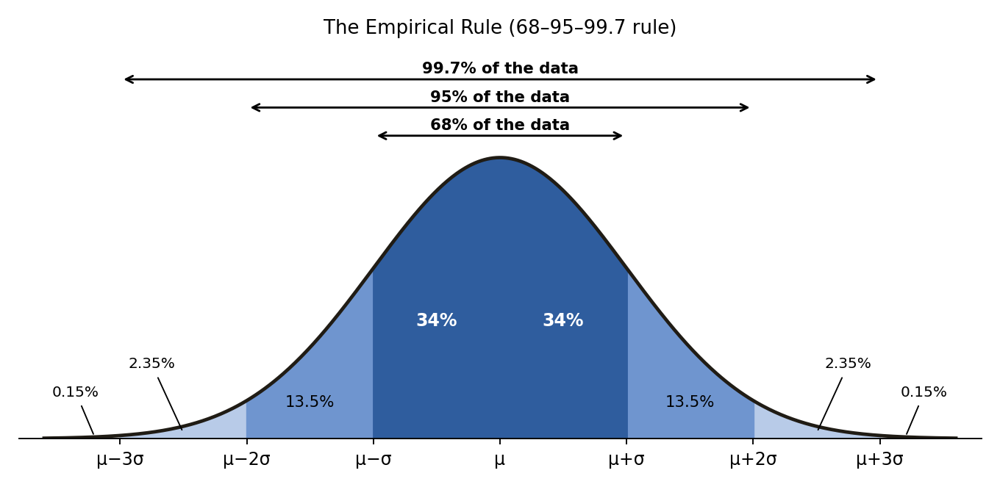
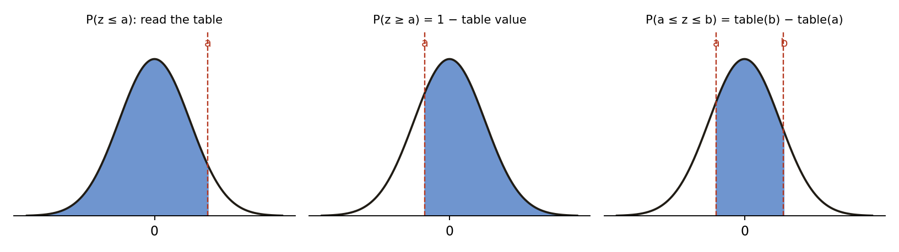
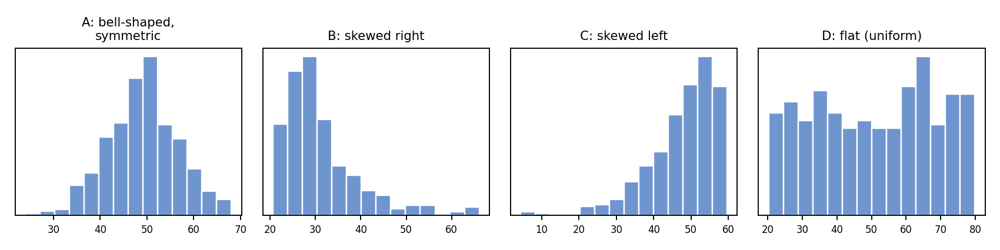
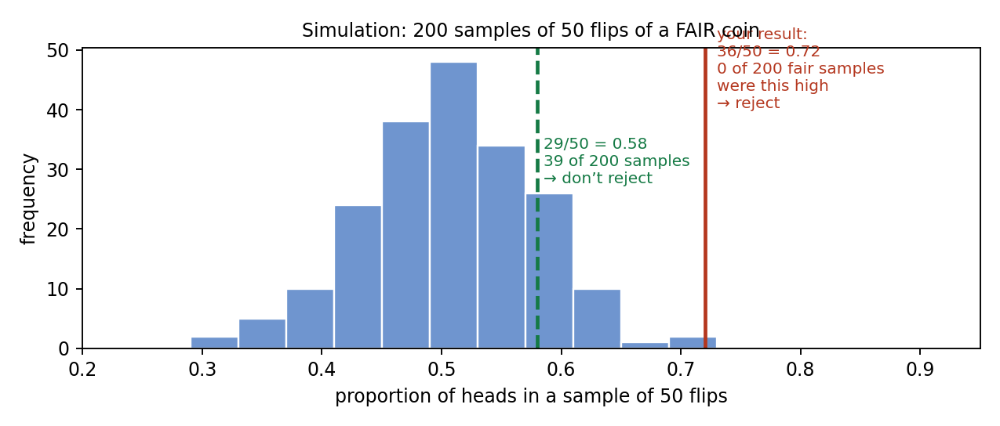
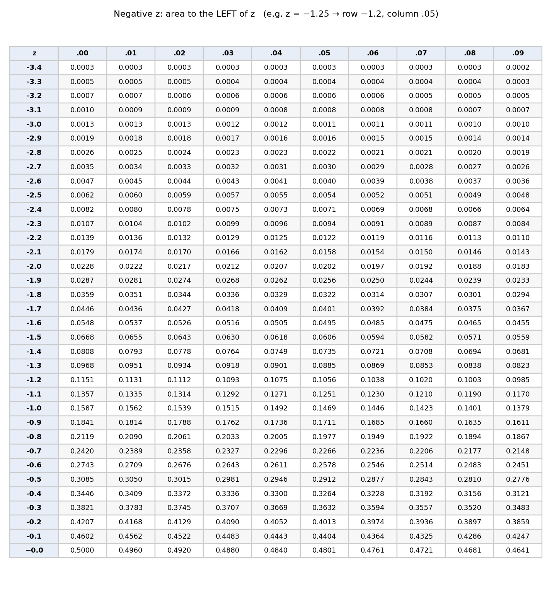
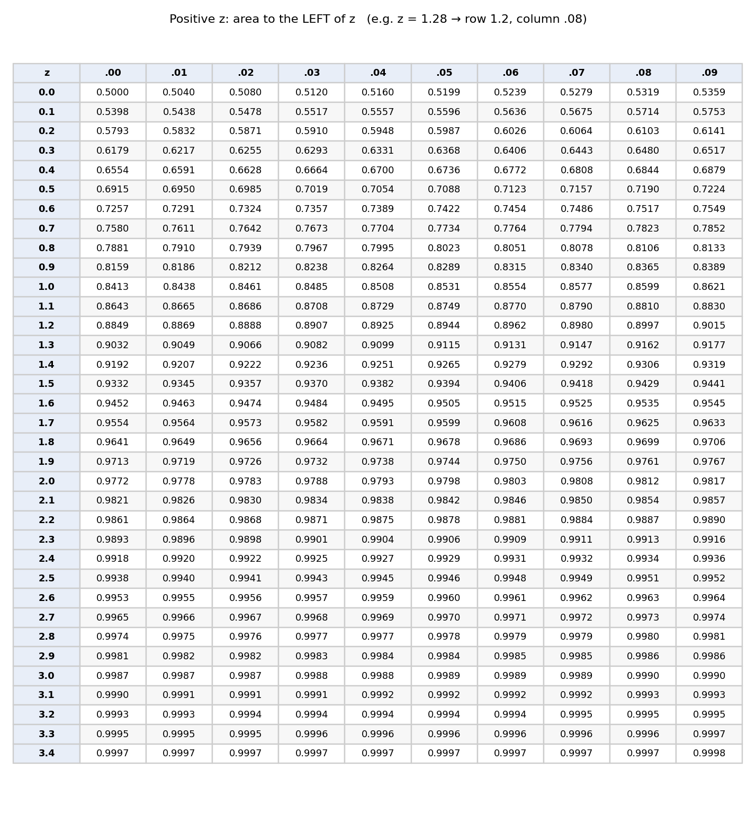

# Statistics Test Review: Normal Distributions, Samples & Data Collection

**Course:** Advanced Algebra (Larson & Boswell): Data Analysis and Statistics.\
**How to use this:** Part 1 is the one-page formula and vocabulary sheet. Parts 2–8 follow the test topics in order, each with short notes, a comparison table where it helps, and fully solved examples. The standard normal table is at the very end.\
**Calculator:** answers match both the table and a TI-84 (`normalcdf` / `invNorm`). The table is always enough.

---

## Part 1 — Formula & Vocabulary Sheet

### Formulas

| Name | Formula | What it means |
| ---- | ------------------------------- | ------------------------------------------ |
| Mean of a population | μ = (Σx) / N | Add all values, divide by how many there are. μ is read "mu". |
| Mean of a sample | x̄ = (Σx) / n | Same calculation, but for a sample. x̄ is read "x-bar". |
| Standard deviation | σ = √[ Σ(x − x̄)² / n ] | Typical distance of the data from the mean. Small σ means the data is bunched together; large σ means it is spread out. |
| z-score | z = (x − μ) / σ | How many standard deviations a value x is above (+) or below (−) the mean. |
| Value from a z-score | x = μ + z·σ | Undo a z-score to get back to the real value. |
| Empirical rule | 68% within μ ± σ, 95% within μ ± 2σ, 99.7% within μ ± 3σ | Only for normal (bell-shaped) data. |
| Area to the right | P(z ≥ a) = 1 − (table value at a) | The table gives area to the left, so subtract from 1. |
| Area between | P(a ≤ z ≤ b) = (table at b) − (table at a) | Big left area minus small left area. |
| Margin of error (sample proportion) | ± 1 / √n | For a random sample of size n, the true population percentage is likely within this much of the sample percentage. |
| Interval for the true value | sample % − 1/√n  to  sample % + 1/√n | Where the population value probably lies. |

**Quick worked check of the standard deviation.** Quiz scores: 6, 7, 7, 8, 8, 8, 8, 9, 9, 10.

- Mean: 80 ÷ 10 = 8.
- Squared distances from 8: 4, 1, 1, 0, 0, 0, 0, 1, 1, 4, which add to 12.
- σ = √(12 ÷ 10) = √1.2 ≈ 1.10.

On a TI-84 (STAT → CALC → 1-Var Stats) this shows as σx = 1.10. The Sx = 1.15 line divides by n − 1 instead; use σx unless your teacher says otherwise.

### Vocabulary

| Term | Definition |
| ---- | ---------------------------------------------------------- |
| Normal distribution | A bell-shaped, symmetric distribution. Its mean, median and mode are all at the center, and its spread is described by σ. |
| Normal curve | The smooth bell-shaped graph of a normal distribution. The total area under it is 1 (100%). |
| Standard normal distribution | The normal distribution with mean 0 and standard deviation 1. Any normal data turns into it when you convert to z-scores. |
| Standard normal table | A table that gives the area under the standard normal curve to the **left** of a z-score, which is the probability of getting a value **at or below** it. |
| Percentile | The percent of data at or below a value. A score at the 90th percentile is higher than 90% of scores. |
| Skewed | Not symmetric: one tail is longer. Skewed right means the long tail is on the right (mean > median). Skewed left means the long tail is on the left (mean < median). |
| Population | The **entire** group you want information about. |
| Sample | The **part** of the population you actually collect data from. |
| Parameter | A number that describes a **population** (for example μ, σ, or a population percentage). |
| Statistic | A number that describes a **sample** (for example x̄, or a sample percentage). |
| Hypothesis | A claim about a characteristic of a population, which you test with data. |
| Random sample | Every member of the population has an equal chance of being chosen. |
| Unbiased sample | A sample that is representative of the population. |
| Biased sample | A sample that over-represents or under-represents part of the population. |
| Survey | Asking people questions to collect data. |
| Observational study | Watching or measuring individuals **without** changing anything. |
| Experiment | **Imposing** a treatment on individuals to see its effect. The only method that can show cause and effect. |
| Simulation | Using a model (coins, dice, random numbers, computer) to reproduce a real situation. |
| Control group | The group in an experiment that does **not** get the treatment (or gets a placebo), used for comparison. |
| Placebo | A harmless fake treatment, so subjects don't know which group they are in. |

**Memory trick:** **P**opulation goes with **P**arameter; **S**ample goes with **S**tatistic.

---

## Part 2 — Interpreting Normally Distributed Data

**Key facts about a normal distribution:**

- It is bell-shaped and symmetric about the mean μ.
- The mean, median and mode are equal, all at the center.
- The total area under the curve is 1, so the area over an interval is the **probability** (or the fraction of the data) in that interval.
- About 68% of the data is within 1 standard deviation of the mean, about 95% within 2, and about 99.7% within 3 (the **empirical rule**).

{width=88%}

**How to use the picture:** mark μ in the middle, then add and subtract σ to label μ ± σ, μ ± 2σ and μ ± 3σ. Then add up the percentages of the pieces you need.

### Example 1 — Using the empirical rule

The heights of 10th-grade boys at a high school are normally distributed with mean 67 inches and standard deviation 2.5 inches.

**(a) What percent of the boys are between 64.5 in and 69.5 in tall?**

- 64.5 = 67 − 2.5 = μ − σ, and 69.5 = 67 + 2.5 = μ + σ.
- The interval μ − σ to μ + σ holds 34% + 34% = **68%**.

**(b) What is the probability that a randomly chosen boy is taller than 72 in?**

- 72 = 67 + 2(2.5) = μ + 2σ.
- The part of the curve to the right of μ + 2σ is 2.35% + 0.15% = **2.5%**, so the probability is 0.025.

**(c) What percent are between 62 in and 69.5 in?**

- 62 = 67 − 2(2.5) = μ − 2σ, and 69.5 = μ + σ.
- From μ − 2σ to μ is 13.5% + 34% = 47.5%. From μ to μ + σ is 34%.
- Total: 47.5% + 34% = **81.5%**.

**(d) Out of 300 boys, about how many are shorter than 64.5 in?**

- 64.5 = μ − σ. The area to the left of μ − σ is 13.5% + 2.35% + 0.15% = 16%.
- 0.16 × 300 = **48 boys**.

---

## Part 3 — Using a z-Score and the Standard Normal Table

The empirical rule only works for values exactly 1, 2 or 3 standard deviations from the mean. For anything else, convert to a **z-score** and use the **standard normal table**.

**Why z-scores work.** Subtracting μ moves the center to 0, and dividing by σ measures distance in "standard deviations". This turns any normal distribution into the standard normal distribution (mean 0, standard deviation 1), so one table works for every problem.

**Steps:**

1. Compute z = (x − μ) / σ. Round to two decimal places.
2. Look it up: the **row** is the ones and tenths digits, the **column** is the hundredths digit. The number in the table is the area to the **left** of z.
3. Use the right rule for the question:

{width=100%}

| The question asks for… | Do this |
| --- | --- |
| "less than", "at most", "below" | Table value at z |
| "greater than", "at least", "above" | 1 − table value at z |
| "between a and b" | Table value at b − table value at a |

### Example 2 — Finding probabilities with z-scores

SAT Math scores are normally distributed with mean 500 and standard deviation 100.

**(a) What is the probability that a student scores 650 or less?**

- z = (650 − 500) / 100 = 150 / 100 = 1.50.
- Table, row 1.5, column .00: **0.9332**.
- So about **93.3%** of students score 650 or less.
- Calculator check: `normalcdf(-1E99, 650, 500, 100)` = 0.9332.

**(b) What is the probability that a student scores more than 430?**

- z = (430 − 500) / 100 = −70 / 100 = −0.70.
- Table, row −0.7, column .00: 0.2420. That is the area to the **left**.
- "More than" means the area to the **right**: 1 − 0.2420 = **0.7580** (about 75.8%).

**(c) What percent of students score between 420 and 610?**

- z for 420: (420 − 500) / 100 = −0.80, and the table gives 0.2119.
- z for 610: (610 − 500) / 100 = 1.10, and the table gives 0.8643.
- Between: 0.8643 − 0.2119 = **0.6524**, so about **65.2%**.

### Example 3 — Working backwards (a percentile)

Using the same SAT Math scores (μ = 500, σ = 100): what score is at the **90th percentile**?

- We need the area to the left to be 0.90. Search **inside** the table for the value closest to 0.9000: it is 0.8997, in row 1.2, column .08, so z ≈ 1.28.
- Convert back to a score: x = μ + z·σ = 500 + 1.28 × 100 = **628**.
- A score of about 628 beats 90% of test takers. Calculator check: `invNorm(0.90, 500, 100)` ≈ 628.2.

### Example 4 — Small-probability questions (negative z)

The battery life of a phone model is normally distributed with mean 42 months and standard deviation 6 months. What percent of batteries fail before 34.5 months?

- z = (34.5 − 42) / 6 = −7.5 / 6 = −1.25.
- Table, row −1.2, column .05: **0.1056**.
- So about **10.6%** of batteries fail before 34.5 months.

### Example 5 — Comparing scores with z-scores

Dhairya scored 82 on an English test (class mean 75, standard deviation 5) and 88 on a Math test (class mean 80, standard deviation 8). On which test did he do better **compared with his class**?

- English: z = (82 − 75) / 5 = 1.40.
- Math: z = (88 − 80) / 8 = 1.00.
- The English score is 1.4 standard deviations above the mean, and the Math score only 1.0. So **English** was the relatively better performance, even though the Math score is the higher number.

---

## Part 4 — Recognizing Normal Distributions

**Checklist:** data is approximately normal when its histogram is:

1. **Single-peaked** (one hump) in the middle,
2. **Symmetric**: the left half roughly mirrors the right half, and
3. **Bell-shaped**: it tapers off evenly on both sides, with most data near the center and very little far out.

The quick number test: for normal data, **mean ≈ median**. If the mean is much bigger than the median, the data is skewed right; if it is much smaller, the data is skewed left.

{width=100%}

| Histogram | Shape | Normal? | Why |
| --- | --- | --- | --- |
| A | Bell-shaped, symmetric | **Yes** | One central peak, even tails on both sides |
| B | Skewed right | No | Long tail to the right (e.g. household incomes) |
| C | Skewed left | No | Long tail to the left (e.g. scores on an easy test) |
| D | Uniform (flat) | No | No peak; every value about equally common |

### Example 6 — Is it normal?

**(a)** The number of minutes students spend on social media per day has a mean of 128 minutes and a median of 95 minutes. Is this likely a normal distribution?

- In a normal distribution the mean equals the median. Here the mean is much larger than the median.
- A few students with very high screen time pull the mean up, which means the data is **skewed right**. So it is **not normal**, and the empirical rule and the z-table should not be used on it.

**(b)** The weights of 500 bags of chips have a histogram that is bell-shaped and symmetric, with mean 9.02 oz and median 9.01 oz. Is it reasonable to use the standard normal table on these weights?

- **Yes.** The shape is bell-shaped and symmetric, and the mean is almost equal to the median, so the data is approximately normal.

---

## Part 5 — Populations vs. Samples, Parameters vs. Statistics

|  | Population | Sample |
| --- | --- | --- |
| What it is | The **whole** group you want to know about | The **part** of the group you actually study |
| A number describing it is a | **Parameter** | **Statistic** |
| Symbols | μ (mean), σ (standard deviation), p (proportion) | x̄ (mean), s (standard deviation), p̂ (proportion) |
| Usually known? | Usually **not**: too big to measure all of it | **Yes**: we measure it |
| Changes from sample to sample? | No: it is one fixed number | Yes: a different sample gives a different value |

**How to decide in a word problem:**

- Ask "who does the question want to know about?" That group is the **population**.
- Ask "who was actually measured or asked?" That group is the **sample**.
- If the number comes from **everyone** in the population, it is a **parameter**. If it comes from only **some** of them, it is a **statistic**.

### Example 7 — Identify the population and the sample

**(a)** A survey of 1,200 randomly selected U.S. adults found that 64% drink coffee daily.

- **Population:** all adults in the United States.
- **Sample:** the 1,200 adults surveyed.

**(b)** To check the quality of a day's production, a factory tests 50 of the 4,000 light bulbs it made that day.

- **Population:** all 4,000 bulbs made that day.
- **Sample:** the 50 bulbs tested.

### Example 8 — Parameter or statistic?

| Statement | Answer | Reason |
| --- | --- | --- |
| The mean age of **all** 32 students in Dhairya's class is 14.6 years. | Parameter | It describes the whole group being studied (the class). |
| In a poll of 800 voters, 52% support the new park. | Statistic | It describes only the 800 voters sampled, not all voters. |
| The 2020 Census counted **all** U.S. residents and found 16.8% were 65 or older. | Parameter | A census measures the entire population. |
| A random sample of 40 NBA players has a mean height of 6 ft 6.5 in. | Statistic | It comes from 40 players, not every player. |

---

## Part 6 — Analyzing a Hypothesis

A **hypothesis** is a claim about a population. We can't check the whole population, so we compare our **sample result** with what would usually happen **if the claim were true**.

**Steps:**

1. **State the hypothesis** (the claim). Example: "This coin is fair", i.e. heads comes up 50% of the time.
2. **Collect a sample** and find its statistic. Example: 50 flips, 36 heads, so 36/50 = 0.72.
3. **Simulate** many samples of the same size, *assuming the claim is true*. Example: 200 samples of 50 flips of a fair coin.
4. **Compare.** How often did the simulation produce a result as extreme as yours?
   - **Rarely** (roughly 5% of the time or less): your result would be very unlikely if the claim were true, so **reject the hypothesis**.
   - **Often:** your result is normal for a true claim, so **don't reject** it. This does not prove the claim; it only means the data doesn't contradict it.

{width=95%}

### Example 9 — A suspicious coin (reject)

You flip a coin 50 times and get 36 heads. You claim the coin is fair. Should you reject the claim?

- Sample proportion: 36 / 50 = 0.72.
- In the simulation of 200 samples of 50 fair flips, **none** reached 0.72. The simulated results cluster around 0.50, and almost all fall between 0.36 and 0.64.
- Getting 0.72 from a fair coin would be extremely unlikely (the exact probability is about 0.1%).
- **Conclusion: reject the hypothesis.** The coin is probably not fair.

### Example 10 — An ordinary result (don't reject)

A friend flips the same kind of coin 50 times and gets 29 heads (0.58). Reject the claim that it is fair?

- In the simulation, 39 of the 200 samples (19.5%) were 0.58 or higher.
- That is common, far more than 5%, so this result is quite possible with a fair coin.
- **Conclusion: do not reject the hypothesis.** There isn't enough evidence that the coin is unfair.

---

## Part 7 — Methods of Data Collection, Sampling & Bias

### 7A. The four methods of collecting data

| Method | What the researcher does | Changes anything? | Can show cause and effect? | Example | Clue words |
| --- | --- | --- | --- | --- | --- |
| **Survey** | Asks people questions | No | No | Asking 200 students how many hours they sleep | "asked", "poll", "questionnaire", "responded" |
| **Observational study** | Watches or measures individuals as they are | No | No, only an association | Recording how many drivers wear seat belts at an intersection | "observed", "recorded", "tracked", "compared people who already…" |
| **Experiment** | **Imposes a treatment** on one group and compares with a **control group** | **Yes** | **Yes**, if the groups are randomly assigned | Randomly giving half the tomato plants a new fertilizer and comparing growth | "randomly assigned", "treatment", "control group", "placebo" |
| **Simulation** | Uses a model to imitate a real situation | Nothing real | No: it models, it doesn't measure | Using random numbers to model 1,000 free throws by a 70% shooter | "model", "random number generator", "simulate", "coin/die/spinner" |

**The key difference between an observational study and an experiment:** in an observational study the individuals **choose** their own group (people who already exercise vs. people who don't). In an experiment the **researcher assigns** the groups. That is why only an experiment can prove cause and effect.

**A good experiment has:**

- a **control group** (no treatment or a placebo),
- **random assignment** of subjects to groups, and
- enough subjects (**replication**), so the result isn't down to luck.

### Example 11 — Identify the method

| Situation | Method | Reason |
| --- | --- | --- |
| A researcher records how long each shopper waits in line at a grocery store. | Observational study | Measures what happens without changing anything |
| The school asks every 10th student entering the cafeteria to rate the lunch menu. | Survey | Asks people questions |
| 60 volunteers are randomly split: 30 take a vitamin, 30 take a placebo. Their colds are counted for 3 months. | Experiment | A treatment is imposed, with a control group and random assignment |
| A student uses a random number generator to model rolling two dice 500 times. | Simulation | A model imitates a real process |
| A study compares test scores of students who **chose** to take music lessons with those who didn't. | Observational study | The students picked their own group; nothing was imposed |

### 7B. Sampling methods (how the sample is chosen)

| Method | How it is done | Example | Biased? |
| --- | --- | --- | --- |
| **Random** | Every member has an equal chance (names from a hat, random number generator) | Randomly pick 100 student ID numbers | **Unbiased** (best) |
| **Stratified** | Split the population into groups (strata), then randomly pick from **each** group | Randomly choose 25 students from each of grades 9, 10, 11 and 12 | **Unbiased** |
| **Systematic** | Use a rule, like every kth member of a list | Survey every 10th person entering the stadium | Usually **unbiased** |
| **Cluster** | Split into groups, randomly pick **whole** groups, and use everyone in them | Randomly choose 3 homerooms and survey every student in them | Usually **unbiased** |
| **Convenience** | Pick whoever is easiest to reach | Survey the students sitting at your lunch table | **Biased** |
| **Self-selected** | Members **volunteer** to respond | An online poll anyone can answer | **Biased**: people with strong opinions respond most |

**Stratified vs. cluster, the most common mix-up:**

- **Stratified:** a **few from every** group.
- **Cluster:** **all from a few** groups.

### 7C. Identifying bias

A sample (or a question) is **biased** if it systematically favors certain results.

| Type of bias | What goes wrong | Example |
| --- | --- | --- |
| **Sampling bias** (unrepresentative sample) | The sample leaves out, or over-represents, part of the population | Surveying people leaving a gym to estimate how often U.S. adults exercise |
| **Self-selection / voluntary response** | Only people who care strongly answer | A TV station's call-in poll about a new tax |
| **Nonresponse bias** | Many people chosen don't reply, and they may differ from those who do | Mailing 1,000 surveys and getting only 90 back |
| **Question (wording) bias** | The question pushes toward an answer | "Don't you agree that the unfair new curfew should be removed?" |

### Example 12 — Find the bias, then fix it

**(a)** To estimate how much time U.S. teens spend on video games, a researcher surveys 150 teens at a gaming convention.

- **Biased: sampling bias.** Teens at a gaming convention likely play far more than typical teens.
- **Fix:** take a random sample of teens from many schools, for example a stratified random sample from each region of the U.S.

**(b)** A principal wants students' opinions on the dress code and posts an optional online form.

- **Biased: self-selected.** Mostly students who strongly dislike (or strongly like) the dress code will respond.
- **Fix:** randomly select students from the full school roster and ask each of them.

**(c)** Survey question: "Should the city waste money on a new skate park?"

- **Biased: question wording.** The word "waste" pushes people toward "no".
- **Fix:** "Do you support or oppose building a new skate park?"

**(d)** A teacher surveys the 12 students in the front two rows about whether homework should be reduced.

- **Biased: convenience sample.** Students who sit in front may not represent the class.
- **Fix:** use a random number generator to choose students from the whole class roster.

---

## Part 8 — Evaluating Published Reports

When you read a claim in a news story or advertisement, check these five things:

1. **Who was studied?** Is the sample **random** and **large enough**, and does it represent the population the claim is about?
2. **How was the data collected?** Survey, observational study or experiment? **Only an experiment** supports a cause-and-effect claim.
3. **Is there bias?** Look for convenience or self-selected samples, low response, loaded questions, or a sponsor who benefits from the result.
4. **What is the margin of error?** Use ±1/√n. If the difference being claimed is smaller than the margin of error, the claim is not supported.
5. **Does the conclusion match the data?** Watch for claims about "all Americans" from a sample of one school, or "causes" from a study that only observed.

### Example 13 — An advertisement

*"4 out of 5 dentists recommend Brite-Smile toothpaste!"* The fine print: the company sent a survey to 25 dentists who already stock its product; 15 replied and 12 of them recommended it.

- **Sample:** very small (15 replies), and only dentists who **already sell** the product, so it is a biased sample.
- **Nonresponse:** 10 of the 25 dentists didn't reply.
- **Sponsor:** the company benefits from a positive result.
- **Conclusion:** the claim is **not reliable**. "4 out of 5" (12 of 15) does not represent dentists in general.

### Example 14 — "Causes" from an observational study

*"Study shows eating breakfast raises test scores!"* Researchers recorded whether 2,000 students ate breakfast and compared their grades. Breakfast eaters averaged higher.

- **Method:** observational study. Nobody was **assigned** to eat breakfast; students chose.
- Other factors could explain the difference: sleep, family routines, study habits.
- **Conclusion:** the data shows an **association**, not cause and effect. To show cause, you would need an experiment that randomly assigns students to eat or skip breakfast.

---

## Part 9 — Estimating a Population Mean (and Proportion)

We usually can't measure a whole population, so we use a **sample statistic to estimate the population parameter**:

- use the **sample mean x̄** to estimate the **population mean μ**;
- use the **sample proportion p̂** to estimate the **population proportion p**.

**Why it works, and how to make it better:**

- A **random** sample tends to look like the population, so its mean lands close to μ.
- Different samples give slightly different means. This is called **sampling variability**.
- **Larger samples vary less**, so their means are closer to μ. More data gives a better estimate.
- Taking **several** random samples and averaging their means gives an even better estimate.

### Example 15 — Estimate a population mean from one sample

A random sample of 10 students at a high school recorded how many minutes they spent on homework last night:

45, 60, 30, 50, 55, 40, 65, 35, 50, 70

Estimate the mean homework time for **all** students at the school.

- Add: 45 + 60 + 30 + 50 + 55 + 40 + 65 + 35 + 50 + 70 = 500.
- Divide: x̄ = 500 / 10 = **50 minutes**.
- The sample mean is a **statistic**. It is our estimate of the population mean μ (a **parameter**), so the best estimate is that students spend about **50 minutes**.

### Example 16 — Several samples

Four more random samples of 10 students each gave means of 53, 48, 47 and 52 minutes. Together with Example 15's 50 minutes, what is a better estimate of μ, and what does the spread tell you?

- Mean of the five sample means: (50 + 53 + 48 + 47 + 52) / 5 = 250 / 5 = **50 minutes**.
- The sample means range from 47 to 53, so a single sample of 10 can be off by about 3 minutes.
- Using samples of **40** students instead would make the means cluster **more tightly** around the true value.

### Example 17 — Margin of error in a poll

In a random sample of 900 likely voters, 52% said they will vote for Candidate A. Can the newspaper say Candidate A will win a majority?

- Margin of error: ±1/√900 = ±1/30 ≈ ±0.033, which is **±3.3%**.
- Interval: 52% − 3.3% = 48.7% up to 52% + 3.3% = 55.3%.
- The interval includes values **below 50%**, so the true support could be less than half.
- **Conclusion:** **no**, the poll cannot say Candidate A will win a majority. The race is too close to call.

### Example 18 — How big a sample?

A school wants a margin of error of no more than ±5%. How many students should it survey?

- Set 1/√n = 0.05, so √n = 1 / 0.05 = 20, and n = 20² = **400 students**.

---

## Part 10 — Last-Minute Check (answers below)

1. A normal distribution has μ = 80 and σ = 6. What percent of the data lies between 68 and 92?
2. For the same distribution, find z for x = 71.
3. Using the table, what is P(z ≤ −1.50)?
4. "A survey of 500 of the 3,000 employees found that 38% bike to work." Is 38% a parameter or a statistic?
5. Random sampling from each grade level is which sampling method?
6. Researchers **randomly assign** 50 people to a new diet and 50 to their usual diet. Survey, observational study or experiment?
7. "Wouldn't you agree that our amazing mayor deserves re-election?" What kind of bias is this?
8. A random sample of 625 people is polled. What is the margin of error?
9. The mean of a data set is 30 and the median is 44. Is it skewed left, skewed right, or normal?
10. You roll a die 60 times and get 40 sixes. Should you reject the claim that the die is fair? Why?

**Answers:**

1. 68 = μ − 2σ and 92 = μ + 2σ, so **95%**.
2. z = (71 − 80) / 6 = **−1.5**.
3. Table, row −1.5, column .00: **0.0668**.
4. **Statistic.** It describes the 500 employees sampled, not all 3,000.
5. **Stratified** sampling.
6. **Experiment.** A treatment is imposed and the groups are randomly assigned.
7. **Question (wording) bias.** "Amazing" pushes toward yes.
8. 1/√625 = 1/25 = **±4%**.
9. The mean is less than the median, so it is **skewed left**.
10. **Reject.** A fair die gives a six about 1/6 of the time, about 10 in 60 rolls. Forty sixes would almost never happen with a fair die.

---

## Standard Normal Table (area to the LEFT of z)

**How to read it:** for z = −1.25, go to row **−1.2** and column **.05**, which gives 0.1056. For z = 1.28, go to row **1.2** and column **.08**, which gives 0.8997.

{width=100%}

{width=100%}
