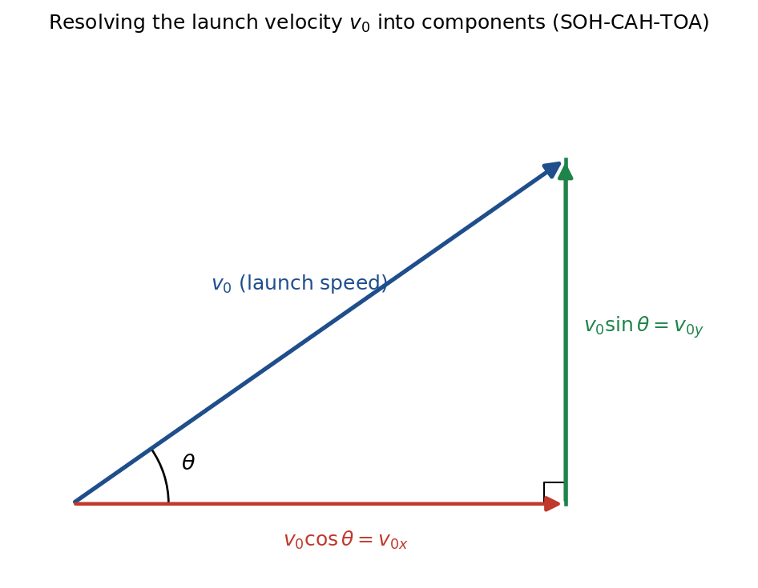

# Session 2 — 2D Kinematics: Projectile Motion

**Duration:** 45 minutes
**Prerequisite:** Session 1 — 1D Kinematics (completed: SUVAT equations + practice set)
**Grade-9 foundation used:** Ch4 Describing Motion Around Us (speed/velocity, distance-time reasoning) — vectors and independence of motion are introduced here as bridge concepts, since the class-9 book doesn't cover them
**Grade-11 depth:** Conceptual Physics (Hewitt), Ch. 6 — Vectors, sections 6.6–6.9 (Components, Projectile Motion, Upwardly Moving Projectiles)
**Why now:** matches what the school teacher is currently covering — projectiles launched at an angle, objects dropped/rolled off a ledge, solving for time and other values

---

## Lesson Plan

**Objectives** — by the end of this session the student should be able to:
1. Explain why horizontal and vertical motion are independent for a projectile (no horizontal force ⇒ no horizontal acceleration; gravity ⇒ constant vertical acceleration).
2. Solve horizontal-launch problems (object rolls/is dropped off a ledge with horizontal velocity).
3. Solve angled-launch problems (object launched at angle θ above horizontal) for time of flight, max height, and range.
4. Combine horizontal and vertical velocity components to find the resultant speed at any instant.

| Time | Segment |
| --- | --- |
| 0–5 min | Warm-up: recall SUVAT equations, conceptual hook question |
| 5–20 min | Concept notes: independence of components, horizontal-launch case, angled-launch case |
| 20–30 min | Worked examples (one of each case) |
| 30–40 min | Guided practice (Q1–Q4 together, Q5+ independent) |
| 40–45 min | Wrap-up, assign remaining practice problems as homework |

---

## Warm-up (5 min)

1. Quick recall: state the four kinematics equations from last session.
   `v = u + at` · `s = ut + ½at²` · `v² = u² + 2as` · `a = (v − u)/t`
2. Hook question: *"If you fire a bullet horizontally over level ground, and at the exact same instant drop a second bullet from the same height, which one hits the ground first?"*
   Answer to draw out: **they land at the same time.** The horizontal motion of the fired bullet doesn't affect its vertical fall — gravity acts on both identically. This is the whole idea behind today's topic.

---

## Concept Notes (15 min)

**Nothing below is a formula to memorize cold — every one is derived from the same four SUVAT equations from Session 1.** Walk through each derivation with him; that's the actual point of this section.

### The core idea

A projectile's motion is two independent 1D motions happening at the same time. Why independent? Gravity only pulls straight down — there's no horizontal force acting on the projectile (ignoring air resistance).

> **Newton's Second Law of Motion:** The acceleration produced by a net force on an object is directly proportional to the magnitude of the net force, inversely proportional to the object's mass, and in the same direction as the net force.
> Mathematically: **`F_net = ma`**, equivalently **`a = F_net / m`**, where F_net is the net (total) force in newtons (N), m is mass in kilograms (kg), and a is acceleration in m/s².
> Applied here: horizontally, `F_net,x = 0` (no horizontal force), so `a_x = 0/m = 0` — zero horizontal acceleration, which is exactly why the horizontal velocity stays constant throughout the flight.

- **Horizontal (x):** zero acceleration → **constant velocity**.
- **Vertical (y):** constant acceleration `g = 9.8 m/s²`, downward — this is exactly the free-fall motion from Session 1, just happening at the same time as the horizontal motion instead of on its own.

They don't affect each other, which is why we can reuse the Session 1 SUVAT equations on each direction separately.

### Case A — Horizontal Launch (rolls/dropped off a ledge, table, cliff) — full derivation

Setup: launched purely horizontally with speed v₀, so the initial vertical velocity is 0. Take downward as positive for the y-direction here, and the launch direction as positive for x.

**Deriving x (horizontal distance):**
Start from the Session 1 equation `s = ut + ½at²`, applied to the x-direction. Horizontal acceleration `a = 0` (no horizontal force), and initial horizontal speed `u = v₀`:
`x = v₀t + ½(0)t² → x = v₀t`

**Deriving y (vertical distance fallen):**
Same equation, applied to the y-direction. Initial vertical speed `u = 0` (purely horizontal launch), and vertical acceleration `a = g`:
`y = (0)t + ½gt² → y = ½gt²`

**Deriving vy (vertical velocity at time t):**
Start from `v = u + at`, applied to the y-direction, with `u = 0`, `a = g`:
`vy = 0 + gt → vy = gt`

**Deriving the time to land from height h:**
"Landing" means the object has fallen the full height, so `y = h`. Substitute into the y equation we just derived and solve for t:
`h = ½gt² → t² = 2h/g → t = √(2h/g)`

So every formula in Case A is just the two Session-1 equations (`s = ut+½at²` and `v = u+at`) applied once horizontally with `a = 0`, and once vertically with `u = 0, a = g`.

### Case B — Launched at an Angle (kicked/thrown upward at angle θ, lands at the same height it launched from) — full derivation

**Deriving v₀x and v₀y (splitting the launch velocity into components) — full SOH-CAH-TOA derivation:**

The launch velocity v₀ points at angle θ above horizontal — it's a single vector, not already separated into "horizontal" and "vertical" pieces. To split it, draw the right triangle it forms with the horizontal (this is exactly the vector-component method from Hewitt Ch. 6.6):

- **Step 1 — construct the triangle.** Draw v₀ as an arrow from the origin at angle θ above the horizontal. Drop a vertical line from the tip of that arrow down to the horizontal axis. This creates a right triangle where:
  - the **hypotenuse** is v₀ itself (length = the launch speed)
  - the **horizontal leg** (along the ground) is v₀x
  - the **vertical leg** (the dropped line) is v₀y
  - the right angle sits where the vertical leg meets the horizontal leg

- **Step 2 — identify opposite, adjacent, hypotenuse relative to θ.** θ is the angle at the origin, between the horizontal leg and the hypotenuse.
  - The side **opposite** θ (doesn't touch the angle) is the vertical leg → v₀y
  - The side **adjacent** to θ (touches the angle, isn't the hypotenuse) is the horizontal leg → v₀x
  - The **hypotenuse** is v₀

- **Step 3 — recall SOH-CAH-TOA.**
  `SOH: sinθ = Opposite / Hypotenuse`
  `CAH: cosθ = Adjacent / Hypotenuse`
  `TOA: tanθ = Opposite / Adjacent`

- **Step 4 — apply SOH to solve for v₀y.**
  `sinθ = v₀y / v₀`
  Multiply both sides by v₀: **`v₀y = v₀ sinθ`**

- **Step 5 — apply CAH to solve for v₀x.**
  `cosθ = v₀x / v₀`
  Multiply both sides by v₀: **`v₀x = v₀ cosθ`**

- **Step 6 — sanity-check with the Pythagorean theorem.** The two components should recombine into the original speed: `v₀x² + v₀y² = v₀²`. Substitute:
  `(v₀cosθ)² + (v₀sinθ)² = v₀²cos²θ + v₀²sin²θ = v₀²(cos²θ + sin²θ)`
  Using the identity `sin²θ + cos²θ = 1`, this equals `v₀²(1) = v₀²` ✓ — confirms the components are correct.

- **Worked numeric check:** v₀ = 20 m/s, θ = 30° → `v₀x = 20cos30° = 17.32 m/s`, `v₀y = 20sin30° = 10 m/s`. Check: `17.32² + 10² = 300 + 100 = 400 = 20²` ✓.

`v₀x` stays constant for the whole flight (horizontal acceleration = 0, from Newton's Second Law above); `v₀y` is just the *starting* vertical speed — gravity changes it as time passes, exactly like Case A's vy = gt, except here it starts at v₀y instead of 0.

**Deriving x(t), y(t), vy(t):**
Same approach as Case A, but now the vertical direction starts with a nonzero speed and we take upward as positive, so `a = −g`:
- Horizontal (`u = v₀x`, `a = 0`): `x(t) = v₀x·t`
- Vertical (`u = v₀y`, `a = −g`), from `s = ut + ½at²`: `y(t) = v₀y·t − ½gt²`
- Vertical velocity, from `v = u + at`: `vy(t) = v₀y − gt`

**Deriving the time to reach the peak:**
At the very top of the arc, the projectile is momentarily neither rising nor falling, so `vy = 0`. Set the vy(t) equation to zero and solve for t:
`0 = v₀y − g·t_up → t_up = v₀y/g`

**Deriving the max height:**
Use the third Session-1 equation, `v² = u² + 2as`, applied vertically between launch and the peak, where the vertical velocity is 0:
`0 = v₀y² − 2gH → H = v₀y²/(2g)`

**Deriving the total time of flight:**
"Lands at launch height" means y returns to 0. Set the y(t) equation to zero and solve for t:
`0 = v₀y·T − ½gT² → 0 = T(v₀y − ½gT)`
This is zero when `T = 0` (the launch instant itself) or when `v₀y − ½gT = 0`, i.e. `T = 2v₀y/g`. The second solution is the landing time we want:
`T = 2v₀y/g`
(Notice this is exactly `2 × t_up` — confirming what Session 1's symmetric free-fall behavior already told us: time going up equals time coming down.)

**Deriving the range:**
Range is just the horizontal distance covered in the total flight time: `R = x(T) = v₀x·T`. Substitute `T = 2v₀y/g`:
`R = v₀x · (2v₀y/g) = 2v₀xv₀y/g`
Now substitute the components from the first derivation, `v₀x = v₀cosθ` and `v₀y = v₀sinθ`:
`R = 2v₀²sinθcosθ/g`
Using the double-angle identity `2sinθcosθ = sin(2θ)` (worth a quick note if he hasn't seen it yet):
`R = v₀²sin(2θ)/g`

So every Case B formula also traces straight back to the three Session-1 SUVAT equations — the only new ingredient is splitting v₀ into components with right-triangle trig at the start.

### The strategy for any projectile problem

1. Split the initial velocity into horizontal and vertical components (skip this step for a horizontal launch — it's already just v₀ horizontal, 0 vertical).
2. Solve the **vertical** motion first — it's the one gravity constrains, so it usually gives you time.
3. Plug that time into the **horizontal** equation to get distance, or vice versa.
4. If asked for a resultant velocity (speed and direction) at some instant, find vx and vy separately, then combine: `speed = √(vx² + vy²)`.

---

## Worked Examples (10 min)

**Example 1 (horizontal launch):** A ball rolls off a table 1.25 m high with a horizontal speed of 3 m/s. Find (a) time to hit the floor, (b) horizontal distance traveled, (c) vertical velocity at impact.

- (a) `t = √(2×1.25/9.8) = √0.255 = 0.51 s`
- (b) `x = 3 × 0.51 = 1.52 m`
- (c) `vy = 9.8 × 0.51 = 4.95 m/s`

**Example 2 (angled launch):** A stone is thrown at 20 m/s at 30° above horizontal from ground level. Find (a) time of flight, (b) max height, (c) range.

- `v₀x = 20cos30° = 17.32 m/s`, `v₀y = 20sin30° = 10 m/s`
- (a) `T = 2×10/9.8 = 2.04 s`
- (b) `H = 10²/(2×9.8) = 5.10 m`
- (c) `R = 17.32 × 2.04 = 35.3 m` (check: `400×sin60°/9.8 = 35.3 m` ✓)

---

## Practice Problems

*10 numerical questions, increasing difficulty. Use g = 9.8 m/s². Do Q1–Q4 together in class, assign the rest as homework.*

1. **Horizontal launch — time:** A marble rolls off a 0.8 m high desk at a horizontal velocity of 2 m/s. Find the time to hit the floor.
2. **Horizontal launch — range:** Using Q1, find the horizontal distance the marble travels before landing.
3. **Horizontal launch — impact speed:** A ball leaves a table horizontally at 5 m/s from a height of 2.0 m. Find the vertical velocity just before impact, and the resultant (total) speed at impact.
4. **Angled launch — time of flight:** A ball is kicked at 15 m/s at 40° above horizontal on level ground. Find the time of flight.
5. **Angled launch — max height:** For the same kick as Q4, find the maximum height reached.
6. **Angled launch — range:** For the same kick as Q4, find the horizontal range.
7. **Reverse problem:** A projectile launched at 45° lands 20 m away. Find its initial launch speed. (Hint: at 45°, `sin(2θ) = 1`.)
8. **Cliff problem:** A stone is thrown horizontally from the top of a 45 m cliff at 8 m/s. Find (a) time to hit the ground, (b) horizontal distance traveled, (c) speed just before impact.
9. **Velocity at a given instant:** A ball is thrown at 25 m/s at 53° above horizontal. Find its horizontal and vertical velocity components 2 seconds after launch, and state whether it has passed its highest point yet.
10. **Challenge — complementary angles:** A projectile is launched at 18 m/s, once at 30° and once at 60°. Calculate the range for each and confirm they're equal. Then calculate the time of flight for each and explain why they're different even though the range is the same.

---

## Answer Key — Full Step-by-Step Solutions

**1. Horizontal launch — time**
Given: h = 0.8 m, g = 9.8 m/s² (the horizontal speed 2 m/s doesn't matter for this part — only vertical motion determines fall time).
- Step 1: Vertical motion starts from rest (v₀y = 0), so use `y = ½gt²`.
- Step 2: Solve for t: `t = √(2y/g)`.
- Step 3: Substitute: `t = √(2×0.8 / 9.8) = √(1.6/9.8) = √0.1633`.
- Step 4: `t = 0.40 s`.
**Answer: t ≈ 0.40 s**

**2. Horizontal launch — range**
Given: v₀ = 2 m/s (horizontal), t = 0.40 s (from Q1).
- Step 1: Horizontal velocity is constant (no horizontal acceleration), so use `x = v₀·t`.
- Step 2: Substitute: `x = 2 × 0.40`.
- Step 3: `x = 0.81 m` (using the more precise t = 0.404 s).
**Answer: x ≈ 0.81 m**

**3. Horizontal launch — impact speed**
Given: h = 2.0 m, v₀ = 5 m/s (horizontal), g = 9.8 m/s².
- Step 1: Find time to fall: `t = √(2h/g) = √(4/9.8) = √0.408 = 0.64 s`.
- Step 2: Find vertical velocity at impact: `vy = gt = 9.8 × 0.64 = 6.26 m/s`.
- Step 3: Horizontal velocity is unchanged: `vx = 5 m/s`.
- Step 4: Combine components into the resultant speed: `speed = √(vx² + vy²) = √(5² + 6.26²) = √(25 + 39.2) = √64.2`.
- Step 5: `speed = 8.01 m/s`.
**Answer: t = 0.64 s, vy = 6.26 m/s, resultant speed ≈ 8.01 m/s**

**4. Angled launch — time of flight**
Given: v₀ = 15 m/s, θ = 40°, level ground.
- Step 1: Find the initial vertical component: `v₀y = v₀sinθ = 15 × sin40° = 15 × 0.643 = 9.64 m/s`.
- Step 2: Time of flight (lands at launch height): `T = 2v₀y/g`.
- Step 3: Substitute: `T = 2 × 9.64 / 9.8 = 19.28/9.8`.
- Step 4: `T = 1.97 s`.
**Answer: T ≈ 1.97 s**

**5. Angled launch — max height**
Given: v₀y = 9.64 m/s (from Q4), g = 9.8 m/s².
- Step 1: Use `H = v₀y² / (2g)`.
- Step 2: Substitute: `H = 9.64² / (2×9.8) = 92.93/19.6`.
- Step 3: `H = 4.74 m`.
**Answer: H ≈ 4.74 m**

**6. Angled launch — range**
Given: v₀ = 15 m/s, θ = 40°, T = 1.97 s (from Q4).
- Step 1: Find the horizontal component: `v₀x = v₀cosθ = 15 × cos40° = 15 × 0.766 = 11.49 m/s`.
- Step 2: Range = horizontal speed × total time: `R = v₀x × T = 11.49 × 1.97`.
- Step 3: `R = 22.6 m`.
- Step 4 (check with the shortcut formula): `R = v₀²sin(2θ)/g = 225 × sin80° / 9.8 = 225 × 0.985/9.8 = 22.6 m` ✓ matches.
**Answer: R ≈ 22.6 m**

**7. Reverse problem — find launch speed from range**
Given: R = 20 m, θ = 45°.
- Step 1: Start from `R = v₀²sin(2θ)/g`.
- Step 2: At 45°, `2θ = 90°` and `sin90° = 1`, so the formula simplifies to `R = v₀²/g`.
- Step 3: Solve for v₀: `v₀ = √(Rg)`.
- Step 4: Substitute: `v₀ = √(20 × 9.8) = √196`.
- Step 5: `v₀ = 14 m/s`.
**Answer: v₀ = 14 m/s**

**8. Cliff problem**
Given: h = 45 m, v₀ = 8 m/s (horizontal), g = 9.8 m/s².
- Step 1 (time): `t = √(2h/g) = √(90/9.8) = √9.184`.
- Step 2: `t = 3.03 s`.
- Step 3 (horizontal distance): `x = v₀ × t = 8 × 3.03`.
- Step 4: `x = 24.2 m`.
- Step 5 (vertical velocity at impact): `vy = gt = 9.8 × 3.03 = 29.7 m/s`.
- Step 6 (resultant impact speed): `speed = √(vx² + vy²) = √(8² + 29.7²) = √(64 + 882.1) = √946.1`.
- Step 7: `speed = 30.8 m/s`.
**Answer: t ≈ 3.03 s, x ≈ 24.2 m, impact speed ≈ 30.8 m/s**

**9. Velocity at a given instant**
Given: v₀ = 25 m/s, θ = 53°, t = 2 s.
- Step 1: Horizontal component (constant for the whole flight): `vx = v₀cosθ = 25 × cos53° = 25 × 0.602 = 15 m/s`.
- Step 2: Initial vertical component: `v₀y = v₀sinθ = 25 × sin53° = 25 × 0.799 = 20 m/s`.
- Step 3: Vertical velocity at t = 2 s: `vy = v₀y − gt = 20 − 9.8×2 = 20 − 19.6 = 0.4 m/s`.
- Step 4: Since vy is still positive (moving upward), the ball hasn't reached its peak yet. Confirm: `t_up = v₀y/g = 20/9.8 = 2.04 s`, which is just after t = 2 s.
**Answer: vx = 15 m/s, vy = 0.4 m/s — the ball has not yet reached its highest point**

**10. Complementary angles — same range, different time**
Given: v₀ = 18 m/s, θ₁ = 30°, θ₂ = 60°.
- Step 1 (range at 30°): `R = v₀²sin(2θ)/g = 18² × sin60° / 9.8 = 324 × 0.866/9.8 = 280.6/9.8 = 28.6 m`.
- Step 2 (range at 60°): `R = 324 × sin120° / 9.8`. Since `sin120° = sin60° = 0.866`, this also gives `R = 28.6 m`.
- Step 3: Both ranges are equal — confirmed.
- Step 4 (time at 30°): `v₀y = 18sin30° = 9 m/s`, so `T = 2×9/9.8 = 1.84 s`.
- Step 5 (time at 60°): `v₀y = 18sin60° = 15.59 m/s`, so `T = 2×15.59/9.8 = 3.18 s`.
**Answer: both launches range 28.6 m, but the 60° launch stays airborne almost twice as long (3.18 s vs 1.84 s) — it trades horizontal speed for a higher, longer arc that still lands at the same spot.**

---

## Notes for next session

Once this is solid, natural next steps in 2D kinematics (if the teacher continues here before moving to Forces): projectiles launched *downward* at an angle from a height, or relative-velocity problems (river-crossing type, same independence-of-components idea). Flag if the teacher's next topic is one of these, or if it moves to Forces (Session 3 in the master plan).
