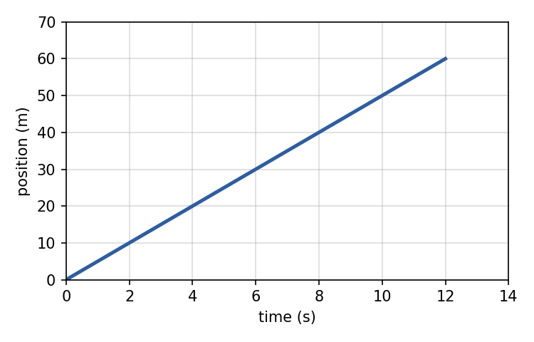
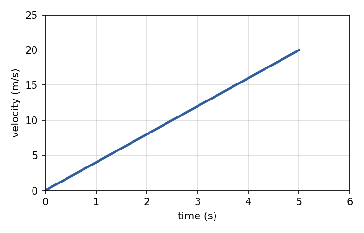

# Physics Unit 1 — Practice Test

**Format:** 30 multiple-choice + 2 free-response = **32 questions**, the same length and style as the school's *Unit 1 Review*.\
**Topics:** scalars & vectors · vectors (resultants, direction angles, components) · technical drawings & scaling · 1-D motion & free fall · acceleration & motion graphs · 2-D motion (projectiles).\
**Rules:** closed book, calculator allowed, **g = 9.81 m/s²**. Directions are standard-position angles (counter-clockwise from east) unless stated. Suggested time: 45 minutes.

| Topic | Questions |
| --- | --- |
| Scalars & Vectors | 1–4 |
| Vectors | 5–9 |
| Technical Drawings | 10–15 |
| 1-D Motion | 16–20 |
| Motion Graphs | 21–25 |
| 2-D Motion | 26–32 (incl. free response) |

---

## Part A — Multiple Choice

### Scalars & Vectors

**1.** Which of these is a vector quantity?

a) 25 s\
b) 12 kg\
c) 15 m/s west\
d) 40 °C

**2.** Which list contains only scalar quantities?

a) Displacement, speed, time\
b) Velocity, force, mass\
c) Acceleration, distance, time\
d) Speed, time, mass

**3.** A velociraptor runs 40 m east, then 40 m back west to its starting spot. What are its distance and displacement?

a) 80 m and 80 m\
b) 0 m and 80 m\
c) 40 m and 0 m\
d) 80 m and 0 m

**4.** Your favorite PhysEng teacher jogs once around a 400 m track in 200 s, finishing at the start line. What are the average speed and average velocity?

a) 2 m/s and 2 m/s\
b) 2 m/s and 0 m/s\
c) 0 m/s and 2 m/s\
d) 0 m/s and 0 m/s

### Vectors

**5.** (Vectors) A velociraptor moves 24 m north and 7 m east. What is the magnitude of its resultant displacement?

a) 31 m\
b) 17 m\
c) 25 m\
d) 23 m

**6.** (Vectors) For the same raptor (24 m north, 7 m east), what is the direction of the resultant, measured counter-clockwise from east?

a) 16.3°\
b) 73.7°\
c) 106.3°\
d) 286.3°

**7.** (Vectors) Your favorite PhysEng teacher runs 15 m west and 20 m south. What is the magnitude and direction of the resultant?

a) 25 m at 53°\
b) 35 m at 233°\
c) 25 m at 233°\
d) 25 m at 127°

**8.** (Vectors) A raptor moves 8 m north and 6 m west. What is its resultant?

a) 10 m at 126.9°\
b) 10 m at 53.1°\
c) 14 m at 126.9°\
d) 10 m at 233.1°

**9.** (Vectors) A velocity of 30 m/s points at 60° (counter-clockwise from east). What are its x- and y-components?

a) vx = 26.0 m/s, vy = 15.0 m/s\
b) vx = 15.0 m/s, vy = 26.0 m/s\
c) vx = 30 m/s, vy = 60 m/s\
d) vx = −15.0 m/s, vy = 26.0 m/s

### Technical Drawings

**10.** Which type of pictorial drawing has its three axes spaced 120° apart, with receding lines at 30° to the horizontal?

a) Oblique\
b) Perspective\
c) Isometric\
d) Orthographic

**11.** In which type of drawing do parallel depth lines converge toward a vanishing point?

a) Perspective\
b) Isometric\
c) Oblique\
d) AutoCAD

**12.** Which drawing shows the front of an object in its true shape and size, with the depth lines drawn back at an angle (often 45°)?

a) Isometric\
b) Oblique\
c) Perspective\
d) Multiview

**13.** A drawing shows an object as separate flat front, top and right-side views. What type of drawing is this?

a) Isometric\
b) Perspective\
c) Oblique\
d) Orthographic (multiview)

**14.** A steel plate measures 5 cm by 9 cm. Scale it onto paper using the scale factor 3:1. What are the drawing's dimensions?

a) 8 cm by 12 cm\
b) 1.67 cm by 3 cm\
c) 15 cm by 27 cm\
d) 45 cm by 81 cm

**15.** A 12 m long school bus is drawn at a scale of 1:100. How long is the bus on the drawing?

a) 1.2 cm\
b) 12 cm\
c) 120 cm\
d) 1200 cm

### 1-D Motion

**16.** (1-D Motion) Your favorite PhysEng teacher is 120 m from the exit and runs at a constant velocity that gets them there in 15 s. What is the teacher's velocity?

a) 0.125 m/s\
b) 1800 m/s\
c) 9.81 m/s\
d) 8.0 m/s

**17.** (1-D Motion) A velociraptor accelerates uniformly from rest to 18 m/s in 3.0 s. What is its acceleration?

a) 6.0 m/s²\
b) 54 m/s²\
c) 0.17 m/s²\
d) 9.81 m/s²

**18.** (1-D Motion) How far does that raptor travel during those 3.0 s?

a) 54 m\
b) 18 m\
c) 9 m\
d) 27 m

**19.** (1-D Motion) A car moving at 30 m/s brakes with a constant acceleration of −6.0 m/s². How far does it travel before stopping?

a) 75 m\
b) 150 m\
c) 5.0 m\
d) 180 m

**20.** (Free Fall) A textbook is dropped from rest off a 30 m high roof. How long does it take to hit the ground? (g = 9.81 m/s²)

a) 3.06 s\
b) 6.12 s\
c) 2.47 s\
d) 1.75 s

### Motion Graphs

**21.** (Graphing) What does the slope of a velocity–time graph represent?

a) Displacement\
b) Acceleration\
c) Velocity\
d) Time

**22.** (Graphing) The position–time graph shows a velociraptor moving in a straight line. What is its velocity?

{width=55%}

a) 5.0 m/s\
b) 0.2 m/s\
c) 60 m/s\
d) 720 m/s

**23.** (Graphing) The velocity–time graph shows your teacher's scooter. What is its acceleration?

{width=55%}

a) 20 m/s²\
b) 0.25 m/s²\
c) 4.0 m/s²\
d) 100 m/s²

**24.** (Graphing) Using the same velocity–time graph, how far does the scooter travel in the first 5 s?

{width=55%}

a) 100 m\
b) 4 m\
c) 25 m\
d) 50 m

**25.** (Graphing) On a velocity–time graph, a horizontal line above the time axis means the object is…

a) at rest\
b) moving with constant velocity\
c) speeding up at a constant rate\
d) slowing down

### 2-D Motion

**26.** (Projectiles) A ball rolls horizontally off a 1.8 m high table at 4.0 m/s. How long is it in the air?

a) 0.45 s\
b) 0.61 s\
c) 0.37 s\
d) 0.18 s

**27.** (Projectiles) How far from the base of the table does that ball land?

a) 2.4 m\
b) 7.2 m\
c) 1.8 m\
d) 0.61 m

**28.** (Free Fall Extension) The fire department sets an inflatable cushion 5.0 m from the edge of an 11 m tall building. How fast must your favorite teacher be moving horizontally when leaping from the roof?

a) It doesn't matter\
b) 0.30 m/s\
c) 7.5 m/s\
d) 3.3 m/s

**29.** (Projectiles) A plane flying horizontally at 60 m/s drops a package. Ignoring air resistance, where is the package when it hits the ground?

a) Far behind the plane\
b) Ahead of the plane\
c) Directly below the point where it was dropped\
d) Directly below the plane

**30.** (Projectiles) A ball is kicked at an angle above level ground. At the very top of its path, which is true?

a) Both its horizontal and vertical velocity are zero\
b) Its horizontal velocity is zero; its vertical velocity is at a maximum\
c) Its vertical velocity is zero; its horizontal velocity is unchanged\
d) Its acceleration is zero

---

## Part B — Free Response (show all work)

**31.** A toy car rolls horizontally off a 0.95 m high shelf at 2.6 m/s. (a) How long is it in the air? (b) How far from the shelf does it land? (c) What is its vertical velocity just before impact? Give the magnitude and direction. (d) What is the magnitude of its total velocity just before impact?

*Work:*

&nbsp;

&nbsp;

&nbsp;

**32.** At the same instant and from the same height, Ball A is dropped from rest and Ball B is launched horizontally at 12 m/s. Which ball reaches the floor first? Explain using the x/y independence of projectile motion.

*Work:*

&nbsp;

&nbsp;

&nbsp;

## Answer Key

### Part A

| # | Ans | # | Ans | # | Ans |
| --- | --- | --- | --- | --- | --- |
| 1 | c | 11 | a | 21 | b |
| 2 | d | 12 | b | 22 | a |
| 3 | d | 13 | d | 23 | c |
| 4 | b | 14 | c | 24 | d |
| 5 | c | 15 | b | 25 | b |
| 6 | b | 16 | d | 26 | b |
| 7 | c | 17 | a | 27 | a |
| 8 | a | 18 | d | 28 | d |
| 9 | b | 19 | a | 29 | d |
| 10 | c | 20 | c | 30 | c |

### Worked explanations

**1. (c) 15 m/s west.** Only 15 m/s west states a direction. Time, mass and temperature are scalars.

**2. (d) Speed, time, mass.** Speed, time and mass have size only. Each other list includes a vector: displacement, velocity/force, or acceleration.

**3. (d) 80 m and 0 m.** Distance is the total path: 40 + 40 = 80 m. Displacement is final minus start position. It ends where it began, so displacement = 0 m.

**4. (b) 2 m/s and 0 m/s.** Average speed = 400 m ÷ 200 s = 2 m/s. The displacement is 0 (back at the start), so average velocity = 0 ÷ 200 = 0 m/s.

**5. (c) 25 m.** R = √(24² + 7²) = √(576 + 49) = √625 = 25 m. 31 m (just adding) and 17 m (subtracting) are traps.

**6. (b) 73.7°.** φ = tan⁻¹(24/7) = 73.7°. North and east are both +, so the resultant is in Q1 and θ = φ = 73.7°. (16.3° = tan⁻¹(7/24) uses the wrong ratio.)

**7. (c) 25 m at 233°.** R = √(15² + 20²) = 25 m. φ = tan⁻¹(20/15) = 53.1°. West and south are both −, which is Q3, so θ = 180° + 53.1° = 233.1° ≈ 233°.

**8. (a) 10 m at 126.9°.** R = √(8² + 6²) = 10 m. φ = tan⁻¹(8/6) = 53.1°. North (+) and west (−) put it in Q2, so θ = 180° − 53.1° = 126.9°.

**9. (b) vx = 15.0 m/s, vy = 26.0 m/s.** vx = 30 cos 60° = 30 × 0.5 = 15.0 m/s. vy = 30 sin 60° = 30 × 0.866 = 26.0 m/s. Swapping sin and cos gives the first option.

**10. (c) Isometric.** Isometric means 'equal measure'. The three axes are 120° apart and receding edges are drawn at 30°.

**11. (a) Perspective.** Perspective drawings converge to one or more vanishing points, like a photo. AutoCAD is software, not a drawing type.

**12. (b) Oblique.** Oblique: the front face (the frontal lines) keeps true proportions, and depth recedes at an angle.

**13. (d) Orthographic (multiview).** Orthographic (multiview) projection shows each face as its own 2D view in true size and shape.

**14. (c) 15 cm by 27 cm.** 3:1 means drawing : actual = 3 : 1, so every length is multiplied by 3: 5 × 3 = 15 cm and 9 × 3 = 27 cm. Adding 3 or dividing by 3 are traps.

**15. (b) 12 cm.** 12 m = 1200 cm. Drawing = 1200 ÷ 100 = 12 cm.

**16. (d) 8.0 m/s.** v = displacement ÷ time = 120 ÷ 15 = 8.0 m/s. 0.125 is time ÷ distance (upside down), and 9.81 is g, which is irrelevant here.

**17. (a) 6.0 m/s².** a = (v − u) ÷ t = (18 − 0) ÷ 3.0 = 6.0 m/s².

**18. (d) 27 m.** s = ut + ½at² = 0 + ½ × 6.0 × 3.0² = 27 m. As a check, average velocity (0 + 18)/2 = 9 m/s × 3 s = 27 m.

**19. (a) 75 m.** v² = u² + 2as → 0 = 30² + 2(−6.0)s → s = 900 ÷ 12 = 75 m.

**20. (c) 2.47 s.** h = ½gt² → t = √(2h/g) = √(60 ÷ 9.81) = √6.12 = 2.47 s. The distractors forget the 2 or the square root.

**21. (b) Acceleration.** Slope = Δv ÷ Δt, which is the definition of acceleration. The area under a v–t graph is displacement.

**22. (a) 5.0 m/s.** Slope of the x–t graph = rise ÷ run = 60 m ÷ 12 s = 5.0 m/s. The line is straight, so the velocity is constant.

**23. (c) 4.0 m/s².** Slope of the v–t graph = Δv ÷ Δt = 20 ÷ 5 = 4.0 m/s².

**24. (d) 50 m.** Displacement = area under the v–t graph. It is a triangle: ½ × 5 s × 20 m/s = 50 m. Using the rectangle (5 × 20) gives the 100 m trap.

**25. (b) moving with constant velocity.** A flat v–t line means v is not changing: constant velocity, zero acceleration. At rest would be a line on the time axis (v = 0).

**26. (b) 0.61 s.** Only the vertical motion sets the time: t = √(2h/g) = √(3.6 ÷ 9.81) = √0.367 = 0.61 s. The 4.0 m/s doesn't matter for the time.

**27. (a) 2.4 m.** Horizontal velocity is constant: x = vx × t = 4.0 × 0.606 = 2.4 m.

**28. (d) 3.3 m/s.** Fall time: t = √(2 × 11 ÷ 9.81) = √2.24 = 1.50 s. Horizontal speed: v = 5.0 ÷ 1.50 = 3.3 m/s. It does matter: too slow and the teacher lands short.

**29. (d) Directly below the plane.** The package keeps the plane's 60 m/s horizontal velocity (no horizontal force), so it stays directly under the plane the whole way down.

**30. (c) Its vertical velocity is zero; its horizontal velocity is unchanged.** At the peak vy = 0 (it stops rising). vx never changes, and acceleration is still g = 9.81 m/s² downward the whole time.

### Part B

**31.**

- **(a)** Vertical motion from rest: h = ½gt², so t = √(2h/g) = √(2 × 0.95 ÷ 9.81) = √0.1937 = 0.44 s.
- **(b)** Horizontal velocity is constant: x = vx × t = 2.6 × 0.440 = 1.14 m.
- **(c)** vy = gt = 9.81 × 0.440 = 4.32 m/s, directed downward.
- **(d)** Combine the perpendicular components: v = √(vx² + vy²) = √(2.6² + 4.32²) = √(6.76 + 18.66) = √25.4 = 5.04 m/s (at 58.9° below the horizontal).

**32.**

- They land at the same time.
- Horizontal and vertical motions are independent: the only force is gravity, which acts vertically.
- Both balls start with zero vertical velocity and both have vertical acceleration g, so the vertical equation y = ½gt² is identical for both and gives the same fall time.
- Ball B's 12 m/s only affects how far it travels horizontally (x = 12t), not how long it takes to fall.
