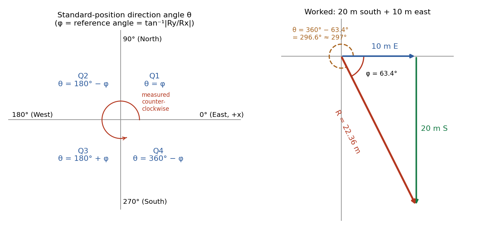
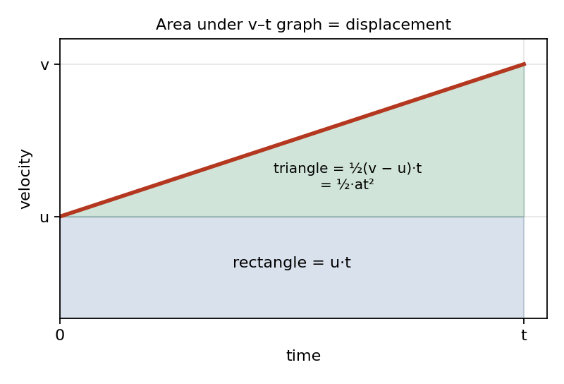
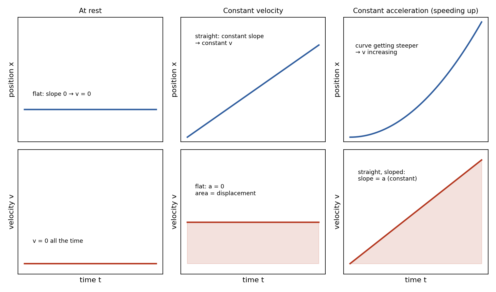
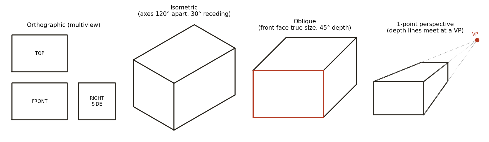

# Session 3 — Unit 1 Review: Vectors, Motion Graphs & Technical Drawings

**Duration:** 45 minutes\
**Continues from:** Session 2, 2D Kinematics (projectile motion). Session 1 covered 1D kinematics and the SUVAT equations.\
**Why now:** the school's **Unit 1 Review** (32 multiple-choice questions) covers vectors and scalars, technical drawings, 1D kinematics, acceleration and motion graphs, and 2D kinematics. Sessions 1–2 already covered the kinematics. Today fills the three gaps (**vectors done formally, motion graphs, technical drawings**) and finishes with an exam-style drill.\
**Grade-9 foundation:** Ch4 *Describing Motion Around Us* (distance–time and speed–time graphs, §4.2).\
**Grade-11 depth:** NCERT Class 11 Ch3 *Motion in a Plane* (§3.2 scalars and vectors, head-to-tail addition, §3.5 resolution into components), Ch2 *Motion in a Straight Line* (slope and area of x–t and v–t graphs; kinematic equations derived from v–t area). Also Glencoe *Physics: Principles and Problems* §2.3 (position–time graphs) and Hewitt *Conceptual Physics* Ch6 (vectors).\
**Not in any textbook in the vault:** technical drawing types and scaling are engineering-drawing content from the school's PhysEng course. That section uses standard drafting conventions and is marked as such.\
**Units note:** the school's answer choices use **g = 9.81 m/s²** (Session 2 used 9.8). Use 9.81 from now on.

---

## Lesson Plan

**Objectives.** By the end of this session the student should be able to:

1. Classify a quantity as scalar or vector, and tell distance from displacement and speed from velocity.
2. Add perpendicular vectors, then state the resultant's direction as a **standard-position angle (0°–360°, measured counter-clockwise from east)**. This is the format the school uses, e.g. "22.36 m at 297°".
3. Read position–time and velocity–time graphs: slope, area, and what each shape means.
4. Identify orthographic, isometric, oblique and perspective drawings, and apply a scale factor.

| Time | Segment |
| --- | --- |
| 0–4 min | Warm-up: two projectile recall questions |
| 4–14 min | Scalars vs vectors, resultant + direction angle, components |
| 14–26 min | Acceleration and motion graphs (slope, area, shapes) |
| 26–34 min | Technical drawings and scaling |
| 34–43 min | Exam-style rapid drill (mixed, timed) |
| 43–45 min | Wrap-up: assign the practice test and the homework problems below |

**Pacing note.** If you run behind, shorten the component-addition example in the vectors section (the test only needs perpendicular vectors) before touching anything else. Do not cut the direction-angle rule or the graphs section. Those are where the test's trickiest distractors live.

---

## Warm-up (4 min)

1. *Ball A is dropped from rest. At the same instant, Ball B is launched horizontally at 8.0 m/s from the same height. Which lands first?*
   **Same time.** Vertical motion is independent of horizontal motion. Both start with zero vertical velocity and both fall with g, so they take identical times. This is the Session 2 core idea and it's on his worksheet.

2. *A marble rolls off a 1.25 m table. How long is it in the air?*
   `t = √(2h/g) = √(2 × 1.25 / 9.81) = √0.2548 = 0.50 s`. The 3.2 m/s horizontal speed doesn't matter for the time.

---

## Part 1 — Scalars vs Vectors (10 min)

### Definitions (NCERT Class 11 §3.2)

- **Scalar quantity:** specified completely by a single number (its magnitude) with the proper unit. Examples: distance, speed, time, mass, volume, temperature, energy.
- **Vector quantity:** has both a **magnitude and a direction**, and obeys the triangle (head-to-tail) law of addition. Examples: displacement, velocity, acceleration, force.

The two pairs that get tested most:

| Scalar | Vector partner | Difference |
| --- | --- | --- |
| **Distance**: total path length | **Displacement**: straight line from start to finish, with direction | Walk 30 m E then 40 m N: distance = 70 m, displacement = 50 m |
| **Speed** = distance ÷ time | **Velocity** = displacement ÷ time | Same walk in 50 s: average speed 1.4 m/s, average velocity 1.0 m/s |

NCERT puts it this way: average speed is always **greater than or equal to** the magnitude of average velocity. They are equal only for straight-line motion that never turns back.

### Adding perpendicular vectors: magnitude

Place the vectors **head to tail**. The resultant R runs from the tail of the first to the head of the last. If the two vectors are perpendicular they form a right triangle with R as the hypotenuse, so by Pythagoras:

`R = √(Rx² + Ry²)`

### The direction angle: this is where marks are lost

The school states direction as a **standard-position angle θ**. It is measured **counter-clockwise from the +x axis (east)**, from 0° to 360°. The recipe:

1. Assign signs: east and north are **+**, west and south are **−**. So Rx is + for east, − for west; Ry is + for north, − for south.
2. Find the **reference angle** `φ = tan⁻¹(|Ry| / |Rx|)`. This is always between 0° and 90°.
3. Use the quadrant to convert φ into θ:

| Quadrant | Signs (Rx, Ry) | θ |
| --- | --- | --- |
| Q1 (north-east) | (+, +) | θ = φ |
| Q2 (north-west) | (−, +) | θ = 180° − φ |
| Q3 (south-west) | (−, −) | θ = 180° + φ |
| Q4 (south-east) | (+, −) | θ = 360° − φ |

{width=100%}

**Why the quadrant step matters.** For "20 m south and 10 m east", `φ = tan⁻¹(20/10) = 63.4°`, and **63° is one of the wrong answer choices**. The resultant points south-east (Q4), so `θ = 360° − 63.4° = 296.6° ≈ 297°`. The calculator only gives φ. Sketching the arrows gives the quadrant. Always sketch first.

**Worked Example 1.** A drone flies 12 m north, then 5 m west. Find the resultant displacement.

- Components: Rx = −5 m (west), Ry = +12 m (north), which is quadrant Q2.
- Magnitude: `R = √(5² + 12²) = √169 = 13 m`
- Reference angle: `φ = tan⁻¹(12/5) = 67.4°`
- Standard angle (Q2): `θ = 180° − 67.4° = 112.6°`
- Compass form, if a question asks for it: 22.6° west of north, since `tan⁻¹(5/12) = 22.6°`.

**Answer: 13 m at 112.6°.**

### Resolving a vector into components (NCERT §3.5, Hewitt 6.6)

The adding process runs in reverse. A vector A at standard angle θ is the hypotenuse of a right triangle whose legs are its x- and y-components:

`Ax = A cos θ`  ·  `Ay = A sin θ`

These come straight from SOH-CAH-TOA. They are exactly how Session 2 split a launch velocity into v₀·cosθ and v₀·sinθ. When θ is a standard-position angle, the **signs come out automatically**. For example, 15 m/s at 210° gives `vx = 15cos210° = −12.99 m/s` and `vy = 15sin210° = −7.50 m/s`, which points west and south, as it should.

To add vectors that are **not** perpendicular: resolve each one, add all the x-components, add all the y-components, then use Pythagoras and the quadrant rule on the totals. Practice Problem 4 below does this.

---

## Part 2 — Acceleration & Motion Graphs (12 min)

### Acceleration

`a = Δv / Δt = (v − u) / t`, in m/s². This is the Session 1 equation `v = u + at`, rearranged.

- If a has the **same sign** as v, the object is **speeding up**. If it has the **opposite sign**, it is **slowing down**. "Negative acceleration" does not always mean slowing down.
- **Free fall:** a = g = 9.81 m/s², downward, whatever the mass (no air resistance).

### Rule 1: slope of a position–time graph = velocity

Derivation: slope = rise ÷ run = Δx ÷ Δt, and Δx ÷ Δt is the **definition** of average velocity. On a curved x–t graph, the velocity at an instant is the slope of the tangent at that point (NCERT Ch2 summary, point 2).

### Rule 2: slope of a velocity–time graph = acceleration

Same logic: slope = Δv ÷ Δt, which is the definition of acceleration (NCERT Ch2 summary, point 4).

### Rule 3: area under a velocity–time graph = displacement

For constant velocity the v–t graph is a flat line, so the area is a rectangle of height v and width t. **Area = v × t = x.**

For uniform acceleration from u to v (NCERT §2.4, Fig 2.5), split the area into two pieces:

{width=62%}

- Rectangle: `u × t`
- Triangle: `½ × (v − u) × t`. Since `v − u = at` (from the definition of a), the triangle is `½ × at × t = ½at²`.
- Total: **`x = ut + ½at²`**

That is exactly the Session 1 SUVAT equation, now **derived from a graph**. Similarly, the **area under an acceleration–time graph = change in velocity**, because a × t = Δv.

### What the shapes mean (NCERT Ch2 summary, point 4)

{width=92%}

| Motion | x–t graph | v–t graph |
| --- | --- | --- |
| At rest | Horizontal line | On the time axis (v = 0) |
| Constant velocity | Straight sloped line | Horizontal line (a = 0) |
| Constant acceleration | Parabola (curve) | Straight sloped line |
| Moving backward | Line sloping downward | Below the time axis |

**Trap to flag.** The graph on the school review has **distance** on the y-axis and a **straight** line. Straight means constant slope, so constant velocity. It is a position graph, not a velocity graph. Reading the slope identifies the scenario: about 75 m in 9 s, which is 8.33 m/s.

**Worked Example 2 (v–t graph).** A car speeds up from rest to 12 m/s in 4 s, cruises at 12 m/s for 6 s, then brakes to rest in 3 s.

- Accelerations (slopes): `a₁ = (12 − 0)/4 = 3 m/s²`, `a₂ = 0`, `a₃ = (0 − 12)/3 = −4 m/s²`
- Displacement (area): triangle `½ × 4 × 12 = 24 m`, plus rectangle `6 × 12 = 72 m`, plus triangle `½ × 3 × 12 = 18 m`, for a **total of 114 m**
- Average velocity: `114 m ÷ 13 s = 8.77 m/s`

---

## Part 3 — Technical Drawings & Scaling (8 min)

*Standard engineering-drawing conventions from the school's PhysEng course. None of the vault textbooks cover this, so it is supplementary, not textbook-verified.*

### Why scale?

Real objects are often too big (a bridge, a building) or too small (a watch gear) to draw at true size. Scaling shrinks or enlarges **every** dimension by the same factor, so all proportions stay true and real measurements can still be read off the drawing. In the review's words, the purpose is *"to fit a large image/object onto a smaller piece of paper."*

**Scale notation is `drawing : actual`.**

- **1:1**: full size.
- **1:2**: half size (a reduction). Divide the real lengths by 2.
- **2:1**: double size (an enlargement). Multiply the real lengths by 2.
- General rule: **drawing length = actual length × (first number ÷ second number)**.

**Worked Example 3.** A triangle with sides 6, 9 and 14 cm:

- at **3:1** it is drawn with sides 18, 27 and 42 cm (× 3)
- at **1:3** it is drawn with sides 2, 3 and 4.67 cm (÷ 3)

In reverse: a 4.5 cm line on a 1:50 plan is `4.5 × 50 = 225 cm = 2.25 m` in real life.

### The four drawing types

{width=100%}

| Type | What it looks like | Key identifying fact |
| --- | --- | --- |
| **Orthographic (multiview)** | Separate flat 2D views: front, top, right side | Each view shows its face in **true size and shape**. Standard layout: top view above the front view, right-side view to its right. Hidden edges are dashed. |
| **Isometric** | Pictorial 3D, corner facing you | The three axes are **120° apart**, with receding lines at **30°** to horizontal. Lengths along the axes are true, but **no face** appears in its true shape. |
| **Oblique** | Pictorial 3D, front face flat to you | The **front face is drawn in true shape and proportion** (the "frontal lines with true proportions and relations"). Depth lines recede at an angle, usually 45°. |
| **Perspective** | Most realistic, like a photo | Parallel depth lines **converge to vanishing point(s)** (1-point, 2-point). Looks real, but you **can't measure** true sizes from it. |

**Distractor to flag:** AutoCAD is **software** for making drawings (CAD = computer-aided design). It is not a type of drawing.

Two refinements of oblique, in case they come up: **cavalier** oblique draws depth at full length, and **cabinet** oblique draws depth at half length, which looks less stretched.

---

## Part 4 — Exam-Style Rapid Drill (9 min)

Give about 60–90 seconds each, answered aloud or on the whiteboard. Answers are for the tutor.

1. *A runner covers 100 m in 12.5 s at constant velocity. Velocity?* → `100/12.5 = 8.0 m/s`
2. *Which is a scalar: displacement, velocity, speed, or acceleration?* → **Speed**
3. *A hiker goes 8 m west and 6 m south. Resultant?* → `√(64 + 36) = 10 m`; `φ = tan⁻¹(6/8) = 36.9°`; Q3, so `θ = 180° + 36.9° = 216.9°`
4. *The slope of a v–t graph is…?* → **Acceleration**. *The area under it?* → **Displacement**
5. *A drawing shows a 3 m wall as 6 cm. What's the scale?* → `6 cm : 300 cm = 1:50`
6. *A ball rolls off a 20 m roof and must land 6 m out. What horizontal speed does it need?* → `t = √(2 × 20 / 9.81) = 2.02 s`, then `v = 6 / 2.02 = 2.97 m/s`. The horizontal distance fixes the speed, so "it doesn't matter" is wrong.
7. *Which drawing type shows the front face in true proportion, with depth receding at 45°?* → **Oblique**

---

## Wrap-up (2 min)

- One-line summary for him: *vectors need a direction angle, so sketch first and apply the quadrant rule; slope of x–t is v, slope of v–t is a, area under v–t is displacement; oblique = true front face, isometric = 120° axes, perspective = vanishing points.*
- Homework: the **Unit 1 Practice Test** (separate file, 32 questions in the same format as the school's review) plus Practice Problems 1–11 below.

---

## Practice Problems

*Use g = 9.81 m/s². Angles are standard-position (counter-clockwise from east) unless stated.*

1. **Scalar or vector?** Classify each: 5 kg · 20 m/s north · 30 s · 9.81 m/s² downward · 12 N left · 40 km · 25 °C.
2. **Distance vs displacement:** A hiker walks 30 m east then 40 m north in 50 s. Find (a) distance, (b) displacement (magnitude and angle), (c) average speed, (d) average velocity.
3. **Resultant in Q3:** A boat moves 9 m west and 12 m south. Find the magnitude and standard-position direction of its displacement.
4. **Adding non-perpendicular vectors:** A = 10 m at 30°, B = 6 m at 150°. Find A + B.
5. **Resolving:** A velocity of 20 m/s at 330°. Find vx and vy, and say which compass quadrant it points into.
6. **Reading a position–time graph:** A runner goes from 0 to 40 m in 8 s, stays at 40 m for 4 s, then returns to the 10 m mark by t = 18 s (all at constant speeds). Find the velocity in each stage, the total distance, the displacement, the average speed and the average velocity.
7. **Braking (v–t area):** A car at 25 m/s brakes uniformly to rest in 5.0 s. Find its acceleration and stopping distance using the graph area, then check with a SUVAT equation.
8. **Free fall:** A stone is dropped from a 20 m roof. Find the fall time and impact speed.
9. **Horizontal launch (fire-cushion type):** From the same 20 m roof, a person leaps horizontally toward a cushion 6.0 m from the wall. What horizontal speed is needed?
10. **Scaling:** Draw a 6, 9, 14 cm triangle at (a) 3:1 and (b) 1:3. What length is each side on paper?
11. **Drawing ID:** Name the drawing type: (a) three flat views, front/top/side; (b) 3D view whose depth lines meet at a point on the horizon; (c) 3D view with axes 120° apart; (d) 3D view with a true-shape front face and 45° depth lines.

---

## Answer Key — Full Step-by-Step Solutions

**1. Scalar or vector**

- Step 1: A vector must state a direction. A scalar is a size only.
- Step 2: The quantities with directions are 20 m/s north (velocity), 9.81 m/s² downward (acceleration) and 12 N left (force).
- Step 3: The rest have no direction: 5 kg (mass), 30 s (time), 40 km (distance), 25 °C (temperature).

**Answer: vectors = 20 m/s N, 9.81 m/s² down, 12 N left. Scalars = 5 kg, 30 s, 40 km, 25 °C.**

**2. Distance vs displacement**

- Step 1 (distance, the total path): `30 + 40 = 70 m`.
- Step 2 (displacement magnitude): the legs are perpendicular, so `√(30² + 40²) = √2500 = 50 m`.
- Step 3 (direction): Rx = +30 and Ry = +40, which is Q1. `θ = tan⁻¹(40/30) = 53.1°`.
- Step 4 (average speed): `70 / 50 = 1.4 m/s`.
- Step 5 (average velocity): `50 / 50 = 1.0 m/s` at 53.1°.

**Answer: 70 m; 50 m at 53.1°; 1.4 m/s; 1.0 m/s at 53.1°.**

**3. Resultant in Q3**

- Step 1: Rx = −9 m (west), Ry = −12 m (south), which is quadrant Q3.
- Step 2: `R = √(9² + 12²) = √225 = 15 m`.
- Step 3: `φ = tan⁻¹(12/9) = 53.1°`.
- Step 4 (Q3): `θ = 180° + 53.1° = 233.1°`.

**Answer: 15 m at 233.1°.**

**4. Adding non-perpendicular vectors**

- Step 1 (resolve A): `Ax = 10cos30° = 8.66 m`, `Ay = 10sin30° = 5.00 m`.
- Step 2 (resolve B): `Bx = 6cos150° = −5.20 m`, `By = 6sin150° = 3.00 m`.
- Step 3 (add components): `Rx = 8.66 − 5.20 = 3.46 m`, `Ry = 5.00 + 3.00 = 8.00 m`.
- Step 4: `R = √(3.46² + 8.00²) = √(12.0 + 64.0) = √76.0 = 8.72 m`.
- Step 5: both components are positive (Q1), so `θ = tan⁻¹(8.00/3.46) = 66.6°`.

**Answer: 8.72 m at 66.6°.**

**5. Resolving**

- Step 1: `vx = 20cos330° = 20 × 0.866 = 17.3 m/s`.
- Step 2: `vy = 20sin330° = 20 × (−0.5) = −10.0 m/s`.
- Step 3: + x and − y means east and south, i.e. Q4.

**Answer: vx = +17.3 m/s, vy = −10.0 m/s, pointing south-east.**

**6. Reading a position–time graph**

- Stage 1 velocity (slope): `(40 − 0) / 8 = 5.0 m/s`.
- Stage 2: the position doesn't change, so the slope is 0 and `v = 0` (at rest).
- Stage 3: `(10 − 40) / (18 − 12) = −30 / 6 = −5.0 m/s`. The minus sign means moving back toward the start.
- Total distance: `40 m out + 30 m back = 70 m`.
- Displacement: `final − initial = 10 − 0 = 10 m`.
- Average speed: `70 / 18 = 3.89 m/s`. Average velocity: `10 / 18 = 0.56 m/s`.

**Answer: 5.0, 0, −5.0 m/s; 70 m; 10 m; 3.89 m/s; 0.56 m/s.**

**7. Braking (v–t area)**

- Step 1 (acceleration = slope): `a = (0 − 25) / 5.0 = −5.0 m/s²`.
- Step 2 (distance = area of the triangle): `½ × 5.0 × 25 = 62.5 m`.
- Step 3 (check with `v² = u² + 2as`): `0 = 25² + 2(−5.0)s`, so `s = 625 / 10 = 62.5 m`. ✓

**Answer: a = −5.0 m/s², stopping distance = 62.5 m.**

**8. Free fall**

- Step 1: it starts from rest, so `h = ½gt²` and `t = √(2h/g) = √(40 / 9.81) = √4.08 = 2.02 s`.
- Step 2: `v = gt = 9.81 × 2.02 = 19.8 m/s`.
- Step 3 (check): `v = √(2gh) = √(2 × 9.81 × 20) = √392.4 = 19.8 m/s`. ✓

**Answer: 2.02 s, 19.8 m/s.**

**9. Horizontal launch**

- Step 1: the fall time depends only on height. From Q8, `t = 2.02 s`.
- Step 2: horizontal velocity is constant, so `v = x / t = 6.0 / 2.02 = 2.97 m/s`.

**Answer: about 2.97 m/s. The speed matters: too slow and they land short of the cushion.**

**10. Scaling**

- Step 1: 3:1 means drawing = actual × 3, giving 18, 27, 42 cm.
- Step 2: 1:3 means drawing = actual ÷ 3, giving 2, 3, 4.67 cm.

**Answer: (a) 18, 27, 42 cm; (b) 2, 3, 4.67 cm.**

**11. Drawing ID**

**Answer: (a) orthographic / multiview; (b) perspective; (c) isometric; (d) oblique.**

---

## Notes for next session

After the Unit 1 test, the plan returns to **Forces (Newton's laws)**. That was Session 3 in the master plan and is now Session 4. If the test results show a weak area, start Session 4 with a 5-minute fix on it. The most likely candidates are the quadrant rule for direction angles and reading x–t versus v–t graphs.
