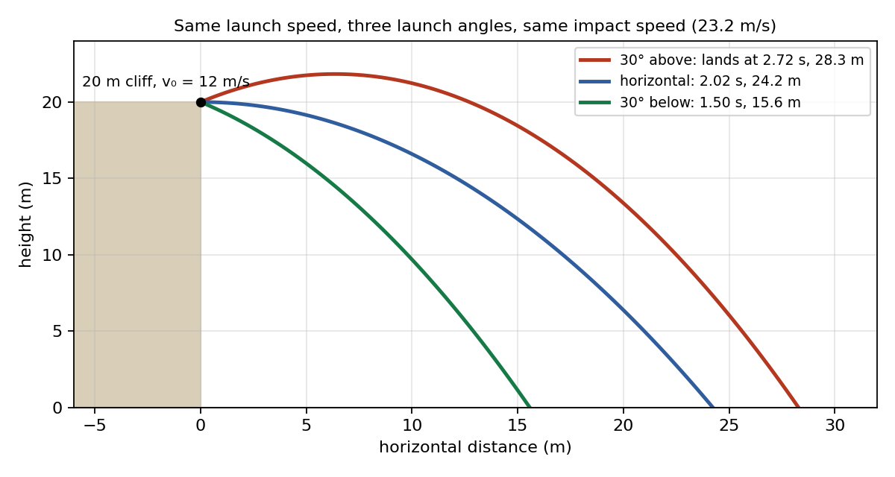
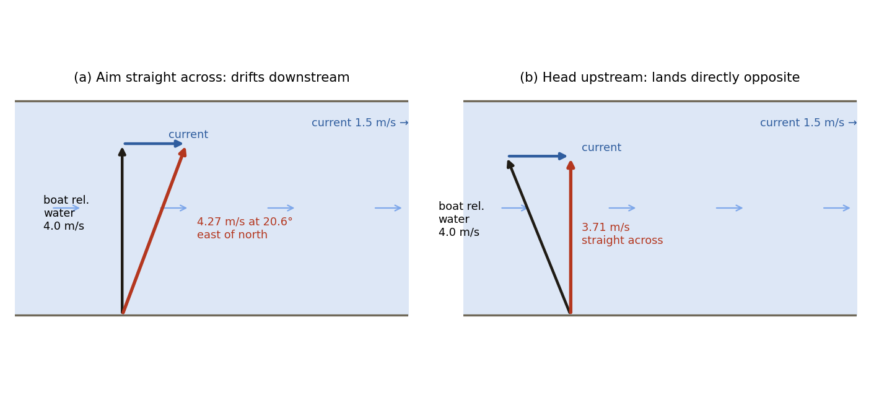
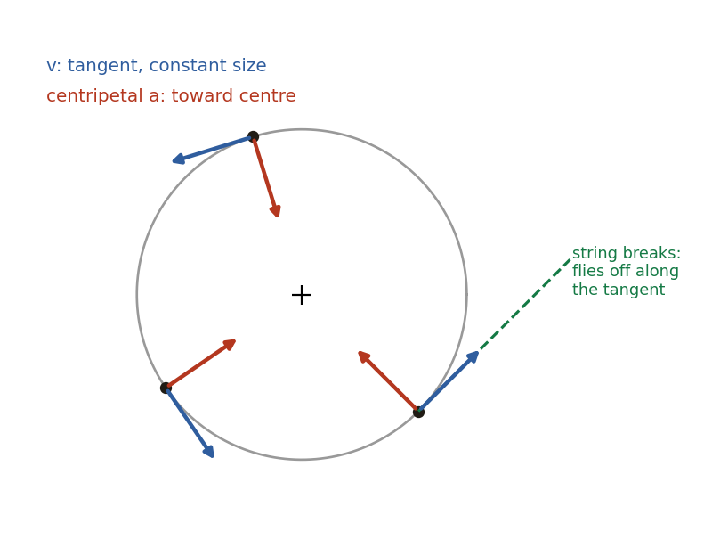

# Session 4 — 2D Kinematics II: Launches from a Height, Relative Velocity & Circular Motion

**Duration:** 45 minutes\
**Continues from:** Session 2, projectile motion (Wed 16 Sep). Session 3 was a one-off review for the school's Unit 1 test and adds no new content.\
**Grade-9 foundation:** Ch4 *Describing Motion Around Us*, §4.4 "Motion in a Plane" and §4.4.1 "Uniform circular motion" (distance vs displacement on a circle, average speed 2πR/T, why constant speed on a circle still means acceleration, Activity 4.5 "marble in a ring").\
**Grade-11 depth:** Glencoe *Physics: Principles and Problems* Ch6 "Motion in Two Dimensions":

- §6.1: the end of projectile motion, "Trajectories depend upon the viewer" and the launch-from-a-cliff problem
- §6.2: circular motion, including the centripetal-acceleration derivation
- §6.3: relative velocity

Hewitt *Conceptual Physics* adds §6.3 (tailwind/headwind velocity vectors), §6.8 (the fired-vs-dropped bullet, rifle angled up or down), §13.2 (linear vs rotational speed) and §13.4 (why "centrifugal force" is a misconception).\
**Why now:** Session 2's "next steps" note named exactly these threads: launches at an angle from a height, relative-velocity (river-crossing) problems, and the rest of Glencoe Ch6. Doing them finishes 2D kinematics before Forces.\
**g = 9.81 m/s²** throughout, matching the school.

---

## Lesson Plan

**Objectives.** By the end of this session the student should be able to:

1. Solve a projectile launched at an angle **from a height**, upward or downward. This is the one case Session 2 didn't cover, and it needs the quadratic formula.
2. Add velocities measured in different frames: `v(A rel. C) = v(A rel. B) + v(B rel. C)`. Apply it in a straight line (walking on a bus) and in 2D (a boat in a river, a plane in a crosswind).
3. Describe uniform circular motion: velocity is tangent, speed is constant, the object is still accelerating, and the acceleration `a = v²/r` points to the centre.

| Time | Segment |
| --- | --- |
| 0–5 min | Warm-up: 2 recall questions + walk through the formula sheet (Cases A and B) |
| 5–15 min | Part 1: angled launch from a height (derivation + worked example) |
| 15–27 min | Part 2: relative velocity (1D, then river crossing) |
| 27–40 min | Part 3: uniform circular motion (grade-9 picture, then the v²/r derivation) |
| 40–45 min | Exit ticket (3 quick questions), assign homework |

**Pacing note.** If you're behind at the 15-minute mark, skip the "launched downward" half of Worked Example 1 and just point to the figure. Don't cut the river-crossing example: it reuses the Session 2 independence idea and is the most common exam problem here.

---

## Warm-up (5 min)

1. *A ball is kicked at 20 m/s at 30° and again at 60°. Which lands farther? Which stays up longer?*
   → **Same range** (complementary angles, Session 2 Q10). The **60° kick stays up longer**, because it has the bigger vertical component.

2. *At the very top of a projectile's path, what is its acceleration?*
   → Still **g = 9.81 m/s² downward**. Only the vertical *velocity* is zero at the top.

---

## Formula Sheet — Projectile Motion (Session 2 recap, plus today's Case C)

*Keep this page in front of him for the whole session. In the warm-up, walk down Cases A and B once, asking "where did this line come from?" for each row, then start Part 1.*

### The starting point: three Session 1 equations

Every projectile formula below is one of these three, applied **separately** to the horizontal and vertical directions:

| Label | Equation | In words |
| ---- | -------------------- | ------------------------------------ |
| **S1** | `v = u + at` | final velocity = initial velocity + (acceleration × time) |
| **S2** | `s = ut + ½at²` | displacement = (initial velocity × time) + ½ × acceleration × time² |
| **S3** | `v² = u² + 2as` | links velocities and displacement without needing time |

**The two facts that let us split the motion:**

- **Horizontal (x):** there is no horizontal force, so `aₓ = 0`. The horizontal velocity never changes.
- **Vertical (y):** gravity is the only force, so the vertical acceleration is always `g = 9.81 m/s²`, pointing **down**.

Both directions share the **same time t**, and time is what connects them.

### Case A — Horizontal launch from a height

*Rolls or is thrown horizontally off a table, cliff or roof. Launch speed v₀ is horizontal, height is h. Sign convention (as in Session 2): **down is positive** for y.*

| Step | Formula | How it is derived | What it tells you |
| ---- | ------------------------- | ------------------------------ | ---------------------- |
| A1 | `vₓ = v₀` (constant) | aₓ = 0, so S1 gives `vₓ = v₀ + 0·t` | The horizontal speed stays v₀ the whole flight |
| A2 | `x = v₀t` | S2 horizontally: `u = v₀`, `a = 0` | Horizontal distance after time t |
| A3 | `y = ½gt²` | S2 vertically: `u = 0` (no initial vertical speed), `a = g` | Distance fallen after time t |
| A4 | `v_y = gt` | S1 vertically: `u = 0`, `a = g` | Downward speed after time t |
| A5 | `t = √(2h/g)` | Landing means it has fallen the full height: put `y = h` in A3, so `h = ½gt²`, then solve for t | **Time in the air.** Depends only on h, not on v₀ |
| A6 | `x = v₀·√(2h/g)` | Put the landing time A5 into A2 | **How far from the edge it lands** |
| A7 | `v_y = √(2gh)` at impact | Put A5 into A4. Or use S3 directly: `v_y² = 0 + 2gh` | Vertical speed just before hitting the ground |
| A8 | `v = √(v₀² + v_y²)`, angle below horizontal `= tan⁻¹(v_y / v₀)` | The components are perpendicular, so use Pythagoras and tan⁻¹ | **Total impact speed** and its direction |

**Case A in one line:** *the height sets the time (A5); the time sets the distance (A6).*

### Case B — Launched at an angle θ, landing at the same height

*Kicked or thrown upward from level ground. Launch speed v₀ at angle θ above the horizontal. Sign convention: **up is positive**, so the vertical acceleration is `−g`.*

| Step | Formula | How it is derived | What it tells you |
| ---- | ------------------------- | ------------------------------ | ---------------------- |
| B1 | `v₀ₓ = v₀cosθ` | v₀ is the hypotenuse of a right triangle, and the horizontal side is the *adjacent* side (CAH) | Starting horizontal speed. It stays constant for the whole flight |
| B2 | `v₀ᵧ = v₀sinθ` | The vertical side is the *opposite* side (SOH) | Starting vertical speed. Gravity changes it |
| B3 | `x(t) = v₀ₓ·t` | S2 horizontally: `u = v₀ₓ`, `a = 0` | Horizontal position at any time |
| B4 | `y(t) = v₀ᵧ·t − ½gt²` | S2 vertically: `u = v₀ᵧ`, `a = −g` | Height at any time |
| B5 | `v_y(t) = v₀ᵧ − gt` | S1 vertically: `u = v₀ᵧ`, `a = −g` | Vertical speed at any time. It is positive going up and negative coming down |
| B6 | `t_up = v₀ᵧ / g` | At the top the vertical speed is zero: set B5 to 0 and solve | **Time to reach the highest point** |
| B7 | `H = v₀ᵧ² / (2g)` | S3 vertically between launch and top: `0 = v₀ᵧ² − 2gH` | **Maximum height** |
| B8 | `T = 2v₀ᵧ / g` | Landing means back at launch height: set B4 to 0, giving `0 = t(v₀ᵧ − ½gt)`. Keep the non-zero root. Note that `T = 2 × t_up` | **Total time of flight** |
| B9 | `R = v₀ₓ·T = v₀² sin(2θ) / g` | Put T (B8) into B3, substitute B1 and B2, then use `2sinθcosθ = sin2θ` | **Range.** Largest at 45°. Angles that add up to 90° (e.g. 30° and 60°) give the same range |
| B10 | `v = √(vₓ² + v_y²)` | Pythagoras on the components at any instant | Speed at any moment. At the top it is just `v₀ₓ` |

**Case B in one line:** *split v₀ into components (B1–B2), use the vertical motion to find the times (B6, B8), then use the horizontal motion to find the range (B9).*

### Case C — Launched at an angle from a height *(new today, derived in Part 1)*

*The general case: angle θ **and** height h. Up is positive, and the origin is at ground level.*

| Step | Formula | How it is derived | What it tells you |
| ---- | ------------------------- | ------------------------------ | ---------------------- |
| C1 | `v₀ₓ = v₀cosθ`, `v₀ᵧ = v₀sinθ` | Same as B1–B2. For a **downward** launch, v₀ᵧ is negative | Starting components |
| C2 | `y(t) = h + v₀ᵧ·t − ½gt²` | Same as B4, but starting from height h instead of 0 | Height at any time |
| C3 | `t = [v₀ᵧ + √(v₀ᵧ² + 2gh)] / g` | Set C2 to 0 and solve the quadratic, keeping the positive root | **Time of flight** |
| C4 | `x = v₀ₓ·t` | Same as B3, using the time from C3 | **Landing distance** |
| C5 | `v_impact = √(v₀² + 2gh)` | `v_y² = v₀ᵧ² + 2gh` (from S3) plus the unchanged `vₓ²` | **Impact speed.** It does not depend on the angle |

**How the three cases fit together.** Case C is the master case:

- Put **θ = 0** (so `v₀ᵧ = 0`) and C3 becomes A5, `t = √(2h/g)`.
- Put **h = 0** and C3 becomes B8, `t = 2v₀ᵧ/g`.

So Cases A and B are just Case C with one of its ingredients switched off.

---

## Part 1 — Launched at an Angle from a Height (10 min)

Session 2 covered two special cases. **Case A** is a horizontal launch from a height (`v₀y = 0`). **Case B** is an angled launch that lands at the same height it started from. **Case C** is the general case, **both at once**: launched at angle θ from height h (Glencoe §6.1, Practice Problem 6).

### Derivation: time of flight

Put the origin at ground level with **up as positive**. The launch point is at y = h. Using `s = ut + ½at²` vertically with `u = v₀y = v₀sinθ` and `a = −g`:

`y(t) = h + v₀y·t − ½gt²`

Landing means y = 0:

`0 = h + v₀y·t − ½gt²`, which rearranges to `½g·t² − v₀y·t − h = 0`

This is a quadratic `at² + bt + c = 0` with `a = ½g`, `b = −v₀y`, `c = −h`. The quadratic formula gives:

`t = [v₀y ± √(v₀y² + 4·(½g)·h)] / (2·½g) = [v₀y ± √(v₀y² + 2gh)] / g`

The "−" root is negative, i.e. a time *before* the launch, so it is rejected. That leaves:

**`t = [v₀y + √(v₀y² + 2gh)] / g`**

**Check against Session 2.** For a horizontal launch, v₀y = 0, so `t = √(2gh)/g = √(2h/g)`. That is exactly the Session 2 formula. ✓

For a **downward** launch, v₀y is negative. The same formula works: just substitute the negative value.

### A result that surprises students: impact speed doesn't depend on the angle

The vertical velocity at impact comes from `v² = u² + 2as` in the vertical direction, over a fall of h below the launch point: `vy² = v₀y² + 2gh`. The horizontal velocity never changes, so vx² = v₀x². The total speed is:

`v² = vx² + vy² = (v₀x² + v₀y²) + 2gh = v₀² + 2gh`

So **`v_impact = √(v₀² + 2gh)`**, whatever the angle. The angle changes *when* and *where* the object lands, but not *how fast* it is going when it hits.

### Worked Example 1

A stone is thrown at 12 m/s from the top of a 20 m cliff. Compare throwing it (a) 30° above the horizontal and (b) 30° below the horizontal.

- Components: `v₀x = 12cos30° = 10.39 m/s`. For (a), `v₀y = +12sin30° = +6.0 m/s`; for (b), `v₀y = −6.0 m/s`.
- Time for (a): `t = [6.0 + √(6.0² + 2 × 9.81 × 20)] / 9.81 = [6.0 + √428.4] / 9.81 = (6.0 + 20.70) / 9.81 = 2.72 s`
- Time for (b): `t = [−6.0 + 20.70] / 9.81 = 1.50 s`
- Distance for (a): `x = 10.39 × 2.72 = 28.3 m`. Distance for (b): `x = 10.39 × 1.50 = 15.6 m`.
- Impact speed, both cases: `√(12² + 2 × 9.81 × 20) = √536.4 = 23.2 m/s` ✓ (same, as derived)

{width=85%}

**Link to Hewitt §6.8.** Compare each throw with a stone simply *dropped* from the cliff, which takes 2.02 s. Aimed **up**, the thrown stone lands *after* the dropped one. Aimed **down**, it lands *before*. Only a horizontal throw ties with the dropped stone, and that is the Session 2 "bullets land together" result.

---

## Part 2 — Relative Velocity (12 min)

### Motion depends on who is watching

Glencoe §6.1 ends with "trajectories depend upon the viewer." Toss a ball straight up while riding a bus and you see it go straight up and down. Someone on the pavement sees a **parabola**, because the ball, your hand and the bus all share the bus's horizontal velocity. A velocity only means something once you say **what it is measured relative to** (the frame of reference).

### The rule (Glencoe §6.3)

**`v(A rel. C) = v(A rel. B) + v(B rel. C)`**

This is a **vector** sum. The middle object B "chains" the two velocities together.

**In a straight line**, just add or subtract (Glencoe's bus, Hewitt's airplane in wind):

- You walk forward at 3 m/s on a bus going 8 m/s: `3 + 8 = 11 m/s` relative to the road.
- You walk toward the back instead: `−3 + 8 = 5 m/s` relative to the road.
- A plane flies at 100 km/h relative to the air. With a 20 km/h tailwind its ground speed is **120 km/h**. With a 20 km/h headwind it is **80 km/h** (Hewitt §6.3).

**In 2D** the vectors are at an angle, so draw the triangle and use Pythagoras plus tan⁻¹. This is the vector addition from Session 3.

### Worked Example 2: crossing a river

A river is 60 m wide and flows east at 1.5 m/s. A boat moves at 4.0 m/s *relative to the water*.

**(a) The boat points straight across (north).**

- Velocity relative to the ground: `v(boat rel. ground) = v(boat rel. water) + v(water rel. ground)`. The two vectors are perpendicular (4.0 m/s north and 1.5 m/s east), so the magnitude is `√(4.0² + 1.5²) = √18.25 = 4.27 m/s`.
- Direction: `tan⁻¹(1.5 / 4.0) = 20.6°` east of north, which is 69.4° in standard position.
- **Time to cross.** Only the *northward* component moves the boat across, and the current can't speed that up or slow it down. This is the same independence idea as Session 2: `t = 60 m ÷ 4.0 m/s = 15 s`.
- **Downstream drift** in that time: `1.5 m/s × 15 s = 22.5 m` east of the point directly opposite.

**(b) Where must it point to land directly opposite?**

- The *resultant* now has to point straight north, so the boat must aim partly upstream to cancel the current. The boat's 4.0 m/s is now the **hypotenuse**.
- Heading: `sinφ = 1.5 / 4.0`, so `φ = 22.0°` west of north (upstream).
- Speed across: `√(4.0² − 1.5²) = √13.75 = 3.71 m/s`
- Time: `60 ÷ 3.71 = 16.2 s`. Landing opposite costs extra time.

{width=95%}

**Check yourself.** If the current were faster than the boat, `sinφ` would be greater than 1, so there is no solution: the boat *cannot* land directly opposite. This is Practice Problem 6.

---

## Part 3 — Uniform Circular Motion (13 min)

### The grade-9 picture (Class 9 Ch4 §4.4.1)

- A child on a merry-go-round of radius R travels a **distance of 2πR** per revolution, but ends up where they started, so the **displacement is 0**.
- If one revolution takes time T (the **period**), then `average speed = 2πR / T` (Eq. 4.5). The average velocity over a full revolution is 0.
- **Uniform circular motion** means moving in a circle at constant speed. The *speed* is constant, but the *direction* of the velocity changes continuously. The book shows this by imagining a track with 4 sides, then 6, then more and more, until it becomes a circle.
- **So the object is accelerating**, even at constant speed, because acceleration is any change in *velocity*, and that includes a change of direction. As the book puts it: "In uniform circular motion, the motion of the object is accelerated because the direction of its velocity continuously changes."
- **The velocity at any point is along the tangent** to the circle.

### Activity 4.5 (the book's demo; do it with any ring and a marble)

Roll a marble around the inside of a tape ring, then lift the ring away. The marble **leaves in a straight line along the tangent**. It does not fly outward.

The reason is **Newton's First Law of Motion**: an object at rest stays at rest, and an object in motion keeps moving with the same speed in the same direction, unless a net external force acts on it. Mathematically: **if `F_net = 0`, then `a = 0` and `v` is constant.** Once the ring stops pushing, nothing turns the marble, so it continues in the direction it was moving at that instant, which is the tangent.

Hewitt §13.4 makes the same point with a can whirled on a string. When the string breaks the can goes off tangent to the circle, which is why "centrifugal (outward) force" is a misconception. Glencoe calls it "a fictitious, nonexistent force."

{width=60%}

### Derivation: centripetal acceleration `a = v²/r` (Glencoe §6.2)

1. Take two nearby positions on the circle, with position vectors **r₁** and **r₂** from the centre. They have the same length r. The displacement between them is Δr.
2. The velocities there, **v₁** and **v₂**, have the same length v, and each is at 90° to its position vector. So the angle between v₁ and v₂ equals the angle between r₁ and r₂.
3. That means the triangle formed by (r₁, r₂, Δr) and the triangle formed by (v₁, v₂, Δv) are **similar**: both are isosceles with the same apex angle. Corresponding sides are in the same ratio: `Δr / r = Δv / v`.
4. Divide both sides by Δt: `(1/r)(Δr/Δt) = (1/v)(Δv/Δt)`.
5. Now `Δr/Δt = v` (the speed) and `Δv/Δt = a` (the acceleration), so `v / r = a / v`.
6. Therefore **`a_c = v² / r`**, pointing toward the **centre** because Δv points inward. "Centripetal" means centre-seeking.

**Period form.** Substitute the grade-9 result `v = 2πr / T`:

`a_c = (2πr/T)² / r = 4π²r / T²`

**Where the force comes in (a preview of Forces).** **Newton's Second Law of Motion** says the acceleration of an object is directly proportional to the net force on it, inversely proportional to its mass, and in the same direction as the net force: **`F_net = m·a`**. So a circling object must have a net force pointing to the centre: **`F_net = m·v²/r`**. This is called the *centripetal force*. It is not a new kind of force: it is whatever real force is doing the pulling, such as string tension, friction on a car's tyres, or gravity on the Moon.

### Linear speed vs rotational speed (Hewitt §13.2)

Every point on a merry-go-round turns at the **same rotational speed** (revolutions per minute), but points farther out travel a bigger circle in the same time. So **linear speed is proportional to r**: twice as far out means twice as fast.

### Worked Example 3

A child sits 3.0 m from the centre of a merry-go-round that makes one revolution every 6.0 s.

- Distance per revolution: `2π × 3.0 = 18.8 m`. Displacement per revolution: 0.
- Speed: `v = 2πr / T = 18.8 / 6.0 = 3.14 m/s`
- Centripetal acceleration: `a_c = v²/r = 3.14² / 3.0 = 3.29 m/s²`, toward the centre. Check with the period form: `4π² × 3.0 / 6.0² = 3.29 m/s²` ✓
- Her brother sits at 1.5 m. His speed is `3.14 / 2 = 1.57 m/s` and his acceleration is `1.57² / 1.5 = 1.64 m/s²`. Same RPM, half the speed.

---

## Exit Ticket (3 min)

1. *A swimmer aims straight across a river. Does a faster current change how long she takes to cross?* → **No.** Only her across-component matters. The current changes where she lands, not when.
2. *A car goes round a roundabout at a steady 10 m/s. Is it accelerating?* → **Yes.** Its direction is changing, so `a_c = v²/r` toward the centre.
3. *A stone is thrown from a cliff at the same speed, once aimed up and once aimed down. Which hits the ground faster?* → **Neither.** They land at the same speed, `√(v₀² + 2gh)`.

---

## Practice Problems

*Use g = 9.81 m/s². Do Q1, Q5 and Q8 in class if time allows; the rest are homework.*

1. **Angled launch from a height:** A ball is thrown at 15 m/s at 40° above the horizontal from the top of a 25 m building. Find (a) the time until it hits the ground, (b) how far from the building it lands, (c) its impact speed, (d) the maximum height above the ground it reaches.
2. **Downward launch:** The same ball is thrown at 15 m/s but 40° *below* the horizontal. Find the time and the horizontal distance. Compare the impact speed with Q1.
3. **Relative velocity on a train:** A train moves east at 25 m/s. A passenger walks at 2.0 m/s (a) toward the front, (b) toward the back. Find the passenger's velocity relative to the ground in each case.
4. **Finding the current (Glencoe-style):** A boat is rowed directly upstream at 3.0 m/s relative to the water. People on the bank see it move upstream at only 1.2 m/s. How fast is the river flowing?
5. **Crosswind (Glencoe §6.3):** A plane flies due north at 150 km/h relative to the air. A wind blows east at 75 km/h. Find the plane's velocity relative to the ground (magnitude and direction).
6. **Swimmer vs current:** A river is 80 m wide with a 2.0 m/s current. A swimmer who can swim 1.2 m/s aims straight across. (a) How long does she take? (b) How far downstream does she land? (c) Could she land directly opposite by aiming upstream? Explain.
7. **Aiming upstream:** A boat moves at 5.0 m/s relative to the water in a 100 m wide river with a 3.0 m/s current. At what angle upstream must it head to land directly opposite, and how long does the crossing take?
8. **Centripetal acceleration (Glencoe §6.2):** A runner moving at 8.8 m/s rounds a bend of radius 25 m. Find the runner's centripetal acceleration and state its direction.
9. **Merry-go-round (grade-9 + grade-11):** A child sits 4.0 m from the centre of a merry-go-round that turns once every 8.0 s. Find (a) the distance per revolution, (b) the speed, (c) the centripetal acceleration, (d) the displacement and average velocity over *half* a revolution.
10. **Conceptual:** (a) A stone whirled in a horizontal circle is released at the moment it is heading due east. Which way does it go, and which law explains it? (b) "An object moving at constant speed can't be accelerating." True or false? Explain.

---

## Answer Key — Full Step-by-Step Solutions

**1. Angled launch from a height**

- Step 1 (components): `v₀x = 15cos40° = 11.49 m/s`; `v₀y = 15sin40° = 9.64 m/s`.
- Step 2 (time, from the derived formula): `t = [v₀y + √(v₀y² + 2gh)] / g = [9.64 + √(9.64² + 2 × 9.81 × 25)] / 9.81 = [9.64 + √583.5] / 9.81 = (9.64 + 24.16) / 9.81 = 3.45 s`.
- Step 3 (distance): `x = v₀x·t = 11.49 × 3.45 = 39.6 m`.
- Step 4 (impact speed): `v = √(v₀² + 2gh) = √(225 + 490.5) = √715.5 = 26.7 m/s`.
- Step 5 (max height): the rise above the roof is `v₀y² / (2g) = 9.64² / 19.62 = 4.74 m`, so the maximum height is `25 + 4.74 = 29.7 m` above the ground.

**Answer: 3.45 s; 39.6 m; 26.7 m/s; 29.7 m.**

**2. Downward launch**

- Step 1: now `v₀y = −9.64 m/s` (downward). `v₀x = 11.49 m/s` as before.
- Step 2: `t = [−9.64 + 24.16] / 9.81 = 14.52 / 9.81 = 1.48 s`.
- Step 3: `x = 11.49 × 1.48 = 17.0 m`.
- Step 4: impact speed `= √(v₀² + 2gh) = 26.7 m/s`, the same as Q1.

**Answer: 1.48 s, 17.0 m, and the same impact speed (26.7 m/s).**

**3. Relative velocity on a train**

- Step 1: `v(passenger rel. ground) = v(passenger rel. train) + v(train rel. ground)`. Take east as +.
- Step 2 (a): `+2.0 + 25 = 27 m/s` east.
- Step 3 (b): `−2.0 + 25 = 23 m/s` east. The passenger still moves east relative to the ground, just more slowly.

**Answer: (a) 27 m/s east; (b) 23 m/s east.**

**4. Finding the current**

- Step 1: take upstream as +. `v(boat rel. bank) = v(boat rel. water) + v(water rel. bank)`.
- Step 2: `+1.2 = +3.0 + v(water rel. bank)`, so `v(water rel. bank) = −1.8 m/s`.
- Step 3: the minus sign means the water flows downstream, against the boat.

**Answer: 1.8 m/s, flowing against the boat.**

**5. Crosswind**

- Step 1: the two velocities are perpendicular, so `|v| = √(150² + 75²) = √28125 = 168 km/h`.
- Step 2: `tan⁻¹(75/150) = 26.6°` east of north. In standard position that is `90° − 26.6° = 63.4°`.

**Answer: 168 km/h at 26.6° east of north (63.4°).**

**6. Swimmer vs current**

- Step 1 (a): only her across-component matters, so `t = 80 / 1.2 = 66.7 s`.
- Step 2 (b): drift `= 2.0 × 66.7 = 133 m` downstream.
- Step 3 (c): to land opposite she would need `sinφ = v_current / v_swimmer = 2.0 / 1.2 = 1.67`. No angle has a sine greater than 1, so it is impossible. The current is faster than she can swim, so she will always be carried downstream.

**Answer: 66.7 s; 133 m; no, because the current is faster than she is.**

**7. Aiming upstream**

- Step 1: the resultant must point straight across, so the boat's 5.0 m/s is the hypotenuse. `sinφ = 3.0 / 5.0 = 0.6`, which gives `φ = 36.9°` upstream of straight across.
- Step 2: speed across `= √(5.0² − 3.0²) = √16 = 4.0 m/s`.
- Step 3: time `= 100 / 4.0 = 25 s`.

**Answer: head 36.9° upstream; the crossing takes 25 s.**

**8. Centripetal acceleration**

- Step 1: `a_c = v²/r = 8.8² / 25 = 77.44 / 25 = 3.1 m/s²`.
- Step 2: the direction is toward the centre of the bend. (Friction from the track on the runner's shoes supplies the force.)

**Answer: 3.1 m/s², toward the centre of the curve.**

**9. Merry-go-round**

- Step 1 (a): `2πr = 2π × 4.0 = 25.1 m`.
- Step 2 (b): `v = 25.1 / 8.0 = 3.14 m/s`.
- Step 3 (c): `a_c = v²/r = 3.14² / 4.0 = 2.47 m/s²`. Check: `4π²r/T² = 4π² × 4.0 / 64 = 2.47 m/s²` ✓
- Step 4 (d): after half a revolution the child is on the opposite side, so the displacement is one **diameter**, `2 × 4.0 = 8.0 m`. That took `T/2 = 4.0 s`, so the average velocity is `8.0 / 4.0 = 2.0 m/s`. Compare the average speed over the same interval: `(25.1/2) / 4.0 = 3.14 m/s`, which is larger, as NCERT says it always is.

**Answer: 25.1 m; 3.14 m/s; 2.47 m/s² toward the centre; 8.0 m and 2.0 m/s.**

**10. Conceptual**

- (a) **Due east, in a straight line** (along the tangent at the moment of release), falling under gravity as it goes. By Newton's First Law, with no string force there is nothing to change its horizontal direction, so it keeps the velocity it had at release.
- (b) **False.** Acceleration is any change in *velocity*, which includes direction. In uniform circular motion the speed is constant but the direction changes continuously, so there is an acceleration `v²/r` toward the centre.

---

## Notes for next session

2D kinematics is now complete: projectiles in every configuration, relative velocity and uniform circular motion. **Forces (Newton's laws) comes next.** Circular motion gives a natural bridge. `F_net = m·v²/r` has already appeared, so Session 5 can begin with free-body diagrams: "what real force supplies the centripetal force here?" (string, friction, gravity). Class 9 Ch6 *How Forces Affect Motion* is the grade-9 foundation for that.
