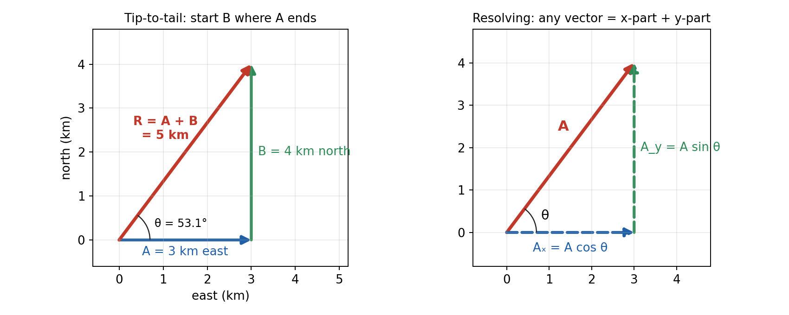
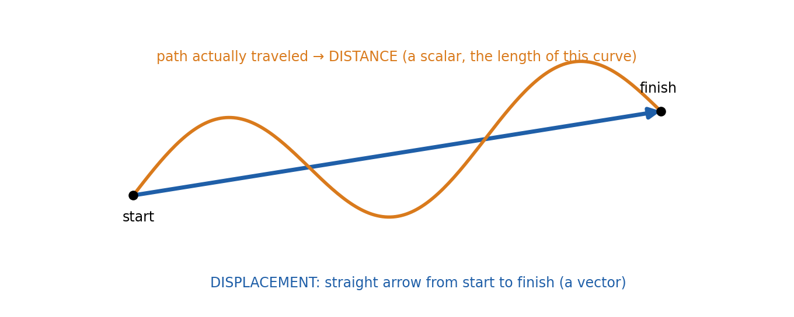
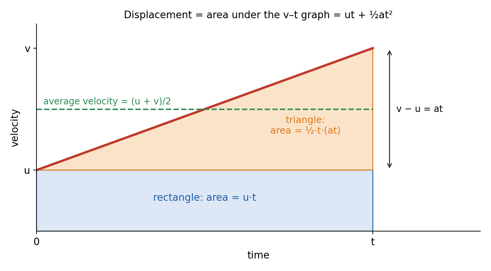
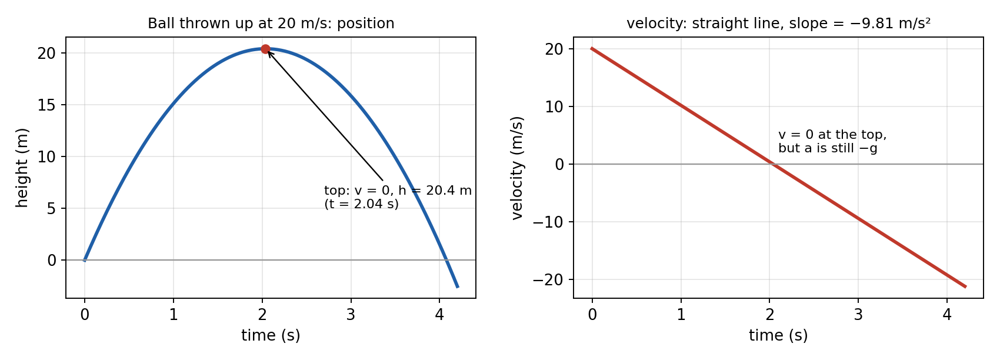

# Session 1 — Vectors from Scratch and Motion in a Straight Line: The Kinematic Equations

**Duration:** 60 minutes. It splits cleanly into two 30-minute halves: vectors, then kinematics.\
**Position in the course:** the first Physics session. Everything after it builds on this one: Session 2's projectiles, Session 4's relative velocity and Sessions 5–6's forces.\
**Grade-9 foundation:** Class 9 Ch4 *Describing Motion Around Us*: distance vs displacement, speed vs velocity, acceleration, the equations of uniformly accelerated motion. *The Class 9 PDF is on the Mac and wasn't reachable today, so section numbers from it are left out.*\
**Grade-11 depth:** Glencoe *Physics: Principles and Problems*:

- Ch2 "Representing Motion": position, displacement, velocity
- Ch3 "Accelerated Motion": §3.1 Acceleration, §3.2 Motion with Constant Acceleration, §3.3 Free Fall
- Ch5 §5.1 "Vectors": adding vectors, and components

Hewitt *Conceptual Physics* adds Ch2 §2.1–2.6 (motion is relative, speed, velocity, acceleration, free fall "how fast" and "how far") and Ch6 §6.1–6.4 (vector and scalar quantities, adding vectors geometrically).\
**g = 9.81 m/s²** throughout, matching the school.

---

## Lesson Plan

**Objectives.** By the end of this session the student should be able to:

1. Tell **scalars** from **vectors**, add vectors tip-to-tail, and find a resultant's size and direction with Pythagoras and tangent.
2. **Resolve** a vector into x- and y-components, and add vectors by components.
3. Tell **distance** from **displacement** and **speed** from **velocity**, and find average speed, average velocity and acceleration.
4. **Derive** the kinematic equations for constant acceleration and choose the right one for a problem.
5. Solve **free-fall** problems with a = −g.

| Time | Segment |
| --- | --- |
| 0–5 min | Warm-up: "How far and which way?" |
| 5–25 min | Part 1: vectors from scratch (scalars vs vectors, adding, components) |
| 25–35 min | Part 2: describing motion (distance, displacement, speed, velocity, acceleration) |
| 35–52 min | Part 3: the kinematic equations, derived one from another, with worked examples |
| 52–57 min | Part 4: free fall |
| 57–60 min | Exit ticket, assign homework |

**Pacing note.** If time is short, keep the derivations in Part 3 (they are the heart of the session) and set component addition (Worked Example 3) and free fall as reading plus homework.

---

## Warm-up (5 min)

1. *You walk 3 km east, then 4 km north. How far did you walk? How far are you from where you started?*
   → You **walked 7 km** (distance), but you're only **5 km** from the start (displacement). The difference between "how far along the path" and "how far and which way" is the whole idea of vectors.

2. *A car's speedometer reads a steady 60 km/h as it goes around a bend. Is its velocity constant?*
   → **No.** The speed is constant but the direction changes, so the velocity changes. Velocity is a vector.

---

## Formula Sheet — Session 1

| Label | Equation | In words |
| --- | --- | --- |
| **V1** | `R = √(A² + B²)`, `tanθ = B/A` | resultant of two perpendicular vectors |
| **V2** | `Aₓ = A cosθ`, `A_y = A sinθ` | components (θ measured from the x-axis) |
| **V3** | `Rₓ = Aₓ + Bₓ`, `R_y = A_y + B_y` | add vectors by adding their components |
| **K1** | `average speed = distance / time` | a scalar |
| **K2** | `v_avg = Δx / Δt` (displacement / time) | a vector |
| **K3** | `a = Δv / Δt = (v − u)/t` | acceleration: change in velocity per second |
| **S0** | `s = v_avg × t = ½(u + v)t` | distance/displacement = average velocity × time (constant a) |
| **S1** | `v = u + at` | final velocity |
| **S2** | `s = ut + ½at²` | displacement after time t |
| **S3** | `v² = u² + 2as` | links speed and displacement, with no time |
| **FF** | `a = −g = −9.81 m/s²` (up positive) | free fall |

**Symbols:** u = initial velocity, v = final velocity, a = acceleration (constant), t = time, s = displacement.

---

## Part 1 — Vectors from Scratch (20 min)

### Scalars and vectors (Hewitt §6.1, Glencoe §5.1)

A **scalar** has only a size (magnitude) and a unit. A **vector** has a size **and a direction**.

| Scalars (size only) | Vectors (size + direction) |
| --- | --- |
| distance (m) | displacement (m, east) |
| speed (m/s) | velocity (m/s, north) |
| time (s), mass (kg) | acceleration (m/s², down) |
| temperature, energy | force (N, to the left) |

**How a vector is drawn:** an **arrow**. Its **length** shows the size (to a chosen scale) and its **direction** shows the direction. In print a vector is written in bold (**A**) or with an arrow over the letter. Plain A means just its size.

**Two useful facts:**

- Two vectors are **equal** if they have the same size and the same direction, wherever they are drawn.
- **−A** is the same size as **A** but points the opposite way. In one dimension, direction is just a **sign**: choose a positive direction (east, or up) and make the opposite way negative.

### Adding vectors in one dimension

Along a line, add the signs. Walk 5 m east, then 2 m west, with east positive: `+5 + (−2) = +3 m`, so the displacement is 3 m east.

### Adding vectors in two dimensions: tip-to-tail (Hewitt §6.4)

To add **A + B**, draw A, then start B at the **tip** of A. The **resultant R** runs from the tail of A to the tip of B. The order doesn't matter: A + B = B + A.

{width=100%}

**When A and B are perpendicular** they form a right triangle with R as the hypotenuse:

- **Size (Pythagoras):** `R = √(A² + B²)`
- **Direction:** `tanθ = B/A`, so `θ = tan⁻¹(B/A)`, measured from A.

### Worked Example 1: the warm-up walk

3 km east then 4 km north.

- `R = √(3² + 4²) = √25 = 5 km`.
- `θ = tan⁻¹(4/3) = 53.1°`.

**Answer: 5 km at 53.1° north of east.** Distance walked = 7 km, but displacement = 5 km.

**The range of possible answers.** Two vectors of sizes A and B can give any resultant from `A − B` (pointing opposite ways) to `A + B` (the same way). For 3 and 4 the resultant can be anything from 1 to 7. It is 5 only when they are perpendicular.

### Resolving a vector into components

Any vector can be replaced by two perpendicular vectors, its **components**, that add up to it. This is the reverse of adding. If **A** makes angle θ with the x-axis, then from the right triangle:

- `cosθ = adjacent/hypotenuse = Aₓ/A`, so **`Aₓ = A cosθ`**
- `sinθ = opposite/hypotenuse = A_y/A`, so **`A_y = A sinθ`**

Check: `Aₓ² + A_y² = A²(cos²θ + sin²θ) = A²` ✓

**Worked Example 2.** A ball is kicked at 20 m/s at 30° above the horizontal. Find the components of its velocity.

- `vₓ = 20 cos30° = 20 × 0.866 = 17.3 m/s` (horizontal)
- `v_y = 20 sin30° = 20 × 0.500 = 10.0 m/s` (vertical)

This is exactly how Session 2 splits a projectile's launch velocity.

### Adding any vectors by components

For vectors that are **not** perpendicular, don't draw a messy triangle. Instead:

1. Resolve each vector into x and y components.
2. Add all the x's, and add all the y's: `Rₓ = Aₓ + Bₓ`, `R_y = A_y + B_y`.
3. Recombine: `R = √(Rₓ² + R_y²)` and `θ = tan⁻¹(R_y/Rₓ)`.

**Worked Example 3.** A boat moves 10 m east, then 6 m at 60° north of east. Find the total displacement.

- A: `Aₓ = 10`, `A_y = 0`.
- B: `Bₓ = 6 cos60° = 3.0`, `B_y = 6 sin60° = 5.20`.
- `Rₓ = 13.0 m`, `R_y = 5.20 m`.
- `R = √(13.0² + 5.20²) = √(169 + 27) = √196 = 14.0 m`.
- `θ = tan⁻¹(5.20/13.0) = 21.8°`.

**Answer: 14.0 m at 21.8° north of east.**

---

## Part 2 — Describing Motion (10 min)

### Motion is relative (Hewitt §2.1)

Every position and velocity is measured from a **reference point**. You sit still in a bus, but you are moving at 60 km/h relative to the road. Session 4 returns to this idea.

### Distance vs displacement

- **Distance** is the length of the path actually traveled. It is a **scalar** and never negative.
- **Displacement** is the straight-line change in position, from start to finish. It is a **vector**: `Δx = x_final − x_initial`.

{width=90%}

The size of the displacement is **never more** than the distance. The two are equal only for a straight-line trip in one direction. A runner who completes one lap of a 400 m track has run **400 m** but has a displacement of **zero**.

### Speed vs velocity (Hewitt §2.2–2.3)

- **Average speed** = total distance / total time (scalar).
- **Average velocity** = displacement / time, `v_avg = Δx/Δt` (vector).
- **Instantaneous** speed or velocity is the value at one moment: what the speedometer shows.

Units: m/s (SI), km/h, mph. To convert **km/h → m/s, divide by 3.6** (because 1 km/h = 1000 m / 3600 s). For example, 90 km/h = 25 m/s.

**Worked Example 4.** A runner completes one lap of a 400 m track in 80 s. Find the average speed and average velocity.

- Average speed = `400/80 = 5.0 m/s`.
- Average velocity = `0/80 = 0 m/s`: back at the start, so the displacement is zero.

### Acceleration (Hewitt §2.4, Glencoe §3.1)

**Acceleration** is the rate of change of **velocity**:

`a = Δv/Δt = (v − u)/t`,  unit **m/s²** ("meters per second, every second")

Because velocity is a vector, you accelerate when you **speed up, slow down or change direction**.

**Sign rule.** If a and v point the **same** way, the object **speeds up**. If they point **opposite** ways, it **slows down**. "Negative acceleration" means "acceleration in the negative direction". It only means slowing down if the object is moving in the positive direction.

---

## Part 3 — The Kinematic Equations (17 min)

These hold only when the **acceleration is constant**. Each is derived from the one before, so the student never has to memorize them blindly.

### S1 from the definition of acceleration

Start from `a = (v − u)/t`. Multiply both sides by t: `at = v − u`. So:

**`v = u + at`**  (S1)

The velocity changes by the same amount, `a`, every second, so v grows linearly with t.

### S0: distance = average velocity × time

For any motion, displacement = average velocity × time. When a is constant, v rises in a straight line from u to v, so its average is exactly halfway:

`v_avg = (u + v)/2`, so  **`s = ½(u + v)t`**  (S0)

This is the equation the student used first: "distance = average velocity × time".

### S2: substitute S1 into S0

Replace v in S0 with `u + at`:

`s = ½(u + u + at)t = ½(2u + at)t = ut + ½at²`

**`s = ut + ½at²`**  (S2)

**The same result from the graph.** The displacement is the **area under the v–t graph**. That area splits into a rectangle (`u × t`) and a triangle (`½ × t × at`):

{width=85%}

### S3: eliminate time

Some problems give no time at all. From S1, `t = (v − u)/a`. Substitute into S0:

`s = ½(u + v) × (v − u)/a = (v² − u²)/(2a)`

Multiply both sides by 2a:

**`v² = u² + 2as`**  (S3)

### Choosing the equation

Each equation leaves out one of the five quantities. Pick the one that leaves out the quantity you are **neither given nor asked for**.

| Equation | Leaves out | Use when… |
| --- | --- | --- |
| S1 `v = u + at` | s | no distance involved |
| S0 `s = ½(u + v)t` | a | no acceleration involved |
| S2 `s = ut + ½at²` | v | no final velocity involved |
| S3 `v² = u² + 2as` | t | no time involved |

**Method:** (1) choose a positive direction; (2) list u, v, a, s, t with signs, writing "?" for the unknown; (3) pick the equation; (4) substitute and solve; (5) check the units and whether the answer is sensible.

### Worked Example 5: speeding up

A car goes from rest to 25 m/s in 5.0 s. Find its acceleration and the distance covered.

- Known: `u = 0`, `v = 25 m/s`, `t = 5.0 s`.
- S1: `a = (25 − 0)/5.0 = 5.0 m/s²`.
- S0: `s = ½(0 + 25)(5.0) = 62.5 m`. Check with S2: `0 + ½ × 5.0 × 25 = 62.5 m` ✓

**Answer: 5.0 m/s²; 62.5 m.**

### Worked Example 6: braking distance

A car moving at 30 m/s brakes with an acceleration of −6.0 m/s². How far does it travel before stopping, and how long does it take?

- Forward is positive. Known: `u = 30`, `v = 0`, `a = −6.0`. Asked: s and t.
- S3: `0 = 30² + 2(−6.0)s`, so `s = 900/12 = 75 m`.
- S1: `0 = 30 + (−6.0)t`, so `t = 5.0 s`.

**Answer: 75 m; 5.0 s.** Double the speed and the stopping distance goes up **four** times (s ∝ u²). That is why speed limits matter.

---

## Part 4 — Free Fall (5 min)

### Free fall (Hewitt §2.5–2.6, Glencoe §3.3)

Without air resistance, every object near Earth's surface accelerates downward at **g = 9.81 m/s²**, whatever its mass. Take **up as positive**, so **a = −9.81 m/s²** in every free-fall problem, whether the object is going up, at the top, or coming down. The four equations are unchanged.

**Useful results for an object thrown straight up at speed u:**

- At the top, `v = 0`. From S1: `t_top = u/g`.
- From S3: `0 = u² − 2g·h`, so **`h_max = u²/(2g)`**.
- By symmetry it takes as long to fall as to rise, and it returns to your hand at the same speed it left with.

{width=100%}

**Worked Example 7.** A ball is thrown straight up at 15 m/s. Find (a) the maximum height, (b) the time to reach it, (c) the total time in the air.

- **(a)** `h = u²/(2g) = 15²/(2 × 9.81) = 225/19.62 = 11.5 m`.
- **(b)** `t = u/g = 15/9.81 = 1.53 s`.
- **(c)** By symmetry, `2 × 1.53 = 3.06 s`.

---

## Exit Ticket (3 min)

1. *Two forces of 6 N and 8 N act on an object. What are the largest and smallest possible resultants?* → **14 N** (same direction) and **2 N** (opposite directions). 10 N only if they are perpendicular.
2. *Which equation would you use to find how fast a car is going after 100 m, given u and a but not t?* → **S3**, `v² = u² + 2as` (no time).
3. *At the top of its flight, what are a ball's velocity and acceleration?* → `v = 0`, but `a = 9.81 m/s²` **downward**. It never stops accelerating.

---

## Practice Problems

*Use g = 9.81 m/s². Conceptual questions C1–C7, numerical questions N1–N12. Do C3, N3 and N8 in class if time allows; the rest are homework.*

### Conceptual

**C1.** Sort into scalars and vectors: mass, displacement, speed, velocity, time, acceleration, force, distance, temperature.

**C2.** (a) Can the size of an object's displacement ever be greater than the distance it traveled? (b) Can the distance be non-zero while the displacement is zero? Give an example.

**C3.** Two vectors have sizes 6 units and 8 units. (a) What is the largest possible resultant? (b) The smallest? (c) At what angle between them is the resultant 10 units?

**C4.** Can an object have zero velocity and still be accelerating? Give an example.

**C5.** A car travels around a circular track at a steady 60 km/h. Is its (a) speed constant, (b) velocity constant, (c) acceleration zero? Explain.

**C6.** "A negative acceleration always means the object is slowing down." True or false? Give an example.

**C7.** Explain why the displacement in the equations of motion equals the area under the velocity–time graph.

### Numerical

**N1.** A hiker walks 5 m east and then 12 m north. Find the size and direction of her displacement.

**N2.** A rope pulls a sled with a force of 50 N at 37° above the horizontal. Find the horizontal and vertical components of the force.

**N3.** A boat travels 10 m east and then 6 m at 60° north of east. Using components, find the resultant displacement. (Compare with Worked Example 3.)

**N4.** A family drives 120 km to a city in 1.5 h and returns home by the same road in 2.5 h. Find (a) the average speed for the round trip, (b) the average velocity for the round trip.

**N5.** Convert (a) 90 km/h to m/s, (b) 15 m/s to km/h.

**N6.** A cyclist speeds up uniformly from 4.0 m/s to 10 m/s in 3.0 s. Find (a) the acceleration, (b) the distance covered, using "distance = average velocity × time".

**N7.** A plane starts from rest and accelerates at 3.2 m/s². It needs 80 m/s to take off. Find (a) the minimum runway length, (b) the time on the runway.

**N8.** A car moving at 20 m/s brakes at 4.0 m/s². Find (a) the time to stop, (b) the stopping distance, (c) the distance covered in the first 2.0 s of braking.

**N9.** A stone is dropped from rest off a 45 m cliff. Find (a) the time to reach the bottom, (b) its speed on impact.

**N10.** A ball is thrown straight up at 20 m/s. Find (a) the maximum height, (b) the time to reach it, (c) its velocity after 3.0 s, (d) its height after 3.0 s.

**N11.** A car accelerates from rest at 2.0 m/s² for 10 s, then travels at constant velocity for 20 s, then brakes uniformly to a stop in 5.0 s. Find (a) the total distance, (b) the average velocity for the whole trip.

**N12.** A driver moving at 25 m/s sees a hazard. Her reaction time is 0.80 s, and then the car brakes at 5.0 m/s². Find the total distance from seeing the hazard to stopping.

---

## Answer Key — Full Step-by-Step Solutions

### Conceptual

**C1.**

- **Scalars:** mass, speed, time, distance, temperature.
- **Vectors:** displacement, velocity, acceleration, force.

**C2.**

- **(a)** **No.** The straight line is the shortest path between two points, so the size of the displacement is at most the distance. They are equal only for straight-line motion in one direction.
- **(b)** **Yes.** One lap of a 400 m track: distance 400 m, displacement 0. The same goes for any round trip.

**C3.**

- **(a)** Same direction: `6 + 8 = 14` units.
- **(b)** Opposite directions: `8 − 6 = 2` units.
- **(c)** `6² + 8² = 36 + 64 = 100 = 10²`, so by Pythagoras they must be at **90°**.

**C4.** **Yes.** A ball thrown straight up has `v = 0` for an instant at the top, but its acceleration is still `9.81 m/s²` downward. That is why it immediately starts to fall.

**C5.**

- **(a)** **Yes**, the speed is constant (60 km/h).
- **(b)** **No.** Its direction keeps changing, so its velocity (a vector) changes.
- **(c)** **No.** A changing velocity means a non-zero acceleration. Session 4 shows it is `v²/r`, toward the center.

**C6.** **False.** Negative acceleration means the acceleration points in the negative direction. A ball **falling** (taking up as positive) has negative velocity and negative acceleration, and it is **speeding up**. An object slows down only when a and v have opposite signs.

**C7.** Over a tiny time interval Δt the velocity is almost constant, so the displacement in that interval is `v × Δt`: the area of a thin strip under the graph. Adding up all the strips gives the total area, and the total displacement. For constant acceleration the area is a rectangle `ut` plus a triangle `½at²`, which is S2.

### Numerical

**N1.**

- `R = √(5² + 12²) = √(25 + 144) = √169 = 13 m`.
- `θ = tan⁻¹(12/5) = 67.4°`.

**Answer: 13 m at 67.4° north of east.**

**N2.**

- Horizontal: `Fₓ = 50 cos37° = 50 × 0.799 = 39.9 N`.
- Vertical: `F_y = 50 sin37° = 50 × 0.602 = 30.1 N`.
- Check: `√(39.9² + 30.1²) = √(1592 + 906) = √2498 = 50.0 N` ✓

**Answer: 39.9 N horizontal; 30.1 N vertical.**

**N3.**

- First vector: `(10, 0)`. Second: `(6 cos60°, 6 sin60°) = (3.0, 5.20)`.
- `Rₓ = 13.0 m`, `R_y = 5.20 m`.
- `R = √(13.0² + 5.20²) = √196 = 14.0 m`; `θ = tan⁻¹(5.20/13.0) = 21.8°`.

**Answer: 14.0 m at 21.8° north of east.** It matches Worked Example 3, as it should.

**N4.**

- **(a)** Total distance = `120 + 120 = 240 km`; total time = `1.5 + 2.5 = 4.0 h`. Average speed = `240/4.0 = 60 km/h`.
- **(b)** Back home, so the displacement is 0. Average velocity = **0**.

Note that 60 km/h is **not** the average of 80 km/h and 48 km/h (64 km/h). The slower leg takes longer, so it counts for more.

**N5.**

- **(a)** `90/3.6 = 25 m/s`.
- **(b)** `15 × 3.6 = 54 km/h`.

**N6.**

- **(a)** `a = (10 − 4.0)/3.0 = 2.0 m/s²`.
- **(b)** S0: `s = ½(4.0 + 10)(3.0) = ½ × 14 × 3.0 = 21 m`. Check with S2: `4.0 × 3.0 + ½ × 2.0 × 3.0² = 12 + 9 = 21 m` ✓

**Answer: 2.0 m/s²; 21 m.**

**N7.**

- Known: `u = 0`, `v = 80 m/s`, `a = 3.2 m/s²`.
- **(a)** S3: `80² = 0 + 2 × 3.2 × s`, so `s = 6400/6.4 = 1000 m` (1.0 km).
- **(b)** S1: `80 = 0 + 3.2t`, so `t = 25 s`.

**Answer: 1000 m; 25 s.**

**N8.**

- Forward is positive: `u = 20`, `a = −4.0`.
- **(a)** S1: `0 = 20 − 4.0t`, so `t = 5.0 s`.
- **(b)** S3: `0 = 20² − 2 × 4.0 × s`, so `s = 400/8.0 = 50 m`.
- **(c)** S2 with t = 2.0 s: `s = 20 × 2.0 + ½ × (−4.0) × 2.0² = 40 − 8.0 = 32 m`.

**Answer: 5.0 s; 50 m; 32 m.** More than half the distance is covered in the first 2 s, because the car is fastest then.

**N9.**

- Take down as positive to keep the signs simple: `u = 0`, `a = +9.81`, `s = 45 m`.
- **(a)** S2: `45 = 0 + ½ × 9.81 × t²`, so `t² = 90/9.81 = 9.17` and `t = 3.03 s`.
- **(b)** S3: `v² = 0 + 2 × 9.81 × 45 = 883`, so `v = 29.7 m/s`. Check with S1: `9.81 × 3.03 = 29.7` ✓

**Answer: 3.03 s; 29.7 m/s.**

**N10.**

- Up is positive: `u = 20`, `a = −9.81`.
- **(a)** S3 with v = 0 at the top: `0 = 20² − 2 × 9.81 × h`, so `h = 400/19.62 = 20.4 m`.
- **(b)** S1: `0 = 20 − 9.81t`, so `t = 2.04 s`.
- **(c)** S1 at t = 3.0 s: `v = 20 − 9.81 × 3.0 = 20 − 29.4 = −9.43 m/s`. The minus sign means it is moving **downward** at 9.43 m/s.
- **(d)** S2: `s = 20 × 3.0 − ½ × 9.81 × 3.0² = 60 − 44.1 = 15.9 m` above the launch point.

**Answer: 20.4 m; 2.04 s; 9.43 m/s downward; 15.9 m.**

**N11.**

- **Stage 1:** `u = 0`, `a = 2.0`, `t = 10`. `v = 20 m/s`; `s₁ = ½ × 2.0 × 10² = 100 m`.
- **Stage 2:** constant 20 m/s for 20 s: `s₂ = 20 × 20 = 400 m`.
- **Stage 3:** 20 → 0 m/s in 5.0 s. S0: `s₃ = ½(20 + 0)(5.0) = 50 m`.
- **(a)** Total: `100 + 400 + 50 = 550 m`.
- **(b)** It moves in one direction, so the displacement is 550 m. Total time: `10 + 20 + 5.0 = 35 s`. `v_avg = 550/35 = 15.7 m/s`.

**Answer: 550 m; 15.7 m/s.**

**N12.**

- **Reaction phase** (constant speed, no braking yet): `s₁ = 25 × 0.80 = 20 m`.
- **Braking phase:** `0 = 25² − 2 × 5.0 × s₂`, so `s₂ = 625/10 = 62.5 m`.
- **Total:** `20 + 62.5 = 82.5 m`.

**Answer: 82.5 m.** The reaction distance alone is about a quarter of the total, which is why distracted driving is so dangerous.

---

## Notes for next session

Session 2 takes these tools into **two dimensions**. A projectile's launch velocity is resolved into components (V2). The horizontal motion is constant velocity, and the vertical motion is free fall using S1–S3 with a = −g. The key idea: **the two directions are independent**. The warm-up for Session 2 asks for these equations from memory.
