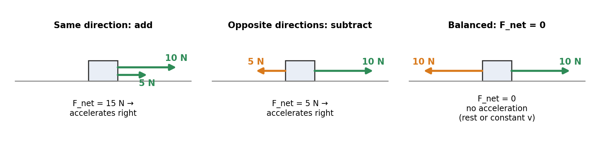
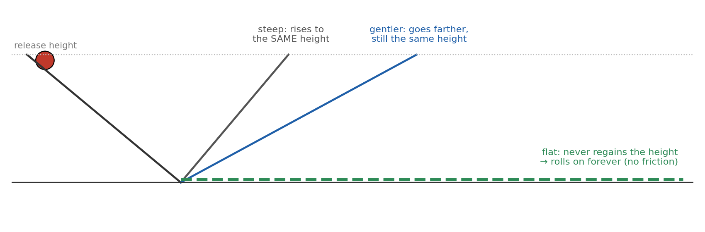
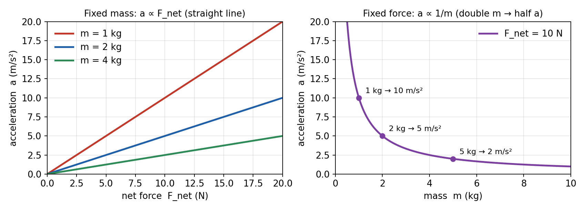
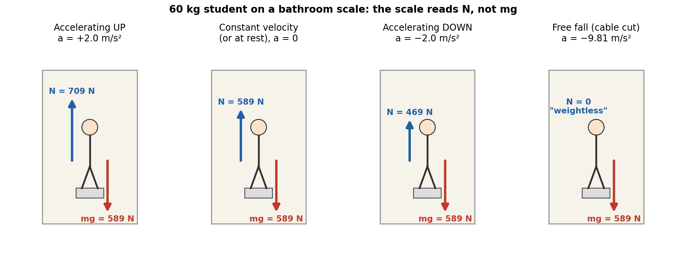
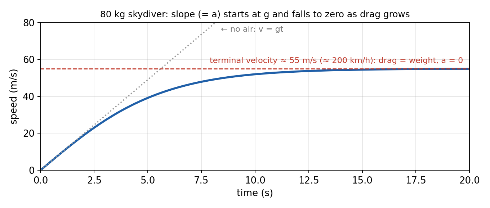

# Session 5 — Forces I: Newton's First and Second Laws

**Duration:** 45 minutes\
**Continues from:** Session 4 (relative velocity and uniform circular motion), which finished 2D kinematics. Sessions 1–4 answered *how* things move. From today we ask *why* they move that way.\
**Grade-9 foundation:** Class 9 Ch6 *How Forces Affect Motion*: balanced and unbalanced forces, inertia, and the first form of F = ma. *The Class 9 PDF is on the Mac and wasn't reachable today, so section numbers from it are left out.*\
**Grade-11 depth:** Glencoe *Physics: Principles and Problems* Ch4 "Forces in One Dimension":

- §4.1 Force and Motion: contact and field forces, net force, the first and second laws
- §4.2 Using Newton's Laws: weight, apparent weight in an elevator, drag and terminal velocity

Hewitt *Conceptual Physics* adds Ch3 §3.1–3.6 (Aristotle → Galileo → the law of inertia, mass vs weight, "1 kg weighs 9.8 N"), Ch4 §4.1–4.3 (force causes acceleration, mass resists it, the second law), §4.7 (why all objects fall with the same g) and §4.8 (air resistance and terminal speed).\
**Why now:** Session 4 ended with a stone released from a whirling string flying off in a straight line, and a car on a roundabout accelerating at constant speed. Both need a *cause*. That cause is force.\
**g = 9.81 m/s²** throughout, matching the school.

---

## Lesson Plan

**Objectives.** By the end of this session the student should be able to:

1. Define force, name contact and field forces, and find the **net force** on an object in one dimension.
2. State **Newton's First Law** exactly, explain inertia, and use "F_net = 0 ⇔ a = 0" in both directions.
3. State **Newton's Second Law**, derive `F_net = ma` from the two proportionalities, and use it with the Session 1 equations.
4. Tell **mass** from **weight**, derive `W = mg`, and explain why a scale in an accelerating elevator doesn't read your weight.

| Time | Segment |
| --- | --- |
| 0–5 min | Warm-up: 2 questions from Session 4 that set up today |
| 5–15 min | Part 1: force, net force, and the First Law (inertia) |
| 15–30 min | Part 2: the Second Law: derivation, units, worked examples |
| 30–40 min | Part 3: mass vs weight, free fall explained, apparent weight, terminal velocity |
| 40–45 min | Exit ticket, assign homework |

**Pacing note.** If you're behind at the 30-minute mark, keep the elevator example (it's the most-tested idea in §4.2) and set terminal velocity as reading from the notes plus homework Q12.

---

## Warm-up (5 min)

1. *In Session 4, a stone whirled on a string is released while heading due east. Which way does it go?*
   → **Straight east**, along the tangent. We said "no force to turn it". Today we name that idea: it's Newton's First Law.

2. *A car goes round a roundabout at a steady 10 m/s. Is it accelerating? If yes, what must be acting on it?*
   → **Yes**, `a = v²/r` toward the center. Something must be pulling it toward the center: **a net force** (here, friction between tires and road). Every acceleration has a force behind it. That's the Second Law.

---

## Formula Sheet — Forces I

*Keep this in front of him. Every line is derived in today's notes.*

| Label | Equation | In words | Where it comes from |
| --- | --- | --- | --- |
| **N0** | `F_net = F₁ + F₂ + …` (with signs) | net force = vector sum of all forces on the object | definition (Part 1) |
| **N1** | `F_net = 0  ⇔  a = 0` | no net force ⇔ rest or constant velocity | First Law |
| **N2** | `F_net = m·a` or `a = F_net / m` | net force = mass × acceleration | Second Law (derived in Part 2) |
| **U** | `1 N = 1 kg·m/s²` | one newton gives 1 kg an acceleration of 1 m/s² | definition of the newton |
| **W** | `W = m·g` | weight = mass × g (g = 9.81 m/s² on Earth) | N2 applied to free fall |
| **E** | `N = m(g + a)` | scale reading in an elevator (a positive = upward) | N2 with two forces |
| **C** | `F_net = m·v²/r` (toward the center) | net force for circular motion | N2 + Session 4's `a = v²/r` |

From Session 1, still used today: `v = u + at`, `s = ut + ½at²`, `v² = u² + 2as`.

---

## Part 1 — Force, Net Force and the First Law (10 min)

### What is a force?

A **force** is a push or a pull on an object, caused by an interaction with another object. It is a **vector**: it has a size (in newtons, N) and a direction. (Glencoe §4.1)

| Type | Needs contact? | Examples |
| --- | --- | --- |
| **Contact forces** | yes | a push or pull, normal (support) force, friction, tension in a rope, air resistance |
| **Field forces** | no, they act at a distance | gravity (weight), magnetic force, electric force |

Every force has an **agent**: something that exerts it. If you can't name the agent ("the table", "the Earth", "the rope"), it isn't a real force. This rule kills the most common mistake: there is **no** "force of motion" that keeps a thrown ball going.

### Net force

The **net force** `F_net` is the vector sum of **all** the forces acting on one object. In one dimension, pick a positive direction and add with signs (Hewitt §4.1, Fig. 4-3):

{width=100%}

- **Unbalanced forces** (F_net ≠ 0) change the motion.
- **Balanced forces** (F_net = 0) leave the motion unchanged: an object at rest stays at rest, and a moving object keeps moving at constant velocity.

### From Aristotle to Galileo (Hewitt §3.1–3.3)

**Aristotle** (4th century BC) believed a force is needed to *keep* an object moving, and that rest is the natural state. It matches daily life: stop pushing a box and it stops.

**Galileo** (around 1600) saw that the box stops because of **friction**, which is itself a force. His thought experiment with two inclined planes:

{width=100%}

A ball released on one frictionless ramp rolls up the opposite ramp to the **same height**. Make the second ramp gentler and the ball travels farther to reach that height. Make it **flat** and the ball can never reach the height, so it rolls on forever. Conclusion: *no force is needed to keep an object moving*; a force is needed only to **change** its motion.

### Newton's First Law (the Law of Inertia)

> **Newton's First Law:** Every body continues in its state of rest, or of uniform motion in a straight line, unless it is compelled to change that state by a net external force acting on it.

**Mathematical form:** `if F_net = 0, then a = 0, so v = constant` (which includes v = 0).

It works in **both directions**. If you see an object at rest or moving at constant velocity, you know `F_net = 0`, even if several forces act on it. A jet cruising at constant velocity with 80 000 N of thrust must have 80 000 N of air resistance (Hewitt §4.5).

**Inertia** is the tendency of an object to resist changes in its motion. The measure of inertia is **mass** (Hewitt §3.5): the more mass, the harder it is to start, stop or turn the object.

**Everyday evidence:**

- The tablecloth trick: the dishes tend to stay at rest.
- When a bus brakes suddenly, passengers lurch forward: their bodies keep moving.
- Seat belts and headrests exist because of inertia.
- Session 4's released stone flies off along the tangent: with no string force, nothing changes its velocity.

**A note on frames (beyond the test).** The First Law holds in an *inertial frame*, one that isn't accelerating. Inside a braking bus, a ball on the floor seems to roll forward "by itself". Seen from the road, the ball simply keeps going while the bus slows down.

---

## Part 2 — Newton's Second Law (15 min)

### Derivation: where F = ma comes from (Hewitt §4.1–4.3, Glencoe §4.1)

Experiments (push a cart on a smooth track and measure a) show two facts:

**Fact 1: for a fixed mass, acceleration is directly proportional to net force.** Double F_net and a doubles:

`a ∝ F_net`  (m fixed)

**Fact 2: for a fixed net force, acceleration is inversely proportional to mass.** Double m and a halves:

`a ∝ 1/m`  (F_net fixed)

{width=100%}

**Step 1: combine the two proportionalities.** If a quantity is proportional to F_net and to 1/m separately, it is proportional to their product:

`a ∝ F_net / m`

**Step 2: turn the proportionality into an equation** with a constant k:

`a = k · F_net / m`, which rearranges to `F_net = (1/k) · m · a`

**Step 3: choose the unit of force so that k = 1.** Define **one newton** as the net force that gives a 1 kg mass an acceleration of 1 m/s². Then:

> **Newton's Second Law:** The acceleration of an object is directly proportional to the net force acting on it, inversely proportional to its mass, and in the same direction as the net force.
>
> **`F_net = m·a`**  or  **`a = F_net / m`**,  with  `1 N = 1 kg·m/s²`

**Direction matters.** `F_net` and `a` always point the **same way**. The *velocity* can point anywhere: a car braking has velocity forward but a and F_net backward.

**The First Law is a special case.** Put `F_net = 0` into `a = F_net/m`: you get `a = 0`, so v is constant. The Second Law contains the First.

**In two dimensions** (used in Session 6), the law holds separately along each axis, just like projectiles in Session 2:

`F_net,x = m·a_x`  and  `F_net,y = m·a_y`

**Beyond the test: Newton's own form.** Newton wrote the law in terms of momentum `p = m·v`: `F_net = Δp/Δt`. If m is constant, `Δp = m·Δv`, so `F_net = m·Δv/Δt = m·a`, which is the form above.

### How to solve a Second Law problem

1. **Choose the object** (the "system") and draw it as a box.
2. **Draw every force** on it as an arrow from the box, and name the agent of each one.
3. **Choose a positive direction**, usually the direction of the acceleration.
4. **Write** `F_net = sum of forces with signs = m·a`.
5. **Solve**, then link to kinematics (`v = u + at` and so on) if the question asks about time, distance or speed.

### Worked Example 1: two pushes, then kinematics

Ali pushes a 40 kg crate east with 150 N. Ben pushes it west with 90 N. Friction is negligible. The crate starts at rest. Find (a) the acceleration, (b) its speed and (c) its distance after 4.0 s.

- Take **east as positive**. `F_net = +150 − 90 = +60 N` (east).
- **(a)** `a = F_net / m = 60 / 40 = 1.5 m/s²` **east**.
- **(b)** Session 1's S1: `v = u + at = 0 + 1.5 × 4.0 = 6.0 m/s` east.
- **(c)** S2: `s = ut + ½at² = 0 + ½ × 1.5 × 4.0² = 12 m` east.

**Answer: 1.5 m/s² east; 6.0 m/s; 12 m.**

### Worked Example 2: when is the motion constant?

A 25 kg box is pulled right with 100 N while friction of 40 N acts left. (a) Find a. (b) Once the box is moving, the pull is reduced to 40 N. What happens now?

- **(a)** Right is positive: `F_net = 100 − 40 = 60 N`, so `a = 60/25 = 2.4 m/s²` to the right.
- **(b)** `F_net = 40 − 40 = 0`, so `a = 0`. The box **keeps moving at whatever speed it had**, at constant velocity. It does **not** stop. This is the First Law, and the point Aristotle got wrong.

### Worked Example 3: finding the force from the motion

A 1200 kg car speeds up uniformly from rest to 27 m/s (about 60 mph) in 9.0 s. What net force acts on it?

- First find a with S1: `a = (v − u)/t = (27 − 0)/9.0 = 3.0 m/s²`.
- Then N2: `F_net = m·a = 1200 × 3.0 = 3600 N` forward.

**Answer: 3.6 × 10³ N forward.** The road's forward friction on the tires supplies it, as Session 6 will show.

---

## Part 3 — Mass, Weight, Apparent Weight and Terminal Velocity (10 min)

### Mass vs weight (Hewitt §3.5, Glencoe §4.2)

| | **Mass (m)** | **Weight (W)** |
| --- | --- | --- |
| What it is | the amount of matter; a measure of **inertia** | the **gravitational force** on the object |
| Type | scalar | vector (points toward Earth's center) |
| SI unit | kilogram (kg) | newton (N) |
| Changes with location? | **no**: the same on Earth, on the Moon, in space | **yes**: depends on g |
| Measured with | a balance (compares masses) | a spring scale (measures a force) |

### Derivation: W = mg

Drop an object with no air resistance. The **only** force on it is its weight W, and we know from Session 1 that it accelerates at g. Apply N2:

`F_net = m·a`  →  `W = m·g`

So a 1 kg mass weighs `1 × 9.81 = 9.81 N` (Hewitt: "1 kilogram weighs 9.8 newtons", about 2.2 lb).

**Example.** A 60 kg student weighs `60 × 9.81 = 589 N` on Earth. On the Moon (g = 1.62 m/s²) the weight is `60 × 1.62 = 97 N`, but the mass is still **60 kg**.

### Free fall explained: why heavy and light objects fall together (Hewitt §4.7)

A 10 kg cannonball has 10 times the weight of a 1 kg stone. It also has 10 times the mass (10 times the inertia). The acceleration is the ratio:

`a = W/m = (m·g)/m = g`

The mass cancels, so **every** object in free fall has the same acceleration g. Aristotle's followers looked only at the bigger force; Newton's law says to divide by the bigger mass too.

### Apparent weight: the elevator (Glencoe §4.2)

A bathroom scale doesn't measure your weight. It measures the **normal force N** it pushes up on you with. Take up as positive; two forces act on you: N up and mg down.

**Derivation:**

`F_net = N − mg = m·a`  →  **`N = m(g + a)`**

{width=100%}

**Worked Example 4.** A 60 kg student stands on a scale in an elevator. Find the reading when the elevator (a) accelerates upward at 2.0 m/s², (b) moves at constant velocity, (c) accelerates downward at 2.0 m/s², (d) is in free fall.

- **(a)** `N = 60(9.81 + 2.0) = 60 × 11.81 = 709 N`. He feels **heavier**.
- **(b)** `a = 0`, so `N = 60 × 9.81 = 589 N`, his true weight, **whether moving or not**.
- **(c)** `a = −2.0`: `N = 60(9.81 − 2.0) = 60 × 7.81 = 469 N`. He feels **lighter**.
- **(d)** `a = −9.81`: `N = 60(9.81 − 9.81) = 0`. The scale reads zero: "weightless". His weight is still 589 N; there's just no support force.

**The key point:** the scale reading depends on the **acceleration**, not on the direction of motion. An elevator moving *down* but *slowing down* has an upward a, so the scale reads *more* than mg.

### Air resistance and terminal velocity (Hewitt §4.8, Glencoe §4.2)

**Air resistance (drag)** is a friction force from the air. It opposes the motion and **grows as the speed grows**. For a falling skydiver, taking down as positive:

`F_net = mg − D = m·a`, so `a = g − D/m`

- At the start, v = 0, so D = 0 and `a = g`.
- As v grows, D grows, F_net shrinks, and a gets smaller.
- When `D = mg`, `F_net = 0`, so `a = 0`: the speed stops increasing. That constant speed is the **terminal velocity**.

{width=90%}

A parachute greatly increases D, which lowers the terminal velocity to a safe 15–25 km/h (Hewitt). A heavier skydiver needs more drag to balance their weight, so they fall faster before reaching terminal velocity.

### Link back to Session 4: circular motion needs a net force

Session 4 showed `a = v²/r` toward the center. By N2 there must be a net force in the same direction:

`F_net = m·v²/r`  (toward the center)

This is **not** a new kind of force. It is the net of real forces: tension, friction, gravity or a normal force. For a 0.50 kg ball on a string, moving in a horizontal circle of radius 0.80 m at 4.0 m/s: `F_net = 0.50 × 4.0² / 0.80 = 10 N`, supplied by the tension, toward the center. Cut the string and F_net = 0, so by the First Law the ball flies off along the tangent. Hewitt §13.4: there is no outward "centrifugal force" pushing it.

---

## Exit Ticket (3 min)

1. *A hockey puck slides across frictionless ice at 5 m/s. What force keeps it moving?* → **None.** No net force is needed to keep moving; the First Law says it keeps its velocity by itself.
2. *The same net force acts on a 2 kg cart and a 6 kg cart. How do their accelerations compare?* → The 2 kg cart's acceleration is **3 times** bigger (a ∝ 1/m).
3. *An elevator moving upward slows to a stop. Does the scale read more or less than your weight?* → **Less.** Slowing while moving up means a points **down**, so `N = m(g + a)` with a negative.

---

## Practice Problems

*Use g = 9.81 m/s². Do Q1, Q5 and Q8 in class if time allows; the rest are homework.*

1. **Net force:** Three horizontal forces act on a 15 kg sled: 60 N east, 45 N east and 30 N west. Find the net force and the acceleration.
2. **Towing (Hewitt §4.3):** A net force of 2000 N acts on a 1000 kg car. (a) Find its acceleration. (b) With the same force, the car tows a second, identical car. What is the new acceleration?
3. **Jet thrust (Hewitt §4.3):** How much thrust must a 30 000 kg jet produce to accelerate at 1.5 m/s² (ignore air resistance)?
4. **Finding mass:** A 24 N net force gives a cart an acceleration of 3.0 m/s². (a) Find the cart's mass. (b) A 4.0 kg load is added. Find the new acceleration with the same force.
5. **Pitching a baseball:** A pitcher's hand moves a 0.145 kg baseball from rest to 40 m/s over a distance of 1.6 m. Find the average acceleration and the average force of the hand on the ball.
6. **Braking:** A 1500 kg car traveling at 25 m/s brakes to a stop in 50 m. Find (a) the deceleration, (b) the braking force and (c) the stopping time.
7. **Mass vs weight:** An astronaut has a mass of 75 kg. Find (a) her weight on Earth, (b) her weight on the Moon (g = 1.62 m/s²), (c) her mass and weight in deep space far from any planet. (d) Would it be easier to shake her back and forth in deep space than on Earth? Explain.
8. **Elevator:** A 50 kg student stands on a scale in an elevator, and the scale reads 560 N. (a) Find the elevator's acceleration (size and direction). (b) Could the elevator be moving downward? Explain.
9. **Constant velocity (Hewitt §4.5):** A jet cruises at constant velocity while its engines produce 80 000 N of thrust. What is its acceleration, and how large is the air resistance on it?
10. **Circular motion link:** A 1200 kg car rounds a flat curve of radius 50 m at 15 m/s. Find the net force needed and name the real force that provides it.
11. **Conceptual:** (a) Explain the tablecloth trick with the First Law. (b) Why do passengers lurch forward when a bus brakes? (c) True or false: "A force is needed to keep an object moving." Explain.
12. **Terminal velocity:** An 80 kg skydiver is falling. (a) Find her weight. (b) At the moment the air resistance is 500 N, find her acceleration. (c) What is the air resistance once she reaches terminal velocity?

---

## Answer Key — Full Step-by-Step Solutions

**1. Net force**

- Take east as positive: `F_net = +60 + 45 − 30 = +75 N`.
- `a = F_net/m = 75/15 = 5.0 m/s²`.

**Answer: 75 N east; 5.0 m/s² east.**

**2. Towing**

- **(a)** `a = F_net/m = 2000/1000 = 2.0 m/s²`.
- **(b)** The mass doubles to 2000 kg with the same force: `a = 2000/2000 = 1.0 m/s²`. Double the mass means half the acceleration.

**Answer: 2.0 m/s²; 1.0 m/s².**

**3. Jet thrust**

- `F = m·a = 30 000 × 1.5 = 45 000 N`.

**Answer: 4.5 × 10⁴ N.**

**4. Finding mass**

- **(a)** `m = F_net/a = 24/3.0 = 8.0 kg`.
- **(b)** New mass `8.0 + 4.0 = 12 kg`: `a = 24/12 = 2.0 m/s²`.

**Answer: 8.0 kg; 2.0 m/s².**

**5. Pitching a baseball**

- Known: `u = 0`, `v = 40 m/s`, `s = 1.6 m`. Time isn't given, so use S3: `v² = u² + 2as`.
- `40² = 0 + 2 × a × 1.6`, so `a = 1600/3.2 = 500 m/s²`.
- N2: `F = m·a = 0.145 × 500 = 72.5 N`.

**Answer: 500 m/s²; about 73 N** (about 50 times the ball's weight of 1.4 N).

**6. Braking**

- Take forward as positive. Known: `u = 25 m/s`, `v = 0`, `s = 50 m`.
- **(a)** S3: `0 = 25² + 2a(50)`, so `a = −625/100 = −6.25 m/s²` (6.25 m/s² backward).
- **(b)** `F_net = m·a = 1500 × (−6.25) = −9375 N`, so about **9.4 × 10³ N backward**.
- **(c)** S1: `0 = 25 + (−6.25)t`, so `t = 25/6.25 = 4.0 s`.

**Answer: 6.25 m/s²; 9.4 × 10³ N backward; 4.0 s.**

**7. Mass vs weight**

- **(a)** `W = mg = 75 × 9.81 = 736 N`.
- **(b)** `W = 75 × 1.62 = 122 N`.
- **(c)** Mass is still **75 kg**. Weight is about **0 N** (no gravity to speak of).
- **(d)** **No.** Shaking means repeatedly accelerating her, and that depends on **mass** (inertia), which is the same everywhere. Hewitt Fig. 3-9 makes exactly this point.

**Answer: 736 N; 122 N; 75 kg and 0 N; no, same inertia.**

**8. Elevator**

- Up is positive. `N − mg = ma`, so `a = N/m − g = 560/50 − 9.81 = 11.2 − 9.81 = 1.39 m/s²`.
- **(a)** **1.4 m/s² upward** (positive).
- **(b)** **Yes.** An upward acceleration happens when moving up and speeding up, **or** when moving down and slowing down. The scale can't tell the difference.

**Answer: 1.4 m/s² upward; yes, if it is moving down and slowing.**

**9. Constant velocity**

- Constant velocity means `a = 0`, so `F_net = 0` (First Law).
- Thrust − air resistance = 0, so air resistance = **80 000 N**, backward.

**Answer: a = 0; 8.0 × 10⁴ N.**

**10. Circular motion link**

- `F_net = m·v²/r = 1200 × 15²/50 = 1200 × 225/50 = 5400 N`, toward the center of the curve.
- On a flat road the only horizontal force on the car is **static friction** from the road on the tires. On ice there is almost no friction, so the car goes straight on (First Law).

**Answer: 5.4 × 10³ N toward the center, provided by friction.**

**11. Conceptual**

- **(a)** The dishes are at rest and, by inertia, tend to stay at rest. The cloth is pulled so fast that the small friction force acts for only a very short time, too short to give the dishes a noticeable velocity.
- **(b)** The brakes act on the bus, not on the passengers. Their bodies keep moving forward at the old speed (inertia) until the seat or a seat belt exerts a backward force on them.
- **(c)** **False.** A force is needed to **change** motion, not to maintain it. In daily life we keep pushing only to cancel friction, so F_net = 0 and the velocity stays constant.

**12. Terminal velocity**

- **(a)** `W = mg = 80 × 9.81 = 785 N`.
- **(b)** Down is positive: `F_net = 785 − 500 = 285 N`, so `a = 285/80 = 3.56 m/s²` downward. She is still speeding up, but more slowly than g.
- **(c)** At terminal velocity `a = 0`, so `D = mg = 785 N`.

**Answer: 785 N; 3.6 m/s² downward; 785 N.**

---

## Notes for next session

Session 6 finishes Newton's laws:

- **The Third Law:** action–reaction pairs, why they never cancel, and the horse-and-cart problem (Hewitt Ch5).
- **Free-body diagrams:** the method used in every force problem from now on.
- **The named forces:** normal force, tension and friction (Glencoe §5.2, static vs kinetic).
- **Problems:** objects on an inclined plane and two connected objects.

Today's apparent-weight example (N ≠ mg) and the circular-motion link (friction as the centripetal force) set up that session. For practice between sessions, use the **F = ma Force Lab** and **Newton's Laws Flashcards** on the study-tools site.
