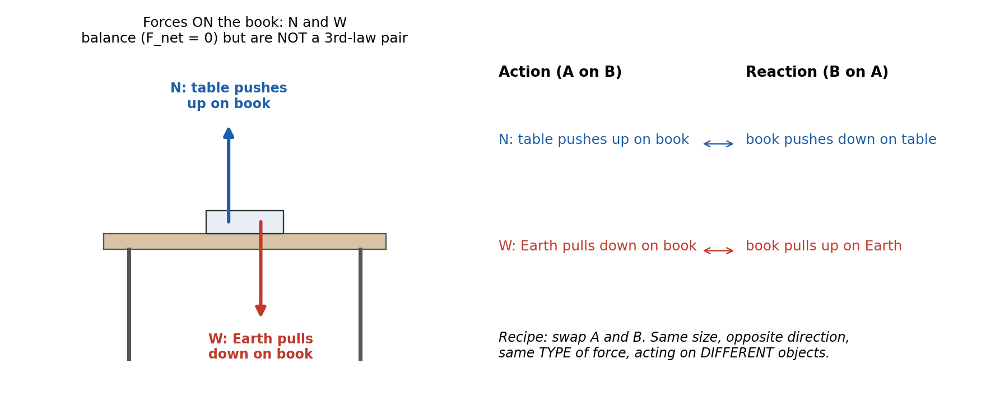
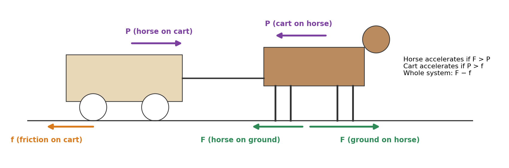
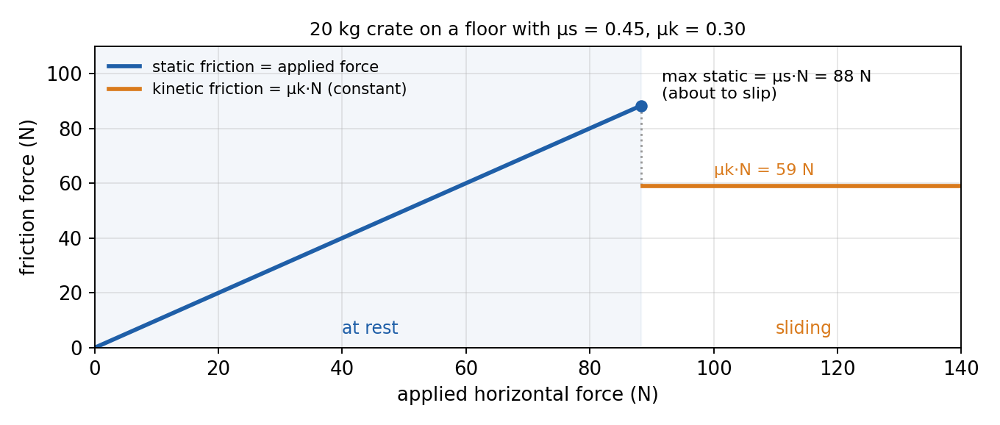
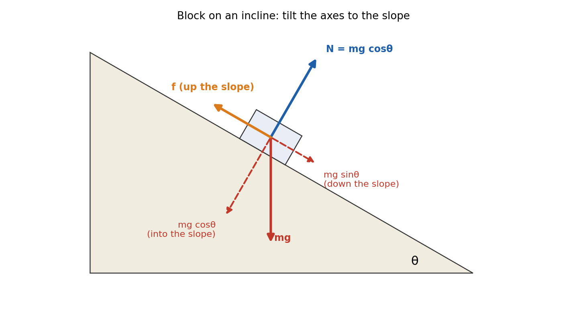
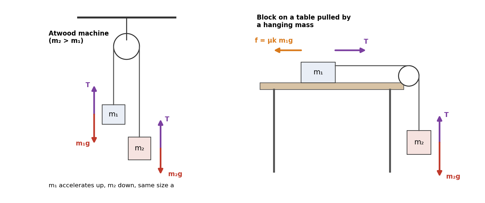

# Session 6 — Forces II: Newton's Third Law, Free-Body Diagrams, Friction and Connected Objects

**Duration:** 45 minutes\
**Continues from:** Session 5 (First and Second Laws, mass vs weight, apparent weight, terminal velocity).\
**Grade-9 foundation:** Class 9 Ch6 *How Forces Affect Motion*: action and reaction, friction as a force that opposes motion. *The Class 9 PDF is on the Mac and wasn't reachable today, so section numbers from it are left out.*\
**Grade-11 depth:**

- Glencoe *Physics: Principles and Problems* Ch4 §4.3 "Interaction Forces": third-law pairs, tension, the normal force.
- Glencoe Ch5 "Forces in Two Dimensions": §5.2 Friction (static and kinetic, coefficients) and §5.3 Force and Motion in Two Dimensions (inclined planes).

Hewitt *Conceptual Physics* adds Ch4 §4.4 (statics: support force and tension), §4.5 (friction) and Ch5 §5.1–5.7 (interactions, identifying action and reaction, why they don't cancel, the horse-cart problem).\
**Why now:** Session 5 kept every problem to "forces given, find a". Real problems make you *find* the forces first. That needs the Third Law and free-body diagrams.\
**g = 9.81 m/s²** throughout, matching the school.

---

## Lesson Plan

**Objectives.** By the end of this session the student should be able to:

1. State **Newton's Third Law**, find the reaction to any force with the "swap A and B" recipe, and explain why action and reaction never cancel.
2. Draw a correct **free-body diagram** (FBD) using the named forces: weight, normal, tension, friction, applied and drag.
3. Use **static and kinetic friction**: `f_s ≤ μ_s·N`, `f_k = μ_k·N`.
4. Solve an **inclined-plane** problem by resolving mg into `mg sinθ` and `mg cosθ`.
5. Solve **two connected objects** (the Atwood machine, and a block on a table pulled by a hanging mass).

| Time | Segment |
| --- | --- |
| 0–4 min | Warm-up: 2 questions from Session 5 |
| 4–12 min | Part 1: the Third Law |
| 12–20 min | Part 2: free-body diagrams, normal force and tension |
| 20–29 min | Part 3: friction |
| 29–40 min | Part 4: inclined planes and connected objects |
| 40–45 min | Exit ticket, assign homework |

**Pacing note.** This is a full session. If you're behind at 29 minutes, do the incline (Worked Example 4) in class and set the Atwood and table-pulley examples as reading plus homework Q11–Q12. They repeat the same four-step method.

---

## Warm-up (4 min)

1. *A 60 kg student stands on a scale in an elevator accelerating upward at 2.0 m/s². What does the scale read?*
   → `N = m(g + a) = 60 × 11.81 = 709 N`. The scale reads the **normal force**, not the weight.

2. *A crate slides at constant velocity while you push it with 150 N. How big is the friction force?*
   → **150 N**, opposite to the push. Constant velocity means F_net = 0 (First Law).

---

## Formula Sheet — Forces II

| Label | Equation | In words |
| --- | --- | --- |
| **N3** | `F(A on B) = −F(B on A)` | action and reaction: equal size, opposite direction, different objects |
| **FS** | `f_s ≤ μ_s·N` | static friction matches the push, up to a maximum `μ_s·N` |
| **FK** | `f_k = μ_k·N` | kinetic (sliding) friction is constant, and usually `μ_k < μ_s` |
| **I1** | `mg sinθ` along the slope, `mg cosθ` into the slope | weight resolved on an incline |
| **I2** | `N = mg cosθ` | normal force on an incline (no other perpendicular forces) |
| **I3** | `a = g(sinθ − μ_k cosθ)` | block sliding down an incline with friction (μ_k = 0: `a = g sinθ`) |
| **I4** | `tanθ = μ_s` | steepest angle at which a block can rest without slipping |
| **AT** | `a = (m₂ − m₁)g/(m₁ + m₂)`, `T = 2m₁m₂g/(m₁ + m₂)` | Atwood machine |
| **TP** | `a = (m₂ − μ_k m₁)g/(m₁ + m₂)` | block m₁ on a table, pulled by a hanging mass m₂ |

Still used from Session 5: `F_net = m·a`, `W = mg`, `N = m(g + a)` in an elevator.

---

## Part 1 — Newton's Third Law (8 min)

### Forces come in pairs (Hewitt §5.1–5.2, Glencoe §4.3)

A force is an **interaction** between two objects. When you push a wall, the wall pushes back on you. You can't touch without being touched.

> **Newton's Third Law:** When one object exerts a force on a second object, the second object exerts a force on the first that is equal in magnitude and opposite in direction.
>
> **Mathematical form:** `F(A on B) = −F(B on A)`

### The recipe for finding the reaction (Hewitt §5.3)

Write the action as "**A exerts a force on B**". The reaction is "**B exerts a force on A**". Just swap A and B.

| Action (A on B) | Reaction (B on A) |
| --- | --- |
| tire pushes road backward | road pushes tire forward (this is what drives the car) |
| rocket pushes exhaust gas down | gas pushes rocket up |
| Earth pulls ball down (the ball's weight) | ball pulls Earth up |
| your foot pushes the ball | the ball pushes your foot |

The two forces in a pair always: (1) are the **same size**; (2) point in **opposite directions**; (3) are the **same type** (both gravity, both contact); and (4) act on **different objects**.

### Why action and reaction don't cancel (Hewitt §5.5)

Forces cancel only when they act on the **same** object. Action acts on B; reaction acts on A. When you kick a ball, the only force *on the ball* is your kick, so the ball accelerates. The ball's push acts on your foot, slowing it down.

**The classic trap: the book on the table.** The table's upward push N and the book's weight W are equal and opposite, but they are **not** a third-law pair. They act on the same object (the book), and they are different types of force (contact vs gravity). They balance because of the **First Law** (the book isn't accelerating), not the Third.

{width=100%}

### Equal forces, unequal accelerations (Hewitt §5.4)

The forces in a pair are equal, but the accelerations are not. By N2, `a = F/m`, so the lighter object accelerates more. A falling apple pulls Earth up with the same force Earth pulls the apple down, but Earth's mass is so huge that its acceleration is immeasurably small.

**Worked Example 1.** A 60 kg skater and a 40 kg skater stand facing each other on frictionless ice and push apart. During the push each exerts a 120 N force on the other. Find each acceleration.

- By N3, each skater feels **120 N** (in opposite directions).
- 60 kg skater: `a = 120/60 = 2.0 m/s²`.
- 40 kg skater: `a = 120/40 = 3.0 m/s²`, in the opposite direction.

**Answer: 2.0 m/s² and 3.0 m/s², opposite ways.** Same force, but the lighter skater gets the bigger acceleration.

### The horse-and-cart problem (Hewitt §5.6)

The horse argues: "If I pull the cart, the cart pulls back on me equally, so we can never move." Where is the mistake? To decide whether something accelerates, look **only at the forces on that thing**:

{width=100%}

- **On the cart:** the horse's pull P forward and road friction f backward. The cart accelerates if `P > f`.
- **On the horse:** the cart's pull P backward and the ground's push F forward. The horse pushes backward on the ground, and by N3 the ground pushes the horse forward. The horse accelerates if `F > P`.
- **On the horse + cart system:** P and its reaction are *internal* and cancel. The only outside horizontal forces are F and f, so the system accelerates if `F > f`.

This is why you can't move a stalled car by pushing on its dashboard from inside: that push is internal.

---

## Part 2 — Free-Body Diagrams, Normal Force and Tension (8 min)

### The named forces (Glencoe §4.3, Hewitt §4.4)

| Force | Symbol | Agent | Direction |
| --- | --- | --- | --- |
| Weight | `W = mg` | Earth | straight down |
| Normal (support) force | `N` | a surface | **perpendicular** to the surface, pushing away from it |
| Tension | `T` | a rope, string or cable | along the rope, **pulling** away from the object |
| Friction | `f` | a surface | **parallel** to the surface, opposing sliding (or the tendency to slide) |
| Applied force | `F` | a person or thing pushing or pulling | as given |
| Drag / air resistance | `D` | air or water | opposite to the velocity |

### How to draw a free-body diagram

1. Draw the **one** object you care about as a dot or box. Draw nothing else.
2. For every **contact** (surface, rope, hand) add the force that contact exerts. Then add **weight**.
3. Draw each arrow **starting on the object** and pointing the way the force acts. Make the lengths roughly match the sizes.
4. Label each arrow and be able to name its agent. No agent means no force: never draw a "force of motion".
5. Only forces **on** this object go in its FBD. Its reactions act on other objects and go in *their* FBDs.

### The normal force is not always mg

N is whatever the surface must supply to stop the object sinking into it. Apply N2 perpendicular to the surface.

**Worked Example 2.** A 10 kg box rests on the floor. (a) Find N. (b) Someone pushes straight down on the box with 20 N. Find N now. (c) Instead, someone pulls straight up on it with 20 N.

- **(a)** Up is positive, a = 0: `N − mg = 0`, so `N = 10 × 9.81 = 98.1 N`.
- **(b)** `N − mg − 20 = 0`, so `N = 98.1 + 20 = 118.1 N`.
- **(c)** `N + 20 − mg = 0`, so `N = 98.1 − 20 = 78.1 N`.

**Tension** works the same way. A lamp hanging at rest from one cord has `T = mg`. Hanging from two vertical cords that share the load, each has `T = mg/2` (Hewitt §4.4, the one-arm vs two-arm pull-up). In an accelerating elevator the cable tension is `T = m(g + a)`, the same algebra as Session 5's scale.

---

## Part 3 — Friction (9 min)

### Where it comes from (Hewitt §4.5)

Even polished surfaces are bumpy under a microscope. Friction is the force from those surfaces catching on each other. It always acts **parallel to the surface** and **opposes sliding**, or the tendency to slide. There are two kinds (Glencoe §5.2):

- **Static friction** `f_s` acts while the surfaces are **not** sliding. It adjusts to exactly match the push, up to a maximum: `f_s ≤ μ_s·N`.
- **Kinetic friction** `f_k` acts while the surfaces **are** sliding. It is roughly constant: `f_k = μ_k·N`.

`μ` (mu) is the **coefficient of friction**. It has no units, depends only on the two materials, and usually `μ_k < μ_s`. That is why it's harder to start a heavy box moving than to keep it moving.

| Surfaces (typical values) | μ_s | μ_k |
| --- | --- | --- |
| rubber on dry concrete | 0.80 | 0.65 |
| wood on wood | 0.50 | 0.20 |
| steel on steel (dry) | 0.78 | 0.58 |
| steel on steel (oiled) | 0.15 | 0.06 |
| Teflon on steel | 0.04 | 0.04 |

{width=90%}

**Worked Example 3.** A 20 kg crate sits on a floor with μ_s = 0.45 and μ_k = 0.30. (a) Find N. (b) What is the largest push that won't move it? (c) A 60 N push is applied. What happens? (d) A 100 N push is applied. Find the acceleration.

- **(a)** Level floor, no vertical acceleration: `N = mg = 20 × 9.81 = 196.2 N`.
- **(b)** `f_s,max = μ_s·N = 0.45 × 196.2 = 88.3 N`.
- **(c)** `60 N < 88.3 N`, so the crate **stays put**. Static friction is exactly **60 N**, not 88.3 N. The maximum is only reached when the crate is about to slip.
- **(d)** `100 N > 88.3 N`, so it slides. Kinetic friction: `f_k = 0.30 × 196.2 = 58.9 N`. N2: `a = (100 − 58.9)/20 = 41.1/20 = 2.06 m/s²`.

**Answer: 196 N; 88.3 N; stays at rest with f_s = 60 N; 2.06 m/s².**

**Friction drives you forward too.** When you walk or a car accelerates, the foot or tire pushes back on the ground and **static** friction pushes it forward (N3). The tire isn't sliding, so it's static friction. That is why anti-lock brakes that stop the wheels skidding stop the car faster: `μ_s > μ_k`.

---

## Part 4 — Inclined Planes and Connected Objects (11 min)

### Derivation: resolving weight on an incline (Glencoe §5.3)

On a slope, choose axes **along** the slope and **perpendicular** to it. Then N and f each lie along one axis, and only mg has to be split.

{width=85%}

**Step 1: find the angle.** The weight is vertical, and the perpendicular to the slope is tilted by θ from the vertical, because the slope is tilted by θ from the horizontal. So the angle between mg and the "into the slope" direction is **θ**.

**Step 2: resolve**, just like Session 2's `v₀cosθ` and `v₀sinθ`:

- along the slope (downhill): `mg sinθ`
- into the slope: `mg cosθ`

**Step 3: perpendicular axis.** The block doesn't jump off or sink in, so `a⊥ = 0`: `N − mg cosθ = 0`, which gives **`N = mg cosθ`**.

**Step 4: along the slope**, taking downhill as positive for a block sliding down, with kinetic friction pointing uphill:

`mg sinθ − μ_k·N = m·a`  →  `mg sinθ − μ_k·mg cosθ = m·a`  →  **`a = g(sinθ − μ_k cosθ)`**

The mass cancels. With no friction, `a = g sinθ`. Check the limits: θ = 90° gives a = g (free fall), and θ = 0 gives a = 0 (a flat floor). ✓

**Step 5: the angle of repose.** Tilt the slope until a resting block is just about to slip. Then static friction is at its maximum and balances the downhill component:

`mg sinθ = μ_s·mg cosθ`  →  **`tanθ = μ_s`**

This gives a simple lab method for measuring μ_s: tilt a board until the block starts to slide and measure the angle.

**Worked Example 4.** A 5.0 kg block is on a 30° incline. (a) Find the components of its weight and N. (b) Find its acceleration if the incline is frictionless. (c) Find its acceleration if μ_k = 0.20.

- **(a)** `mg = 5.0 × 9.81 = 49.05 N`. Along the slope: `49.05 × sin30° = 24.5 N`. Into the slope: `49.05 × cos30° = 42.5 N`, so `N = 42.5 N`.
- **(b)** `a = g sinθ = 9.81 × 0.500 = 4.91 m/s²` down the slope.
- **(c)** `f_k = 0.20 × 42.5 = 8.50 N`. `a = (24.5 − 8.50)/5.0 = 3.21 m/s²`. Check with I3: `9.81 × (0.500 − 0.20 × 0.866) = 9.81 × 0.327 = 3.21 m/s²` ✓

### Connected objects: the method

When two objects are joined by a light string over a frictionless pulley:

- They have the **same size of acceleration** (the string doesn't stretch).
- The **tension is the same** all along the string.

Write N2 **separately** for each object, choosing each positive direction along the way that object moves. Then **add** the equations: T cancels and you get a. Put a back into either equation to get T.

{width=100%}

### Derivation and Worked Example 5: the Atwood machine

Masses `m₁ = 3.0 kg` and `m₂ = 5.0 kg` hang on either side of a pulley. m₂ is heavier, so it moves down and m₁ moves up.

- **m₁ (up is positive):** `T − m₁g = m₁a`  …(1)
- **m₂ (down is positive):** `m₂g − T = m₂a`  …(2)
- **Add (1) + (2):** `m₂g − m₁g = (m₁ + m₂)a`, so **`a = (m₂ − m₁)g/(m₁ + m₂)`**
- **Put a into (1):** `T = m₁(g + a) = m₁g·[1 + (m₂ − m₁)/(m₁ + m₂)] = m₁g·2m₂/(m₁ + m₂)`, so **`T = 2m₁m₂g/(m₁ + m₂)`**

Numbers: `a = (5.0 − 3.0) × 9.81/8.0 = 2.45 m/s²` and `T = 2 × 3.0 × 5.0 × 9.81/8.0 = 36.8 N`.

Check with (2): `5.0 × 9.81 − 36.8 = 12.3 N`, and `5.0 × 2.45 = 12.3 N` ✓. T lies between m₁g (29.4 N) and m₂g (49.1 N), as it must: it has to lift m₁ but can't hold up m₂.

### Worked Example 6: block on a table pulled by a hanging mass

A 4.0 kg block on a table (μ_k = 0.25) is tied over a pulley at the table's edge to a 2.0 kg hanging mass.

- **Block m₁ (toward the pulley is positive):** vertically, `N = m₁g`. Horizontally: `T − μ_k m₁g = m₁a`  …(1)
- **Hanging mass m₂ (down is positive):** `m₂g − T = m₂a`  …(2)
- **Add:** `m₂g − μ_k m₁g = (m₁ + m₂)a`, so **`a = (m₂ − μ_k m₁)g/(m₁ + m₂)`**
- Numbers: `a = (2.0 − 0.25 × 4.0) × 9.81/6.0 = 1.0 × 9.81/6.0 = 1.64 m/s²`.
- From (2): `T = m₂(g − a) = 2.0 × (9.81 − 1.64) = 16.3 N`.
- Check with (1): `16.3 − 0.25 × 4.0 × 9.81 = 16.3 − 9.81 = 6.5 N`, and `4.0 × 1.64 = 6.5 N` ✓

**A trap: T ≠ m₂g.** If T equaled the hanging weight (19.6 N), m₂ would have zero net force and couldn't accelerate. The tension is always *less* than m₂g while m₂ accelerates downward.

---

## Exit Ticket (3 min)

1. *Earth pulls you down with 600 N. What is the reaction force?* → **You pull Earth up with 600 N.** It is *not* the floor's push on you.
2. *A box on a floor has μ_s = 0.5 and weighs 100 N. You push with 30 N and it doesn't move. What is the friction force?* → **30 N.** Static friction matches the push; 50 N is only the maximum.
3. *Does a block's acceleration down a frictionless slope depend on its mass?* → **No.** `a = g sinθ`, and the mass cancels.

---

## Practice Problems

*Use g = 9.81 m/s². Do Q2, Q6 and Q9 in class if time allows; the rest are homework.*

1. **Identifying pairs:** A book rests on a table. (a) List the forces on the book. (b) Give the third-law reaction of each. (c) Which two forces are equal because of the First Law, and which because of the Third?
2. **Skaters:** A 70 kg skater and a 50 kg skater push off each other. The 50 kg skater accelerates at 1.4 m/s². (a) What force did each exert? (b) Find the 70 kg skater's acceleration.
3. **The apple pulls Earth:** A 1.0 kg apple falls toward Earth (mass 5.97 × 10²⁴ kg). (a) What force does the apple exert on Earth? (b) Find Earth's acceleration toward the apple.
4. **Normal force:** An 8.0 kg box sits on the floor. A rope pulls straight up on it with 30 N, but the box doesn't leave the floor. Find the normal force.
5. **Tension (Hewitt §4.4):** A 12 kg lamp hangs at rest. Find the tension (a) if it hangs from one vertical cord, (b) if two vertical cords share the load equally.
6. **Starting and sliding:** A 50 kg crate is on a floor with μ_s = 0.40 and μ_k = 0.30. Find (a) the minimum horizontal push that starts it moving, (b) the push needed to keep it moving at constant velocity, (c) its acceleration with a 300 N push.
7. **Friction from motion:** A hockey puck leaves a stick at 12 m/s and slides 60 m before stopping. Find (a) the deceleration, (b) μ_k between puck and ice. (c) Why don't you need the puck's mass?
8. **Frictionless ski slope:** A 60 kg skier starts from rest on a frictionless 25° slope. Find (a) the acceleration, (b) the normal force, (c) the speed after sliding 50 m down the slope.
9. **Incline with friction:** A 10 kg box slides down a 35° ramp with μ_k = 0.30. Find (a) N, (b) the friction force, (c) the acceleration.
10. **Angle of repose:** μ_s between a block and a board is 0.60. At what angle does the block start to slide?
11. **Atwood machine:** Masses of 2.0 kg and 3.0 kg hang over a frictionless pulley and start from rest. Find (a) the acceleration, (b) the tension, (c) how long the heavier mass takes to fall 1.0 m.
12. **Table and pulley:** A 6.0 kg block on a table is tied to a 2.0 kg hanging mass over a pulley at the edge. Find the acceleration and tension if (a) the table is frictionless, (b) μ_k = 0.20.
13. **Elevator cable:** An 800 kg elevator accelerates upward at 1.5 m/s². Find the tension in its cable.
14. **Horse and cart (Hewitt §5.6):** A student says, "The cart pulls back on the horse as hard as the horse pulls the cart, so they can't accelerate." Explain the mistake, and state which force actually makes the horse move forward.

---

## Answer Key — Full Step-by-Step Solutions

**1. Identifying pairs**

- **(a)** Two forces act on the book: its weight W (Earth pulls it down) and the normal force N (the table pushes it up).
- **(b)** Reaction to W: **the book pulls Earth up**. Reaction to N: **the book pushes down on the table**.
- **(c)** `N = W` because of the **First Law**: the book isn't accelerating, so the forces on it balance. Each force equals its partner because of the **Third Law**. N and W are not a pair: they act on the same object and are different types of force.

**2. Skaters**

- **(a)** Force on the 50 kg skater: `F = m·a = 50 × 1.4 = 70 N`. By N3, the 70 kg skater also feels **70 N**, in the opposite direction.
- **(b)** `a = F/m = 70/70 = 1.0 m/s²`, opposite to the other skater.

**Answer: 70 N each; 1.0 m/s².**

**3. The apple pulls Earth**

- **(a)** Earth pulls the apple with `W = mg = 1.0 × 9.81 = 9.81 N`. By N3, the apple pulls Earth up with **9.81 N**.
- **(b)** `a = F/m = 9.81/(5.97 × 10²⁴) = 1.6 × 10⁻²⁴ m/s²`, far too small to detect.

**Answer: 9.81 N; 1.6 × 10⁻²⁴ m/s².**

**4. Normal force**

- Up is positive, a = 0: `N + 30 − mg = 0`.
- `N = mg − 30 = 8.0 × 9.81 − 30 = 78.5 − 30 = 48.5 N`.

**Answer: 48.5 N** (less than the weight, because the rope takes part of the load).

**5. Tension**

- **(a)** At rest, so `T − mg = 0`, giving `T = 12 × 9.81 = 118 N`.
- **(b)** `2T − mg = 0`, giving `T = 118/2 = 58.9 N` each.

**Answer: 118 N; 58.9 N each.**

**6. Starting and sliding**

- `N = mg = 50 × 9.81 = 490.5 N`.
- **(a)** To start it, the push must exceed `μ_s·N = 0.40 × 490.5 = 196 N`.
- **(b)** Constant velocity means F_net = 0, so the push equals kinetic friction: `f_k = 0.30 × 490.5 = 147 N`.
- **(c)** `a = (300 − 147.2)/50 = 152.8/50 = 3.06 m/s²`.

**Answer: 196 N; 147 N; 3.06 m/s².**

**7. Friction from motion**

- **(a)** S3: `0 = 12² + 2a(60)`, so `a = −144/120 = −1.2 m/s²`, a deceleration of 1.2 m/s².
- **(b)** The only horizontal force is kinetic friction: `μ_k·mg = m × 1.2`. The m cancels: `μ_k = 1.2/9.81 = 0.12`.
- **(c)** Both the friction force (`μ_k·mg`) and the inertia (m) are proportional to the mass, so it cancels. This is the same reason all objects fall with the same g.

**Answer: 1.2 m/s²; μ_k ≈ 0.12.**

**8. Frictionless ski slope**

- **(a)** `a = g sinθ = 9.81 × sin25° = 9.81 × 0.4226 = 4.15 m/s²` down the slope.
- **(b)** `N = mg cosθ = 60 × 9.81 × cos25° = 588.6 × 0.9063 = 533 N`.
- **(c)** S3 along the slope: `v² = 0 + 2 × 4.15 × 50 = 415`, so `v = 20.4 m/s`.

**Answer: 4.15 m/s²; 533 N; 20.4 m/s.**

**9. Incline with friction**

- **(a)** `N = mg cosθ = 10 × 9.81 × cos35° = 98.1 × 0.8192 = 80.4 N`.
- **(b)** `f_k = μ_k·N = 0.30 × 80.4 = 24.1 N`, pointing up the ramp.
- **(c)** Downhill component: `mg sinθ = 98.1 × 0.5736 = 56.3 N`. `a = (56.3 − 24.1)/10 = 3.22 m/s²` down the ramp. Check with I3: `9.81 × (0.5736 − 0.30 × 0.8192) = 9.81 × 0.3278 = 3.22` ✓

**Answer: 80.4 N; 24.1 N; 3.22 m/s².**

**10. Angle of repose**

- At the point of slipping, `tanθ = μ_s = 0.60`.
- `θ = tan⁻¹(0.60) = 31.0°`.

**Answer: about 31°.**

**11. Atwood machine**

- **(a)** `a = (m₂ − m₁)g/(m₁ + m₂) = (3.0 − 2.0) × 9.81/5.0 = 1.96 m/s²`.
- **(b)** `T = 2m₁m₂g/(m₁ + m₂) = 2 × 2.0 × 3.0 × 9.81/5.0 = 23.5 N`. Check: `T = m₁(g + a) = 2.0 × (9.81 + 1.96) = 23.5 N` ✓
- **(c)** S2 from rest: `1.0 = ½ × 1.96 × t²`, so `t² = 1.02` and `t = 1.01 s`.

**Answer: 1.96 m/s²; 23.5 N; 1.01 s.**

**12. Table and pulley**

- **(a)** μ_k = 0: `a = m₂g/(m₁ + m₂) = 2.0 × 9.81/8.0 = 2.45 m/s²`. From the block's equation, `T = m₁a = 6.0 × 2.45 = 14.7 N`.
- **(b)** `a = (m₂ − μ_k m₁)g/(m₁ + m₂) = (2.0 − 0.20 × 6.0) × 9.81/8.0 = 0.80 × 9.81/8.0 = 0.981 m/s²`. From the hanging mass: `T = m₂(g − a) = 2.0 × (9.81 − 0.981) = 17.7 N`. Check with the block: `17.7 − 0.20 × 6.0 × 9.81 = 17.7 − 11.8 = 5.9 N`, and `6.0 × 0.981 = 5.9 N` ✓

**Answer: (a) 2.45 m/s², 14.7 N; (b) 0.981 m/s², 17.7 N.**

**13. Elevator cable**

- Up is positive: `T − mg = ma`.
- `T = m(g + a) = 800 × (9.81 + 1.5) = 800 × 11.31 = 9048 N`.

**Answer: about 9.0 × 10³ N.**

**14. Horse and cart**

- The two pulls are a third-law pair, so they act on **different objects**: one on the cart, one on the horse. They can't cancel each other.
- The cart accelerates because the horse's pull on it is bigger than the road friction on it.
- The horse moves forward because it pushes **backward on the ground**, and by N3 the **ground pushes the horse forward**. When that forward push is bigger than the cart's backward pull, the horse accelerates.

---

## Notes for next session

Newton's three laws are now complete. Next steps:

- **Forces at an angle:** a rope pulling at an angle, which changes N, and objects in 2D equilibrium (a sign hung from two angled cables). This is Glencoe §5.1 vector addition applied to forces, and the natural next session.
- **Circular motion with forces:** banked curves, and a car over a hill. This combines Session 4's `v²/r` with today's FBDs.

**Practice tools on the study-tools site:** the Free-Body Diagram Builder, the F = ma Force Lab, the Action–Reaction Pair Finder, and the Newton's Laws flashcards and practice test.
